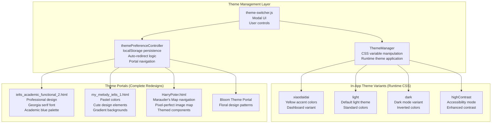
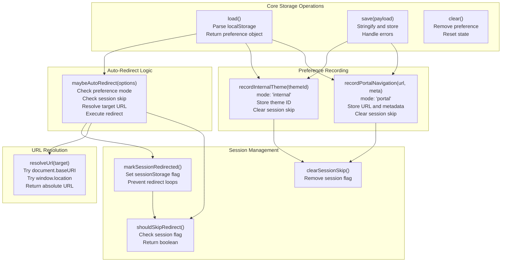
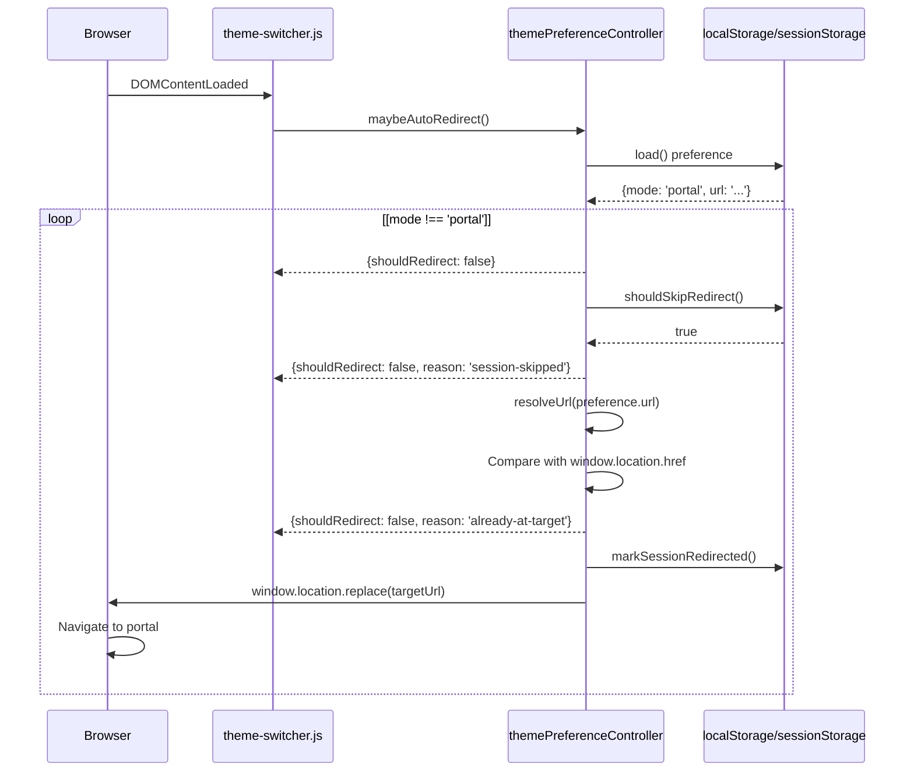
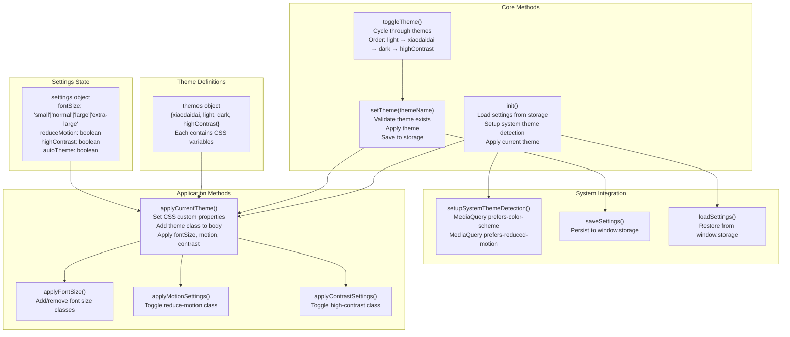
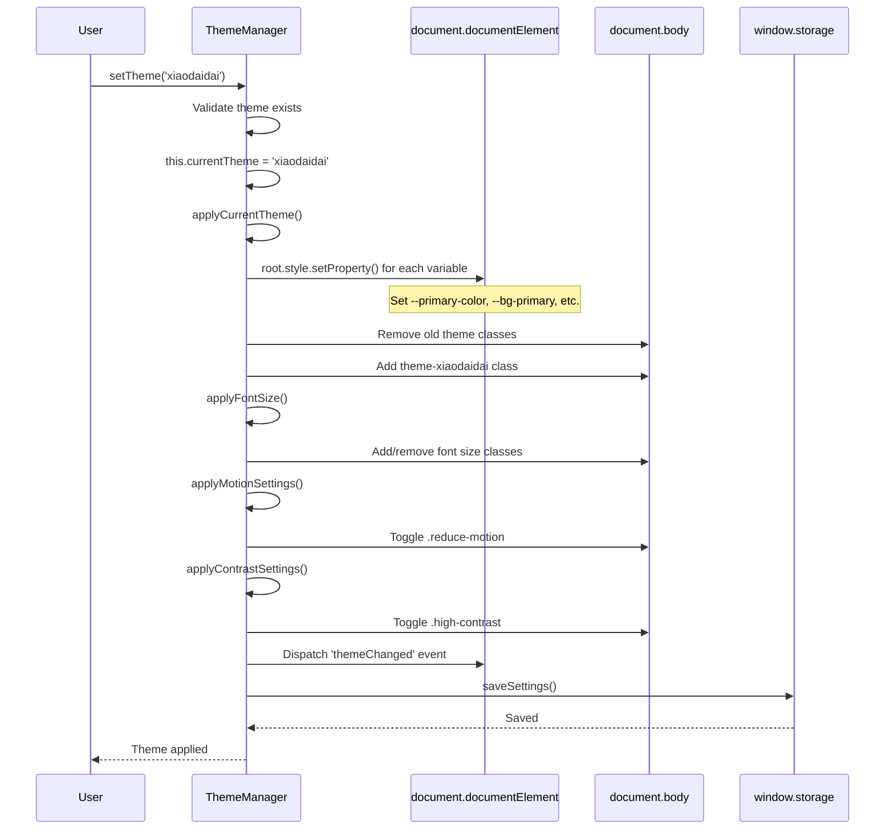
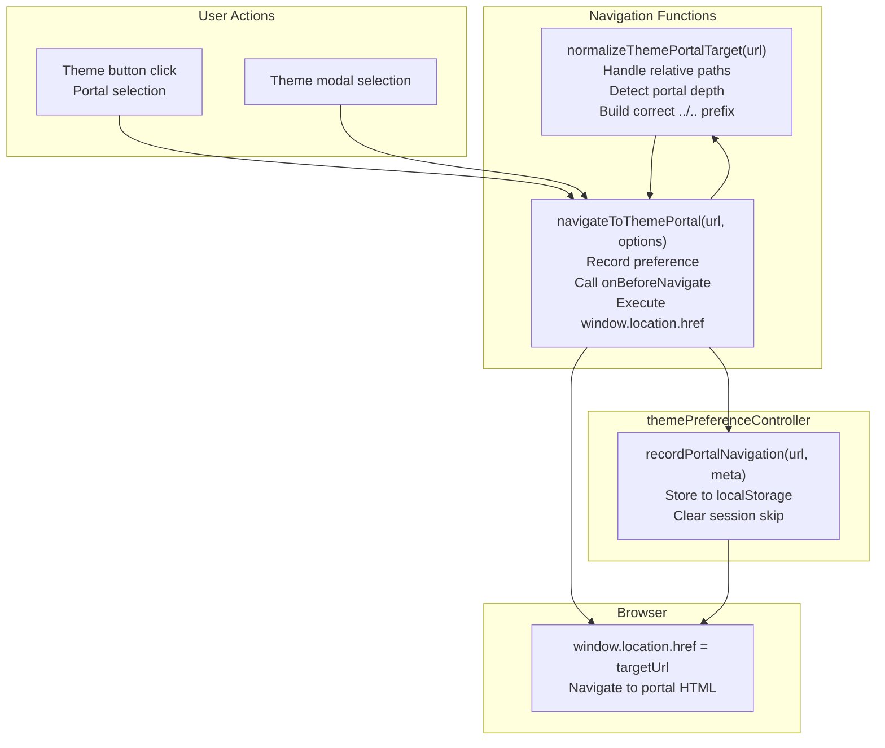
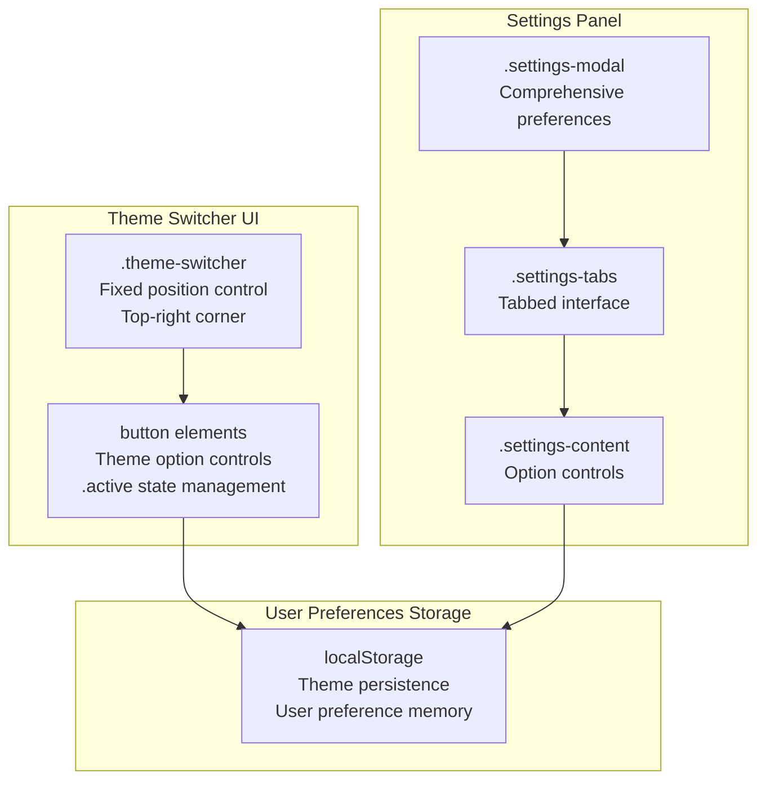

# Theme Management & Controller

> **Relevant source files**
> * [.superdesign/design_iterations/HarryPoter.html](https://github.com/sallowayma-git/IELTS-practice/blob/df0c9b8f/.superdesign/design_iterations/HarryPoter.html)
> * [.superdesign/design_iterations/ielts_academic_functional_2.html](https://github.com/sallowayma-git/IELTS-practice/blob/df0c9b8f/.superdesign/design_iterations/ielts_academic_functional_2.html)
> * [.superdesign/design_iterations/my_melody_ielts_1.html](https://github.com/sallowayma-git/IELTS-practice/blob/df0c9b8f/.superdesign/design_iterations/my_melody_ielts_1.html)
> * [developer/docs/2025-10-12-hp-view-capture.md](https://github.com/sallowayma-git/IELTS-practice/blob/df0c9b8f/developer/docs/2025-10-12-hp-view-capture.md)
> * [js/components/practiceHistory.js](https://github.com/sallowayma-git/IELTS-practice/blob/df0c9b8f/js/components/practiceHistory.js)
> * [js/components/practiceRecordModal.js](https://github.com/sallowayma-git/IELTS-practice/blob/df0c9b8f/js/components/practiceRecordModal.js)
> * [js/components/settingsPanel.js](https://github.com/sallowayma-git/IELTS-practice/blob/df0c9b8f/js/components/settingsPanel.js)
> * [js/plugins/hp/hp-path.js](https://github.com/sallowayma-git/IELTS-practice/blob/df0c9b8f/js/plugins/hp/hp-path.js)
> * [js/theme-switcher.js](https://github.com/sallowayma-git/IELTS-practice/blob/df0c9b8f/js/theme-switcher.js)
> * [js/utils/themeManager.js](https://github.com/sallowayma-git/IELTS-practice/blob/df0c9b8f/js/utils/themeManager.js)

This document covers the theme management system that enables users to switch between different visual themes and theme portals. The system consists of two primary strategies: **theme portals** (complete UI redesigns in separate HTML files) and **in-app theme variants** (runtime CSS modifications). The architecture centers around `themePreferenceController`, `ThemeManager`, and `theme-switcher.js`.

## Dual-Strategy Theme Architecture

The theme system implements two distinct strategies for theme variation:

### Theme Strategy Overview



**Sources:** [js/theme-switcher.js L1-L473](https://github.com/sallowayma-git/IELTS-practice/blob/df0c9b8f/js/theme-switcher.js#L1-L473)

 [js/utils/themeManager.js L1-L409](https://github.com/sallowayma-git/IELTS-practice/blob/df0c9b8f/js/utils/themeManager.js#L1-L409)

 [.superdesign/design_iterations/my_melody_ielts_1.html L1-L100](https://github.com/sallowayma-git/IELTS-practice/blob/df0c9b8f/.superdesign/design_iterations/my_melody_ielts_1.html#L1-L100)

 [.superdesign/design_iterations/ielts_academic_functional_2.html L1-L100](https://github.com/sallowayma-git/IELTS-practice/blob/df0c9b8f/.superdesign/design_iterations/ielts_academic_functional_2.html#L1-L100)

 [.superdesign/design_iterations/HarryPoter.html L1-L100](https://github.com/sallowayma-git/IELTS-practice/blob/df0c9b8f/.superdesign/design_iterations/HarryPoter.html#L1-L100)

### Strategy Comparison

| Aspect | Theme Portals | In-App Theme Variants |
| --- | --- | --- |
| **Navigation** | Full page navigation to different HTML | Runtime CSS class toggle |
| **Persistence** | `themePreferenceController.recordPortalNavigation()` | `ThemeManager.setTheme()` |
| **Scope** | Complete UX redesign | Color scheme and styling changes |
| **Examples** | Academic, My Melody, Harry Potter | xiaodaidai, light, dark, highContrast |
| **Restoration** | Auto-redirect on next visit | Applied from localStorage |

**Sources:** [js/theme-switcher.js L399-L428](https://github.com/sallowayma-git/IELTS-practice/blob/df0c9b8f/js/theme-switcher.js#L399-L428)

 [js/utils/themeManager.js L265-L280](https://github.com/sallowayma-git/IELTS-practice/blob/df0c9b8f/js/utils/themeManager.js#L265-L280)

## themePreferenceController

The `themePreferenceController` object manages theme preference persistence, auto-redirect logic, and portal navigation. It operates independently of the main application and executes early in the page lifecycle.

### themePreferenceController Architecture



**Sources:** [js/theme-switcher.js L17-L168](https://github.com/sallowayma-git/IELTS-practice/blob/df0c9b8f/js/theme-switcher.js#L17-L168)

### Preference Data Structure

The `themePreferenceController` stores preference snapshots in localStorage:

```yaml
// Portal navigation preference
{
  mode: 'portal',
  url: '.superdesign/design_iterations/my_melody_ielts_1.html',
  label: 'My Melody Theme',
  theme: null,
  updatedAt: 1634567890123
}

// In-app theme preference
{
  mode: 'internal',
  theme: 'xiaodaidai',
  updatedAt: 1634567890456
}
```

**Key Methods:**

| Method | Purpose | Return Value |
| --- | --- | --- |
| `load()` | Parse localStorage preference | `{mode, url?, theme?, updatedAt}` or `null` |
| `save(payload)` | Store preference snapshot | `void` |
| `recordPortalNavigation(url, meta)` | Record portal navigation intent | Preference object |
| `recordInternalTheme(themeId)` | Record in-app theme selection | Preference object |
| `maybeAutoRedirect(options)` | Auto-redirect to preferred portal | `{shouldRedirect, targetUrl?, preference?}` |
| `resolveUrl(target)` | Convert relative to absolute URL | String URL |

**Sources:** [js/theme-switcher.js L21-L168](https://github.com/sallowayma-git/IELTS-practice/blob/df0c9b8f/js/theme-switcher.js#L21-L168)

### Auto-Redirect Execution Flow



**Sources:** [js/theme-switcher.js L142-L168](https://github.com/sallowayma-git/IELTS-practice/blob/df0c9b8f/js/theme-switcher.js#L142-L168)

 [js/theme-switcher.js L206-L207](https://github.com/sallowayma-git/IELTS-practice/blob/df0c9b8f/js/theme-switcher.js#L206-L207)

### Query Parameter Handling

The system supports query parameters for manual override:

| Query Parameter | Effect |
| --- | --- |
| `?theme=reset` | Clear preference, clear session skip, remove query param |
| `?theme=main` | Same as `reset` |
| `?theme=default` | Same as `reset` |
| `?theme=portal` | Clear session skip only, allow auto-redirect |

**Implementation:**

```javascript
function handleThemeQueryParameters() {
    const params = new URLSearchParams(window.location.search);
    const directive = params.get('theme');
    
    if (['reset', 'main', 'default'].includes(directive)) {
        themePreferenceController.clear();
        themePreferenceController.clearSessionSkip();
    } else if (directive === 'portal') {
        themePreferenceController.clearSessionSkip();
    }
    
    // Remove query param from URL
    if (directive) {
        params.delete('theme');
        const nextUrl = `${window.location.pathname}${params.toString() ? `?${params}` : ''}`;
        window.history.replaceState({}, document.title, nextUrl);
    }
}
```

**Sources:** [js/theme-switcher.js L175-L204](https://github.com/sallowayma-git/IELTS-practice/blob/df0c9b8f/js/theme-switcher.js#L175-L204)

## ThemeManager Class

The `ThemeManager` class handles runtime theme application by manipulating CSS custom properties and document classes. It manages in-app theme variants (xiaodaidai, light, dark, highContrast) and accessibility settings.

### ThemeManager Architecture



**Sources:** [js/utils/themeManager.js L1-L409](https://github.com/sallowayma-git/IELTS-practice/blob/df0c9b8f/js/utils/themeManager.js#L1-L409)

### Theme Definition Structure

Each theme in the `themes` object contains CSS custom property overrides:

```css
xiaodaidai: {
    name: '小呆呆控制台',
    variables: {
        '--primary-color': '#ffc83d',
        '--primary-color-light': 'rgba(255, 200, 61, 0.18)',
        '--primary-hover': '#f59e0b',
        '--secondary-color': '#64748b',
        '--success-color': '#34d399',
        // ... 30+ CSS variables
    }
}
```

**Key Methods:**

| Method | Purpose | Side Effects |
| --- | --- | --- |
| `setTheme(themeName)` | Switch to specified theme | Updates CSS variables, body class, saves to storage |
| `toggleTheme()` | Cycle through available themes | Calls `setTheme()` with next theme |
| `setFontSize(size)` | Change font size setting | Adds font size class, saves to storage |
| `toggleReduceMotion()` | Toggle animation reduction | Adds/removes `.reduce-motion` class |
| `toggleHighContrast()` | Toggle high contrast mode | Switches to `highContrast` theme or restores previous |
| `toggleAutoTheme()` | Toggle system theme tracking | Enables/disables `prefers-color-scheme` listener |

**Sources:** [js/utils/themeManager.js L7-L130](https://github.com/sallowayma-git/IELTS-practice/blob/df0c9b8f/js/utils/themeManager.js#L7-L130)

 [js/utils/themeManager.js L265-L365](https://github.com/sallowayma-git/IELTS-practice/blob/df0c9b8f/js/utils/themeManager.js#L265-L365)

### Theme Application Process



**Sources:** [js/utils/themeManager.js L210-L236](https://github.com/sallowayma-git/IELTS-practice/blob/df0c9b8f/js/utils/themeManager.js#L210-L236)

 [js/utils/themeManager.js L265-L280](https://github.com/sallowayma-git/IELTS-practice/blob/df0c9b8f/js/utils/themeManager.js#L265-L280)

### System Theme Detection

The `ThemeManager` listens to system-level media queries:

```javascript
setupSystemThemeDetection() {
    const darkModeQuery = window.matchMedia('(prefers-color-scheme: dark)');
    const reduceMotionQuery = window.matchMedia('(prefers-reduced-motion: reduce)');
    
    // Auto-switch theme when system preference changes
    darkModeQuery.addEventListener('change', (e) => {
        if (this.settings.autoTheme) {
            this.setTheme(e.matches ? 'dark' : 'light');
        }
    });
    
    // Auto-enable reduce motion when system requests it
    reduceMotionQuery.addEventListener('change', (e) => {
        this.settings.reduceMotion = e.matches;
        this.applyMotionSettings();
        this.saveSettings();
    });
    
    // Initialize from current system state
    if (this.settings.autoTheme) {
        this.currentTheme = darkModeQuery.matches ? 'dark' : 'light';
    }
    this.settings.reduceMotion = reduceMotionQuery.matches;
}
```

**Sources:** [js/utils/themeManager.js L163-L192](https://github.com/sallowayma-git/IELTS-practice/blob/df0c9b8f/js/utils/themeManager.js#L163-L192)

## Portal Navigation Functions

The system provides functions to navigate between theme portals while recording user preference.

### Portal Navigation Flow



**Sources:** [js/theme-switcher.js L350-L433](https://github.com/sallowayma-git/IELTS-practice/blob/df0c9b8f/js/theme-switcher.js#L350-L433)

### normalizeThemePortalTarget Function

The `normalizeThemePortalTarget` function handles path normalization for portals located in `.superdesign/design_iterations/`:

```javascript
function normalizeThemePortalTarget(url) {
    // Returns input if not starting with .superdesign/
    if (!url.startsWith('.superdesign/')) {
        return url;
    }
    
    // Detect how deep current page is in the portal directory
    const pathName = window.location.pathname;
    const marker = '/.superdesign/design_iterations/';
    const markerIndex = pathName.indexOf(marker);
    
    if (markerIndex === -1) {
        return url; // Not in portal context
    }
    
    // Count segments after marker (e.g., "my_melody.html" = 1 segment)
    const afterMarker = pathName.slice(markerIndex + marker.length);
    const segments = afterMarker.split('/').filter(Boolean);
    const depth = Math.max(0, segments.length - 2);
    
    // Build ../.. prefix based on depth
    const trimmed = url.replace(/^\.superdesign\/design_iterations\//, '');
    const prefix = new Array(depth).fill('..').join('/');
    
    return prefix ? `${prefix}/${trimmed}` : trimmed;
}
```

**Sources:** [js/theme-switcher.js L350-L397](https://github.com/sallowayma-git/IELTS-practice/blob/df0c9b8f/js/theme-switcher.js#L350-L397)

### navigateToThemePortal Function

The main portal navigation function:

```javascript
function navigateToThemePortal(url, options = {}) {
    const meta = options || {};
    const target = normalizeThemePortalTarget(url);
    
    // Record preference before navigating
    const preference = themePreferenceController.recordPortalNavigation(target, meta);
    
    // Apply theme attribute if specified
    if (meta.theme) {
        document.documentElement.setAttribute('data-theme', meta.theme);
        localStorage.setItem('theme', meta.theme);
    }
    
    // Call optional pre-navigation callback
    if (typeof meta.onBeforeNavigate === 'function') {
        meta.onBeforeNavigate(preference);
    }
    
    // Resolve and navigate
    const targetUrl = preference?.url 
        ? themePreferenceController.resolveUrl(preference.url)
        : themePreferenceController.resolveUrl(target);
    
    if (targetUrl) {
        window.location.href = targetUrl;
    }
}
```

**Usage Examples:**

```javascript
// Navigate to My Melody theme
navigateToThemePortal('.superdesign/design_iterations/my_melody_ielts_1.html', {
    label: 'My Melody Theme',
    theme: 'melody'
});

// Navigate to Academic theme
navigateToThemePortal('.superdesign/design_iterations/ielts_academic_functional_2.html', {
    label: 'Academic Theme',
    onBeforeNavigate: (pref) => {
        console.log('Navigating to academic theme', pref);
    }
});
```

**Sources:** [js/theme-switcher.js L399-L428](https://github.com/sallowayma-git/IELTS-practice/blob/df0c9b8f/js/theme-switcher.js#L399-L428)

## Legacy Theme Functions

The `theme-switcher.js` file also contains legacy functions for applying in-app theme variants (Bloom and Blue themes with their dark modes). These functions manipulate CSS classes and localStorage directly:

### Legacy Theme Application Functions

| Function | Purpose | Implementation |
| --- | --- | --- |
| `applyTheme(theme)` | Apply in-app theme variant | Set `data-theme` attribute, toggle classes, update localStorage |
| `applyDefaultTheme()` | Reset to default Bloom theme | Remove theme classes, restore Bloom dark mode from localStorage |
| `toggleBloomDarkMode()` | Toggle Bloom dark/light mode | Toggle `.bloom-dark-mode` class, save to localStorage |
| `toggleBlueDarkMode()` | Toggle Blue theme dark mode | Toggle `.blue-dark-mode` class, save to localStorage |
| `initializeBloomTheme()` | Restore Bloom mode on load | Apply saved Bloom dark/light mode from localStorage |

**Example Usage:**

```
// Apply Blue theme
applyTheme('blue');

// Toggle Bloom dark mode
toggleBloomDarkMode();

// Reset to default
applyDefaultTheme();
```

**Sources:** [js/theme-switcher.js L210-L347](https://github.com/sallowayma-git/IELTS-practice/blob/df0c9b8f/js/theme-switcher.js#L210-L347)

**Note:** These legacy functions coexist with the `ThemeManager` class. New code should prefer using `ThemeManager` for in-app theme variants, but legacy functions remain for backward compatibility with existing HTML portals that reference them directly.

## Theme Switching Infrastructure

The application includes a theme switcher component that allows users to manually control theming options.

### Theme Switcher Component



Sources: [css/styles.css L827-L861](https://github.com/sallowayma-git/IELTS-practice/blob/df0c9b8f/css/styles.css#L827-L861)

 [css/styles.css L863-L900](https://github.com/sallowayma-git/IELTS-practice/blob/df0c9b8f/css/styles.css#L863-L900)

### Settings Panel Layout

The settings panel provides comprehensive control over appearance and accessibility options:

* **Appearance Tab**: Theme selection, color preferences
* **Accessibility Tab**: Font size, motion reduction, high contrast
* **System Tab**: System information and diagnostics

Sources: [css/styles.css L1505-L1695](https://github.com/sallowayma-git/IELTS-practice/blob/df0c9b8f/css/styles.css#L1505-L1695)

The CSS architecture provides a robust foundation for the entire application's visual presentation, with careful attention to maintainability, accessibility, and user experience across all devices and user preferences.