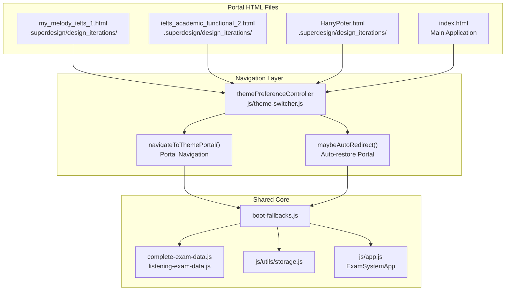
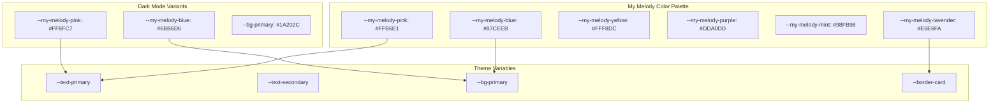
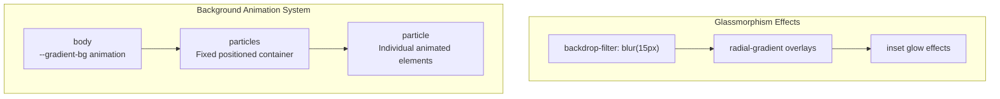
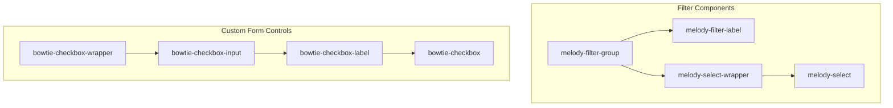
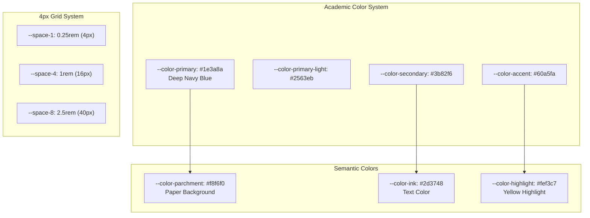
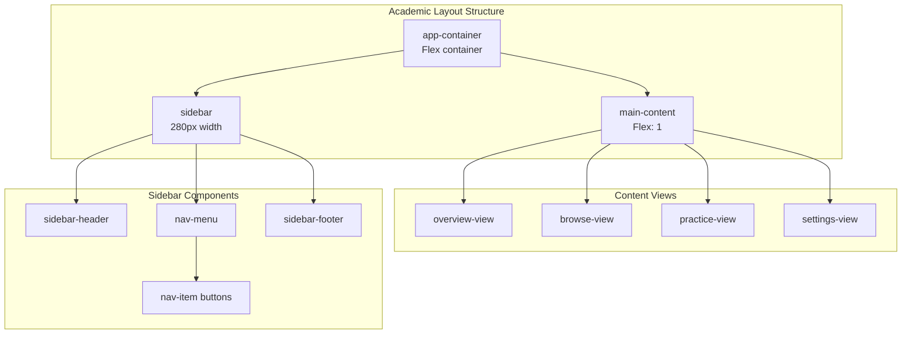
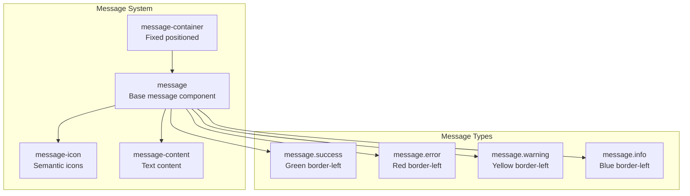
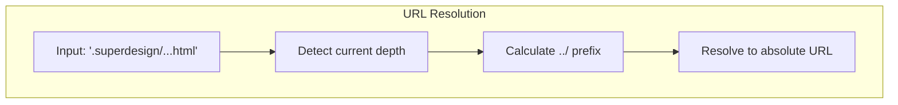
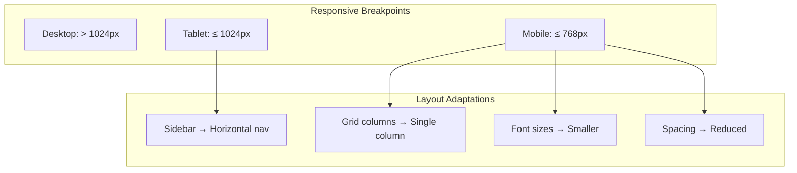

# Theme Portals (Academic, Melody, Bloom)

> **Relevant source files**
> * [.superdesign/design_iterations/HarryPoter.html](https://github.com/sallowayma-git/IELTS-practice/blob/df0c9b8f/.superdesign/design_iterations/HarryPoter.html)
> * [.superdesign/design_iterations/ielts_academic_functional_2.html](https://github.com/sallowayma-git/IELTS-practice/blob/df0c9b8f/.superdesign/design_iterations/ielts_academic_functional_2.html)
> * [.superdesign/design_iterations/my_melody_ielts_1.html](https://github.com/sallowayma-git/IELTS-practice/blob/df0c9b8f/.superdesign/design_iterations/my_melody_ielts_1.html)
> * [developer/docs/2025-10-12-hp-view-capture.md](https://github.com/sallowayma-git/IELTS-practice/blob/df0c9b8f/developer/docs/2025-10-12-hp-view-capture.md)
> * [js/plugins/hp/hp-path.js](https://github.com/sallowayma-git/IELTS-practice/blob/df0c9b8f/js/plugins/hp/hp-path.js)
> * [js/theme-switcher.js](https://github.com/sallowayma-git/IELTS-practice/blob/df0c9b8f/js/theme-switcher.js)

## Purpose and Scope

This page documents the **theme portal** system in the IELTS practice system. Theme portals are complete UI redesigns implemented as standalone HTML files, each providing a dramatically different visual experience and navigation paradigm while maintaining identical underlying functionality and data management.

The system includes four major portals:

* **Academic Portal**: Professional, scholarly interface with sidebar navigation
* **My Melody Portal**: Cute, colorful interface with floating island navigation
* **Bloom Portal**: Floral design theme (styling variant)
* **Harry Potter Portal**: Map-based navigation with Marauder's Map interface (documented separately in [HP Welcome Interface & Views](/sallowayma-git/IELTS-practice/8.1-hp-welcome-interface-and-views))

Theme portals differ from **in-app theme variants** (Blue theme, Xiaodaidai, High Contrast mode), which are CSS-based color scheme changes within the current page. Portals require full navigation to a different HTML file.

For information about the theme preference controller and navigation logic, see [Theme Management & Controller](/sallowayma-git/IELTS-practice/7.1-theme-management-and-controller). For in-app theme variants, see [In-App Theme Variants & CSS](/sallowayma-git/IELTS-practice/7.3-in-app-theme-variants-and-css).

**Sources:** [.superdesign/design_iterations/my_melody_ielts_1.html L1-L20](https://github.com/sallowayma-git/IELTS-practice/blob/df0c9b8f/.superdesign/design_iterations/my_melody_ielts_1.html#L1-L20)

 [.superdesign/design_iterations/ielts_academic_functional_2.html L1-L15](https://github.com/sallowayma-git/IELTS-practice/blob/df0c9b8f/.superdesign/design_iterations/ielts_academic_functional_2.html#L1-L15)

 [.superdesign/design_iterations/HarryPoter.html L1-L10](https://github.com/sallowayma-git/IELTS-practice/blob/df0c9b8f/.superdesign/design_iterations/HarryPoter.html#L1-L10)

 [js/theme-switcher.js L1-L50](https://github.com/sallowayma-git/IELTS-practice/blob/df0c9b8f/js/theme-switcher.js#L1-L50)

## Theme Portal Architecture

Theme portals are standalone HTML files that provide complete UI redesigns. Each portal loads the same core JavaScript modules and data files but presents a unique visual experience and navigation paradigm.



**Portal Navigation Architecture**

Each portal is a complete HTML document with its own styling but shares JavaScript functionality. Users can navigate between portals using the theme switcher modal or direct URLs. The `themePreferenceController` stores the user's preferred portal and automatically redirects on subsequent visits.

**Sources:** [js/theme-switcher.js L17-L169](https://github.com/sallowayma-git/IELTS-practice/blob/df0c9b8f/js/theme-switcher.js#L17-L169)

 [.superdesign/design_iterations/my_melody_ielts_1.html L10-L19](https://github.com/sallowayma-git/IELTS-practice/blob/df0c9b8f/.superdesign/design_iterations/my_melody_ielts_1.html#L10-L19)

 [.superdesign/design_iterations/ielts_academic_functional_2.html L1-L15](https://github.com/sallowayma-git/IELTS-practice/blob/df0c9b8f/.superdesign/design_iterations/ielts_academic_functional_2.html#L1-L15)

## My Melody Portal Implementation

**Location:** `.superdesign/design_iterations/my_melody_ielts_1.html`

The My Melody portal provides a cute, colorful interface with animated elements, glassmorphism effects, and floating island navigation. It targets users who prefer a playful, visually engaging study environment.

### Color System and Design Tokens

The My Melody theme uses a pink-blue-purple color palette with both light and dark mode support:



**My Melody Color System**

Sources: [.superdesign/design_iterations/my_melody_ielts_1.html L24-L93](https://github.com/sallowayma-git/IELTS-practice/blob/df0c9b8f/.superdesign/design_iterations/my_melody_ielts_1.html#L24-L93)

### UI Components and Layout

The My Melody theme features distinctive UI components including floating islands navigation, animated particles, and specialty form controls:

| Component | Implementation | Key Features |
| --- | --- | --- |
| Navigation | `nav-islands` | Floating island-style buttons with hover animations |
| Header | `header` with glassmorphism | Animated gradient background with emoji particles |
| Cards | `stat-card`, `exam-card` | Glassmorphism with radial gradient overlays |
| Checkboxes | `bowtie-checkbox` | Custom bowtie-shaped checkboxes |
| Buttons | `melody-btn` | Gradient buttons with shimmer effects |

The theme implements a complex animated background system with floating particles:



**My Melody Animation Architecture**

Sources: [.superdesign/design_iterations/my_melody_ielts_1.html L100-L143](https://github.com/sallowayma-git/IELTS-practice/blob/df0c9b8f/.superdesign/design_iterations/my_melody_ielts_1.html#L100-L143)

 [.superdesign/design_iterations/my_melody_ielts_1.html L413-L503](https://github.com/sallowayma-git/IELTS-practice/blob/df0c9b8f/.superdesign/design_iterations/my_melody_ielts_1.html#L413-L503)

### Specialty Form Controls

The My Melody theme includes custom form controls that match the aesthetic:



**My Melody Form Control Architecture**

Sources: [.superdesign/design_iterations/my_melody_ielts_1.html L908-L1030](https://github.com/sallowayma-git/IELTS-practice/blob/df0c9b8f/.superdesign/design_iterations/my_melody_ielts_1.html#L908-L1030)

 [.superdesign/design_iterations/my_melody_ielts_1.html L1595-L1669](https://github.com/sallowayma-git/IELTS-practice/blob/df0c9b8f/.superdesign/design_iterations/my_melody_ielts_1.html#L1595-L1669)

## Academic Portal Implementation

**Location:** `.superdesign/design_iterations/ielts_academic_functional_2.html`

The Academic portal provides a professional, scholarly interface optimized for focused study sessions. It uses a sidebar navigation layout, systematic design tokens, and follows traditional academic design principles.

### Design Token System

The Academic theme implements a systematic approach to design tokens with consistent scales:



**Academic Design Token Architecture**

Sources: [.superdesign/design_iterations/ielts_academic_functional_2.html L16-L100](https://github.com/sallowayma-git/IELTS-practice/blob/df0c9b8f/.superdesign/design_iterations/ielts_academic_functional_2.html#L16-L100)

### Layout Architecture

The Academic theme uses a sidebar-based layout with professional card components:



**Academic Layout Architecture**

Sources: [.superdesign/design_iterations/ielts_academic_functional_2.html L118-L212](https://github.com/sallowayma-git/IELTS-practice/blob/df0c9b8f/.superdesign/design_iterations/ielts_academic_functional_2.html#L118-L212)

 [.superdesign/design_iterations/ielts_academic_functional_2.html L233-L246](https://github.com/sallowayma-git/IELTS-practice/blob/df0c9b8f/.superdesign/design_iterations/ielts_academic_functional_2.html#L233-L246)

### Professional UI Components

The Academic theme emphasizes professional, accessible design with semantic styling:

| Component | Class | Purpose |
| --- | --- | --- |
| Statistics | `stat-card` | Overview metrics with hover effects |
| Categories | `category-card` | Subject classification with icons |
| Exam Items | `exam-item` | Professional exam listing |
| Tables | `records-table` | Data-heavy interfaces |
| Messages | `message` | System notifications |

The theme includes a sophisticated message system with semantic styling:



**Academic Message System Architecture**

Sources: [.superdesign/design_iterations/ielts_academic_functional_2.html L658-L733](https://github.com/sallowayma-git/IELTS-practice/blob/df0c9b8f/.superdesign/design_iterations/ielts_academic_functional_2.html#L658-L733)

## Portal Navigation Mechanism

The portal navigation system uses `navigateToThemePortal()` and `themePreferenceController` to manage portal transitions and user preferences.

### Navigation Functions

```mermaid
flowchart TD

load["Page loads"]
params["handleThemeQueryParameters()<br>Process ?theme= params"]
maybe["maybeAutoRedirect()<br>Check preference"]
skip["shouldSkipRedirect()<br>Session guard"]
redirect["window.location.replace()<br>Restore portal"]
button["User clicks theme button"]
normalize["normalizeThemePortalTarget()<br>Path normalization"]
record["recordPortalNavigation()<br>Save preference"]
navigate["window.location.href<br>Navigate to portal"]

subgraph subGraph1 ["Auto-Redirect Flow"]
    load
    params
    maybe
    skip
    redirect
    load --> params
    params --> maybe
    maybe --> skip
    skip --> redirect
end

subgraph subGraph0 ["Portal Navigation Flow"]
    button
    normalize
    record
    navigate
    button --> normalize
    normalize --> record
    record --> navigate
end
```



**Portal Navigation and Auto-Redirect Flow**

| Function | Purpose | Location |
| --- | --- | --- |
| `navigateToThemePortal(url, options)` | Navigate to a portal and record preference | [js/theme-switcher.js L399-L428](https://github.com/sallowayma-git/IELTS-practice/blob/df0c9b8f/js/theme-switcher.js#L399-L428) |
| `normalizeThemePortalTarget(url)` | Resolve relative portal paths | [js/theme-switcher.js L350-L397](https://github.com/sallowayma-git/IELTS-practice/blob/df0c9b8f/js/theme-switcher.js#L350-L397) |
| `recordPortalNavigation(url, meta)` | Save portal preference to localStorage | [js/theme-switcher.js L117-L129](https://github.com/sallowayma-git/IELTS-practice/blob/df0c9b8f/js/theme-switcher.js#L117-L129) |
| `maybeAutoRedirect(options)` | Auto-restore preferred portal on load | [js/theme-switcher.js L142-L168](https://github.com/sallowayma-git/IELTS-practice/blob/df0c9b8f/js/theme-switcher.js#L142-L168) |
| `shouldSkipRedirect()` | Prevent redirect loops using sessionStorage | [js/theme-switcher.js L66-L72](https://github.com/sallowayma-git/IELTS-practice/blob/df0c9b8f/js/theme-switcher.js#L66-L72) |
| `markSessionRedirected()` | Mark current session as redirected | [js/theme-switcher.js L58-L64](https://github.com/sallowayma-git/IELTS-practice/blob/df0c9b8f/js/theme-switcher.js#L58-L64) |

### Preference Storage Structure

The portal preference is stored in `localStorage` with key `'preferred_theme_portal'`:

```yaml
{
  mode: 'portal',           // 'portal' or 'internal'
  url: 'resolved/path.html', // Resolved absolute URL
  label: 'My Melody',       // Display label
  theme: null,              // Optional theme identifier
  updatedAt: 1234567890     // Timestamp
}
```

**Sources:** [js/theme-switcher.js L1-L208](https://github.com/sallowayma-git/IELTS-practice/blob/df0c9b8f/js/theme-switcher.js#L1-L208)

 [js/theme-switcher.js L350-L428](https://github.com/sallowayma-git/IELTS-practice/blob/df0c9b8f/js/theme-switcher.js#L350-L428)

### Portal URL Resolution

Portal URLs are normalized relative to the current page location. The system handles nested directory structures in `.superdesign/design_iterations/`:



**Sources:** [js/theme-switcher.js L350-L397](https://github.com/sallowayma-git/IELTS-practice/blob/df0c9b8f/js/theme-switcher.js#L350-L397)

## Portal Architecture Comparison

All portals share core JavaScript functionality but implement dramatically different visual experiences:

| Aspect | My Melody | Academic | Harry Potter |
| --- | --- | --- | --- |
| **Location** | `.superdesign/design_iterations/` | `.superdesign/design_iterations/` | `.superdesign/design_iterations/` |
| **Navigation** | Floating islands, centered | Sidebar navigation | Map-based clickable regions |
| **Color Strategy** | Brand colors (pink, blue, purple) | Systematic blue scales | Parchment tones, muted palette |
| **Typography** | Mixed sans-serif | Georgia serif + Source Sans Pro | Apple Chancery, serif |
| **Layout** | Single-page sections | Sidebar + content area | Full-viewport map |
| **Animations** | Extensive particle effects | Subtle transitions | Footstep trails, magic reveal |
| **Forms** | Custom bowtie checkboxes | Standard professional controls | Integrated into map locations |
| **Background** | Animated gradients | Static parchment texture | Map image with overlay |
| **Data Loading** | Synchronous script tags | Synchronous script tags | Synchronous script tags |

All portals load identical JavaScript modules (`js/app.js`, `js/utils/storage.js`, `js/core/practiceRecorder.js`) and data files (`complete-exam-data.js`, `listening-exam-data.js`), ensuring functional parity.

**Sources:** [.superdesign/design_iterations/my_melody_ielts_1.html L1-L100](https://github.com/sallowayma-git/IELTS-practice/blob/df0c9b8f/.superdesign/design_iterations/my_melody_ielts_1.html#L1-L100)

 [.superdesign/design_iterations/ielts_academic_functional_2.html L1-L150](https://github.com/sallowayma-git/IELTS-practice/blob/df0c9b8f/.superdesign/design_iterations/ielts_academic_functional_2.html#L1-L150)

 [.superdesign/design_iterations/HarryPoter.html L1-L100](https://github.com/sallowayma-git/IELTS-practice/blob/df0c9b8f/.superdesign/design_iterations/HarryPoter.html#L1-L100)

## Responsive Design Implementation

Both themes implement comprehensive responsive design with breakpoint-based adaptations:



**Responsive Design Strategy**

Both themes use CSS Grid and Flexbox for responsive layouts, with mobile-first considerations for touch interfaces and smaller screens.

Sources: [.superdesign/design_iterations/my_melody_ielts_1.html L1175-L1206](https://github.com/sallowayma-git/IELTS-practice/blob/df0c9b8f/.superdesign/design_iterations/my_melody_ielts_1.html#L1175-L1206)

 [.superdesign/design_iterations/ielts_academic_functional_2.html L780-L850](https://github.com/sallowayma-git/IELTS-practice/blob/df0c9b8f/.superdesign/design_iterations/ielts_academic_functional_2.html#L780-L850)