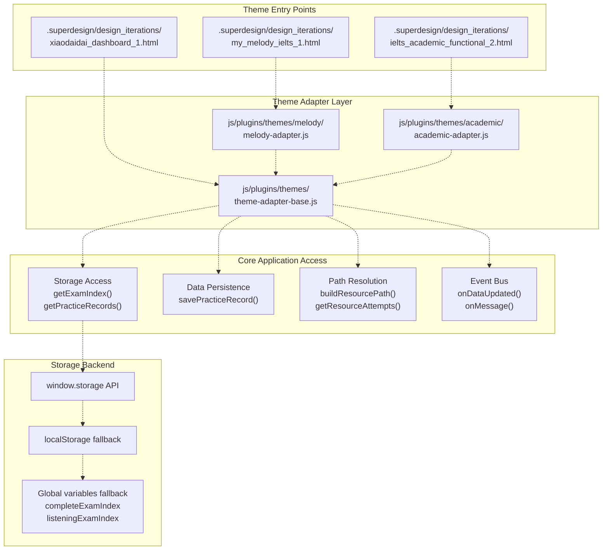
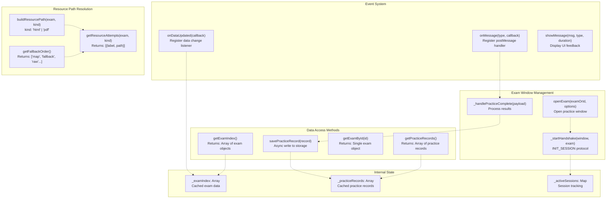
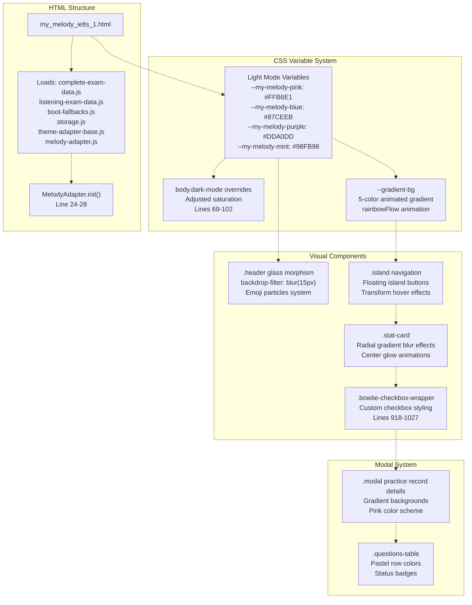
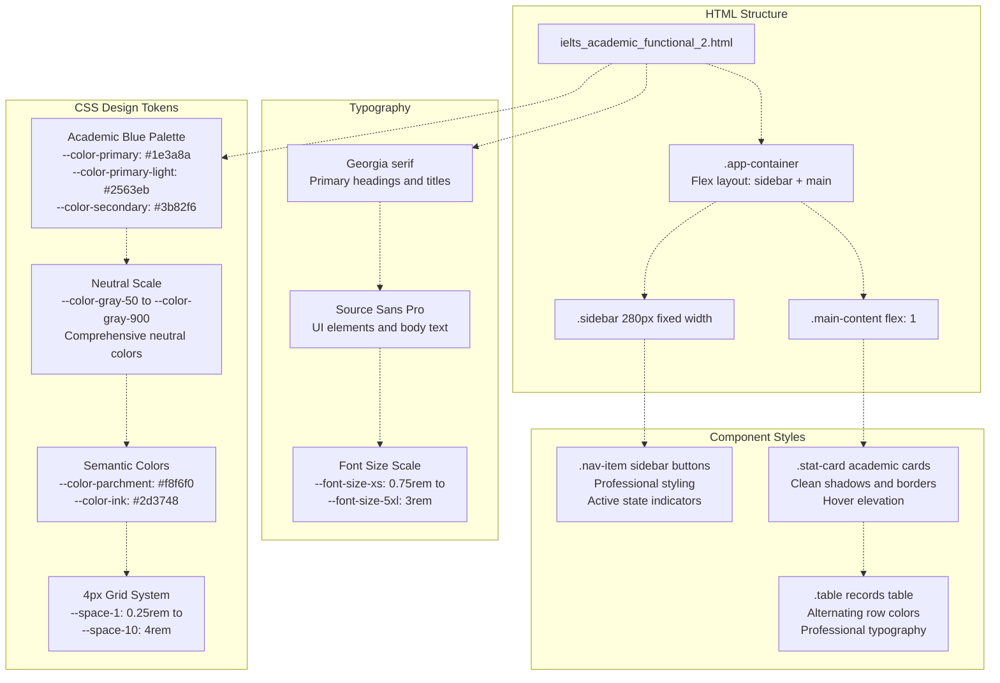
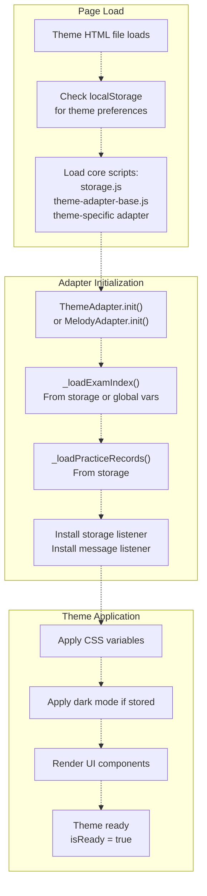
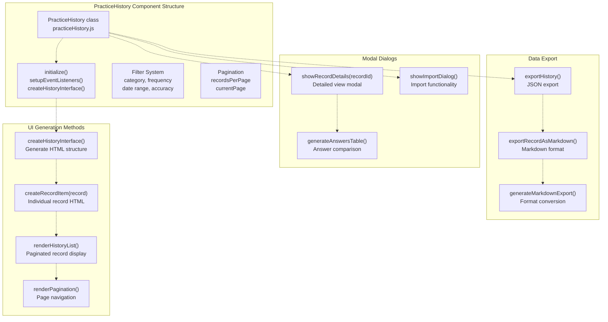
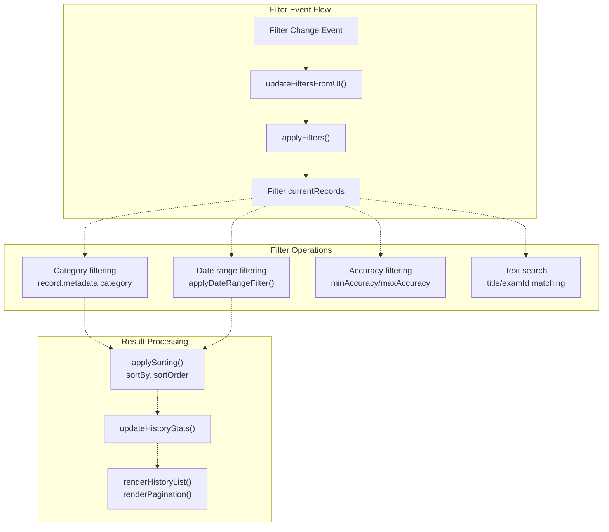
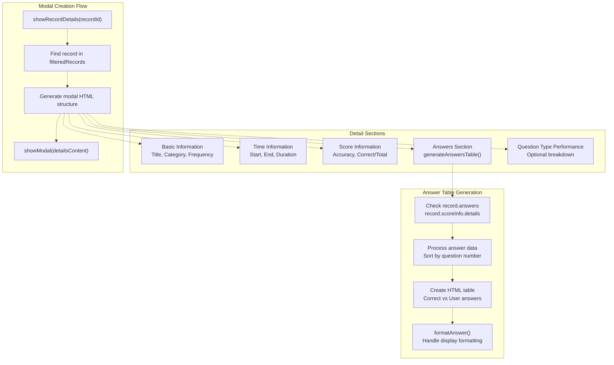
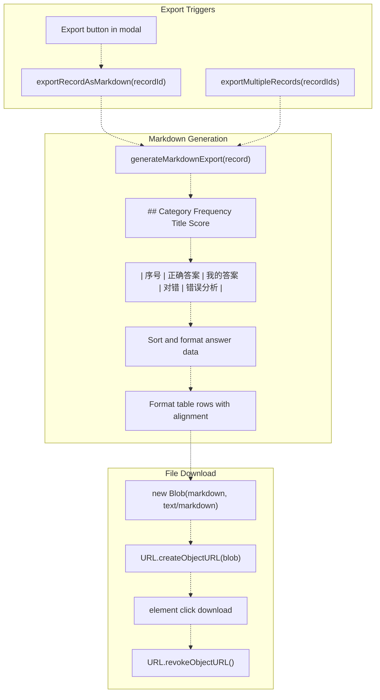

# Theme System & UI Architecture

> **Relevant source files**
> * [.gitignore](https://github.com/sallowayma-git/IELTS-practice/blob/92f64eb8/.gitignore)
> * [.superdesign/design_iterations/ielts_academic_functional_2.html](https://github.com/sallowayma-git/IELTS-practice/blob/92f64eb8/.superdesign/design_iterations/ielts_academic_functional_2.html)
> * [.superdesign/design_iterations/my_melody_ielts_1.html](https://github.com/sallowayma-git/IELTS-practice/blob/92f64eb8/.superdesign/design_iterations/my_melody_ielts_1.html)
> * [js/plugins/themes/theme-adapter-base.js](https://github.com/sallowayma-git/IELTS-practice/blob/92f64eb8/js/plugins/themes/theme-adapter-base.js)

This document describes the theme system architecture that enables multiple visual variants of the IELTS practice application. The system uses a theme adapter pattern to provide a unified interface between theme HTML files and the core application, allowing themes to access exam data, practice records, and system functionality through a consistent API.

The theme system consists of three layers: (1) `ThemeAdapterBase` providing unified data access and event handling, (2) theme-specific HTML entry points with custom CSS, and (3) runtime theme management for switching and persistence. For the Harry Potter theme's specialized bridge architecture, see page 8.

## Theme Architecture Overview

The theme system architecture separates presentation from functionality through the `ThemeAdapterBase` abstraction. Each theme HTML file initializes its own adapter instance, which provides access to exam data and practice records while maintaining isolation from core application internals.

**Theme System Architecture**



Sources: [js/plugins/themes/theme-adapter-base.js L1-L45](https://github.com/sallowayma-git/IELTS-practice/blob/92f64eb8/js/plugins/themes/theme-adapter-base.js#L1-L45)

 [.superdesign/design_iterations/my_melody_ielts_1.html L17-L29](https://github.com/sallowayma-git/IELTS-practice/blob/92f64eb8/.superdesign/design_iterations/my_melody_ielts_1.html#L17-L29)

 [.superdesign/design_iterations/ielts_academic_functional_2.html L1-L10](https://github.com/sallowayma-git/IELTS-practice/blob/92f64eb8/.superdesign/design_iterations/ielts_academic_functional_2.html#L1-L10)

## ThemeAdapterBase Data Access

`ThemeAdapterBase` provides a unified interface for themes to access application data without directly coupling to storage internals. The adapter implements storage event listeners, postMessage protocol handling, and multi-backend data access with automatic fallbacks.

**ThemeAdapterBase API Surface**



### Storage Keys and Constants

The adapter uses consistent storage keys defined in [js/plugins/themes/theme-adapter-base.js L16-L22](https://github.com/sallowayma-git/IELTS-practice/blob/92f64eb8/js/plugins/themes/theme-adapter-base.js#L16-L22)

:

| Constant | Value | Purpose |
| --- | --- | --- |
| `STORAGE_KEYS.EXAM_INDEX` | `'exam_index'` | Primary exam index storage key |
| `STORAGE_KEYS.ACTIVE_EXAM_INDEX_KEY` | `'active_exam_index_key'` | Currently active exam index identifier |
| `STORAGE_KEYS.PRACTICE_RECORDS` | `'practice_records'` | Practice session records storage key |
| `EXAM_INDEX_KEY_RE` | `/^exam_index(_\d+)?$/` | Pattern for exam index key variants |
| `PATH_FALLBACK_ORDER` | `['map', 'fallback', 'raw', 'relative-up', 'relative-design']` | Resource path resolution strategy order |

### Data Normalization

The adapter performs automatic normalization of data from various sources:

**Type Normalization**: The `normalizeType()` function [js/plugins/themes/theme-adapter-base.js L149-L169](https://github.com/sallowayma-git/IELTS-practice/blob/92f64eb8/js/plugins/themes/theme-adapter-base.js#L149-L169)

 standardizes exam types to `'reading'` or `'listening'`, handling aliases like `'read'`, `'r'`, `'listen'`, `'l'`, `'audio'`.

**Record Deduplication**: The `deduplicateRecords()` function [js/plugins/themes/theme-adapter-base.js L200-L232](https://github.com/sallowayma-git/IELTS-practice/blob/92f64eb8/js/plugins/themes/theme-adapter-base.js#L200-L232)

 removes duplicate practice records based on `sessionId`, keeping the record with the latest timestamp.

**Practice Payload Normalization**: The `normalizePracticePayload()` function [js/plugins/themes/theme-adapter-base.js L373-L493](https://github.com/sallowayma-git/IELTS-practice/blob/92f64eb8/js/plugins/themes/theme-adapter-base.js#L373-L493)

 extracts score, duration, and metadata from various message format variations, supporting multiple naming conventions for the same data.

Sources: [js/plugins/themes/theme-adapter-base.js L499-L547](https://github.com/sallowayma-git/IELTS-practice/blob/92f64eb8/js/plugins/themes/theme-adapter-base.js#L499-L547)

 [js/plugins/themes/theme-adapter-base.js L549-L643](https://github.com/sallowayma-git/IELTS-practice/blob/92f64eb8/js/plugins/themes/theme-adapter-base.js#L549-L643)

 [js/plugins/themes/theme-adapter-base.js L996-L1089](https://github.com/sallowayma-git/IELTS-practice/blob/92f64eb8/js/plugins/themes/theme-adapter-base.js#L996-L1089)

## Theme Variants

The system provides three main theme variants, each implemented as standalone HTML files with embedded CSS and theme-specific initialization code.

### My Melody Theme

The My Melody theme in [.superdesign/design_iterations/my_melody_ielts_1.html](https://github.com/sallowayma-git/IELTS-practice/blob/92f64eb8/.superdesign/design_iterations/my_melody_ielts_1.html)

 implements a kawaii-inspired design with pastel colors, glass morphism effects, and animated gradients.

**My Melody Theme Implementation**



The My Melody theme uses CSS custom properties for theming [.superdesign/design_iterations/my_melody_ielts_1.html L33-L66](https://github.com/sallowayma-git/IELTS-practice/blob/92f64eb8/.superdesign/design_iterations/my_melody_ielts_1.html#L33-L66)

:

| Light Mode Variable | Value | Usage |
| --- | --- | --- |
| `--my-melody-pink` | `#FFB6E1` | Primary accent, borders, buttons |
| `--my-melody-blue` | `#87CEEB` | Secondary accent, backgrounds |
| `--my-melody-purple` | `#DDA0DD` | Tertiary accent, gradients |
| `--my-melody-mint` | `#98FB98` | Success indicators |
| `--my-melody-lavender` | `#E6E6FA` | Card borders, backgrounds |
| `--gradient-bg` | 5-color linear gradient | Animated background with `rainbowFlow` |

**Dark Mode Support**: The theme includes dark mode overrides in [.superdesign/design_iterations/my_melody_ielts_1.html L69-L102](https://github.com/sallowayma-git/IELTS-practice/blob/92f64eb8/.superdesign/design_iterations/my_melody_ielts_1.html#L69-L102)

 with adjusted color saturation and muted gradients applied via `body.dark-mode` class.

**Glass Morphism Effects**: Cards and headers use `backdrop-filter: blur(15px)` combined with radial gradients for depth [.superdesign/design_iterations/my_melody_ielts_1.html L541-L580](https://github.com/sallowayma-git/IELTS-practice/blob/92f64eb8/.superdesign/design_iterations/my_melody_ielts_1.html#L541-L580)

### Academic Theme

The Academic theme in [.superdesign/design_iterations/ielts_academic_functional_2.html](https://github.com/sallowayma-git/IELTS-practice/blob/92f64eb8/.superdesign/design_iterations/ielts_academic_functional_2.html)

 provides a professional, scholarly interface with serif typography and a structured sidebar navigation.

**Academic Theme Design System**



The Academic theme uses a comprehensive design token system [.superdesign/design_iterations/ielts_academic_functional_2.html L16-L100](https://github.com/sallowayma-git/IELTS-practice/blob/92f64eb8/.superdesign/design_iterations/ielts_academic_functional_2.html#L16-L100)

:

| Token Category | Examples | Purpose |
| --- | --- | --- |
| Color Palette | `--color-primary: #1e3a8a`, `--color-parchment: #f8f6f0` | Academic blue theme with parchment background |
| Spacing Grid | `--space-1` through `--space-10` | 4px-based consistent spacing system |
| Typography | `--font-size-xs` through `--font-size-5xl` | Modular type scale |
| Font Weights | `--font-weight-normal` through `--font-weight-bold` | Typography hierarchy |
| Shadows | `--shadow-sm` through `--shadow-xl` | Elevation system |
| Border Radius | `--radius-sm` through `--radius-2xl` | Corner rounding system |

**Sidebar Navigation**: The theme uses a fixed 280px sidebar [.superdesign/design_iterations/ielts_academic_functional_2.html L123-L203](https://github.com/sallowayma-git/IELTS-practice/blob/92f64eb8/.superdesign/design_iterations/ielts_academic_functional_2.html#L123-L203)

 with professional button styling and active state indicators.

**Responsive Design**: Media queries at 1024px and 768px breakpoints [.superdesign/design_iterations/ielts_academic_functional_2.html L780-L850](https://github.com/sallowayma-git/IELTS-practice/blob/92f64eb8/.superdesign/design_iterations/ielts_academic_functional_2.html#L780-L850)

 adapt the layout for tablets and mobile devices.

### XiaoDai Theme

The XiaoDai theme (`xiaodaidai_dashboard_1.html`) provides an alternative visual style. Specific implementation details would be found in that HTML file.

Sources: [.superdesign/design_iterations/my_melody_ielts_1.html L1-L30](https://github.com/sallowayma-git/IELTS-practice/blob/92f64eb8/.superdesign/design_iterations/my_melody_ielts_1.html#L1-L30)

 [.superdesign/design_iterations/my_melody_ielts_1.html L31-L102](https://github.com/sallowayma-git/IELTS-practice/blob/92f64eb8/.superdesign/design_iterations/my_melody_ielts_1.html#L31-L102)

 [.superdesign/design_iterations/ielts_academic_functional_2.html L1-L14](https://github.com/sallowayma-git/IELTS-practice/blob/92f64eb8/.superdesign/design_iterations/ielts_academic_functional_2.html#L1-L14)

 [.superdesign/design_iterations/ielts_academic_functional_2.html L15-L100](https://github.com/sallowayma-git/IELTS-practice/blob/92f64eb8/.superdesign/design_iterations/ielts_academic_functional_2.html#L15-L100)

## Runtime Theme Management

While each theme variant is implemented as a separate HTML entry point, the system provides runtime theme management capabilities through ThemeManager utilities and theme-specific dark mode toggles.

### Theme Persistence and Loading

Theme selection is persisted across sessions through localStorage. Each theme HTML file can implement its own theme switching mechanism, or delegate to a centralized ThemeManager if available.

**Theme Loading Sequence**



### Dark Mode Implementation

Each theme implements dark mode through CSS class toggles on the `body` element:

**My Melody Dark Mode**: Activated via `body.dark-mode` class [.superdesign/design_iterations/my_melody_ielts_1.html L69-L102](https://github.com/sallowayma-git/IELTS-practice/blob/92f64eb8/.superdesign/design_iterations/my_melody_ielts_1.html#L69-L102)

 which overrides CSS variables with darker color values and adjusted saturation.

**Academic Theme**: Uses media query support for high contrast and reduced motion preferences [.superdesign/design_iterations/ielts_academic_functional_2.html L896-L912](https://github.com/sallowayma-git/IELTS-practice/blob/92f64eb8/.superdesign/design_iterations/ielts_academic_functional_2.html#L896-L912)

### Theme Switching Modal

Themes that support runtime switching (like the Academic theme) implement a theme switcher modal [.superdesign/design_iterations/ielts_academic_functional_2.html L936-L1095](https://github.com/sallowayma-git/IELTS-practice/blob/92f64eb8/.superdesign/design_iterations/ielts_academic_functional_2.html#L936-L1095)

:

| Function | Implementation | Purpose |
| --- | --- | --- |
| `showThemeSwitcher()` | Display modal with theme options | Allow user to select between theme variants |
| Theme card click | Navigate to different theme HTML file | Load selected theme |
| Current theme badge | Visual indicator of active theme | User feedback |

### Font Size Management

Some themes provide accessibility features for font size adjustment, persisted in localStorage:

```
// Example font size management pattern
localStorage.setItem('fontSize', selectedSize);
document.documentElement.style.fontSize = selectedSize + 'px';
```

### Auto-Theme Based on System Preferences

Themes can optionally detect system color scheme preferences:

```javascript
// Example system preference detection
const prefersDark = window.matchMedia('(prefers-color-scheme: dark)').matches;
if (prefersDark) {
  document.body.classList.add('dark-mode');
}
```

Sources: [js/plugins/themes/theme-adapter-base.js L524-L547](https://github.com/sallowayma-git/IELTS-practice/blob/92f64eb8/js/plugins/themes/theme-adapter-base.js#L524-L547)

 [.superdesign/design_iterations/my_melody_ielts_1.html L20-L29](https://github.com/sallowayma-git/IELTS-practice/blob/92f64eb8/.superdesign/design_iterations/my_melody_ielts_1.html#L20-L29)

 [.superdesign/design_iterations/ielts_academic_functional_2.html L936-L1095](https://github.com/sallowayma-git/IELTS-practice/blob/92f64eb8/.superdesign/design_iterations/ielts_academic_functional_2.html#L936-L1095)

## Practice History Component UI

The `PracticeHistory` class provides a comprehensive interface for viewing and managing practice session records.



Sources: [js/components/practiceHistory.js L5-L33](https://github.com/sallowayma-git/IELTS-practice/blob/92f64eb8/js/components/practiceHistory.js#L5-L33)

 [js/components/practiceHistory.js L99-L241](https://github.com/sallowayma-git/IELTS-practice/blob/92f64eb8/js/components/practiceHistory.js#L99-L241)

### Filter and Search System

The component provides comprehensive filtering capabilities:

| Filter Type | Element ID | Options | Functionality |
| --- | --- | --- | --- |
| Category | `#category-filter` | all, P1, P2, P3 | Filter by exam category |
| Frequency | `#frequency-filter` | all, high, low | Filter by question frequency |
| Status | `#status-filter` | all, completed, interrupted | Filter by completion status |
| Date Range | `#date-range-filter` | all, today, week, month, custom | Time-based filtering |
| Accuracy | `#min-accuracy`, `#max-accuracy` | 0-100% sliders | Accuracy range filtering |
| Search | `#history-search` | Text input | Title/ID search with debounce |

The filter system uses event delegation and debounced input handling:



Sources: [js/components/practiceHistory.js L244-L302](https://github.com/sallowayma-git/IELTS-practice/blob/92f64eb8/js/components/practiceHistory.js#L244-L302)

 [js/components/practiceHistory.js L355-L411](https://github.com/sallowayma-git/IELTS-practice/blob/92f64eb8/js/components/practiceHistory.js#L355-L411)

### Record Details Modal System

The component creates detailed modal dialogs for individual practice records:



Sources: [js/components/practiceHistory.js L717-L832](https://github.com/sallowayma-git/IELTS-practice/blob/92f64eb8/js/components/practiceHistory.js#L717-L832)

 [js/components/practiceHistory.js L836-L931](https://github.com/sallowayma-git/IELTS-practice/blob/92f64eb8/js/components/practiceHistory.js#L836-L931)

### Markdown Export System

The component supports exporting practice records in Markdown format for external analysis:



Sources: [js/components/practiceHistory.js L1218-L1280](https://github.com/sallowayma-git/IELTS-practice/blob/92f64eb8/js/components/practiceHistory.js#L1218-L1280)

 [js/components/practiceHistory.js L1285-L1314](https://github.com/sallowayma-git/IELTS-practice/blob/92f64eb8/js/components/practiceHistory.js#L1285-L1314)

 [js/components/practiceHistory.js L1319-L1355](https://github.com/sallowayma-git/IELTS-practice/blob/92f64eb8/js/components/practiceHistory.js#L1319-L1355)