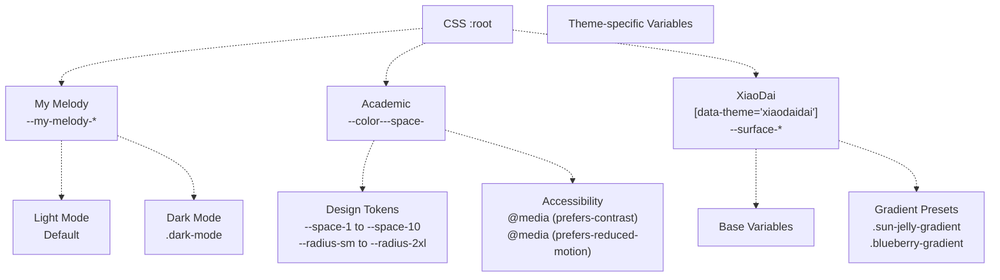
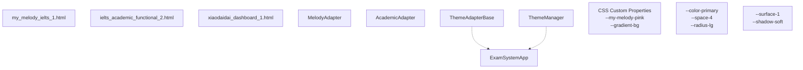
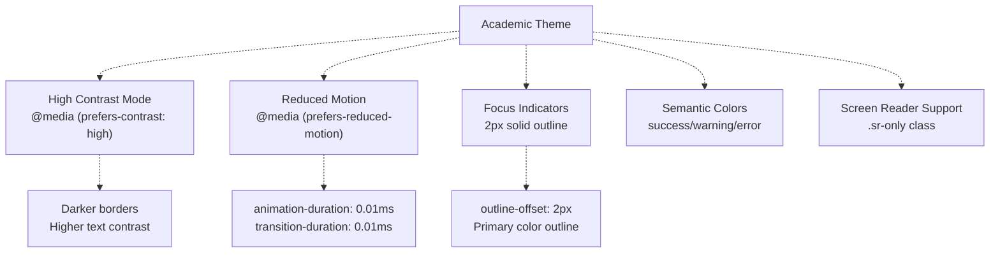
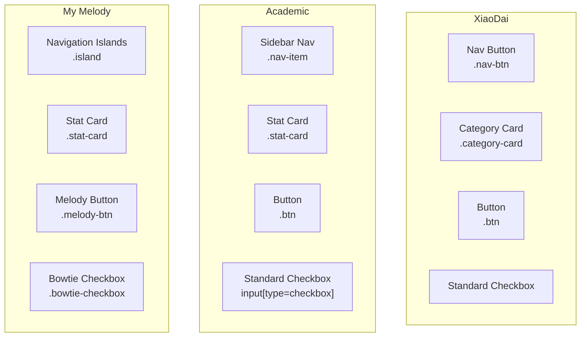

# Theme Variants (Melody, Academic, XiaoDai)

> **Relevant source files**
> * [.gitignore](https://github.com/sallowayma-git/IELTS-practice/blob/92f64eb8/.gitignore)
> * [.superdesign/design_iterations/ielts_academic_functional_2.html](https://github.com/sallowayma-git/IELTS-practice/blob/92f64eb8/.superdesign/design_iterations/ielts_academic_functional_2.html)
> * [.superdesign/design_iterations/my_melody_ielts_1.html](https://github.com/sallowayma-git/IELTS-practice/blob/92f64eb8/.superdesign/design_iterations/my_melody_ielts_1.html)
> * [.superdesign/design_iterations/xiaodaidai_dashboard_1.html](https://github.com/sallowayma-git/IELTS-practice/blob/92f64eb8/.superdesign/design_iterations/xiaodaidai_dashboard_1.html)
> * [assets/data/vocabulary.json](https://github.com/sallowayma-git/IELTS-practice/blob/92f64eb8/assets/data/vocabulary.json)
> * [js/components/dataManagementPanel.js](https://github.com/sallowayma-git/IELTS-practice/blob/92f64eb8/js/components/dataManagementPanel.js)
> * [js/components/settingsPanel.js](https://github.com/sallowayma-git/IELTS-practice/blob/92f64eb8/js/components/settingsPanel.js)
> * [js/utils/helpers.js](https://github.com/sallowayma-git/IELTS-practice/blob/92f64eb8/js/utils/helpers.js)
> * [js/utils/themeManager.js](https://github.com/sallowayma-git/IELTS-practice/blob/92f64eb8/js/utils/themeManager.js)

## Purpose and Scope

This document describes the three primary theme variants available in the IELTS practice system: **My Melody** (playful, gradient-rich), **Academic** (professional, minimalist), and **XiaoDai** (glassmorphic, modern). Each theme provides a complete visual identity through CSS custom properties, component styling, and visual effects. This page focuses on the visual characteristics, CSS variable systems, and design patterns of each theme variant.

For information about the theme architecture and adapter pattern, see [Theme Architecture Overview](/sallowayma-git/IELTS-practice/7.1-theme-architecture-overview). For runtime theme switching and management, see [Runtime Theme Management](/sallowayma-git/IELTS-practice/7.4-runtime-theme-management).

---

## Theme Comparison Overview

The three themes provide distinct visual experiences while maintaining functional consistency:

| Aspect | My Melody | Academic | XiaoDai |
| --- | --- | --- | --- |
| **Primary Color** | `#FFB6E1` (pink) | `#1e3a8a` (navy) | `#ffc83d` (sun yellow) |
| **Background Style** | Animated gradient | Parchment texture | Radial gradient |
| **Visual Effects** | Heavy (particles, glows) | Minimal (subtle shadows) | Moderate (glass panels) |
| **Typography** | Segoe UI, sans-serif | Georgia serif / Source Sans Pro | PingFang SC / HarmonyOS Sans |
| **Layout** | Island-based navigation | Sidebar navigation | Floating panel design |
| **Target Aesthetic** | Playful, kawaii | Professional, academic | Modern, translucent |
| **Accessibility** | Dark mode support | High contrast + reduced motion | Auto theme support |

Sources: [.superdesign/design_iterations/my_melody_ielts_1.html L32-L66](https://github.com/sallowayma-git/IELTS-practice/blob/92f64eb8/.superdesign/design_iterations/my_melody_ielts_1.html#L32-L66)

 [.superdesign/design_iterations/ielts_academic_functional_2.html L16-L100](https://github.com/sallowayma-git/IELTS-practice/blob/92f64eb8/.superdesign/design_iterations/ielts_academic_functional_2.html#L16-L100)

 [.superdesign/design_iterations/xiaodaidai_dashboard_1.html L9-L26](https://github.com/sallowayma-git/IELTS-practice/blob/92f64eb8/.superdesign/design_iterations/xiaodaidai_dashboard_1.html#L9-L26)

---

## My Melody Theme

### Color System and CSS Variables

The My Melody theme uses a vibrant pastel color palette with extensive support for light and dark modes:

```css
/* Light Mode Colors */
--my-melody-pink: #FFB6E1;
--my-melody-blue: #87CEEB;
--my-melody-yellow: #FFF8DC;
--my-melody-purple: #DDA0DD;
--my-melody-mint: #98FB98;
--my-melody-lavender: #E6E6FA;

/* Dark Mode Colors (adjusted saturation) */
body.dark-mode {
  --my-melody-pink: #FF8FC7;
  --my-melody-blue: #6BB6D6;
  /* ... */
}
```

The theme defines comprehensive variable sets for text, backgrounds, borders, and shadows that automatically adapt to dark mode via the `.dark-mode` body class.

**Key Visual Variables:**

* **Gradient Background**: `linear-gradient(135deg, #FFE4F1 0%, #E6F3FF 25%, #FFF0F5 50%, #F0E6FF 75%, #E4FFE4 100%)`
* **Shadow Soft**: `0 8px 32px rgba(255, 182, 225, 0.3)`
* **Shadow Strong**: `0 12px 48px rgba(255, 182, 225, 0.4)`
* **Border Card**: `var(--my-melody-pink)`

Sources: [.superdesign/design_iterations/my_melody_ielts_1.html L32-L102](https://github.com/sallowayma-git/IELTS-practice/blob/92f64eb8/.superdesign/design_iterations/my_melody_ielts_1.html#L32-L102)

### Visual Effects and Animations

#### Rainbow Flow Background Animation

The body background uses an animated gradient that shifts positions over 15 seconds:

```
body {
  background: var(--gradient-bg);
  background-size: 400% 400%;
  animation: rainbowFlow 15s ease infinite;
}

@keyframes rainbowFlow {
  0% { background-position: 0% 50%; }
  25% { background-position: 100% 50%; }
  50% { background-position: 100% 100%; }
  75% { background-position: 0% 100%; }
  100% { background-position: 0% 50%; }
}
```

Sources: [.superdesign/design_iterations/my_melody_ielts_1.html L110-L128](https://github.com/sallowayma-git/IELTS-practice/blob/92f64eb8/.superdesign/design_iterations/my_melody_ielts_1.html#L110-L128)

#### Glass Morphism with Radial Gradients

Components like the header and stat cards use a sophisticated glass effect with center-to-edge radial gradients:

```yaml
.header::before {
  content: '';
  position: absolute;
  background: radial-gradient(ellipse at center,
    rgba(255, 255, 255, 0.25) 0%,
    rgba(255, 255, 255, 0.15) 20%,
    rgba(255, 182, 225, 0.1) 40%,
    rgba(255, 182, 225, 0.05) 60%,
    transparent 80%);
  backdrop-filter: blur(15px);
}

.header::after {
  /* Text area glow for title */
  background: radial-gradient(ellipse at center,
    rgba(255, 20, 147, 0.15) 0%,
    rgba(255, 20, 147, 0.08) 30%,
    transparent 70%);
  filter: blur(10px);
  animation: headerTextAreaGlow 3s ease-in-out infinite alternate;
}
```

This creates a multi-layered depth effect where the center appears brighter and gradually fades toward edges.

Sources: [.superdesign/design_iterations/my_melody_ielts_1.html L183-L220](https://github.com/sallowayma-git/IELTS-practice/blob/92f64eb8/.superdesign/design_iterations/my_melody_ielts_1.html#L183-L220)

#### Floating Particles

Decorative emoji particles float across the background:

```
.particles {
  position: fixed;
  width: 100%;
  height: 100%;
  pointer-events: none;
  z-index: 1;
}

.particle {
  position: absolute;
  font-size: 20px;
  opacity: 0.6;
  animation: float 6s ease-in-out infinite;
}
```

Sources: [.superdesign/design_iterations/my_melody_ielts_1.html L130-L151](https://github.com/sallowayma-git/IELTS-practice/blob/92f64eb8/.superdesign/design_iterations/my_melody_ielts_1.html#L130-L151)

### Component Styles

#### Bowtie Checkbox

A custom checkbox styled as a bowtie ribbon, unique to the My Melody theme:

```css
.bowtie-checkbox::before,
.bowtie-checkbox::after {
  content: '';
  width: 8px;
  height: 12px;
  border: 2px solid var(--my-melody-lavender);
  border-radius: 2px;
  background: linear-gradient(135deg, #ffffff, #faf9ff);
  transition: all 0.3s cubic-bezier(0.4, 0, 0.2, 1);
}

.bowtie-checkbox-input:checked + .bowtie-checkbox-label .bowtie-checkbox::before {
  background: linear-gradient(135deg, var(--my-melody-pink), var(--my-melody-purple));
  transform: scale(0.9) rotate(-5deg);
}
```

The two pseudo-elements represent the two sides of a bowtie that tilt when checked.

Sources: [.superdesign/design_iterations/my_melody_ielts_1.html L940-L1003](https://github.com/sallowayma-git/IELTS-practice/blob/92f64eb8/.superdesign/design_iterations/my_melody_ielts_1.html#L940-L1003)

#### Navigation Islands

Floating, translucent navigation cards with hover effects:

```css
.island {
  background: var(--bg-overlay);
  backdrop-filter: blur(10px);
  border-radius: 25px;
  padding: 20px 30px;
  box-shadow: var(--shadow-soft);
  transition: all 0.3s cubic-bezier(0.68, -0.55, 0.265, 1.55);
}

.island:hover {
  transform: translateY(-5px) scale(1.05);
  box-shadow: var(--shadow-strong);
  border-color: var(--my-melody-pink);
}
```

Sources: [.superdesign/design_iterations/my_melody_ielts_1.html L432-L475](https://github.com/sallowayma-git/IELTS-practice/blob/92f64eb8/.superdesign/design_iterations/my_melody_ielts_1.html#L432-L475)

---

## Academic Theme

### Design System and Grid

The Academic theme is built on a **4-point grid system** (4px base unit) with a comprehensive design token system:

```
:root {
  /* 4-Point Grid System */
  --space-1: 0.25rem;  /* 4px */
  --space-2: 0.5rem;   /* 8px */
  --space-3: 0.75rem;  /* 12px */
  --space-4: 1rem;     /* 16px */
  /* ... up to --space-10: 4rem (64px) */
  
  /* Border Radius Scale */
  --radius-sm: 0.25rem;  /* 4px */
  --radius-md: 0.375rem; /* 6px */
  --radius-lg: 0.5rem;   /* 8px */
  --radius-xl: 0.75rem;  /* 12px */
  --radius-2xl: 1rem;    /* 16px */
  --radius-full: 9999px;
}
```

This systematic approach ensures visual consistency and makes spacing predictable.

Sources: [.superdesign/design_iterations/ielts_academic_functional_2.html L48-L66](https://github.com/sallowayma-git/IELTS-practice/blob/92f64eb8/.superdesign/design_iterations/ielts_academic_functional_2.html#L48-L66)

### Color Palette

The Academic theme uses a professional blue color scheme with semantic color definitions:

```css
:root {
  /* Academic Blue Palette */
  --color-primary: #1e3a8a;        /* Deep Navy Blue */
  --color-primary-light: #2563eb;   /* Bright Blue */
  --color-primary-dark: #1e293b;   /* Dark Blue */
  --color-secondary: #3b82f6;      /* Medium Blue */
  --color-accent: #60a5fa;         /* Light Blue */
  
  /* Neutral Gray Scale */
  --color-gray-50: #f8fafc;
  --color-gray-100: #f1f5f9;
  /* ... through gray-900 */
  
  /* Semantic Colors */
  --color-success: #10b981;
  --color-warning: #f59e0b;
  --color-error: #ef4444;
  --color-info: #3b82f6;
  
  /* Academic-specific */
  --color-parchment: #f8f6f0;  /* Paper background */
  --color-ink: #2d3748;        /* Text color */
}
```

Sources: [.superdesign/design_iterations/ielts_academic_functional_2.html L16-L47](https://github.com/sallowayma-git/IELTS-practice/blob/92f64eb8/.superdesign/design_iterations/ielts_academic_functional_2.html#L16-L47)

### Typography System

The Academic theme uses a dual-font system with a **modular scale**:

```
body {
  font-family: 'Georgia', serif;  /* Body text */
}

.nav-item, .btn, .table {
  font-family: 'Source Sans Pro', sans-serif;  /* UI elements */
}

:root {
  /* Typography Scale (8 steps) */
  --font-size-xs: 0.75rem;    /* 12px */
  --font-size-sm: 0.875rem;   /* 14px */
  --font-size-base: 1rem;     /* 16px */
  --font-size-lg: 1.125rem;   /* 18px */
  --font-size-xl: 1.25rem;    /* 20px */
  --font-size-2xl: 1.5rem;    /* 24px */
  --font-size-3xl: 1.875rem;  /* 30px */
  --font-size-4xl: 2.25rem;   /* 36px */
  --font-size-5xl: 3rem;      /* 48px */
}
```

Georgia serif provides a scholarly, readable feel for content, while Source Sans Pro offers clean UI readability.

Sources: [.superdesign/design_iterations/ielts_academic_functional_2.html L69-L88](https://github.com/sallowayma-git/IELTS-practice/blob/92f64eb8/.superdesign/design_iterations/ielts_academic_functional_2.html#L69-L88)

 [.superdesign/design_iterations/ielts_academic_functional_2.html L109-L116](https://github.com/sallowayma-git/IELTS-practice/blob/92f64eb8/.superdesign/design_iterations/ielts_academic_functional_2.html#L109-L116)

### Minimal Visual Effects

Unlike the other themes, Academic uses subtle, professional effects:

```css
.stat-card {
  background-color: var(--color-white);
  border: 1px solid var(--color-gray-200);
  border-radius: var(--radius-lg);
  box-shadow: var(--shadow-md);  /* 0 4px 6px -1px rgba(0, 0, 0, 0.1) */
  transition: all var(--transition-normal);  /* 200ms ease-out */
}

.stat-card:hover {
  transform: translateY(-2px);  /* Subtle lift */
  box-shadow: var(--shadow-lg);
  border-color: var(--color-primary);
}
```

No gradients, no heavy animations—just clean borders, subtle shadows, and gentle hover states.

Sources: [.superdesign/design_iterations/ielts_academic_functional_2.html L256-L270](https://github.com/sallowayma-git/IELTS-practice/blob/92f64eb8/.superdesign/design_iterations/ielts_academic_functional_2.html#L256-L270)

### Accessibility Features

The Academic theme has the most comprehensive accessibility support:

```css
/* High Contrast Mode */
@media (prefers-contrast: high) {
  :root {
    --color-gray-200: #999999;
    --color-gray-300: #666666;
    --color-gray-600: #333333;
  }
}

/* Reduced Motion */
@media (prefers-reduced-motion: reduce) {
  * {
    animation-duration: 0.01ms !important;
    animation-iteration-count: 1 !important;
    transition-duration: 0.01ms !important;
  }
}

/* Focus Styles */
button:focus, input:focus {
  outline: 2px solid var(--color-primary);
  outline-offset: 2px;
}
```

Sources: [.superdesign/design_iterations/ielts_academic_functional_2.html L897-L912](https://github.com/sallowayma-git/IELTS-practice/blob/92f64eb8/.superdesign/design_iterations/ielts_academic_functional_2.html#L897-L912)

---

## XiaoDai Theme

### Glassmorphic Design Language

The XiaoDai theme centers on a **glassmorphic** aesthetic with soft, translucent surfaces:

```
:root[data-theme="xiaodaidai"] {
  /* Multi-layer surface system */
  --surface-1: rgba(255, 255, 255, 0.9);
  --surface-2: rgba(255, 255, 255, 0.75);
  --surface-3: rgba(255, 255, 255, 0.6);
  
  /* Soft shadow system */
  --shadow-soft: 0 24px 60px rgba(161, 191, 255, 0.3);
  --shadow-card: 0 16px 40px rgba(255, 200, 61, 0.22);
}

.glass-panel {
  backdrop-filter: blur(18px);
  box-shadow: var(--shadow-soft);
  border: 1px solid rgba(255, 255, 255, 0.6);
}
```

The multi-layer opacity system creates depth through transparency rather than shadows.

Sources: [.superdesign/design_iterations/xiaodaidai_dashboard_1.html L9-L26](https://github.com/sallowayma-git/IELTS-practice/blob/92f64eb8/.superdesign/design_iterations/xiaodaidai_dashboard_1.html#L9-L26)

 [.superdesign/design_iterations/xiaodaidai_dashboard_1.html L41-L45](https://github.com/sallowayma-git/IELTS-practice/blob/92f64eb8/.superdesign/design_iterations/xiaodaidai_dashboard_1.html#L41-L45)

### Gradient System

XiaoDai uses named gradient presets for different visual contexts:

```css
.sun-jelly-gradient {
  background: linear-gradient(120deg, #ffe08a 0%, #ffb347 100%);
}

.blueberry-gradient {
  background: linear-gradient(135deg, #ddeeff 0%, #7aa8ff 100%);
}
```

These gradients are applied to buttons, tags, and decorative elements throughout the interface.

Sources: [.superdesign/design_iterations/xiaodaidai_dashboard_1.html L47-L53](https://github.com/sallowayma-git/IELTS-practice/blob/92f64eb8/.superdesign/design_iterations/xiaodaidai_dashboard_1.html#L47-L53)

### Radial Background Composition

The background uses layered radial gradients to create a soft, ambient environment:

```yaml
html {
  background:
    radial-gradient(circle at 12% 18%, rgba(255, 232, 166, 0.55), transparent 52%),
    radial-gradient(circle at 82% 10%, rgba(161, 191, 255, 0.45), transparent 54%),
    radial-gradient(circle at 50% 100%, rgba(255, 107, 107, 0.16), transparent 58%),
    var(--bg-base);
}
```

Three positioned radial gradients (sun yellow, blueberry blue, rose) create a warm, diffused ambient lighting effect.

Sources: [.superdesign/design_iterations/xiaodaidai_dashboard_1.html L29-L34](https://github.com/sallowayma-git/IELTS-practice/blob/92f64eb8/.superdesign/design_iterations/xiaodaidai_dashboard_1.html#L29-L34)

### Overview Hero Section

The hero section uses an **orbital visualization** concept:

```
.overview-orbit {
  position: relative;
  width: clamp(16rem, 28vw, 20rem);
  aspect-ratio: 1 / 1;
}

.overview-orbit-ring--primary {
  background: radial-gradient(circle at 65% 35%, rgba(255, 200, 61, 0.25), transparent 55%);
}

.overview-orbit-ring--secondary {
  inset: 2rem;  /* Nested inside primary */
  background: radial-gradient(circle at 35% 75%, rgba(161, 191, 255, 0.25), transparent 60%);
}

.overview-orbit-core {
  inset: 4rem;  /* Innermost circle */
  display: flex;
  flex-direction: column;
  align-items: center;
  justify-content: center;
}
```

This creates concentric rings with offset radial glows, providing a visually distinctive data visualization.

Sources: [.superdesign/design_iterations/xiaodaidai_dashboard_1.html L211-L262](https://github.com/sallowayma-git/IELTS-practice/blob/92f64eb8/.superdesign/design_iterations/xiaodaidai_dashboard_1.html#L211-L262)

### Pulse Animations

Interactive elements use pulse animations for feedback:

```css
.pulse-dot {
  width: 0.75rem;
  height: 0.75rem;
  border-radius: 9999px;
  background: #34d399;
  box-shadow: 0 0 0 0 rgba(52, 211, 153, 0.6);
  animation: pulse 1.8s infinite;
}

@keyframes pulse {
  0% { box-shadow: 0 0 0 0 rgba(52, 211, 153, 0.6); }
  70% { box-shadow: 0 0 0 0.75rem rgba(52, 211, 153, 0); }
  100% { box-shadow: 0 0 0 0 rgba(52, 211, 153, 0); }
}
```

Sources: [.superdesign/design_iterations/xiaodaidai_dashboard_1.html L336-L355](https://github.com/sallowayma-git/IELTS-practice/blob/92f64eb8/.superdesign/design_iterations/xiaodaidai_dashboard_1.html#L336-L355)

### Virtual Scroll Optimization

XiaoDai implements custom virtual scrolling with styled scrollbars:

```
.virtual-scroll-viewport {
  position: relative;
  overflow-y: auto;
  max-height: min(68vh, 720px);
  border-radius: 1.5rem;
  scrollbar-gutter: stable;
}

.virtual-scroll-viewport::-webkit-scrollbar {
  width: 0.75rem;
}

.virtual-scroll-viewport::-webkit-scrollbar-thumb {
  border-radius: 9999px;
  background: linear-gradient(180deg, rgba(161, 191, 255, 0.7), rgba(122, 168, 255, 0.8));
}
```

The scrollbar uses the theme's blueberry gradient and maintains gutter space to prevent layout shift.

Sources: [.superdesign/design_iterations/xiaodaidai_dashboard_1.html L442-L462](https://github.com/sallowayma-git/IELTS-practice/blob/92f64eb8/.superdesign/design_iterations/xiaodaidai_dashboard_1.html#L442-L462)

---

## CSS Variable Architecture Comparison

### Variable Naming Conventions

Each theme uses a distinct variable naming strategy:

**My Melody**: Semantic color names

```
--my-melody-pink
--my-melody-blue
--my-melody-lavender
```

**Academic**: Functional naming with scale

```
--color-primary
--color-gray-200
--space-4
--radius-lg
```

**XiaoDai**: Context-based naming

```
--surface-1
--accent-secondary
--shadow-soft
```

### Variable Inheritance Diagram



Sources: [.superdesign/design_iterations/my_melody_ielts_1.html L32-L102](https://github.com/sallowayma-git/IELTS-practice/blob/92f64eb8/.superdesign/design_iterations/my_melody_ielts_1.html#L32-L102)

 [.superdesign/design_iterations/ielts_academic_functional_2.html L16-L100](https://github.com/sallowayma-git/IELTS-practice/blob/92f64eb8/.superdesign/design_iterations/ielts_academic_functional_2.html#L16-L100)

 [.superdesign/design_iterations/xiaodaidai_dashboard_1.html L9-L26](https://github.com/sallowayma-git/IELTS-practice/blob/92f64eb8/.superdesign/design_iterations/xiaodaidai_dashboard_1.html#L9-L26)

---

## Theme Integration with ThemeManager

The `ThemeManager` class provides runtime theme switching and maintains theme definitions:

```python
class ThemeManager {
    constructor() {
        this.themes = {
            xiaodaidai: {
                name: '小呆呆控制台',
                variables: {
                    '--primary-color': '#ffc83d',
                    '--accent-color': '#a1bfff',
                    '--bg-primary': '#f7f9fb',
                    // ...
                }
            },
            light: {
                name: '浅色主题',
                variables: {
                    '--primary-color': '#3b82f6',
                    '--bg-primary': '#ffffff',
                    // ...
                }
            },
            dark: { /* ... */ },
            highContrast: { /* ... */ }
        };
    }
}
```

The manager applies theme variables by iterating over entries and setting CSS custom properties on `document.documentElement`:

```javascript
applyCurrentTheme() {
    const theme = this.themes[this.currentTheme];
    const root = document.documentElement;
    
    Object.entries(theme.variables).forEach(([property, value]) => {
        root.style.setProperty(property, value);
    });
    
    document.body.className = document.body.className
        .replace(/theme-\w+/g, '')
        .trim();
    document.body.classList.add(`theme-${this.currentTheme}`);
}
```

Sources: [js/utils/themeManager.js L5-L237](https://github.com/sallowayma-git/IELTS-practice/blob/92f64eb8/js/utils/themeManager.js#L5-L237)

### Theme HTML Files and Adapters



Each HTML file contains:

1. **Inline CSS** with theme-specific variables and component styles
2. **Script references** to adapter initialization
3. **Bootstrap code** to initialize the theme system

Sources: [.superdesign/design_iterations/my_melody_ielts_1.html L17-L30](https://github.com/sallowayma-git/IELTS-practice/blob/92f64eb8/.superdesign/design_iterations/my_melody_ielts_1.html#L17-L30)

 [.superdesign/design_iterations/ielts_academic_functional_2.html L1-L14](https://github.com/sallowayma-git/IELTS-practice/blob/92f64eb8/.superdesign/design_iterations/ielts_academic_functional_2.html#L1-L14)

 [.superdesign/design_iterations/xiaodaidai_dashboard_1.html L1-L7](https://github.com/sallowayma-git/IELTS-practice/blob/92f64eb8/.superdesign/design_iterations/xiaodaidai_dashboard_1.html#L1-L7)

---

## Visual Effects Comparison

### Effect Intensity Scale

| Effect Type | My Melody | Academic | XiaoDai |
| --- | --- | --- | --- |
| **Background Animation** | Heavy (rainbowFlow) | None | Subtle (radial gradients) |
| **Backdrop Blur** | 15px | None | 18px |
| **Box Shadows** | Multi-layered, colored | Single, neutral | Soft, colored |
| **Hover Transforms** | Scale + translateY | translateY only | translateY + scale minimal |
| **Gradients** | Everywhere (5-color) | None | Strategic (2-color) |
| **Particles/Decorations** | Yes (floating emoji) | No | No |
| **Glow Effects** | Multiple per component | None | Subtle on accents |

### Animation Performance

**My Melody** uses the most animations:

* Background: `rainbowFlow` 15s infinite
* Header glows: 3-4s alternating
* Particles: 6s ease-in-out infinite
* Emoji clouds: Variable duration with `gentleSpin`

**Academic** minimizes animations:

* Transitions only: 150-300ms ease-out
* Respects `prefers-reduced-motion`

**XiaoDai** uses targeted animations:

* Pulse dots: 1.8s infinite
* Bubble float: 18-22s infinite
* Transitions: 150-200ms ease-out

Sources: [.superdesign/design_iterations/my_melody_ielts_1.html L110-L151](https://github.com/sallowayma-git/IELTS-practice/blob/92f64eb8/.superdesign/design_iterations/my_melody_ielts_1.html#L110-L151)

 [.superdesign/design_iterations/ielts_academic_functional_2.html L906-L912](https://github.com/sallowayma-git/IELTS-practice/blob/92f64eb8/.superdesign/design_iterations/ielts_academic_functional_2.html#L906-L912)

 [.superdesign/design_iterations/xiaodaidai_dashboard_1.html L336-L799](https://github.com/sallowayma-git/IELTS-practice/blob/92f64eb8/.superdesign/design_iterations/xiaodaidai_dashboard_1.html#L336-L799)

---

## Dark Mode and Accessibility

### My Melody Dark Mode Implementation

My Melody implements dark mode through body class toggling and variable overrides:

```css
body.dark-mode {
    --my-melody-pink: #FF8FC7;      /* Adjusted saturation */
    --my-melody-blue: #6BB6D6;
    --text-primary: #F7FAFC;
    --text-secondary: #E2E8F0;
    --bg-primary: #1A202C;
    --bg-secondary: #2D3748;
    --gradient-bg: linear-gradient(135deg, #2A1F2A 0%, #1F2A2A 25%, ...);
}
```

The dark gradient uses muted, darker versions of the original rainbow colors.

Sources: [.superdesign/design_iterations/my_melody_ielts_1.html L69-L102](https://github.com/sallowayma-git/IELTS-practice/blob/92f64eb8/.superdesign/design_iterations/my_melody_ielts_1.html#L69-L102)

### Academic Accessibility Matrix

Academic provides the most comprehensive accessibility features:



Sources: [.superdesign/design_iterations/ielts_academic_functional_2.html L874-L912](https://github.com/sallowayma-git/IELTS-practice/blob/92f64eb8/.superdesign/design_iterations/ielts_academic_functional_2.html#L874-L912)

### XiaoDai Auto-Theme

XiaoDai uses the `data-theme` attribute and integrates with `ThemeManager` for system preference detection:

```
:root[data-theme="xiaodaidai"] {
  /* Theme variables */
}
```

The `ThemeManager` listens to system theme changes:

```javascript
setupSystemThemeDetection() {
    const darkModeQuery = window.matchMedia('(prefers-color-scheme: dark)');
    darkModeQuery.addEventListener('change', (e) => {
        if (this.settings.autoTheme) {
            this.setTheme(e.matches ? 'dark' : 'light');
        }
    });
}
```

Sources: [.superdesign/design_iterations/xiaodaidai_dashboard_1.html L9](https://github.com/sallowayma-git/IELTS-practice/blob/92f64eb8/.superdesign/design_iterations/xiaodaidai_dashboard_1.html#L9-L9)

 [js/utils/themeManager.js L164-L192](https://github.com/sallowayma-git/IELTS-practice/blob/92f64eb8/js/utils/themeManager.js#L164-L192)

---

## Component Style Mapping

### Cross-Theme Component Equivalence



While class names differ, each theme implements equivalent functional components with theme-appropriate styling.

### Button Style Comparison

**My Melody Buttons** (gradient with emoji icons):

```sql
.melody-btn {
    background: linear-gradient(135deg, #ffb6e1, #dda0dd);
    color: #8b4f8b;
    box-shadow: 0 3px 8px rgba(255, 182, 225, 0.15);
    padding: 8px 16px;
}

.melody-btn-icon {
    font-size: 1.2rem;
    filter: drop-shadow(0 1px 2px rgba(255, 182, 225, 0.2));
}
```

**Academic Buttons** (minimal borders):

```css
.btn {
    padding: var(--space-3) var(--space-5);
    border: 1px solid var(--color-gray-300);
    border-radius: var(--radius-md);
    background-color: var(--color-white);
    transition: all var(--transition-normal);
}

.btn-primary {
    background-color: var(--color-primary);
    color: var(--color-white);
}
```

**XiaoDai Buttons** (glass panels):

```css
.btn {
    padding: 0.75rem 1.5rem;
    border-radius: var(--radius-chip);
    border: 1px solid rgba(255, 255, 255, 0.7);
    background: rgba(255, 255, 255, 0.82);
    box-shadow: 0 12px 26px rgba(161, 191, 255, 0.22);
}
```

Sources: [.superdesign/design_iterations/my_melody_ielts_1.html L750-L850](https://github.com/sallowayma-git/IELTS-practice/blob/92f64eb8/.superdesign/design_iterations/my_melody_ielts_1.html#L750-L850)

 [.superdesign/design_iterations/ielts_academic_functional_2.html L489-L540](https://github.com/sallowayma-git/IELTS-practice/blob/92f64eb8/.superdesign/design_iterations/ielts_academic_functional_2.html#L489-L540)

 [.superdesign/design_iterations/xiaodaidai_dashboard_1.html L595-L641](https://github.com/sallowayma-git/IELTS-practice/blob/92f64eb8/.superdesign/design_iterations/xiaodaidai_dashboard_1.html#L595-L641)

---

## Theme File Structure

```mermaid
flowchart TD

DesignDir[".superdesign/design_iterations/"]
MelodyHTML["my_melody_ielts_1.html<br>33.72 importance"]
AcademicHTML["ielts_academic_functional_2.html<br>22.56 importance"]
XiaoDaiHTML["xiaodaidai_dashboard_1.html<br>4.59 importance"]
MelodyCSS[""]
MelodyScripts[""]
MelodyBody["structure<br>Navigation islands<br>View pages"]
AcademicCSS[""]
AcademicBody["structure<br>Sidebar layout<br>Main content"]
XiaoDaiCSS[""]
XiaoDaiBody["structure<br>Hero section<br>Virtual scroll"]
Variables1["CSS Custom Properties<br>--my-melody-*"]
Components1["Component Styles<br>.island, .stat-card"]
Animations1["Animations<br>rainbowFlow, float"]
Variables2["Design Tokens<br>--space-, --color-"]
Components2["Component Styles<br>.nav-item, .btn"]
MediaQueries["Media Queries<br>Responsive + A11y"]
Variables3["Theme Variables<br>--surface-*, --accent"]
Components3["Component Styles<br>.glass-panel, .orbit"]
Gradients["Gradient Classes<br>.sun-jelly-gradient"]

DesignDir -.-> MelodyHTML
DesignDir -.-> AcademicHTML
DesignDir -.-> XiaoDaiHTML
MelodyHTML -.-> MelodyCSS
MelodyHTML -.-> MelodyScripts
MelodyHTML -.-> MelodyBody
AcademicHTML -.-> AcademicCSS
AcademicHTML -.-> AcademicBody
XiaoDaiHTML -.-> XiaoDaiCSS
XiaoDaiHTML -.-> XiaoDaiBody
MelodyCSS -.-> Variables1
MelodyCSS -.-> Components1
MelodyCSS -.-> Animations1
AcademicCSS -.-> Variables2
AcademicCSS -.-> Components2
AcademicCSS -.-> MediaQueries
XiaoDaiCSS -.-> Variables3
XiaoDaiCSS -.-> Components3
XiaoDaiCSS -.-> Gradients
```

Each HTML file is self-contained with:

1. **CSS variables and styles** in `<style>` tags
2. **Theme initialization** in `<script>` tags
3. **HTML structure** for the theme's layout pattern
4. **External script references** for shared functionality

Sources: [.superdesign/design_iterations/my_melody_ielts_1.html L1-L30](https://github.com/sallowayma-git/IELTS-practice/blob/92f64eb8/.superdesign/design_iterations/my_melody_ielts_1.html#L1-L30)

 [.superdesign/design_iterations/ielts_academic_functional_2.html L1-L14](https://github.com/sallowayma-git/IELTS-practice/blob/92f64eb8/.superdesign/design_iterations/ielts_academic_functional_2.html#L1-L14)

 [.superdesign/design_iterations/xiaodaidai_dashboard_1.html L1-L10](https://github.com/sallowayma-git/IELTS-practice/blob/92f64eb8/.superdesign/design_iterations/xiaodaidai_dashboard_1.html#L1-L10)

---

## Summary

The three theme variants provide distinct visual identities while maintaining functional consistency:

* **My Melody**: Maximalist, playful aesthetic with heavy use of gradients, animations, and custom components (bowtie checkboxes). Best for users who prefer vibrant, engaging interfaces.
* **Academic**: Minimalist, professional design built on a systematic design token foundation. Emphasizes readability, accessibility, and clean typography. Best for focused study sessions.
* **XiaoDai**: Modern glassmorphic design with soft translucent surfaces and strategic use of gradients. Balances visual appeal with performance through virtual scrolling and optimized animations.

Each theme is implemented as a standalone HTML file with embedded CSS and integrates with the core application through theme adapters (for My Melody and Academic) or direct integration with `ThemeManager` (for XiaoDai). The CSS variable systems allow for runtime theme switching while maintaining component consistency.

Sources: [.superdesign/design_iterations/my_melody_ielts_1.html](https://github.com/sallowayma-git/IELTS-practice/blob/92f64eb8/.superdesign/design_iterations/my_melody_ielts_1.html)

 [.superdesign/design_iterations/ielts_academic_functional_2.html](https://github.com/sallowayma-git/IELTS-practice/blob/92f64eb8/.superdesign/design_iterations/ielts_academic_functional_2.html)

 [.superdesign/design_iterations/xiaodaidai_dashboard_1.html](https://github.com/sallowayma-git/IELTS-practice/blob/92f64eb8/.superdesign/design_iterations/xiaodaidai_dashboard_1.html)

 [js/utils/themeManager.js](https://github.com/sallowayma-git/IELTS-practice/blob/92f64eb8/js/utils/themeManager.js)