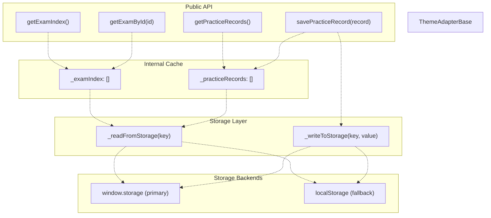
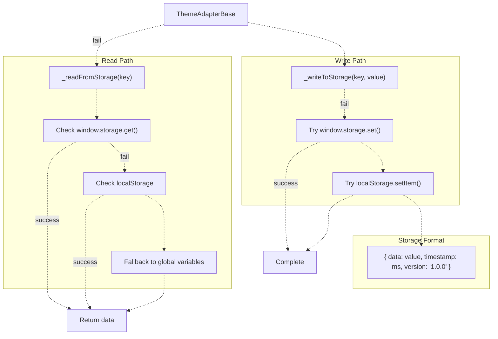
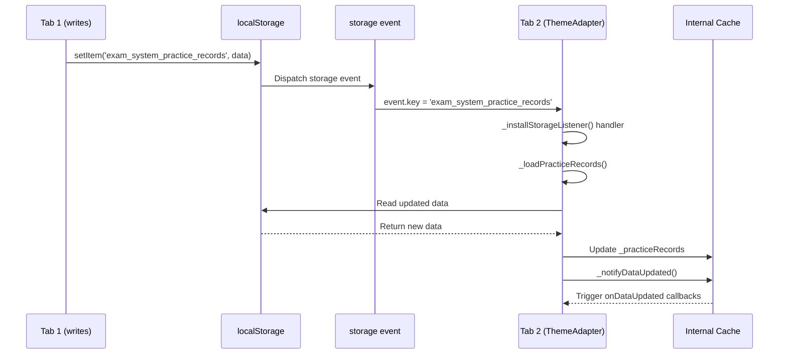
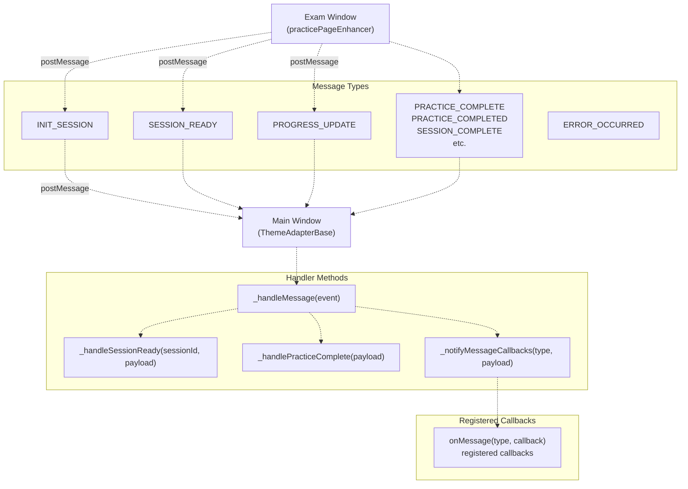
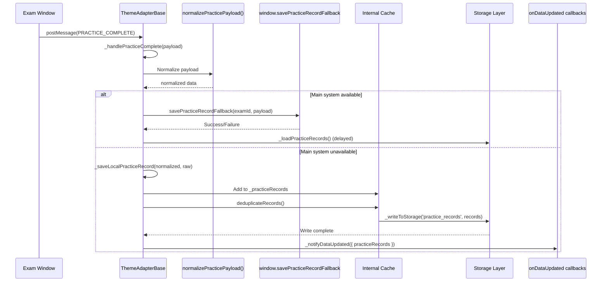
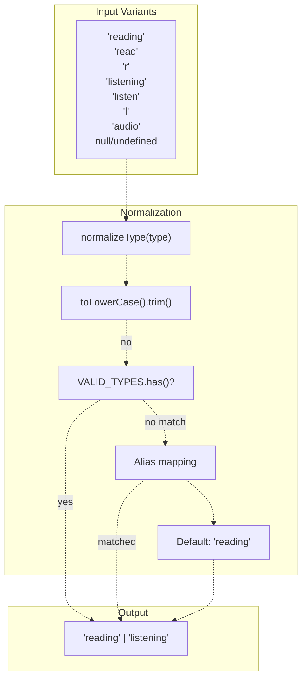
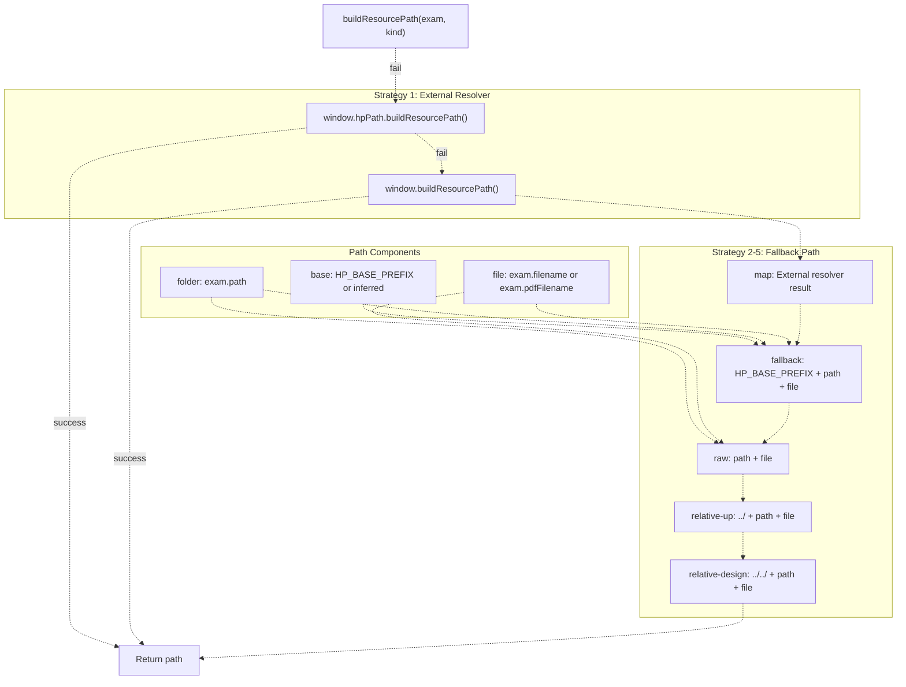
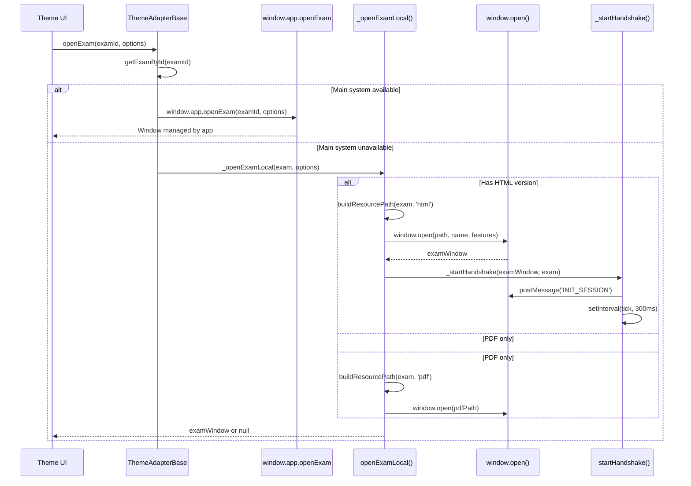
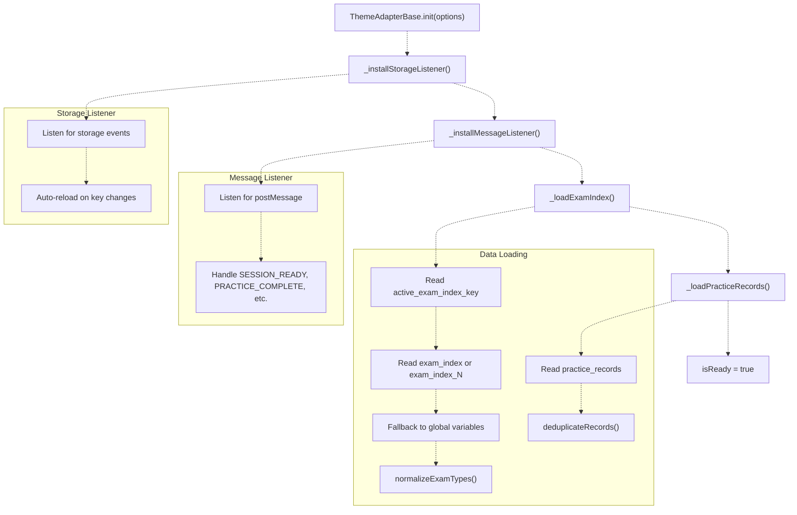

# ThemeAdapterBase & Data Access

> **Relevant source files**
> * [js/plugins/themes/theme-adapter-base.js](https://github.com/sallowayma-git/IELTS-practice/blob/92f64eb8/js/plugins/themes/theme-adapter-base.js)

## Purpose and Scope

The `ThemeAdapterBase` provides a unified data access layer that bridges theme HTML files with the core application's storage and state management systems. It abstracts storage operations, event synchronization, and cross-window communication, allowing different theme variants (Melody, Academic, XiaoDai, HP) to interact with exam data and practice records using a consistent API.

This page covers:

* Data access methods for exam index and practice records
* Storage synchronization and cross-tab updates
* PostMessage event bus for exam window communication
* Practice record saving and normalization
* Resource path resolution with fallback strategies

For theme-specific implementations that extend this base, see [Theme Variants (Melody, Academic, XiaoDai)](/sallowayma-git/IELTS-practice/7.3-theme-variants-(melody-academic-xiaodai)). For the HP theme's specialized bridge architecture, see [HP Core Bridge Architecture](/sallowayma-git/IELTS-practice/8.2-hp-core-bridge-architecture). For overall theme system design, see [Theme Architecture Overview](/sallowayma-git/IELTS-practice/7.1-theme-architecture-overview).

**Sources:** [js/plugins/themes/theme-adapter-base.js L1-L12](https://github.com/sallowayma-git/IELTS-practice/blob/92f64eb8/js/plugins/themes/theme-adapter-base.js#L1-L12)

---

## Core Responsibilities

`ThemeAdapterBase` serves as a singleton object (not a class) that provides:

| Responsibility | Methods/Features |
| --- | --- |
| **Data Access** | `getExamIndex()`, `getPracticeRecords()`, `getExamById(id)` |
| **Data Persistence** | `savePracticeRecord(record)` with deduplication |
| **Storage Sync** | Automatic reload on `storage` events across tabs |
| **Message Bus** | PostMessage handling for `PRACTICE_COMPLETE`, `SESSION_READY`, etc. |
| **Resource Resolution** | `buildResourcePath(exam, kind)` with 5-strategy fallback |
| **Exam Management** | `openExam(examOrId, options)` with handshake protocol |
| **Event Callbacks** | `onDataUpdated(callback)`, `onMessage(type, callback)` |

**Sources:** [js/plugins/themes/theme-adapter-base.js L499-L517](https://github.com/sallowayma-git/IELTS-practice/blob/92f64eb8/js/plugins/themes/theme-adapter-base.js#L499-L517)

---

## Data Access Interface

### Storage Keys

The adapter uses consistent storage keys that align with the main system:

```javascript
const STORAGE_KEYS = {
  EXAM_INDEX: 'exam_index',
  ACTIVE_EXAM_INDEX_KEY: 'active_exam_index_key',
  EXAM_INDEX_CONFIGURATIONS: 'exam_index_configurations',
  PRACTICE_RECORDS: 'practice_records'
};
```

**Sources:** [js/plugins/themes/theme-adapter-base.js L16-L22](https://github.com/sallowayma-git/IELTS-practice/blob/92f64eb8/js/plugins/themes/theme-adapter-base.js#L16-L22)

### Core Data Access Methods



**Sources:** [js/plugins/themes/theme-adapter-base.js L549-L563](https://github.com/sallowayma-git/IELTS-practice/blob/92f64eb8/js/plugins/themes/theme-adapter-base.js#L549-L563)

 [js/plugins/themes/theme-adapter-base.js L1321-L1381](https://github.com/sallowayma-git/IELTS-practice/blob/92f64eb8/js/plugins/themes/theme-adapter-base.js#L1321-L1381)

### Method Details

#### getExamIndex()

Returns a cloned copy of the exam index array. Data is loaded on initialization and kept synchronized via storage events.

```
getExamIndex() {
  return cloneArray(this._examIndex);
}
```

**Behavior:**

* Returns a defensive copy (not a reference to internal state)
* Array includes both reading and listening exams
* Each exam has normalized `type` field ('reading' or 'listening')

**Sources:** [js/plugins/themes/theme-adapter-base.js L549-L555](https://github.com/sallowayma-git/IELTS-practice/blob/92f64eb8/js/plugins/themes/theme-adapter-base.js#L549-L555)

#### getPracticeRecords()

Returns a cloned copy of practice records, deduplicated by `sessionId`.

```
getPracticeRecords() {
  return cloneArray(this._practiceRecords);
}
```

**Behavior:**

* Sorted by timestamp (newest first from `unshift` on save)
* Deduplicated based on `sessionId` or `id` field
* Automatically reloaded when storage events detected

**Sources:** [js/plugins/themes/theme-adapter-base.js L557-L563](https://github.com/sallowayma-git/IELTS-practice/blob/92f64eb8/js/plugins/themes/theme-adapter-base.js#L557-L563)

#### getExamById(id)

Searches the exam index for a matching exam by ID.

```javascript
getExamById(id) {
  return this._examIndex.find(exam => exam && exam.id === id) || null;
}
```

**Returns:** Exam object or `null` if not found.

**Sources:** [js/plugins/themes/theme-adapter-base.js L565-L572](https://github.com/sallowayma-git/IELTS-practice/blob/92f64eb8/js/plugins/themes/theme-adapter-base.js#L565-L572)

---

## Storage Architecture

### Multi-Tier Storage Strategy

The adapter implements a two-tier storage strategy with automatic fallback:



**Sources:** [js/plugins/themes/theme-adapter-base.js L1320-L1381](https://github.com/sallowayma-git/IELTS-practice/blob/92f64eb8/js/plugins/themes/theme-adapter-base.js#L1320-L1381)

### Read Operation

The `_readFromStorage()` method attempts multiple strategies:

1. **Primary:** `window.storage.get(key)` - Uses main system's storage manager
2. **Fallback:** `localStorage.getItem('exam_system_' + key)` - Direct localStorage access
3. **Global Variables:** For exam index, falls back to `window.completeExamIndex` and `window.listeningExamIndex`

```javascript
async _readFromStorage(key) {
  // Try window.storage first
  if (window.storage && typeof window.storage.get === 'function') {
    try {
      const result = window.storage.get(key, null);
      if (result && typeof result.then === 'function') {
        return await result;
      }
      return result;
    } catch (error) {
      console.warn('[ThemeAdapterBase] storage.get failed:', error);
    }
  }

  // Fallback to localStorage
  try {
    const prefixedKey = 'exam_system_' + key;
    const raw = localStorage.getItem(prefixedKey);
    if (raw) {
      const parsed = safeJsonParse(raw);
      return parsed ? parsed.data : null;
    }
  } catch (error) {
    console.warn('[ThemeAdapterBase] localStorage read failed:', error);
  }

  return null;
}
```

**Key Points:**

* Handles both synchronous and asynchronous storage APIs
* Automatically unwraps envelope format `{ data, timestamp, version }`
* Prefix `exam_system_` ensures namespace isolation

**Sources:** [js/plugins/themes/theme-adapter-base.js L1319-L1349](https://github.com/sallowayma-git/IELTS-practice/blob/92f64eb8/js/plugins/themes/theme-adapter-base.js#L1319-L1349)

### Write Operation

The `_writeToStorage()` method follows a similar pattern:

```javascript
async _writeToStorage(key, value) {
  // Try window.storage first
  if (window.storage && typeof window.storage.set === 'function') {
    try {
      const result = window.storage.set(key, value);
      if (result && typeof result.then === 'function') {
        await result;
      }
      return;
    } catch (error) {
      console.warn('[ThemeAdapterBase] storage.set failed:', error);
    }
  }

  // Fallback to localStorage
  try {
    const prefixedKey = 'exam_system_' + key;
    const serialized = JSON.stringify({
      data: value,
      timestamp: Date.now(),
      version: this.version
    });
    localStorage.setItem(prefixedKey, serialized);
  } catch (error) {
    console.error('[ThemeAdapterBase] localStorage write failed:', error);
    throw error;
  }
}
```

**Envelope Format:**

* `data`: The actual payload
* `timestamp`: Write time in milliseconds
* `version`: Adapter version for migration tracking

**Sources:** [js/plugins/themes/theme-adapter-base.js L1351-L1381](https://github.com/sallowayma-git/IELTS-practice/blob/92f64eb8/js/plugins/themes/theme-adapter-base.js#L1351-L1381)

---

## Storage Event Synchronization

### Cross-Tab Communication

The adapter listens to `storage` events to synchronize data across browser tabs and windows:



**Sources:** [js/plugins/themes/theme-adapter-base.js L998-L1023](https://github.com/sallowayma-git/IELTS-practice/blob/92f64eb8/js/plugins/themes/theme-adapter-base.js#L998-L1023)

### Storage Listener Implementation

```javascript
_installStorageListener() {
  if (this._storageListenerInstalled) return;

  window.addEventListener('storage', (event) => {
    if (!event || !event.key) return;

    // Strip prefix to get logical key
    const key = event.key.replace(/^exam_system_/, '');
    
    if (key === STORAGE_KEYS.ACTIVE_EXAM_INDEX_KEY) {
      console.log('[ThemeAdapterBase] Detected exam index switch');
      this._loadExamIndex().catch(console.error);
    } else if (key === STORAGE_KEYS.EXAM_INDEX || EXAM_INDEX_KEY_RE.test(key) || key === STORAGE_KEYS.EXAM_INDEX_CONFIGURATIONS) {
      console.log('[ThemeAdapterBase] Detected exam index change');
      this._loadExamIndex().catch(console.error);
    } else if (key === STORAGE_KEYS.PRACTICE_RECORDS) {
      console.log('[ThemeAdapterBase] Detected practice records change');
      this._loadPracticeRecords().catch(console.error);
    }
  });

  this._storageListenerInstalled = true;
}
```

**Monitored Keys:**

* `active_exam_index_key`: Triggers exam index reload when user switches libraries
* `exam_index`, `exam_index_N`, `exam_index_configurations`: Triggers reload on index changes
* `practice_records`: Triggers reload when records updated

**Sources:** [js/plugins/themes/theme-adapter-base.js L998-L1023](https://github.com/sallowayma-git/IELTS-practice/blob/92f64eb8/js/plugins/themes/theme-adapter-base.js#L998-L1023)

---

## PostMessage Event Bus

### Message Lifecycle

The adapter acts as a central message bus for cross-window communication:



**Sources:** [js/plugins/themes/theme-adapter-base.js L1025-L1089](https://github.com/sallowayma-git/IELTS-practice/blob/92f64eb8/js/plugins/themes/theme-adapter-base.js#L1025-L1089)

### Message Type Normalization

The adapter handles multiple message type variants:

| Canonical Type | Variants |
| --- | --- |
| `PRACTICE_COMPLETE` | `PRACTICE_COMPLETE`, `PRACTICE_COMPLETED`, `SESSION_COMPLETE`, `SESSION_COMPLETED`, `EXAM_FINISHED`, `QUIZ_COMPLETE`, `QUIZ_COMPLETED`, `TEST_COMPLETE`, `LESSON_COMPLETE`, `WORKOUT_COMPLETE` |
| `SESSION_READY` | `SESSION_READY` |
| `PROGRESS_UPDATE` | `PROGRESS_UPDATE` |
| `ERROR_OCCURRED` | `ERROR_OCCURRED` |
| `REQUEST_INIT` | `REQUEST_INIT` |

```javascript
function normalizeMessageType(value) {
  return String(value || '').toUpperCase();
}

const PRACTICE_COMPLETE_TYPES = new Set([
  'PRACTICE_COMPLETE',
  'PRACTICE_COMPLETED',
  'SESSION_COMPLETE',
  'SESSION_COMPLETED',
  'EXAM_FINISHED',
  'QUIZ_COMPLETE',
  'QUIZ_COMPLETED',
  'TEST_COMPLETE',
  'LESSON_COMPLETE',
  'WORKOUT_COMPLETE'
]);
```

**Sources:** [js/plugins/themes/theme-adapter-base.js L32-L44](https://github.com/sallowayma-git/IELTS-practice/blob/92f64eb8/js/plugins/themes/theme-adapter-base.js#L32-L44)

 [js/plugins/themes/theme-adapter-base.js L263-L266](https://github.com/sallowayma-git/IELTS-practice/blob/92f64eb8/js/plugins/themes/theme-adapter-base.js#L263-L266)

### Message Handler Implementation

```javascript
_handleMessage(event) {
  if (!event || !event.data) return;

  const payload = event.data;
  const rawType = payload.type;
  if (!rawType) return;

  const normalizedType = normalizeMessageType(rawType);

  // Handle SESSION_READY
  if (normalizedType === 'SESSION_READY') {
    const sessionId = payload.sessionId || payload.sessionID || (payload.data && (payload.data.sessionId || payload.data.sessionID));
    if (sessionId) {
      this._handleSessionReady(sessionId, payload);
    }
    this._notifyMessageCallbacks('SESSION_READY', payload);
    return;
  }

  // Handle PRACTICE_COMPLETE variants
  if (PRACTICE_COMPLETE_TYPES.has(normalizedType)) {
    console.log('[ThemeAdapterBase] Received practice complete message:', normalizedType, payload);
    this._handlePracticeComplete(payload);
    this._notifyMessageCallbacks('PRACTICE_COMPLETE', payload);
    return;
  }

  // Handle PROGRESS_UPDATE
  if (normalizedType === 'PROGRESS_UPDATE') {
    this._notifyMessageCallbacks('PROGRESS_UPDATE', payload);
    return;
  }

  // Handle ERROR_OCCURRED
  if (normalizedType === 'ERROR_OCCURRED') {
    console.warn('[ThemeAdapterBase] Received error message:', payload);
    this._notifyMessageCallbacks('ERROR_OCCURRED', payload);
    return;
  }

  // Handle REQUEST_INIT
  if (normalizedType === 'REQUEST_INIT') {
    this._notifyMessageCallbacks('REQUEST_INIT', payload);
    return;
  }
}
```

**Sources:** [js/plugins/themes/theme-adapter-base.js L1040-L1089](https://github.com/sallowayma-git/IELTS-practice/blob/92f64eb8/js/plugins/themes/theme-adapter-base.js#L1040-L1089)

### Callback Registration

Themes can register callbacks for specific message types:

```javascript
// Register callback
ThemeAdapterBase.onMessage('PRACTICE_COMPLETE', (payload, originalType) => {
  console.log('Practice completed:', payload);
});

// Register wildcard callback
ThemeAdapterBase.onMessage('*', (payload, originalType) => {
  console.log('Any message:', originalType, payload);
});

// Remove callback
ThemeAdapterBase.offMessage('PRACTICE_COMPLETE', callbackFunction);
```

**Sources:** [js/plugins/themes/theme-adapter-base.js L960-L984](https://github.com/sallowayma-git/IELTS-practice/blob/92f64eb8/js/plugins/themes/theme-adapter-base.js#L960-L984)

---

## Practice Record Management

### Save Flow



**Sources:** [js/plugins/themes/theme-adapter-base.js L1105-L1216](https://github.com/sallowayma-git/IELTS-practice/blob/92f64eb8/js/plugins/themes/theme-adapter-base.js#L1105-L1216)

### Payload Normalization

The `normalizePracticePayload()` function extracts score data from multiple possible sources:

```javascript
function normalizePracticePayload(payload) {
  const envelope = asObject(payload);
  const nestedData = asObject(envelope.data);
  const scoreInfo = asObject(envelope.scoreInfo);
  const result = asObject(envelope.result);
  const nestedResult = asObject(nestedData.result);
  const meta = asObject(envelope.meta);
  const sources = [scoreInfo, result, nestedResult, nestedData, envelope, meta];

  // Extract fields with priority order
  const percentageKeys = ['percentage', 'accuracy', 'percent', 'scorePercent'];
  const correctKeys = ['correct', 'score', 'correctCount', 'right', 'correctAnswers'];
  const totalKeys = ['total', 'totalQuestions', 'questionCount', 'questions', 'max', 'totalCount'];
  const durationKeys = ['duration', 'totalTime', 'elapsedTime', 'timeSpent', 'time'];

  let correct = pickFirstNumber(correctKeys, sources);
  let total = pickFirstNumber(totalKeys, sources);

  // Calculate from answerComparison if available
  const comparison = envelope.answerComparison || nestedData.answerComparison || ...;
  const comparisonCount = countFromAnswerComparison(comparison);

  // Calculate from answers vs correctAnswers
  const answers = envelope.answers || nestedData.answers || ...;
  const correctAnswers = envelope.correctAnswers || nestedData.correctAnswers || ...;
  const answerCount = countFromAnswers(answers, correctAnswers);

  // Use calculated values as fallback
  if (total === null && comparisonCount.total !== null) {
    total = comparisonCount.total;
  }
  if (correct === null && comparisonCount.correct !== null) {
    correct = comparisonCount.correct;
  }

  // Return normalized structure
  return {
    examId,
    correct,
    total,
    percentage: normalizedPercentage,
    duration,
    sessionId,
    completedAt,
    title,
    category,
    type: examType,
    raw: payload
  };
}
```

**Extraction Strategy:**

1. Search predefined key sets across nested objects
2. Calculate from `answerComparison` (boolean map)
3. Calculate from `answers` vs `correctAnswers` comparison
4. Apply validation (correct ≤ total)
5. Calculate percentage if missing

**Sources:** [js/plugins/themes/theme-adapter-base.js L369-L493](https://github.com/sallowayma-git/IELTS-practice/blob/92f64eb8/js/plugins/themes/theme-adapter-base.js#L369-L493)

### Record Deduplication

Records are deduplicated by `sessionId` (or `id` as fallback), keeping the newest:

```javascript
function deduplicateRecords(records) {
  if (!Array.isArray(records)) return [];
  
  const recordMap = new Map();
  
  records.forEach(record => {
    if (!record) return;
    
    const key = record.sessionId || record.id;
    if (!key) {
      // No identifier - keep it
      recordMap.set(Symbol(), record);
      return;
    }
    
    const existing = recordMap.get(key);
    if (!existing) {
      recordMap.set(key, record);
      return;
    }
    
    // Compare timestamps, keep newer
    const existingTime = getRecordTimestamp(existing);
    const currentTime = getRecordTimestamp(record);
    
    if (currentTime > existingTime) {
      recordMap.set(key, record);
    }
  });
  
  return Array.from(recordMap.values());
}
```

**Timestamp Sources (priority order):**

1. `record.timestamp` (number)
2. `record.date` (parsed to timestamp)
3. `record.id` (if numeric)
4. `0` (fallback)

**Sources:** [js/plugins/themes/theme-adapter-base.js L195-L257](https://github.com/sallowayma-git/IELTS-practice/blob/92f64eb8/js/plugins/themes/theme-adapter-base.js#L195-L257)

---

## Type Normalization

### Type Field Standardization

The adapter normalizes `type` fields to ensure consistency:



**Sources:** [js/plugins/themes/theme-adapter-base.js L145-L169](https://github.com/sallowayma-git/IELTS-practice/blob/92f64eb8/js/plugins/themes/theme-adapter-base.js#L145-L169)

### Implementation

```javascript
const VALID_TYPES = new Set(['reading', 'listening']);

function normalizeType(type) {
  if (!type) return 'reading'; // Default
  const normalized = String(type).toLowerCase().trim();
  
  // Direct match
  if (VALID_TYPES.has(normalized)) {
    return normalized;
  }
  
  // Alias mapping
  if (normalized === 'read' || normalized === 'r') {
    return 'reading';
  }
  if (normalized === 'listen' || normalized === 'l' || normalized === 'audio') {
    return 'listening';
  }
  
  // Default fallback
  return 'reading';
}
```

**Applied to:**

* Exam objects when loaded from storage
* Practice records when saved
* Message payloads when normalized

**Sources:** [js/plugins/themes/theme-adapter-base.js L145-L169](https://github.com/sallowayma-git/IELTS-practice/blob/92f64eb8/js/plugins/themes/theme-adapter-base.js#L145-L169)

---

## Resource Path Resolution

### Multi-Strategy Resolution

The adapter supports 5 fallback strategies for resolving exam resource paths:



**Sources:** [js/plugins/themes/theme-adapter-base.js L612-L703](https://github.com/sallowayma-git/IELTS-practice/blob/92f64eb8/js/plugins/themes/theme-adapter-base.js#L612-L703)

### getResourceAttempts(exam, kind)

Returns an ordered list of path attempts for resource probing:

```javascript
getResourceAttempts(exam, kind) {
  if (!exam) return [];

  const attempts = [];
  const seen = new Set();

  const addAttempt = (label, path) => {
    if (path && !seen.has(path)) {
      seen.add(path);
      attempts.push({ label, path });
    }
  };

  const base = normalizeBasePath(window.HP_BASE_PREFIX) || inferRepoRootPrefix();
  const folder = exam.path || '';
  const primaryFile = kind === 'pdf'
    ? (exam.pdfFilename || exam.filename || '')
    : (exam.filename || '');

  // 1. map - External resolver
  let mapPath = '';
  if (window.hpPath && typeof window.hpPath.buildResourcePath === 'function') {
    try {
      mapPath = window.hpPath.buildResourcePath(exam, kind) || '';
    } catch (_) {}
  } else if (typeof window.buildResourcePath === 'function') {
    try {
      mapPath = window.buildResourcePath(exam, kind) || '';
    } catch (_) {}
  }
  addAttempt('map', mapPath);

  // 2. fallback - HP_BASE_PREFIX
  addAttempt('fallback', encodeResourcePath(joinResourcePath(base, folder, primaryFile)));

  // 3. raw - Direct path + filename
  addAttempt('raw', encodeResourcePath(joinResourcePath('', folder, primaryFile)));

  // 4. relative-up - Parent directory
  addAttempt('relative-up', encodeResourcePath(joinResourcePath('..', folder, primaryFile)));

  // 5. relative-design - Grandparent directory (.superdesign context)
  addAttempt('relative-design', encodeResourcePath(joinResourcePath('../..', folder, primaryFile)));

  return attempts;
}
```

**Return Format:**

```
[
  { label: 'map', path: '/resolved/path/to/exam.html' },
  { label: 'fallback', path: '../../IELTS/listening/exam.html' },
  { label: 'raw', path: 'IELTS/listening/exam.html' },
  { label: 'relative-up', path: '../IELTS/listening/exam.html' },
  { label: 'relative-design', path: '../../IELTS/listening/exam.html' }
]
```

**Usage:** This list is used by resource probing systems to try multiple paths until one succeeds.

**Sources:** [js/plugins/themes/theme-adapter-base.js L644-L695](https://github.com/sallowayma-git/IELTS-practice/blob/92f64eb8/js/plugins/themes/theme-adapter-base.js#L644-L695)

### Repository Root Inference

For file:// URLs and design iteration directories, the adapter infers the path to repository root:

```javascript
function inferRepoRootPrefix() {
  try {
    const rawPath = (window.location && window.location.pathname) ? String(window.location.pathname) : '';
    const path = rawPath.replace(/\\/g, '/');

    const prefixFromAnchor = (anchor, baseUps) => {
      const idx = path.indexOf(anchor);
      if (idx === -1) return '';
      const after = path.slice(idx + anchor.length);
      const parts = after.split('/').filter(Boolean);
      const depth = Math.max(0, parts.length - 1);
      const ups = new Array(baseUps + depth).fill('..');
      return ups.length ? ups.join('/') : '.';
    };

    // Try .superdesign/design_iterations/ (2 levels up from repo root)
    const design = prefixFromAnchor('/.superdesign/design_iterations/', 2);
    if (design) return design;

    // Try .superdesign/ (1 level up from repo root)
    const superdesign = prefixFromAnchor('/.superdesign/', 1);
    if (superdesign) return superdesign;
  } catch (_) {}

  return './';
}
```

**Logic:**

1. Find anchor directories in pathname
2. Calculate depth from anchor to current file
3. Generate `../` sequence to reach repo root
4. Fallback to `./` (current directory)

**Sources:** [js/plugins/themes/theme-adapter-base.js L118-L143](https://github.com/sallowayma-git/IELTS-practice/blob/92f64eb8/js/plugins/themes/theme-adapter-base.js#L118-L143)

---

## Exam Window Management

### Opening Exams



**Sources:** [js/plugins/themes/theme-adapter-base.js L706-L789](https://github.com/sallowayma-git/IELTS-practice/blob/92f64eb8/js/plugins/themes/theme-adapter-base.js#L706-L789)

### Handshake Protocol

The adapter initiates a handshake with newly opened exam windows:

```javascript
_startHandshake(examWindow, exam) {
  if (!examWindow || !exam) return;

  const sessionId = `${exam.id}_${Date.now()}`;
  const initPayload = {
    examId: exam.id,
    sessionId,
    parentOrigin: window.location.origin,
    examTitle: exam.title,
    examType: exam.type
  };

  // Store session
  this._activeSessions = this._activeSessions || new Map();
  this._activeSessions.set(sessionId, {
    examId: exam.id,
    window: examWindow,
    timer: null,
    attempts: 0
  });

  let attempts = 0;
  const maxAttempts = 30; // ~9 seconds

  const tick = () => {
    if (!examWindow || examWindow.closed) {
      this._cleanupSession(sessionId);
      return;
    }

    try {
      examWindow.postMessage({ type: 'INIT_SESSION', data: initPayload }, '*');
      examWindow.postMessage({ type: 'init_exam_session', data: initPayload }, '*');
    } catch (error) {
      console.warn('[ThemeAdapterBase] postMessage failed:', error);
    }

    attempts++;
    if (attempts >= maxAttempts) {
      console.warn('[ThemeAdapterBase] Handshake timeout');
      this._cleanupSession(sessionId);
    }
  };

  const timer = setInterval(tick, 300);
  const session = this._activeSessions.get(sessionId);
  if (session) {
    session.timer = timer;
  }

  // Send first message immediately
  tick();
}
```

**Behavior:**

1. Generate unique `sessionId` from exam ID and timestamp
2. Store session in `_activeSessions` map
3. Send `INIT_SESSION` message every 300ms for up to 9 seconds
4. Stop when `SESSION_READY` received (handled in `_handleSessionReady`)
5. Timeout after 30 attempts if no response

**Sources:** [js/plugins/themes/theme-adapter-base.js L841-L897](https://github.com/sallowayma-git/IELTS-practice/blob/92f64eb8/js/plugins/themes/theme-adapter-base.js#L841-L897)

### Session Cleanup

```javascript
_cleanupSession(sessionId) {
  if (!this._activeSessions) return;
  const session = this._activeSessions.get(sessionId);
  if (session) {
    if (session.timer) {
      clearInterval(session.timer);
    }
    this._activeSessions.delete(sessionId);
  }
}
```

Called when:

* `SESSION_READY` received (successful handshake)
* Exam window closes
* Handshake times out
* `PRACTICE_COMPLETE` received

**Sources:** [js/plugins/themes/theme-adapter-base.js L899-L912](https://github.com/sallowayma-git/IELTS-practice/blob/92f64eb8/js/plugins/themes/theme-adapter-base.js#L899-L912)

---

## Initialization and Lifecycle

### Initialization Flow



**Sources:** [js/plugins/themes/theme-adapter-base.js L520-L547](https://github.com/sallowayma-git/IELTS-practice/blob/92f64eb8/js/plugins/themes/theme-adapter-base.js#L520-L547)

### Usage Example

Theme HTML files typically initialize the adapter during page load:

```javascript
document.addEventListener('DOMContentLoaded', async () => {
  try {
    await ThemeAdapterBase.init();
    
    // Access data
    const exams = ThemeAdapterBase.getExamIndex();
    const records = ThemeAdapterBase.getPracticeRecords();
    
    // Register callbacks
    ThemeAdapterBase.onDataUpdated((data) => {
      console.log('Data updated:', data.examIndex.length, data.practiceRecords.length);
      refreshUI();
    });
    
    ThemeAdapterBase.onMessage('PRACTICE_COMPLETE', (payload) => {
      console.log('Practice completed:', payload);
      refreshHistory();
    });
    
    // Open exam
    document.getElementById('exam-button').addEventListener('click', () => {
      ThemeAdapterBase.openExam('cambridge-17-test-1-reading', {
        windowName: 'practice_window'
      });
    });
  } catch (error) {
    console.error('Initialization failed:', error);
  }
});
```

---

## Data Update Callbacks

Themes can register callbacks to be notified when data changes:

```javascript
ThemeAdapterBase.onDataUpdated((data) => {
  // data.examIndex: current exam index
  // data.practiceRecords: current practice records
  updateExamList(data.examIndex);
  updateHistory(data.practiceRecords);
});

// Remove callback
ThemeAdapterBase.offDataUpdated(callbackFunction);
```

**Triggered by:**

* `storage` event from another tab/window
* Local save via `savePracticeRecord()`
* Initialization completing

**Sources:** [js/plugins/themes/theme-adapter-base.js L939-L958](https://github.com/sallowayma-git/IELTS-practice/blob/92f64eb8/js/plugins/themes/theme-adapter-base.js#L939-L958)

 [js/plugins/themes/theme-adapter-base.js L1396-L1412](https://github.com/sallowayma-git/IELTS-practice/blob/92f64eb8/js/plugins/themes/theme-adapter-base.js#L1396-L1412)

---

## Summary

The `ThemeAdapterBase` provides a robust data access layer with the following key features:

| Feature | Implementation |
| --- | --- |
| **Data Access** | `getExamIndex()`, `getPracticeRecords()`, `getExamById()` with defensive copying |
| **Storage Abstraction** | Two-tier strategy: `window.storage` → `localStorage` with automatic fallback |
| **Cross-Tab Sync** | `storage` event listener automatically reloads data across tabs |
| **Message Bus** | PostMessage handler for `PRACTICE_COMPLETE`, `SESSION_READY`, progress updates |
| **Record Management** | Automatic deduplication, type normalization, payload normalization from multiple sources |
| **Path Resolution** | 5-strategy fallback system for resource paths |
| **Exam Management** | `openExam()` with handshake protocol and session tracking |
| **Type Safety** | Normalizes `type` to `'reading'` or `'listening'` consistently |
| **Event Callbacks** | `onDataUpdated()` and `onMessage()` for reactive UI updates |

The adapter serves as the foundation for all theme variants, enabling them to access and manipulate application data without direct coupling to the main system's implementation details.

**Sources:** [js/plugins/themes/theme-adapter-base.js L1-L1434](https://github.com/sallowayma-git/IELTS-practice/blob/92f64eb8/js/plugins/themes/theme-adapter-base.js#L1-L1434)