# User Interface Components

> **Relevant source files**
> * [assets/developer wiki/hp-overview-usage-todo.md](https://github.com/sallowayma-git/IELTS-practice/blob/df0c9b8f/assets/developer wiki/hp-overview-usage-todo.md)
> * [js/components/DataIntegrityManager.js](https://github.com/sallowayma-git/IELTS-practice/blob/df0c9b8f/js/components/DataIntegrityManager.js)
> * [js/components/practiceHistory.js](https://github.com/sallowayma-git/IELTS-practice/blob/df0c9b8f/js/components/practiceHistory.js)
> * [js/components/practiceRecordModal.js](https://github.com/sallowayma-git/IELTS-practice/blob/df0c9b8f/js/components/practiceRecordModal.js)
> * [js/components/settingsPanel.js](https://github.com/sallowayma-git/IELTS-practice/blob/df0c9b8f/js/components/settingsPanel.js)
> * [js/data/index.js](https://github.com/sallowayma-git/IELTS-practice/blob/df0c9b8f/js/data/index.js)
> * [js/script.js](https://github.com/sallowayma-git/IELTS-practice/blob/df0c9b8f/js/script.js)
> * [js/utils/simpleStorageWrapper.js](https://github.com/sallowayma-git/IELTS-practice/blob/df0c9b8f/js/utils/simpleStorageWrapper.js)
> * [js/utils/themeManager.js](https://github.com/sallowayma-git/IELTS-practice/blob/df0c9b8f/js/utils/themeManager.js)
> * [js/views/legacyViewBundle.js](https://github.com/sallowayma-git/IELTS-practice/blob/df0c9b8f/js/views/legacyViewBundle.js)

This document covers the reusable UI component system in the IELTS practice application, including core component classes, interactive panels, and theme-specific UI elements. It focuses on the component architecture, instantiation patterns, and communication mechanisms between different UI elements.

For detailed information about the data management interface, see [Data Management Panel & Settings UI](/sallowayma-git/IELTS-practice/9.1-settings-panel-and-theme-manager). For practice record viewing and management components, see [Practice History & Record Management](/sallowayma-git/IELTS-practice/9.2-practice-history-and-dashboard-views). For theme-specific UI implementations, see [Harry Potter Theme & Plugin System](/sallowayma-git/IELTS-practice/8-harry-potter-theme-and-plugin-system) and [Theme System & Visual Design](/sallowayma-git/IELTS-practice/7-theme-system-and-visual-design).

## UI Component Architecture Overview

The application uses a modular component architecture where each major UI element is implemented as a JavaScript class with standardized lifecycle methods and event handling patterns.

### Component Hierarchy

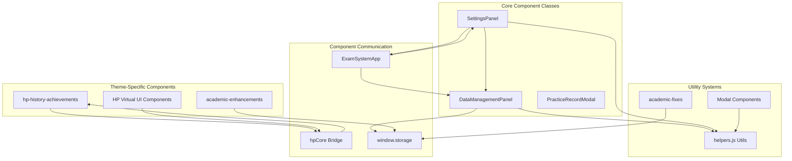

Sources: [js/components/dataManagementPanel.js L1-L763](https://github.com/sallowayma-git/IELTS-practice/blob/df0c9b8f/js/components/dataManagementPanel.js#L1-L763)

 [js/components/settingsPanel.js L1-L701](https://github.com/sallowayma-git/IELTS-practice/blob/df0c9b8f/js/components/settingsPanel.js#L1-L701)

 [js/plugins/hp/hp-history-achievements.js L1-L221](https://github.com/sallowayma-git/IELTS-practice/blob/df0c9b8f/js/plugins/hp/hp-history-achievements.js#L1-L221)

## Core Component Classes

### SettingsPanel Class

The `SettingsPanel` class provides a tabbed settings interface with theme configuration, accessibility options, keyboard shortcuts, and data management integration. It uses event delegation for performance optimization.

**Core Architecture:**

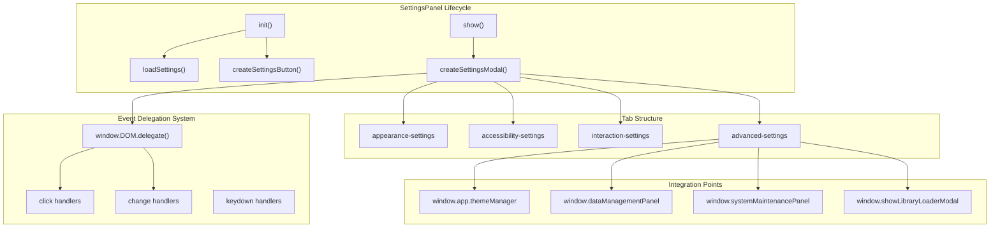

| Tab Section | Settings | Integration |
| --- | --- | --- |
| Appearance | Theme selection, font size, auto-theme | `window.app.themeManager.setTheme()` |
| Accessibility | High contrast, reduce motion, keyboard navigation | CSS class toggles, `ThemeManager` |
| Interaction | Keyboard shortcuts, sound effects, notifications | `window.app.keyboardShortcuts` |
| Advanced | Data management, library loader, system maintenance | Component delegation |

**Event Delegation Pattern:**

The component uses `window.DOM.delegate()` for all event handling, falling back to traditional event listeners when unavailable:

```python
// Event delegation example from settingsPanel.js
window.DOM.delegate('click', '.settings-button', handler);
window.DOM.delegate('change', '#theme-select', handler);
```

Sources: [js/components/settingsPanel.js L1-L40](https://github.com/sallowayma-git/IELTS-practice/blob/df0c9b8f/js/components/settingsPanel.js#L1-L40)

 [js/components/settingsPanel.js L113-L244](https://github.com/sallowayma-git/IELTS-practice/blob/df0c9b8f/js/components/settingsPanel.js#L113-L244)

 [js/components/settingsPanel.js L371-L546](https://github.com/sallowayma-git/IELTS-practice/blob/df0c9b8f/js/components/settingsPanel.js#L371-L546)

### PracticeHistory Class

The `PracticeHistory` class implements a comprehensive practice record management interface with filtering, sorting, pagination, and virtual scrolling support.

**Component Architecture:**

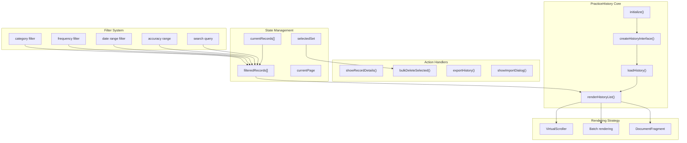

| Feature | Implementation | Code Location |
| --- | --- | --- |
| Virtual Scrolling | `VirtualScroller` integration | [js/components/practiceHistory.js L23-L25](https://github.com/sallowayma-git/IELTS-practice/blob/df0c9b8f/js/components/practiceHistory.js#L23-L25) |
| Filtering | Category, frequency, date, accuracy | [js/components/practiceHistory.js L13-L22](https://github.com/sallowayma-git/IELTS-practice/blob/df0c9b8f/js/components/practiceHistory.js#L13-L22) |
| Sorting | Multi-field with asc/desc order | [js/components/practiceHistory.js L648-L669](https://github.com/sallowayma-git/IELTS-practice/blob/df0c9b8f/js/components/practiceHistory.js#L648-L669) |
| Bulk Selection | Set-based selection tracking | [js/components/practiceHistory.js L9-L10](https://github.com/sallowayma-git/IELTS-practice/blob/df0c9b8f/js/components/practiceHistory.js#L9-L10) |
| Pagination | Configurable records per page | [js/components/practiceHistory.js L11-L12](https://github.com/sallowayma-git/IELTS-practice/blob/df0c9b8f/js/components/practiceHistory.js#L11-L12) |

**DOM Manipulation Utilities:**

The component includes custom DOM utilities with fallback to `window.DOM`:

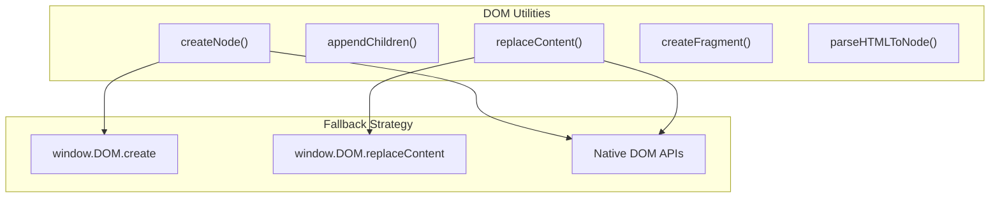

Sources: [js/components/practiceHistory.js L1-L97](https://github.com/sallowayma-git/IELTS-practice/blob/df0c9b8f/js/components/practiceHistory.js#L1-L97)

 [js/components/practiceHistory.js L145-L223](https://github.com/sallowayma-git/IELTS-practice/blob/df0c9b8f/js/components/practiceHistory.js#L145-L223)

 [js/components/practiceHistory.js L374-L475](https://github.com/sallowayma-git/IELTS-practice/blob/df0c9b8f/js/components/practiceHistory.js#L374-L475)

### PracticeRecordModal Class

The `PracticeRecordModal` class displays detailed information about individual practice sessions, including answer comparisons and score breakdowns.

**Modal Structure:**

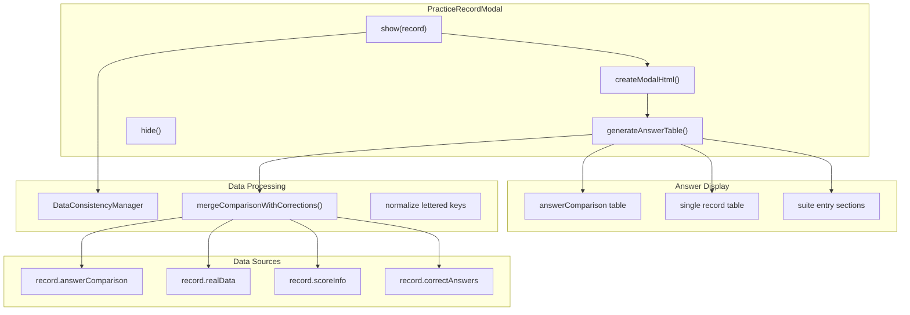

| Method | Purpose | Key Logic |
| --- | --- | --- |
| `show(record)` | Display modal with record data | Data consistency check, modal creation |
| `generateAnswerTable()` | Build answer comparison table | Suite entry detection, fallback to single |
| `mergeComparisonWithCorrections()` | Fill missing correct answers | Multi-source data merging |
| `generateTableFromComparison()` | Render answer table from comparison | Letter-to-numeric key mapping |

**Answer Table Generation:**

The modal implements sophisticated answer table generation with multiple data source fallbacks:

1. **Primary**: `record.answerComparison` (structured comparison data)
2. **Secondary**: `record.realData.answers` and `record.correctAnswers`
3. **Tertiary**: Direct `record.answers` and fallback sources

Sources: [js/components/practiceRecordModal.js L1-L56](https://github.com/sallowayma-git/IELTS-practice/blob/df0c9b8f/js/components/practiceRecordModal.js#L1-L56)

 [js/components/practiceRecordModal.js L145-L340](https://github.com/sallowayma-git/IELTS-practice/blob/df0c9b8f/js/components/practiceRecordModal.js#L145-L340)

 [js/components/practiceRecordModal.js L342-L429](https://github.com/sallowayma-git/IELTS-practice/blob/df0c9b8f/js/components/practiceRecordModal.js#L342-L429)

### ThemeManager Class

The `ThemeManager` class provides theme switching and personalization with CSS custom property manipulation and system preference detection.

**Theme System Architecture:**

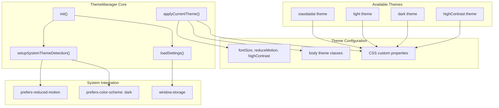

| Theme | Primary Color | Use Case |
| --- | --- | --- |
| `xiaodaidai` | `#ffc83d` | Console-style interface |
| `light` | `#3b82f6` | Default light mode |
| `dark` | `#60a5fa` | Dark mode |
| `highContrast` | `#0066cc` | Accessibility |

**CSS Custom Properties:**

Each theme defines a complete set of CSS variables:

* Color scheme: `--primary-color`, `--secondary-color`, `--success-color`, etc.
* Backgrounds: `--bg-primary`, `--bg-secondary`, `--bg-tertiary`
* Typography: `--text-primary`, `--text-secondary`, `--text-tertiary`
* UI Elements: `--border-color`, `--shadow-sm`, `--shadow-md`, `--shadow-lg`

**System Preference Detection:**

```javascript
// MediaQuery listeners for system preferences
darkModeQuery.addEventListener('change', (e) => {
    if (this.settings.autoTheme) {
        this.setTheme(e.matches ? 'dark' : 'light');
    }
});
```

Sources: [js/utils/themeManager.js L1-L131](https://github.com/sallowayma-git/IELTS-practice/blob/df0c9b8f/js/utils/themeManager.js#L1-L131)

 [js/utils/themeManager.js L163-L236](https://github.com/sallowayma-git/IELTS-practice/blob/df0c9b8f/js/utils/themeManager.js#L163-L236)

 [js/utils/themeManager.js L265-L408](https://github.com/sallowayma-git/IELTS-practice/blob/df0c9b8f/js/utils/themeManager.js#L265-L408)

## Legacy View Components

The application includes a legacy view bundle (`legacyViewBundle.js`) providing backward-compatible rendering for practice statistics, history, and exam lists.

### Legacy Component Architecture

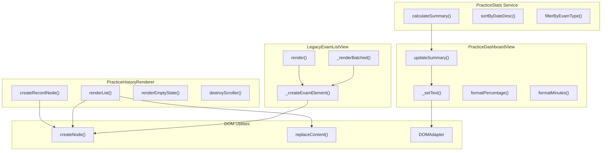

### PracticeStats Service

Statistical calculations for practice records:

| Function | Input | Output |
| --- | --- | --- |
| `calculateSummary(records)` | Practice records array | `{totalPracticed, averageScore, totalStudyMinutes, streak}` |
| `sortByDateDesc(records)` | Records array | Date-sorted array |
| `filterByExamType(records, exams, type)` | Records, exam index, type filter | Filtered records |

**Streak Calculation:**

```javascript
// Calculates consecutive practice days
function calculateStreak(uniqueDateKeys) {
    // Sort dates descending
    // Check if today or yesterday is present
    // Count consecutive days back from most recent
    return streak;
}
```

Sources: [js/views/legacyViewBundle.js L6-L113](https://github.com/sallowayma-git/IELTS-practice/blob/df0c9b8f/js/views/legacyViewBundle.js#L6-L113)

### PracticeDashboardView Class

Dashboard view renderer for practice statistics display:

| Property | Purpose | Default |
| --- | --- | --- |
| `ids.total` | Total practices element ID | `'total-practiced'` |
| `ids.average` | Average score element ID | `'avg-score'` |
| `ids.duration` | Study time element ID | `'study-time'` |
| `ids.streak` | Streak days element ID | `'streak-days'` |

Sources: [js/views/legacyViewBundle.js L116-L163](https://github.com/sallowayma-git/IELTS-practice/blob/df0c9b8f/js/views/legacyViewBundle.js#L116-L163)

### PracticeHistoryRenderer

Provides item-level rendering for practice history with virtual scrolling support:

**Rendering Pipeline:**

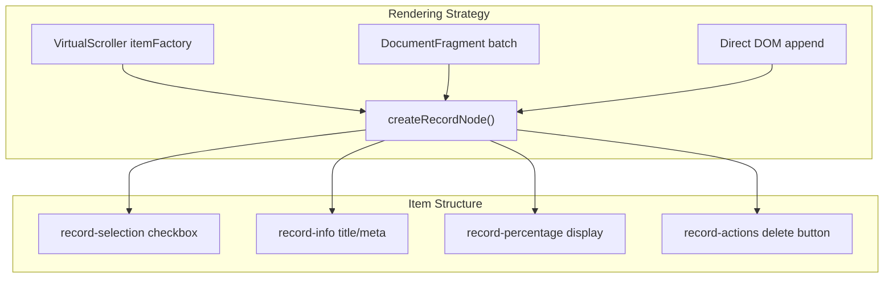

| Method | Purpose | Virtual Scrolling Support |
| --- | --- | --- |
| `createRecordNode(record, options)` | Single record item creation | Yes (as itemFactory) |
| `renderList(container, records, options)` | Full list rendering | Automatic if `VirtualScroller` available |
| `renderEmptyState(container)` | Empty state UI | N/A |
| `destroyScroller(scroller)` | Cleanup virtual scroller | Required before re-render |

**Helper Utilities:**

```
// Score-based color coding
helpers.getScoreColor = function(percentage) {
    if (pct >= 90) return '#10b981';  // Green
    if (pct >= 75) return '#f59e0b';  // Amber
    if (pct >= 60) return '#f97316';  // Orange
    return '#ef4444';                  // Red
};
```

Sources: [js/views/legacyViewBundle.js L165-L387](https://github.com/sallowayma-git/IELTS-practice/blob/df0c9b8f/js/views/legacyViewBundle.js#L165-L387)

### LegacyExamListView Class

Exam list renderer with batched rendering for large datasets:

| Configuration | Default | Purpose |
| --- | --- | --- |
| `containerId` | `'exam-list-container'` | Target container element |
| `loadingSelector` | `'#browse-view .loading'` | Loading indicator |
| `batchSize` | `20` | Items per render batch |
| `supportsGenerate` | `true` | Show HTML generation buttons |

**Batched Rendering:**

```javascript
// Renders exams in chunks using requestAnimationFrame
_renderBatched(exams, listElement, options) {
    var index = 0;
    function processBatch() {
        var endIndex = Math.min(index + batchSize, exams.length);
        // Render batch into DocumentFragment
        // Append to list
        index = endIndex;
        if (index < exams.length) {
            requestAnimationFrame(processBatch);
        }
    }
    requestAnimationFrame(processBatch);
}
```

Sources: [js/views/legacyViewBundle.js L389-L647](https://github.com/sallowayma-git/IELTS-practice/blob/df0c9b8f/js/views/legacyViewBundle.js#L389-L647)

## Event Delegation and DOM Utilities

### Event Delegation System

The application uses a centralized event delegation system (`window.DOM.delegate`) to optimize event handling:

**Delegation Architecture:**

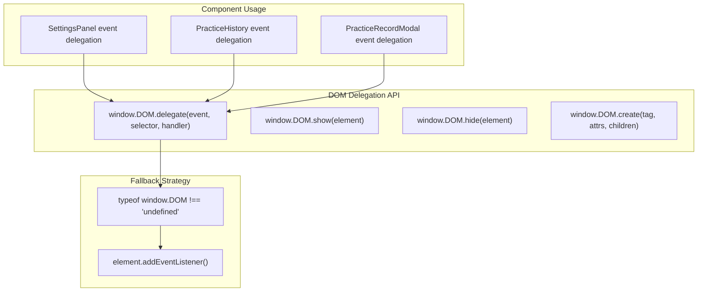

**Usage Pattern:**

```
// Primary: Event delegation
if (typeof window.DOM !== 'undefined' && window.DOM.delegate) {
    window.DOM.delegate('click', '.settings-button', handler);
} else {
    // Fallback: Direct event binding
    document.querySelector('.settings-button')
        .addEventListener('click', handler);
}
```

Sources: [js/components/settingsPanel.js L113-L244](https://github.com/sallowayma-git/IELTS-practice/blob/df0c9b8f/js/components/settingsPanel.js#L113-L244)

 [js/components/practiceHistory.js L413-L475](https://github.com/sallowayma-git/IELTS-practice/blob/df0c9b8f/js/components/practiceHistory.js#L413-L475)

 [js/components/practiceRecordModal.js L660-L697](https://github.com/sallowayma-git/IELTS-practice/blob/df0c9b8f/js/components/practiceRecordModal.js#L660-L697)

### DOM Manipulation Utilities

The `PracticeHistory` class implements custom DOM utilities with fallback support:

| Method | Fallback Priority | Purpose |
| --- | --- | --- |
| `createNode(tag, attrs, children)` | `window.DOM.create` → native | Element creation with attributes |
| `appendChildren(element, children)` | Native only | Append text/element nodes |
| `replaceContent(container, content)` | `window.DOM.replaceContent` → native | Replace container contents |
| `createFragment(items)` | Native only | DocumentFragment for batch operations |
| `parseHTMLToNode(html)` | DOMParser | Parse HTML string to DOM node |

**Implementation Pattern:**

```javascript
createNode(tag, attrs = {}, children = []) {
    if (this.domCreate) {
        return this.domCreate(tag, attrs, children);
    }
    // Fallback to native implementation
    const element = document.createElement(tag);
    // Process attributes, dataset, style
    // Append children
    return element;
}
```

Sources: [js/components/practiceHistory.js L41-L144](https://github.com/sallowayma-git/IELTS-practice/blob/df0c9b8f/js/components/practiceHistory.js#L41-L144)

### Modal and Overlay System

Components use standardized modal patterns with consistent styling and behavior:

**Modal Structure:**

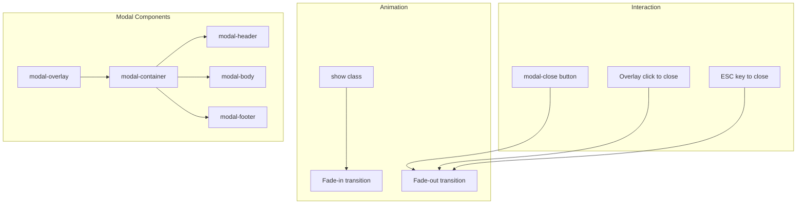

| Component | Modal Class | Show Method | Hide Method |
| --- | --- | --- | --- |
| `SettingsPanel` | `.settings-modal` | `show()` | `hide()` |
| `PracticeRecordModal` | `.modal-overlay` | `show(record)` | `hide()` |
| Legacy Views | Various | Component-specific | Component-specific |

**Common Modal Pattern:**

```javascript
// Show modal
show() {
    const modalHtml = this.createModalHtml();
    document.body.insertAdjacentHTML('beforeend', modalHtml);
    setTimeout(() => {
        document.querySelector('.modal').classList.add('show');
    }, 10);
}

// Hide modal
hide() {
    const modal = document.querySelector('.modal-overlay');
    if (modal) modal.remove();
}
```

Sources: [js/components/settingsPanel.js L249-L273](https://github.com/sallowayma-git/IELTS-practice/blob/df0c9b8f/js/components/settingsPanel.js#L249-L273)

 [js/components/practiceRecordModal.js L17-L56](https://github.com/sallowayma-git/IELTS-practice/blob/df0c9b8f/js/components/practiceRecordModal.js#L17-L56)

 [js/components/practiceRecordModal.js L60-L67](https://github.com/sallowayma-git/IELTS-practice/blob/df0c9b8f/js/components/practiceRecordModal.js#L60-L67)

## Component Communication Patterns

### Event-Driven Architecture

Components communicate through a combination of direct method calls, event dispatching, and shared state management:

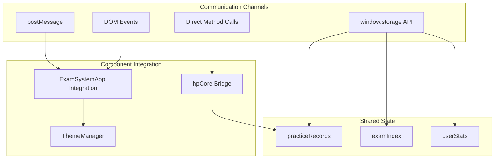

Sources: [js/components/dataManagementPanel.js L208-L257](https://github.com/sallowayma-git/IELTS-practice/blob/df0c9b8f/js/components/dataManagementPanel.js#L208-L257)

 [js/components/settingsPanel.js L409-L596](https://github.com/sallowayma-git/IELTS-practice/blob/df0c9b8f/js/components/settingsPanel.js#L409-L596)

 [js/academic-enhancements.js L16-L31](https://github.com/sallowayma-git/IELTS-practice/blob/df0c9b8f/js/academic-enhancements.js#L16-L31)

### Cross-Component Dependencies

The component system maintains loose coupling through standardized interfaces:

| Dependency Type | Implementation | Examples |
| --- | --- | --- |
| Storage API | `window.storage.get/set` | All components use unified storage |
| Message System | `window.showMessage` | Status notifications |
| Theme Integration | `window.app.themeManager` | Settings panel theme controls |
| Modal Management | Global overlay patterns | Consistent modal behavior |

Sources: [js/components/dataManagementPanel.js L281-L296](https://github.com/sallowayma-git/IELTS-practice/blob/df0c9b8f/js/components/dataManagementPanel.js#L281-L296)

 [js/components/settingsPanel.js L21-L45](https://github.com/sallowayma-git/IELTS-practice/blob/df0c9b8f/js/components/settingsPanel.js#L21-L45)

 [js/academic-fixes.js L8-L30](https://github.com/sallowayma-git/IELTS-practice/blob/df0c9b8f/js/academic-fixes.js#L8-L30)