# User Interface Components

> **Relevant source files**
> * [assets/scripts/complete-exam-data.js](https://github.com/sallowayma-git/IELTS-practice/blob/92f64eb8/assets/scripts/complete-exam-data.js)
> * [assets/scripts/listening-exam-data.js](https://github.com/sallowayma-git/IELTS-practice/blob/92f64eb8/assets/scripts/listening-exam-data.js)
> * [js/app/browseController.js](https://github.com/sallowayma-git/IELTS-practice/blob/92f64eb8/js/app/browseController.js)
> * [js/app/examActions.js](https://github.com/sallowayma-git/IELTS-practice/blob/92f64eb8/js/app/examActions.js)
> * [js/app/main-entry.js](https://github.com/sallowayma-git/IELTS-practice/blob/92f64eb8/js/app/main-entry.js)
> * [js/app/navigationMixin.js](https://github.com/sallowayma-git/IELTS-practice/blob/92f64eb8/js/app/navigationMixin.js)
> * [js/app/spellingErrorCollector.js](https://github.com/sallowayma-git/IELTS-practice/blob/92f64eb8/js/app/spellingErrorCollector.js)
> * [js/components/PerformanceOptimizer.js](https://github.com/sallowayma-git/IELTS-practice/blob/92f64eb8/js/components/PerformanceOptimizer.js)
> * [js/components/practiceHistory.js](https://github.com/sallowayma-git/IELTS-practice/blob/92f64eb8/js/components/practiceHistory.js)
> * [js/components/practiceHistoryEnhancer.js](https://github.com/sallowayma-git/IELTS-practice/blob/92f64eb8/js/components/practiceHistoryEnhancer.js)
> * [js/components/practiceRecordModal.js](https://github.com/sallowayma-git/IELTS-practice/blob/92f64eb8/js/components/practiceRecordModal.js)
> * [js/data/dataSources/storageDataSource.js](https://github.com/sallowayma-git/IELTS-practice/blob/92f64eb8/js/data/dataSources/storageDataSource.js)
> * [js/data/index.js](https://github.com/sallowayma-git/IELTS-practice/blob/92f64eb8/js/data/index.js)
> * [js/runtime/lazyLoader.js](https://github.com/sallowayma-git/IELTS-practice/blob/92f64eb8/js/runtime/lazyLoader.js)
> * [js/utils/markdownExporter.js](https://github.com/sallowayma-git/IELTS-practice/blob/92f64eb8/js/utils/markdownExporter.js)
> * [js/views/legacyViewBundle.js](https://github.com/sallowayma-git/IELTS-practice/blob/92f64eb8/js/views/legacyViewBundle.js)

This document describes the user-facing interface components of the IELTS Practice System, including views, modals, panels, and theme-specific UI elements. For information about the underlying state management and data flow, see [Core Application Architecture](/sallowayma-git/IELTS-practice/3-core-application-architecture). For theme system architecture and portal navigation, see [Theme System & Visual Design](/sallowayma-git/IELTS-practice/8-hp-theme-and-core-bridge).

## Overview

The IELTS Practice System employs a component-based UI architecture with multiple rendering strategies to support different visual themes while maintaining consistent functionality. The UI layer is divided into:

* **Theme Portal Components**: Complete HTML pages with themed layouts (My Melody, Academic, Bloom)
* **Reusable UI Components**: JavaScript classes that render modals, lists, and detail views
* **Legacy View Bundle**: Compatibility components that support older rendering approaches
* **Enhancement Layers**: Additional functionality added to base components

## Component Architecture Diagram

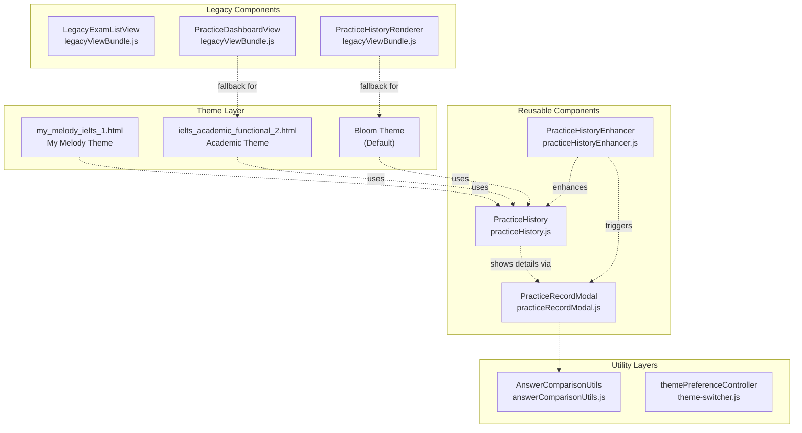

**Sources**: [js/components/practiceRecordModal.js L1-L803](https://github.com/sallowayma-git/IELTS-practice/blob/92f64eb8/js/components/practiceRecordModal.js#L1-L803)

 [js/components/practiceHistory.js L1-L1500](https://github.com/sallowayma-git/IELTS-practice/blob/92f64eb8/js/components/practiceHistory.js#L1-L1500)

 [js/components/practiceHistoryEnhancer.js L1-L383](https://github.com/sallowayma-git/IELTS-practice/blob/92f64eb8/js/components/practiceHistoryEnhancer.js#L1-L383)

 [js/views/legacyViewBundle.js L1-L800](https://github.com/sallowayma-git/IELTS-practice/blob/92f64eb8/js/views/legacyViewBundle.js#L1-L800)

 [js/theme-switcher.js L1-L481](https://github.com/sallowayma-git/IELTS-practice/blob/92f64eb8/js/theme-switcher.js#L1-L481)

## Practice Record Modal Component

`PracticeRecordModal` is the primary component for displaying detailed practice record information. It provides a comprehensive view of a single practice session, including metadata, scores, and answer-by-answer comparisons.

### Modal Lifecycle

```python
#mermaid-elodrqa2nqr{font-family:ui-sans-serif,-apple-system,system-ui,Segoe UI,Helvetica;font-size:16px;fill:#333;}@keyframes edge-animation-frame{from{stroke-dashoffset:0;}}@keyframes dash{to{stroke-dashoffset:0;}}#mermaid-elodrqa2nqr .edge-animation-slow{stroke-dasharray:9,5!important;stroke-dashoffset:900;animation:dash 50s linear infinite;stroke-linecap:round;}#mermaid-elodrqa2nqr .edge-animation-fast{stroke-dasharray:9,5!important;stroke-dashoffset:900;animation:dash 20s linear infinite;stroke-linecap:round;}#mermaid-elodrqa2nqr .error-icon{fill:#dddddd;}#mermaid-elodrqa2nqr .error-text{fill:#222222;stroke:#222222;}#mermaid-elodrqa2nqr .edge-thickness-normal{stroke-width:1px;}#mermaid-elodrqa2nqr .edge-thickness-thick{stroke-width:3.5px;}#mermaid-elodrqa2nqr .edge-pattern-solid{stroke-dasharray:0;}#mermaid-elodrqa2nqr .edge-thickness-invisible{stroke-width:0;fill:none;}#mermaid-elodrqa2nqr .edge-pattern-dashed{stroke-dasharray:3;}#mermaid-elodrqa2nqr .edge-pattern-dotted{stroke-dasharray:2;}#mermaid-elodrqa2nqr .marker{fill:#999;stroke:#999;}#mermaid-elodrqa2nqr .marker.cross{stroke:#999;}#mermaid-elodrqa2nqr svg{font-family:ui-sans-serif,-apple-system,system-ui,Segoe UI,Helvetica;font-size:16px;}#mermaid-elodrqa2nqr p{margin:0;}#mermaid-elodrqa2nqr defs #statediagram-barbEnd{fill:#999;stroke:#999;}#mermaid-elodrqa2nqr g.stateGroup text{fill:#dddddd;stroke:none;font-size:10px;}#mermaid-elodrqa2nqr g.stateGroup text{fill:#333;stroke:none;font-size:10px;}#mermaid-elodrqa2nqr g.stateGroup .state-title{font-weight:bolder;fill:#333;}#mermaid-elodrqa2nqr g.stateGroup rect{fill:#ffffff;stroke:#dddddd;}#mermaid-elodrqa2nqr g.stateGroup line{stroke:#999;stroke-width:1;}#mermaid-elodrqa2nqr .transition{stroke:#999;stroke-width:1;fill:none;}#mermaid-elodrqa2nqr .stateGroup .composit{fill:#f4f4f4;border-bottom:1px;}#mermaid-elodrqa2nqr .stateGroup .alt-composit{fill:#e0e0e0;border-bottom:1px;}#mermaid-elodrqa2nqr .state-note{stroke:#e6d280;fill:#fff5ad;}#mermaid-elodrqa2nqr .state-note text{fill:#333;stroke:none;font-size:10px;}#mermaid-elodrqa2nqr .stateLabel .box{stroke:none;stroke-width:0;fill:#ffffff;opacity:0.5;}#mermaid-elodrqa2nqr .edgeLabel .label rect{fill:#ffffff;opacity:0.5;}#mermaid-elodrqa2nqr .edgeLabel{background-color:#ffffff;text-align:center;}#mermaid-elodrqa2nqr .edgeLabel p{background-color:#ffffff;}#mermaid-elodrqa2nqr .edgeLabel rect{opacity:0.5;background-color:#ffffff;fill:#ffffff;}#mermaid-elodrqa2nqr .edgeLabel .label text{fill:#333;}#mermaid-elodrqa2nqr .label div .edgeLabel{color:#333;}#mermaid-elodrqa2nqr .stateLabel text{fill:#333;font-size:10px;font-weight:bold;}#mermaid-elodrqa2nqr .node circle.state-start{fill:#999;stroke:#999;}#mermaid-elodrqa2nqr .node .fork-join{fill:#999;stroke:#999;}#mermaid-elodrqa2nqr .node circle.state-end{fill:#dddddd;stroke:#f4f4f4;stroke-width:1.5;}#mermaid-elodrqa2nqr .end-state-inner{fill:#f4f4f4;stroke-width:1.5;}#mermaid-elodrqa2nqr .node rect{fill:#ffffff;stroke:#dddddd;stroke-width:1px;}#mermaid-elodrqa2nqr .node polygon{fill:#ffffff;stroke:#dddddd;stroke-width:1px;}#mermaid-elodrqa2nqr #statediagram-barbEnd{fill:#999;}#mermaid-elodrqa2nqr .statediagram-cluster rect{fill:#ffffff;stroke:#dddddd;stroke-width:1px;}#mermaid-elodrqa2nqr .cluster-label,#mermaid-elodrqa2nqr .nodeLabel{color:#333;}#mermaid-elodrqa2nqr .statediagram-cluster rect.outer{rx:5px;ry:5px;}#mermaid-elodrqa2nqr .statediagram-state .divider{stroke:#dddddd;}#mermaid-elodrqa2nqr .statediagram-state .title-state{rx:5px;ry:5px;}#mermaid-elodrqa2nqr .statediagram-cluster.statediagram-cluster .inner{fill:#f4f4f4;}#mermaid-elodrqa2nqr .statediagram-cluster.statediagram-cluster-alt .inner{fill:#f8f8f8;}#mermaid-elodrqa2nqr .statediagram-cluster .inner{rx:0;ry:0;}#mermaid-elodrqa2nqr .statediagram-state rect.basic{rx:5px;ry:5px;}#mermaid-elodrqa2nqr .statediagram-state rect.divider{stroke-dasharray:10,10;fill:#f8f8f8;}#mermaid-elodrqa2nqr .note-edge{stroke-dasharray:5;}#mermaid-elodrqa2nqr .statediagram-note rect{fill:#fff5ad;stroke:#e6d280;stroke-width:1px;rx:0;ry:0;}#mermaid-elodrqa2nqr .statediagram-note rect{fill:#fff5ad;stroke:#e6d280;stroke-width:1px;rx:0;ry:0;}#mermaid-elodrqa2nqr .statediagram-note text{fill:#333;}#mermaid-elodrqa2nqr .statediagram-note .nodeLabel{color:#333;}#mermaid-elodrqa2nqr .statediagram .edgeLabel{color:red;}#mermaid-elodrqa2nqr #dependencyStart,#mermaid-elodrqa2nqr #dependencyEnd{fill:#999;stroke:#999;stroke-width:1;}#mermaid-elodrqa2nqr .statediagramTitleText{text-anchor:middle;font-size:18px;fill:#333;}#mermaid-elodrqa2nqr :root{--mermaid-font-family:"trebuchet ms",verdana,arial,sans-serif;}Initial Stateshow(record) calledValidate recordProcess with AnswerComparisonUtilscreateModalHtml()Insert into documentAdd 'show' classUser views detailshide() or backdrop clickRemove from DOMHiddenPreparingDataNormalizationHTMLGenerationDOMInjectionEventSetupVisibleCleanup
```

**Sources**: [js/components/practiceRecordModal.js L12-L55](https://github.com/sallowayma-git/IELTS-practice/blob/92f64eb8/js/components/practiceRecordModal.js#L12-L55)

### Key Methods

| Method | Purpose | Key Operations |
| --- | --- | --- |
| `show(record)` | Display modal with record details | Data consistency check, prepare display data, generate HTML, setup listeners |
| `hide()` | Close and cleanup modal | Teardown event listeners, remove DOM element |
| `createModalHtml(record)` | Generate complete modal HTML | Format metadata, create answer tables, handle suite entries |
| `generateAnswerTable(record)` | Build answer comparison table | Normalize entries, render rows with correctness indicators |
| `prepareRecordForDisplay(record)` | Enrich record with metadata | Call `AnswerComparisonUtils.withEnrichedMetadata()` |

**Sources**: [js/components/practiceRecordModal.js L12-L162](https://github.com/sallowayma-git/IELTS-practice/blob/92f64eb8/js/components/practiceRecordModal.js#L12-L162)

### Answer Table Rendering Strategy

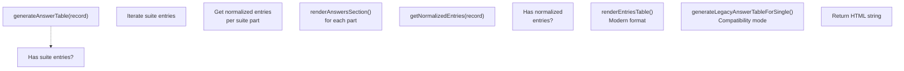

The modal supports two data formats:

1. **Normalized format**: Uses `AnswerComparisonUtils.getNormalizedEntries()` for structured answer data
2. **Legacy format**: Falls back to parsing `answerComparison`, `answers`, and `correctAnswers` objects directly

**Sources**: [js/components/practiceRecordModal.js L292-L518](https://github.com/sallowayma-git/IELTS-practice/blob/92f64eb8/js/components/practiceRecordModal.js#L292-L518)

### Suite Practice Display

For suite practice records (P1+P2+P3 sessions), the modal renders separate sections for each part:

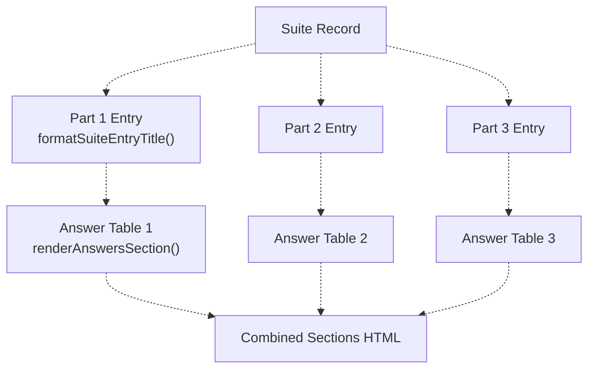

**Sources**: [js/components/practiceRecordModal.js L260-L337](https://github.com/sallowayma-git/IELTS-practice/blob/92f64eb8/js/components/practiceRecordModal.js#L260-L337)

### Data Flow with AnswerComparisonUtils

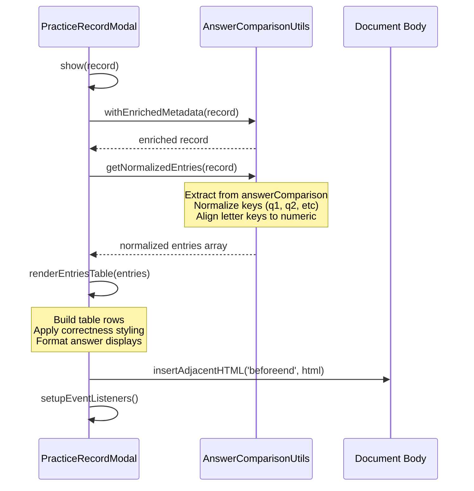

**Sources**: [js/components/practiceRecordModal.js L164-L456](https://github.com/sallowayma-git/IELTS-practice/blob/92f64eb8/js/components/practiceRecordModal.js#L164-L456)

 [js/utils/answerComparisonUtils.js L1-L700](https://github.com/sallowayma-git/IELTS-practice/blob/92f64eb8/js/utils/answerComparisonUtils.js#L1-L700)

## Practice History Component

`PracticeHistory` provides a filterable, sortable list of all practice records with batch operations and virtual scrolling for performance.

### Component State Structure

| Property | Type | Purpose |
| --- | --- | --- |
| `currentRecords` | Array | All loaded practice records |
| `filteredRecords` | Array | Records matching current filters |
| `selectedSet` | Set | IDs of selected records for bulk operations |
| `currentPage` | Number | Current pagination page |
| `recordsPerPage` | Number | Records per page (10/20/50/100) |
| `sortBy` | String | Sort field (startTime/accuracy/duration/examTitle) |
| `sortOrder` | String | Sort direction (asc/desc) |
| `filters` | Object | Active filter criteria |
| `searchQuery` | String | Search text for title filtering |
| `virtualScroller` | VirtualScroller | Performance optimization instance |

**Sources**: [js/components/practiceHistory.js L6-L38](https://github.com/sallowayma-git/IELTS-practice/blob/92f64eb8/js/components/practiceHistory.js#L6-L38)

### History Interface Layout

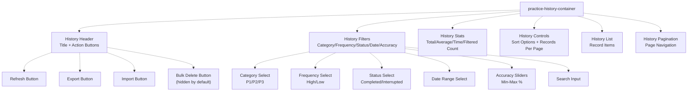

**Sources**: [js/components/practiceHistory.js L228-L368](https://github.com/sallowayma-git/IELTS-practice/blob/92f64eb8/js/components/practiceHistory.js#L228-L368)

### Filter and Sort Processing

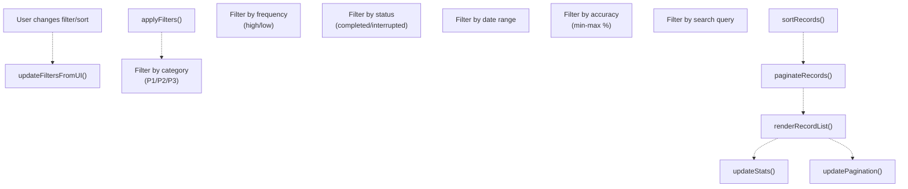

**Sources**: [js/components/practiceHistory.js L476-L603](https://github.com/sallowayma-git/IELTS-practice/blob/92f64eb8/js/components/practiceHistory.js#L476-L603)

### Bulk Delete Mode

The history component supports batch selection and deletion:

```sql
#mermaid-5thdjtno0dg{font-family:ui-sans-serif,-apple-system,system-ui,Segoe UI,Helvetica;font-size:16px;fill:#333;}@keyframes edge-animation-frame{from{stroke-dashoffset:0;}}@keyframes dash{to{stroke-dashoffset:0;}}#mermaid-5thdjtno0dg .edge-animation-slow{stroke-dasharray:9,5!important;stroke-dashoffset:900;animation:dash 50s linear infinite;stroke-linecap:round;}#mermaid-5thdjtno0dg .edge-animation-fast{stroke-dasharray:9,5!important;stroke-dashoffset:900;animation:dash 20s linear infinite;stroke-linecap:round;}#mermaid-5thdjtno0dg .error-icon{fill:#dddddd;}#mermaid-5thdjtno0dg .error-text{fill:#222222;stroke:#222222;}#mermaid-5thdjtno0dg .edge-thickness-normal{stroke-width:1px;}#mermaid-5thdjtno0dg .edge-thickness-thick{stroke-width:3.5px;}#mermaid-5thdjtno0dg .edge-pattern-solid{stroke-dasharray:0;}#mermaid-5thdjtno0dg .edge-thickness-invisible{stroke-width:0;fill:none;}#mermaid-5thdjtno0dg .edge-pattern-dashed{stroke-dasharray:3;}#mermaid-5thdjtno0dg .edge-pattern-dotted{stroke-dasharray:2;}#mermaid-5thdjtno0dg .marker{fill:#999;stroke:#999;}#mermaid-5thdjtno0dg .marker.cross{stroke:#999;}#mermaid-5thdjtno0dg svg{font-family:ui-sans-serif,-apple-system,system-ui,Segoe UI,Helvetica;font-size:16px;}#mermaid-5thdjtno0dg p{margin:0;}#mermaid-5thdjtno0dg defs #statediagram-barbEnd{fill:#999;stroke:#999;}#mermaid-5thdjtno0dg g.stateGroup text{fill:#dddddd;stroke:none;font-size:10px;}#mermaid-5thdjtno0dg g.stateGroup text{fill:#333;stroke:none;font-size:10px;}#mermaid-5thdjtno0dg g.stateGroup .state-title{font-weight:bolder;fill:#333;}#mermaid-5thdjtno0dg g.stateGroup rect{fill:#ffffff;stroke:#dddddd;}#mermaid-5thdjtno0dg g.stateGroup line{stroke:#999;stroke-width:1;}#mermaid-5thdjtno0dg .transition{stroke:#999;stroke-width:1;fill:none;}#mermaid-5thdjtno0dg .stateGroup .composit{fill:#f4f4f4;border-bottom:1px;}#mermaid-5thdjtno0dg .stateGroup .alt-composit{fill:#e0e0e0;border-bottom:1px;}#mermaid-5thdjtno0dg .state-note{stroke:#e6d280;fill:#fff5ad;}#mermaid-5thdjtno0dg .state-note text{fill:#333;stroke:none;font-size:10px;}#mermaid-5thdjtno0dg .stateLabel .box{stroke:none;stroke-width:0;fill:#ffffff;opacity:0.5;}#mermaid-5thdjtno0dg .edgeLabel .label rect{fill:#ffffff;opacity:0.5;}#mermaid-5thdjtno0dg .edgeLabel{background-color:#ffffff;text-align:center;}#mermaid-5thdjtno0dg .edgeLabel p{background-color:#ffffff;}#mermaid-5thdjtno0dg .edgeLabel rect{opacity:0.5;background-color:#ffffff;fill:#ffffff;}#mermaid-5thdjtno0dg .edgeLabel .label text{fill:#333;}#mermaid-5thdjtno0dg .label div .edgeLabel{color:#333;}#mermaid-5thdjtno0dg .stateLabel text{fill:#333;font-size:10px;font-weight:bold;}#mermaid-5thdjtno0dg .node circle.state-start{fill:#999;stroke:#999;}#mermaid-5thdjtno0dg .node .fork-join{fill:#999;stroke:#999;}#mermaid-5thdjtno0dg .node circle.state-end{fill:#dddddd;stroke:#f4f4f4;stroke-width:1.5;}#mermaid-5thdjtno0dg .end-state-inner{fill:#f4f4f4;stroke-width:1.5;}#mermaid-5thdjtno0dg .node rect{fill:#ffffff;stroke:#dddddd;stroke-width:1px;}#mermaid-5thdjtno0dg .node polygon{fill:#ffffff;stroke:#dddddd;stroke-width:1px;}#mermaid-5thdjtno0dg #statediagram-barbEnd{fill:#999;}#mermaid-5thdjtno0dg .statediagram-cluster rect{fill:#ffffff;stroke:#dddddd;stroke-width:1px;}#mermaid-5thdjtno0dg .cluster-label,#mermaid-5thdjtno0dg .nodeLabel{color:#333;}#mermaid-5thdjtno0dg .statediagram-cluster rect.outer{rx:5px;ry:5px;}#mermaid-5thdjtno0dg .statediagram-state .divider{stroke:#dddddd;}#mermaid-5thdjtno0dg .statediagram-state .title-state{rx:5px;ry:5px;}#mermaid-5thdjtno0dg .statediagram-cluster.statediagram-cluster .inner{fill:#f4f4f4;}#mermaid-5thdjtno0dg .statediagram-cluster.statediagram-cluster-alt .inner{fill:#f8f8f8;}#mermaid-5thdjtno0dg .statediagram-cluster .inner{rx:0;ry:0;}#mermaid-5thdjtno0dg .statediagram-state rect.basic{rx:5px;ry:5px;}#mermaid-5thdjtno0dg .statediagram-state rect.divider{stroke-dasharray:10,10;fill:#f8f8f8;}#mermaid-5thdjtno0dg .note-edge{stroke-dasharray:5;}#mermaid-5thdjtno0dg .statediagram-note rect{fill:#fff5ad;stroke:#e6d280;stroke-width:1px;rx:0;ry:0;}#mermaid-5thdjtno0dg .statediagram-note rect{fill:#fff5ad;stroke:#e6d280;stroke-width:1px;rx:0;ry:0;}#mermaid-5thdjtno0dg .statediagram-note text{fill:#333;}#mermaid-5thdjtno0dg .statediagram-note .nodeLabel{color:#333;}#mermaid-5thdjtno0dg .statediagram .edgeLabel{color:red;}#mermaid-5thdjtno0dg #dependencyStart,#mermaid-5thdjtno0dg #dependencyEnd{fill:#999;stroke:#999;stroke-width:1;}#mermaid-5thdjtno0dg .statediagramTitleText{text-anchor:middle;font-size:18px;fill:#333;}#mermaid-5thdjtno0dg :root{--mermaid-font-family:"trebuchet ms",verdana,arial,sans-serif;}Default modeUser clicks checkboxSelect/deselect recordsClick "批量删除"User confirmsDelete completeUser cancelsDeselect allNormalBulkModeConfirmDeleteDeletingselectedSet tracks IDsBulk delete button visibleCheckboxes enabled
```

**Sources**: [js/components/practiceHistory.js L725-L850](https://github.com/sallowayma-git/IELTS-practice/blob/92f64eb8/js/components/practiceHistory.js#L725-L850)

### Virtual Scrolling Integration

For performance with large record lists, the component optionally uses `VirtualScroller`:

```javascript
// Conditional virtual scroller creation
if (this.filteredRecords.length > 50) {
    this.virtualScroller = new VirtualScroller(
        container,
        this.filteredRecords,
        (record) => this.createRecordItem(record),
        { itemHeight: 120, containerHeight: 650 }
    );
}
```

**Sources**: [js/components/practiceHistory.js L901-L945](https://github.com/sallowayma-git/IELTS-practice/blob/92f64eb8/js/components/practiceHistory.js#L901-L945)

## Practice History Enhancer

`PracticeHistoryEnhancer` adds advanced features to the base practice history component without modifying its core implementation. This follows a decorator pattern.

### Enhancement Features

| Feature | Method | Description |
| --- | --- | --- |
| Clickable Titles | `enhancePracticeHistory()` | Makes record titles open detail modals |
| Markdown Export | `exportAsMarkdown()` | Exports records in Markdown table format |
| Enhanced Export Dialog | `showExportDialog()` | Provides JSON vs Markdown format selection |
| Record Detail Modal | `showRecordDetails(recordId)` | Opens `PracticeRecordModal` for selected record |

**Sources**: [js/components/practiceHistoryEnhancer.js L1-L383](https://github.com/sallowayma-git/IELTS-practice/blob/92f64eb8/js/components/practiceHistoryEnhancer.js#L1-L383)

### Initialization Strategy

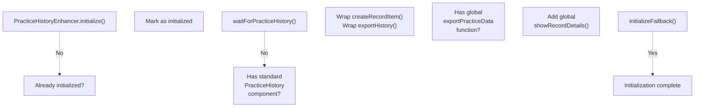

This multi-path initialization ensures the enhancer works across different application configurations, including the standard component-based architecture and legacy global function patterns.

**Sources**: [js/components/practiceHistoryEnhancer.js L13-L161](https://github.com/sallowayma-git/IELTS-practice/blob/92f64eb8/js/components/practiceHistoryEnhancer.js#L13-L161)

### Export Dialog Interaction

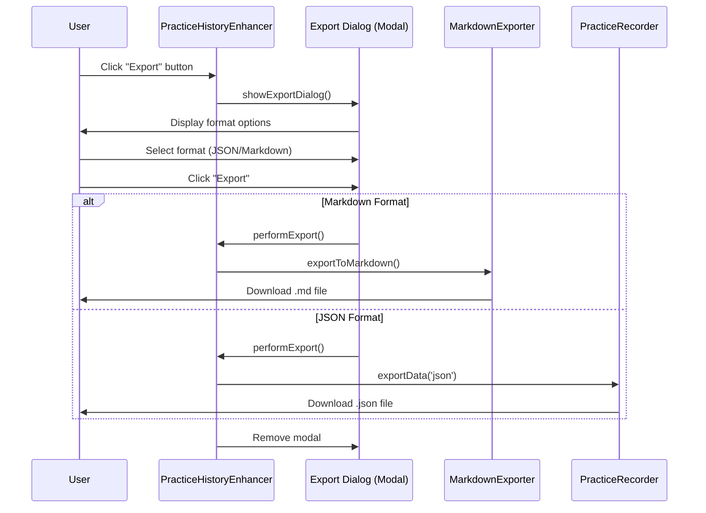

**Sources**: [js/components/practiceHistoryEnhancer.js L166-L318](https://github.com/sallowayma-git/IELTS-practice/blob/92f64eb8/js/components/practiceHistoryEnhancer.js#L166-L318)

## Legacy View Bundle Components

The legacy view bundle provides compatibility components that support older rendering patterns and fallback strategies. These components are self-contained and don't depend on modern framework patterns.

### Component Catalog

| Class | Purpose | Key Methods |
| --- | --- | --- |
| `PracticeStats` | Calculate practice statistics | `calculateSummary()`, `sortByDateDesc()`, `filterByExamType()` |
| `PracticeDashboardView` | Render summary statistics | `updateSummary()` |
| `PracticeHistoryRenderer` | Render history item lists | `createRecordNode()`, `renderList()`, `renderEmptyState()` |
| `LegacyExamListView` | Render exam list with batching | `render()`, `_createExamElement()`, `_renderBatched()` |

**Sources**: [js/views/legacyViewBundle.js L1-L800](https://github.com/sallowayma-git/IELTS-practice/blob/92f64eb8/js/views/legacyViewBundle.js#L1-L800)

### PracticeHistoryRenderer Rendering Strategy

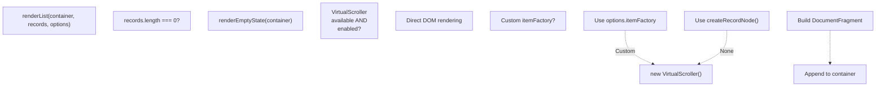

**Sources**: [js/views/legacyViewBundle.js L348-L386](https://github.com/sallowayma-git/IELTS-practice/blob/92f64eb8/js/views/legacyViewBundle.js#L348-L386)

### Record Node Structure

The `createRecordNode()` method builds individual history items with this structure:

```sql
┌─────────────────────────────────────────────┐
│ .history-item.history-record-item           │
│                                             │
│  ┌──────────────────────┐                  │
│  │ .record-selection    │ (checkbox)       │
│  └──────────────────────┘                  │
│                                             │
│  ┌──────────────────────────────────────┐  │
│  │ .record-info                         │  │
│  │  ┌────────────────────────────────┐  │  │
│  │  │ .practice-record-title (link)  │  │  │
│  │  └────────────────────────────────┘  │  │
│  │  ┌────────────────────────────────┐  │  │
│  │  │ .record-meta-line              │  │  │
│  │  │   .record-date                 │  │  │
│  │  │   .record-duration-value       │  │  │
│  │  └────────────────────────────────┘  │  │
│  └──────────────────────────────────────┘  │
│                                             │
│  ┌──────────────────────┐                  │
│  │ .record-percentage   │ (score display)  │
│  └──────────────────────┘                  │
│                                             │
│  ┌──────────────────────┐                  │
│  │ .record-actions      │ (delete button)  │
│  └──────────────────────┘                  │
└─────────────────────────────────────────────┘
```

**Sources**: [js/views/legacyViewBundle.js L256-L338](https://github.com/sallowayma-git/IELTS-practice/blob/92f64eb8/js/views/legacyViewBundle.js#L256-L338)

### LegacyExamListView Batched Rendering

For large exam lists, the component uses `requestAnimationFrame` batching:

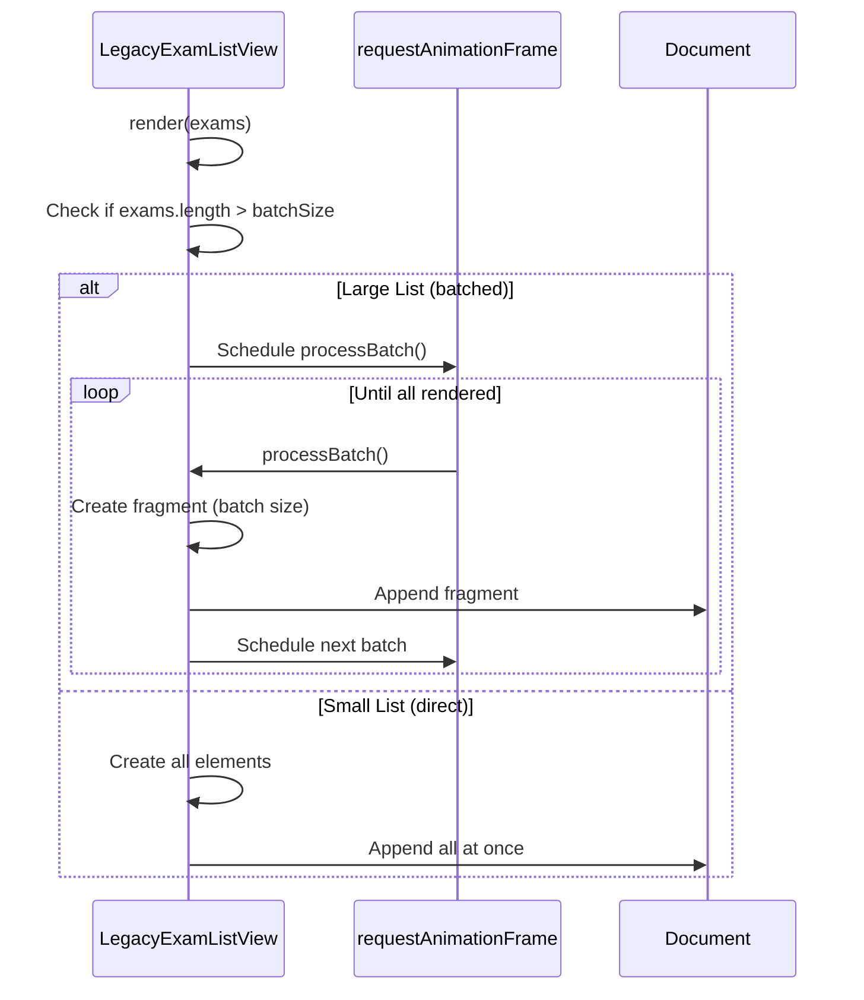

This prevents UI blocking when rendering hundreds of exam items.

**Sources**: [js/views/legacyViewBundle.js L443-L467](https://github.com/sallowayma-git/IELTS-practice/blob/92f64eb8/js/views/legacyViewBundle.js#L443-L467)

## Theme Switcher Modal

The theme switcher provides a modal interface for selecting visual themes and navigating between theme portals.

### Theme Preference Storage

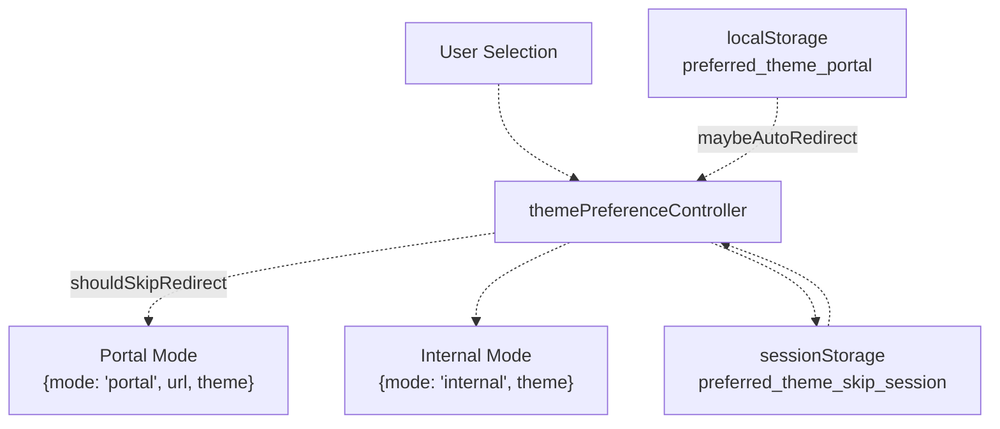

**Sources**: [js/theme-switcher.js L17-L169](https://github.com/sallowayma-git/IELTS-practice/blob/92f64eb8/js/theme-switcher.js#L17-L169)

### Portal Navigation Flow

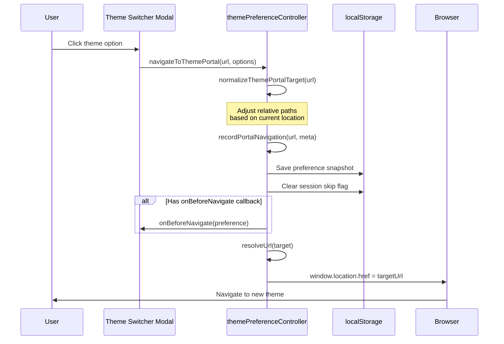

**Sources**: [js/theme-switcher.js L399-L428](https://github.com/sallowayma-git/IELTS-practice/blob/92f64eb8/js/theme-switcher.js#L399-L428)

### Auto-Redirect Mechanism

On page load, `maybeAutoRedirect()` checks if the user should be redirected to their preferred theme:

```javascript
// Simplified logic
maybeAutoRedirect() {
    const preference = this.load();
    if (!preference || preference.mode !== 'portal') {
        return { shouldRedirect: false };
    }
    
    if (this.shouldSkipRedirect()) {
        return { shouldRedirect: false, reason: 'session-skipped' };
    }
    
    const targetUrl = this.resolveUrl(preference.url);
    if (!targetUrl || targetUrl === window.location.href) {
        return { shouldRedirect: false, reason: 'already-at-target' };
    }
    
    this.markSessionRedirected();
    window.location.replace(targetUrl);
    return { shouldRedirect: true };
}
```

The session skip mechanism prevents infinite redirect loops during the same browser session.

**Sources**: [js/theme-switcher.js L142-L168](https://github.com/sallowayma-git/IELTS-practice/blob/92f64eb8/js/theme-switcher.js#L142-L168)

## Styling and CSS Architecture

### Modal CSS Structure

The practice record modal uses a layered approach to avoid conflicts with theme-specific styles:

| Class | Purpose | Scope |
| --- | --- | --- |
| `.modal-overlay` | Full-screen backdrop with blur | Fixed positioning, z-index 1000 |
| `.modal-container` | Main modal box | Centered, max-width 800px, 90vh height |
| `.modal-header` | Title and close button area | Fixed at top, non-scrollable |
| `.modal-body` | Scrollable content area | Flex-grow, custom scrollbar styling |
| `.answer-table` | Answer comparison table | Fixed layout, responsive columns |

**Sources**: [css/practice-record-modal.css L1-L412](https://github.com/sallowayma-git/IELTS-practice/blob/92f64eb8/css/practice-record-modal.css#L1-L412)

### Custom Scrollbar Design

The modal body uses custom scrollbar styling for visual consistency:

```css
#practice-record-modal .modal-body::-webkit-scrollbar {
    width: 8px;
}

#practice-record-modal .modal-body::-webkit-scrollbar-track {
    background: #fce8ec;
    border-radius: 10px;
    border: 2px solid #f9c6d1;
}

#practice-record-modal .modal-body::-webkit-scrollbar-thumb {
    background: linear-gradient(135deg, #f9c6d1 0%, #f8b5d1 100%);
    border-radius: 8px;
    border: 1px solid #f8a5c1;
    min-height: 40px;
}
```

**Sources**: [css/practice-record-modal.css L79-L105](https://github.com/sallowayma-git/IELTS-practice/blob/92f64eb8/css/practice-record-modal.css#L79-L105)

### Theme-Specific Overrides

Different themes can override modal styles. For example, the Academic theme:

```css
/* Academic theme overrides */
.modal-header { 
    background: var(--color-gray-50); 
    border-bottom: 1px solid var(--color-gray-200); 
}
.modal-title { 
    color: var(--color-primary); 
}
.record-summary h4 { 
    background: linear-gradient(135deg, 
        var(--color-primary) 0%, 
        var(--color-secondary) 100%); 
}
```

**Sources**: [.superdesign/design_iterations/ielts_academic_functional_2.html L922-L926](https://github.com/sallowayma-git/IELTS-practice/blob/92f64eb8/.superdesign/design_iterations/ielts_academic_functional_2.html#L922-L926)

## Component Integration with Data Layer

### Data Retrieval Patterns

UI components access practice records through multiple fallback strategies:

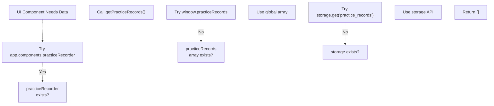

This defensive pattern ensures components work across different application configurations.

**Sources**: [js/components/practiceHistory.js L497-L527](https://github.com/sallowayma-git/IELTS-practice/blob/92f64eb8/js/components/practiceHistory.js#L497-L527)

 [js/components/practiceHistoryEnhancer.js L323-L366](https://github.com/sallowayma-git/IELTS-practice/blob/92f64eb8/js/components/practiceHistoryEnhancer.js#L323-L366)

### Event-Driven Updates

Components use event listeners to stay synchronized with data changes:

```javascript
// PracticeHistory listens for completion events
document.addEventListener('practiceSessionCompleted', () => {
    this.refreshHistory();
});

// Storage change events trigger UI updates
window.addEventListener('storage', (event) => {
    if (event.key === 'practice_records') {
        this.syncPracticeRecords();
    }
});
```

**Sources**: [js/components/practiceHistory.js L158-L161](https://github.com/sallowayma-git/IELTS-practice/blob/92f64eb8/js/components/practiceHistory.js#L158-L161)

## Responsive Design and Accessibility

### Mobile Adaptations

UI components implement responsive breakpoints:

| Breakpoint | Layout Changes |
| --- | --- |
| ≤ 768px | Modal width 95%, single-column metadata, smaller font sizes |
| ≤ 1024px | Horizontal scrolling for tables, stacked filters |

**Sources**: [css/practice-record-modal.css L258-L289](https://github.com/sallowayma-git/IELTS-practice/blob/92f64eb8/css/practice-record-modal.css#L258-L289)

### Keyboard Navigation

Components support keyboard shortcuts:

| Key Combination | Action | Component |
| --- | --- | --- |
| `Escape` | Close modal | PracticeRecordModal, Theme Switcher |
| `Ctrl/Cmd + R` | Refresh history | PracticeHistory |
| `Ctrl/Cmd + E` | Export records | PracticeHistory |

**Sources**: [js/components/practiceHistory.js L204-L222](https://github.com/sallowayma-git/IELTS-practice/blob/92f64eb8/js/components/practiceHistory.js#L204-L222)

### ARIA Attributes

```yaml
// Checkbox labels for screen readers
createNode('input', {
    type: 'checkbox',
    tabindex: bulkDeleteMode ? '0' : '-1',
    'aria-label': '选择练习记录'
})

// Close button accessibility
createNode('button', {
    className: 'modal-close',
    'aria-label': '关闭弹窗'
})
```

**Sources**: [js/views/legacyViewBundle.js L276-L281](https://github.com/sallowayma-git/IELTS-practice/blob/92f64eb8/js/views/legacyViewBundle.js#L276-L281)

 [js/components/practiceRecordModal.js L120-L122](https://github.com/sallowayma-git/IELTS-practice/blob/92f64eb8/js/components/practiceRecordModal.js#L120-L122)

## Performance Optimization Strategies

### Virtual Scrolling

For lists exceeding 50 items, `VirtualScroller` is employed:

```javascript
if (this.filteredRecords.length > 50) {
    this.virtualScroller = new VirtualScroller(
        container,
        this.filteredRecords,
        (record) => this.createRecordItem(record),
        { 
            itemHeight: 120,        // Fixed height per item
            containerHeight: 650,   // Visible area height
            overscan: 5            // Extra items to render
        }
    );
}
```

This renders only visible items plus a small overscan buffer, dramatically improving performance with thousands of records.

**Sources**: [js/components/practiceHistory.js L901-L945](https://github.com/sallowayma-git/IELTS-practice/blob/92f64eb8/js/components/practiceHistory.js#L901-L945)

### DOM Fragment Batching

Legacy components use `DocumentFragment` for efficient DOM manipulation:

```javascript
const fragment = document.createDocumentFragment();
for (let i = 0; i < items.length; i++) {
    fragment.appendChild(createItem(items[i]));
}
container.appendChild(fragment);  // Single reflow
```

**Sources**: [js/views/legacyViewBundle.js L448-L456](https://github.com/sallowayma-git/IELTS-practice/blob/92f64eb8/js/views/legacyViewBundle.js#L448-L456)

### Debounced Search Input

Search inputs use debouncing to prevent excessive filtering:

```javascript
searchInput.addEventListener('input', debounce((e) => {
    this.searchQuery = e.target.value.trim().toLowerCase();
    this.applyFilters();
}, 300));  // 300ms delay
```

**Sources**: [js/components/practiceHistory.js L428-L436](https://github.com/sallowayma-git/IELTS-practice/blob/92f64eb8/js/components/practiceHistory.js#L428-L436)

## Error Handling and Fallbacks

### Modal Display Error Recovery

```javascript
try {
    const processedRecord = this.prepareRecordForDisplay(record);
    const modalHtml = this.createModalHtml(processedRecord);
    // ... render modal
} catch (error) {
    console.error('[PracticeRecordModal] 显示失败:', error);
    if (typeof window.showMessage === 'function') {
        window.showMessage('无法显示练习记录', 'error');
    }
}
```

**Sources**: [js/components/practiceRecordModal.js L38-L43](https://github.com/sallowayma-git/IELTS-practice/blob/92f64eb8/js/components/practiceRecordModal.js#L38-L43)

### Component Initialization Fallbacks

The enhancer implements progressive enhancement with fallbacks:

```
if (window.app?.components?.practiceHistory) {
    // Enhance standard component
} else if (typeof window.exportPracticeData === 'function') {
    // Enhance global functions
} else {
    // Fallback mode - provide basic functionality
    this.initializeFallback();
}
```

**Sources**: [js/components/practiceHistoryEnhancer.js L99-L161](https://github.com/sallowayma-git/IELTS-practice/blob/92f64eb8/js/components/practiceHistoryEnhancer.js#L99-L161)

## Summary

The UI component layer of the IELTS Practice System demonstrates a flexible, multi-strategy architecture that supports:

* **Multiple Visual Themes**: Theme portals share components while presenting distinct aesthetics
* **Progressive Enhancement**: Components degrade gracefully when dependencies are unavailable
* **Performance at Scale**: Virtual scrolling and batched rendering handle thousands of records
* **Accessibility**: Keyboard navigation, ARIA attributes, and responsive design
* **Data Layer Abstraction**: Components work with modern state services or legacy global variables

This design enables the system to maintain a consistent user experience across different theme configurations while accommodating legacy code and providing paths for incremental modernization.