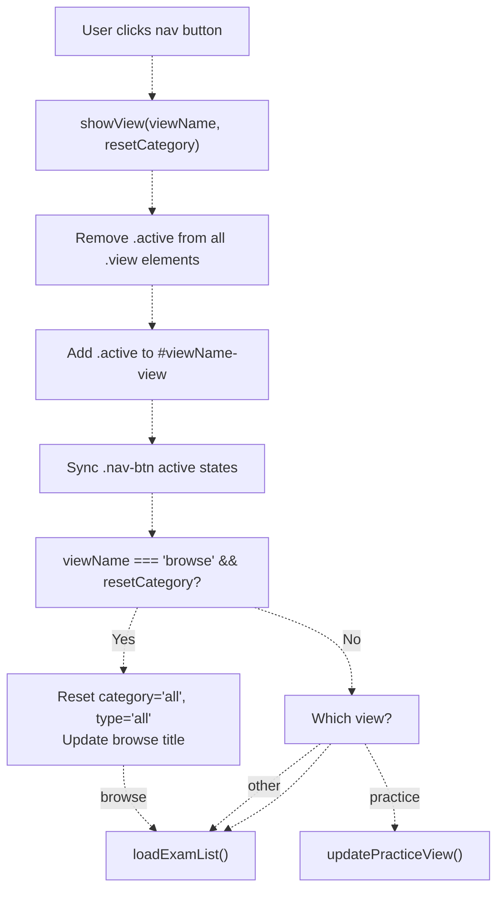
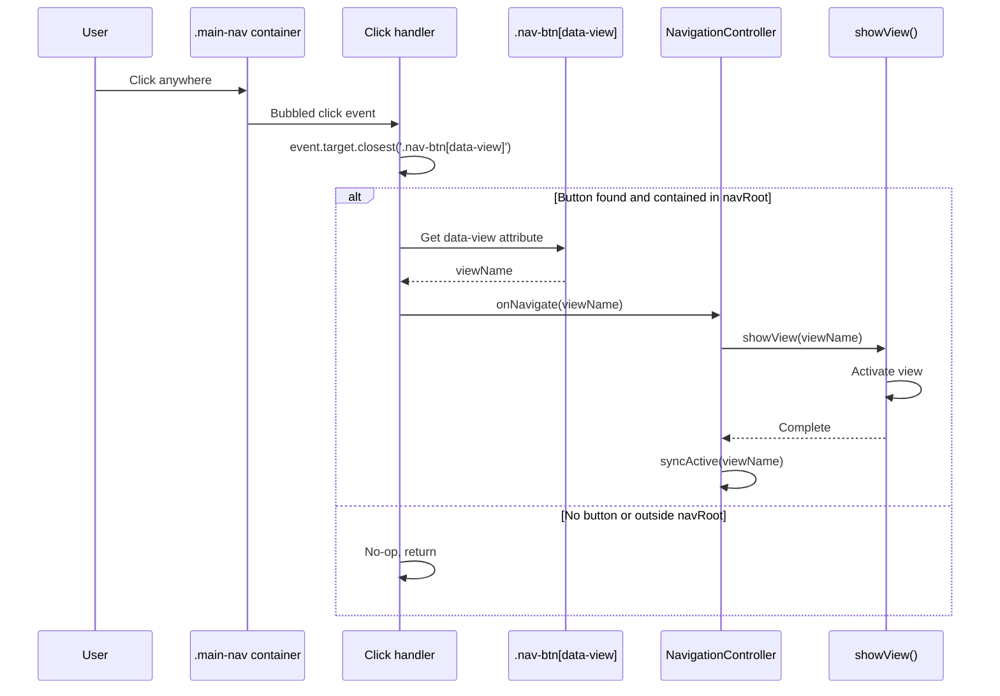
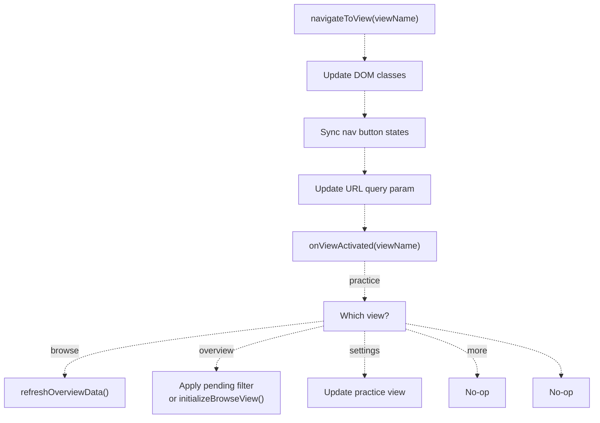
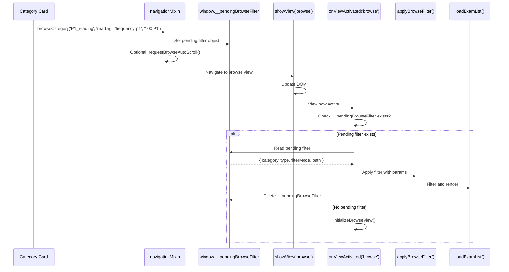
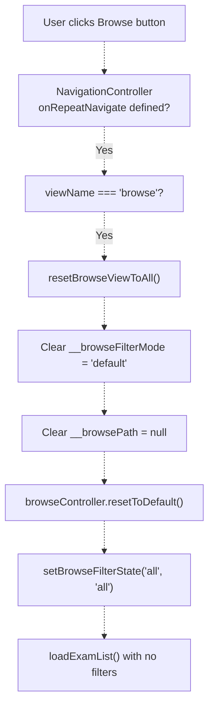
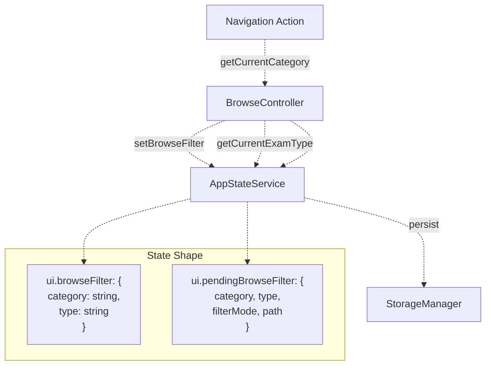
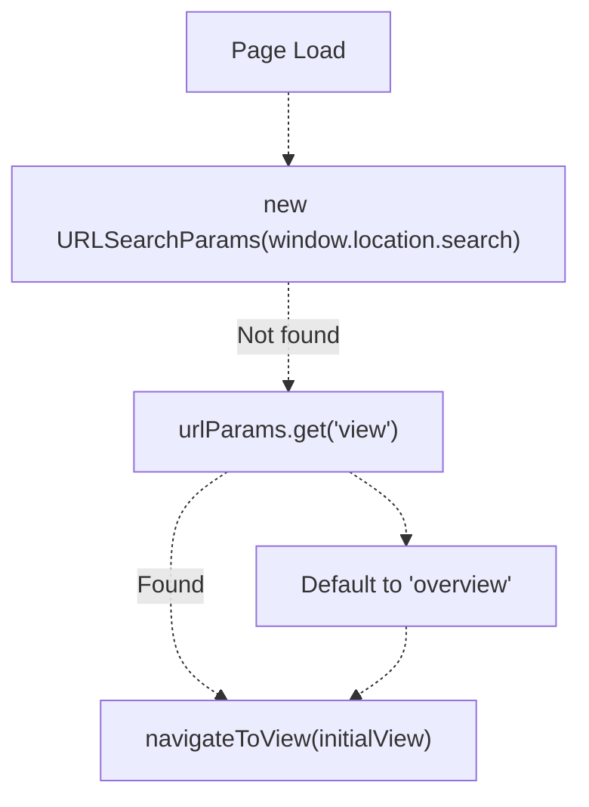
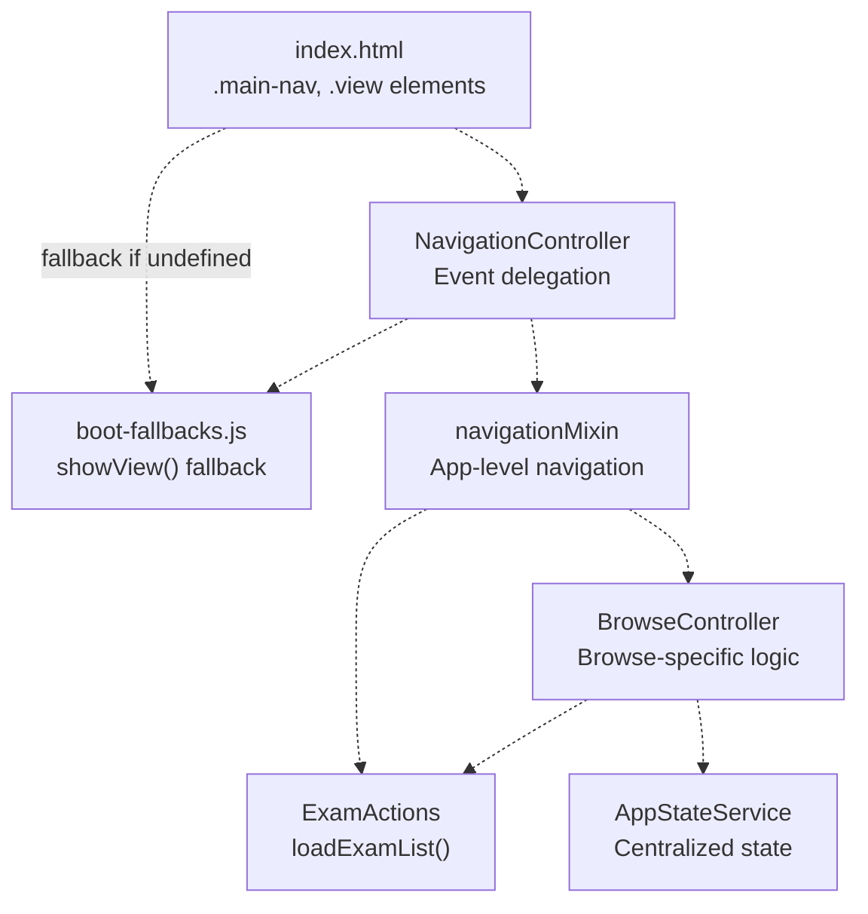

# View Management & Navigation System

> **Relevant source files**
> * [css/heroui-bridge.css](https://github.com/sallowayma-git/IELTS-practice/blob/92f64eb8/css/heroui-bridge.css)
> * [css/main.css](https://github.com/sallowayma-git/IELTS-practice/blob/92f64eb8/css/main.css)
> * [index.html](https://github.com/sallowayma-git/IELTS-practice/blob/92f64eb8/index.html)
> * [js/app.js](https://github.com/sallowayma-git/IELTS-practice/blob/92f64eb8/js/app.js)
> * [js/app/browseController.js](https://github.com/sallowayma-git/IELTS-practice/blob/92f64eb8/js/app/browseController.js)
> * [js/app/examActions.js](https://github.com/sallowayma-git/IELTS-practice/blob/92f64eb8/js/app/examActions.js)
> * [js/app/main-entry.js](https://github.com/sallowayma-git/IELTS-practice/blob/92f64eb8/js/app/main-entry.js)
> * [js/app/navigationMixin.js](https://github.com/sallowayma-git/IELTS-practice/blob/92f64eb8/js/app/navigationMixin.js)
> * [js/app/spellingErrorCollector.js](https://github.com/sallowayma-git/IELTS-practice/blob/92f64eb8/js/app/spellingErrorCollector.js)
> * [js/boot-fallbacks.js](https://github.com/sallowayma-git/IELTS-practice/blob/92f64eb8/js/boot-fallbacks.js)
> * [js/main.js](https://github.com/sallowayma-git/IELTS-practice/blob/92f64eb8/js/main.js)
> * [js/runtime/lazyLoader.js](https://github.com/sallowayma-git/IELTS-practice/blob/92f64eb8/js/runtime/lazyLoader.js)

## Purpose and Scope

This document describes the single-page application (SPA) navigation system used throughout the IELTS practice application. The system manages view switching, active state synchronization, navigation event delegation, and deferred navigation through the pending filter pattern.

For information about the browse view's filtering logic and mode management, see [Browse View & Exam List Management](/sallowayma-git/IELTS-practice/9.1-browse-view-and-exam-list-management). For theme-specific view implementations, see [Theme Architecture Overview](/sallowayma-git/IELTS-practice/7.1-theme-architecture-overview).

---

## Core Navigation Mechanism

### The showView Function

The `showView()` function serves as the primary navigation primitive, responsible for switching between application views and maintaining UI consistency.

**Function Signature and Location:**

* Primary implementation: [js/boot-fallbacks.js L4-L58](https://github.com/sallowayma-git/IELTS-practice/blob/92f64eb8/js/boot-fallbacks.js#L4-L58)
* Also implemented in: [js/app/navigationMixin.js L19-L51](https://github.com/sallowayma-git/IELTS-practice/blob/92f64eb8/js/app/navigationMixin.js#L19-L51)

**Core Responsibilities:**

1. Hide all currently active views
2. Display the target view
3. Update navigation button states
4. Reset browse filters when appropriate
5. Trigger view-specific initialization



**Sources:** [js/boot-fallbacks.js L4-L58](https://github.com/sallowayma-git/IELTS-practice/blob/92f64eb8/js/boot-fallbacks.js#L4-L58)

 [js/app/navigationMixin.js L19-L51](https://github.com/sallowayma-git/IELTS-practice/blob/92f64eb8/js/app/navigationMixin.js#L19-L51)

### View Selection Logic

The function implements defensive view resolution:

| Step | Logic | Code Reference |
| --- | --- | --- |
| 1. Normalize input | `(typeof viewName === 'string' && viewName) ? viewName : 'overview'` | [js/boot-fallbacks.js L9](https://github.com/sallowayma-git/IELTS-practice/blob/92f64eb8/js/boot-fallbacks.js#L9-L9) |
| 2. Query target | `document.getElementById(normalized + '-view')` | [js/boot-fallbacks.js L10](https://github.com/sallowayma-git/IELTS-practice/blob/92f64eb8/js/boot-fallbacks.js#L10-L10) |
| 3. Validate existence | Return early if target not found | [js/boot-fallbacks.js L11-L13](https://github.com/sallowayma-git/IELTS-practice/blob/92f64eb8/js/boot-fallbacks.js#L11-L13) |
| 4. Deactivate all | `querySelectorAll('.view.active')` then remove class | [js/boot-fallbacks.js L15-L17](https://github.com/sallowayma-git/IELTS-practice/blob/92f64eb8/js/boot-fallbacks.js#L15-L17) |
| 5. Activate target | `target.classList.add('active')` | [js/boot-fallbacks.js L18](https://github.com/sallowayma-git/IELTS-practice/blob/92f64eb8/js/boot-fallbacks.js#L18-L18) |

**Sources:** [js/boot-fallbacks.js L9-L18](https://github.com/sallowayma-git/IELTS-practice/blob/92f64eb8/js/boot-fallbacks.js#L9-L18)

---

## NavigationController Architecture

### Controller Initialization

The `NavigationController` provides event delegation and active state management. It is initialized through two possible paths:

**Path 1: ExamSystemApp Mixin**

```
navigationMixin.setupInitialView() 
  → ExamSystemApp.navigateToView()
  → showView()
```

**Path 2: Legacy Initialization**

```
ensureLegacyNavigation() 
  → NavigationController.ensure(options)
  → Event delegation setup
```

**Sources:** [js/main.js L246-L278](https://github.com/sallowayma-git/IELTS-practice/blob/92f64eb8/js/main.js#L246-L278)

 [js/app/navigationMixin.js L5-L14](https://github.com/sallowayma-git/IELTS-practice/blob/92f64eb8/js/app/navigationMixin.js#L5-L14)

### Configuration Options

The controller accepts a configuration object:

| Option | Type | Default | Purpose |
| --- | --- | --- | --- |
| `containerSelector` | string | `'.main-nav'` | Root element for nav buttons |
| `activeClass` | string | `'active'` | CSS class for active state |
| `syncOnNavigate` | boolean | `true` | Sync button states on navigation |
| `onRepeatNavigate` | function | - | Callback when navigating to current view |
| `onNavigate` | function | - | Primary navigation handler |
| `initialView` | string | `'overview'` | View to show on init |

**Sources:** [js/main.js L247-L265](https://github.com/sallowayma-git/IELTS-practice/blob/92f64eb8/js/main.js#L247-L265)

 [js/app/main-entry.js L54-L81](https://github.com/sallowayma-git/IELTS-practice/blob/92f64eb8/js/app/main-entry.js#L54-L81)

### Event Delegation Pattern

The system uses event delegation to handle navigation clicks efficiently:



**Sources:** [js/boot-fallbacks.js L73-L88](https://github.com/sallowayma-git/IELTS-practice/blob/92f64eb8/js/boot-fallbacks.js#L73-L88)

 [js/presentation/navigation-controller.js L1-L454](https://github.com/sallowayma-git/IELTS-practice/blob/92f64eb8/js/presentation/navigation-controller.js#L1-L454)

---

## View Lifecycle

### Activation Sequence

When a view is activated, the following cascade occurs:

1. **DOM State Update** - CSS classes change, triggering visual transition
2. **Navigation Sync** - Button active states synchronized
3. **URL Update** - Query parameter updated (in mixin implementation)
4. **View Callback** - `onViewActivated()` triggered
5. **View-Specific Init** - Lazy loading and data refresh



**Sources:** [js/app/navigationMixin.js L19-L89](https://github.com/sallowayma-git/IELTS-practice/blob/92f64eb8/js/app/navigationMixin.js#L19-L89)

### View-Specific Activation Handlers

Each view has specific initialization logic in `onViewActivated()`:

| View | Initialization Logic | Code Reference |
| --- | --- | --- |
| `overview` | `refreshOverviewData()` - Recalculate stats | [js/app/navigationMixin.js L59](https://github.com/sallowayma-git/IELTS-practice/blob/92f64eb8/js/app/navigationMixin.js#L59-L59) |
| `browse` | Check for pending filter, apply or initialize | [js/app/navigationMixin.js L63-L72](https://github.com/sallowayma-git/IELTS-practice/blob/92f64eb8/js/app/navigationMixin.js#L63-L72) |
| `specialized-practice` | Update progress display | [js/app/navigationMixin.js L74-L77](https://github.com/sallowayma-git/IELTS-practice/blob/92f64eb8/js/app/navigationMixin.js#L74-L77) |
| `question-type-practice` | Update question types | [js/app/navigationMixin.js L78-L82](https://github.com/sallowayma-git/IELTS-practice/blob/92f64eb8/js/app/navigationMixin.js#L78-L82) |
| `practice` | Log activation (handled elsewhere) | [js/app/navigationMixin.js L84-L87](https://github.com/sallowayma-git/IELTS-practice/blob/92f64eb8/js/app/navigationMixin.js#L84-L87) |

**Sources:** [js/app/navigationMixin.js L56-L89](https://github.com/sallowayma-git/IELTS-practice/blob/92f64eb8/js/app/navigationMixin.js#L56-L89)

---

## Pending Filter Pattern

### Problem Statement

The browse view requires complex filter state (category, type, frequency mode, path) that may not be fully initialized when navigation occurs. The pending filter pattern defers filter application until the view is active and ready.

### Pattern Implementation

**Step 1: Filter Request Captured**

```
browseCategory(category, type, filterMode, path)
  → Set window.__pendingBrowseFilter = { category, type, filterMode, path }
  → navigateToView('browse')
```

**Step 2: View Activated**

```sql
onViewActivated('browse')
  → Check if window.__pendingBrowseFilter exists
  → If yes: applyBrowseFilter(...args), then delete __pendingBrowseFilter
  → If no: initializeBrowseView()
```

**Sources:** [js/app/navigationMixin.js L108-L134](https://github.com/sallowayma-git/IELTS-practice/blob/92f64eb8/js/app/navigationMixin.js#L108-L134)

### Pattern Flow Diagram



**Sources:** [js/app/navigationMixin.js L108-L134](https://github.com/sallowayma-git/IELTS-practice/blob/92f64eb8/js/app/navigationMixin.js#L108-L134)

 [js/app/navigationMixin.js L63-L72](https://github.com/sallowayma-git/IELTS-practice/blob/92f64eb8/js/app/navigationMixin.js#L63-L72)

### Global State Variables

The pattern uses several global variables for coordination:

| Variable | Type | Purpose | Write Location | Read Location |
| --- | --- | --- | --- | --- |
| `__pendingBrowseFilter` | object | Deferred filter state | [js/app/navigationMixin.js L111](https://github.com/sallowayma-git/IELTS-practice/blob/92f64eb8/js/app/navigationMixin.js#L111-L111) | [js/app/navigationMixin.js L63](https://github.com/sallowayma-git/IELTS-practice/blob/92f64eb8/js/app/navigationMixin.js#L63-L63) |
| `__browseFilterMode` | string | Current mode ('default', 'frequency-p1', 'frequency-p4') | [js/app/browseController.js L320](https://github.com/sallowayma-git/IELTS-practice/blob/92f64eb8/js/app/browseController.js#L320-L320) | [js/app/examActions.js L23-L38](https://github.com/sallowayma-git/IELTS-practice/blob/92f64eb8/js/app/examActions.js#L23-L38) |
| `__browsePath` | string | Base path for frequency filtering | [js/app/browseController.js L436](https://github.com/sallowayma-git/IELTS-practice/blob/92f64eb8/js/app/browseController.js#L436-L436) | [js/app/browseController.js L239](https://github.com/sallowayma-git/IELTS-practice/blob/92f64eb8/js/app/browseController.js#L239-L239) |

**Sources:** [js/app/navigationMixin.js L111](https://github.com/sallowayma-git/IELTS-practice/blob/92f64eb8/js/app/navigationMixin.js#L111-L111)

 [js/app/browseController.js L320-L324](https://github.com/sallowayma-git/IELTS-practice/blob/92f64eb8/js/app/browseController.js#L320-L324)

---

## Browse View Navigation

### Reset on Repeat Navigation

When users click the "Browse" button while already on the browse view, the system resets filters:



**Sources:** [js/app/main-entry.js L62-L66](https://github.com/sallowayma-git/IELTS-practice/blob/92f64eb8/js/app/main-entry.js#L62-L66)

 [js/app/examActions.js L134-L174](https://github.com/sallowayma-git/IELTS-practice/blob/92f64eb8/js/app/examActions.js#L134-L174)

### Browse Controller Integration

The `BrowseController` manages filter modes and button rendering:

| Method | Purpose | Triggers |
| --- | --- | --- |
| `setMode(mode)` | Switch between 'default', 'frequency-p1', 'frequency-p4' | Category card clicks |
| `renderFilterButtons()` | Generate filter buttons based on current mode | Mode changes |
| `applyFilter(filterId)` | Execute type-based or folder-based filtering | Button clicks |
| `updateBrowseTitle()` | Sync title with current mode/category | Filter state changes |
| `resetToDefault()` | Return to default mode | Repeat navigation |

**Sources:** [js/app/browseController.js L109-L127](https://github.com/sallowayma-git/IELTS-practice/blob/92f64eb8/js/app/browseController.js#L109-L127)

 [js/app/browseController.js L140-L169](https://github.com/sallowayma-git/IELTS-practice/blob/92f64eb8/js/app/browseController.js#L140-L169)

 [js/app/browseController.js L344-L346](https://github.com/sallowayma-git/IELTS-practice/blob/92f64eb8/js/app/browseController.js#L344-L346)

---

## Navigation State Management

### State Service Integration

The navigation system integrates with `AppStateService` for centralized state:



**Sources:** [js/app/browseController.js L356-L384](https://github.com/sallowayma-git/IELTS-practice/blob/92f64eb8/js/app/browseController.js#L356-L384)

 [js/app.js L32-L40](https://github.com/sallowayma-git/IELTS-practice/blob/92f64eb8/js/app.js#L32-L40)

### Legacy Compatibility Shims

The system maintains backward compatibility through shims in `main.js`:

| Shim Function | Purpose | Implementation |
| --- | --- | --- |
| `setBrowseFilterState` | Delegate to browseController | [js/main.js L148-L152](https://github.com/sallowayma-git/IELTS-practice/blob/92f64eb8/js/main.js#L148-L152) |
| `getCurrentCategory` | Delegate to browseController | [js/main.js L156-L163](https://github.com/sallowayma-git/IELTS-practice/blob/92f64eb8/js/main.js#L156-L163) |
| `getCurrentExamType` | Delegate to browseController | [js/main.js L166-L173](https://github.com/sallowayma-git/IELTS-practice/blob/92f64eb8/js/main.js#L166-L173) |
| `updateBrowseTitle` | Delegate to browseController | [js/main.js L176-L182](https://github.com/sallowayma-git/IELTS-practice/blob/92f64eb8/js/main.js#L176-L182) |
| `clearPendingBrowseAutoScroll` | Delegate to browseController | [js/main.js L185-L191](https://github.com/sallowayma-git/IELTS-practice/blob/92f64eb8/js/main.js#L185-L191) |

**Sources:** [js/main.js L146-L191](https://github.com/sallowayma-git/IELTS-practice/blob/92f64eb8/js/main.js#L146-L191)

---

## URL State Synchronization

### Query Parameter Management

The mixin implementation maintains URL state for browser history:

```javascript
// Update URL with current view
const url = new URL(window.location);
url.searchParams.set('view', viewName);
window.history.replaceState({}, '', url);
```

**Sources:** [js/app/navigationMixin.js L44-L46](https://github.com/sallowayma-git/IELTS-practice/blob/92f64eb8/js/app/navigationMixin.js#L44-L46)

### Initial View Resolution

On page load, the initial view is determined from URL parameters:



**Sources:** [js/app/navigationMixin.js L8-L13](https://github.com/sallowayma-git/IELTS-practice/blob/92f64eb8/js/app/navigationMixin.js#L8-L13)

---

## Integration with Application Lifecycle

### Bootstrap Integration

Navigation initialization occurs during application bootstrap:

**Sequence:**

1. `boot-fallbacks.js` registers fallback `showView()` immediately
2. `main-entry.js` calls `initializeNavigationShell()` on DOMContentLoaded
3. `NavigationController.ensure()` creates singleton instance
4. `ExamSystemApp.initialize()` calls `setupInitialView()`
5. Initial view activated based on URL parameter

**Sources:** [js/boot-fallbacks.js L1-L92](https://github.com/sallowayma-git/IELTS-practice/blob/92f64eb8/js/boot-fallbacks.js#L1-L92)

 [js/app/main-entry.js L54-L81](https://github.com/sallowayma-git/IELTS-practice/blob/92f64eb8/js/app/main-entry.js#L54-L81)

 [js/app.js L86-L93](https://github.com/sallowayma-git/IELTS-practice/blob/92f64eb8/js/app.js#L86-L93)

### Mixin Application

The navigation behavior is added to `ExamSystemApp` via mixin:

```
Object.assign(ExamSystemApp.prototype,
    mixins.navigation || {},
    // ... other mixins
);
```

**Sources:** [js/app.js L64-L80](https://github.com/sallowayma-git/IELTS-practice/blob/92f64eb8/js/app.js#L64-L80)

---

## Component Dependencies

### Navigation Component Graph



**Sources:** [index.html L38-L43](https://github.com/sallowayma-git/IELTS-practice/blob/92f64eb8/index.html#L38-L43)

 [js/boot-fallbacks.js L4-L58](https://github.com/sallowayma-git/IELTS-practice/blob/92f64eb8/js/boot-fallbacks.js#L4-L58)

 [js/presentation/navigation-controller.js L1-L454](https://github.com/sallowayma-git/IELTS-practice/blob/92f64eb8/js/presentation/navigation-controller.js#L1-L454)

 [js/app/navigationMixin.js L1-L167](https://github.com/sallowayma-git/IELTS-practice/blob/92f64eb8/js/app/navigationMixin.js#L1-L167)

 [js/app/browseController.js L1-L485](https://github.com/sallowayma-git/IELTS-practice/blob/92f64eb8/js/app/browseController.js#L1-L485)

---

## Error Handling and Resilience

### Defensive Navigation

The system implements multiple defensive patterns:

1. **View Existence Check**: Returns early if target view not found [js/boot-fallbacks.js L11-L13](https://github.com/sallowayma-git/IELTS-practice/blob/92f64eb8/js/boot-fallbacks.js#L11-L13)
2. **Fallback Function**: `boot-fallbacks.js` provides baseline functionality before modules load [js/boot-fallbacks.js L4-L58](https://github.com/sallowayma-git/IELTS-practice/blob/92f64eb8/js/boot-fallbacks.js#L4-L58)
3. **Controller Fallback**: Manual event delegation if NavigationController unavailable [js/boot-fallbacks.js L73-L88](https://github.com/sallowayma-git/IELTS-practice/blob/92f64eb8/js/boot-fallbacks.js#L73-L88)
4. **Null-Safe Delegation**: Shims check for controller existence before delegating [js/main.js L149-L152](https://github.com/sallowayma-git/IELTS-practice/blob/92f64eb8/js/main.js#L149-L152)

**Sources:** [js/boot-fallbacks.js L4-L88](https://github.com/sallowayma-git/IELTS-practice/blob/92f64eb8/js/boot-fallbacks.js#L4-L88)

 [js/main.js L146-L191](https://github.com/sallowayma-git/IELTS-practice/blob/92f64eb8/js/main.js#L146-L191)

### Graceful Degradation

If advanced features fail, the system falls back to basic functionality:

| Feature | Primary Implementation | Fallback |
| --- | --- | --- |
| Navigation | `NavigationController` | Manual event listener in boot-fallbacks |
| View switching | `ExamSystemApp.navigateToView()` | Direct `showView()` call |
| Filter state | `AppStateService` | Global variables |
| Browse controller | `BrowseController` methods | Direct global functions |

**Sources:** [js/boot-fallbacks.js L62-L92](https://github.com/sallowayma-git/IELTS-practice/blob/92f64eb8/js/boot-fallbacks.js#L62-L92)

 [js/main.js L146-L200](https://github.com/sallowayma-git/IELTS-practice/blob/92f64eb8/js/main.js#L146-L200)