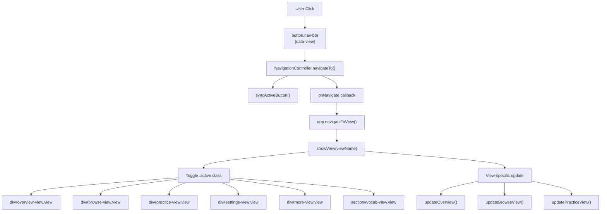
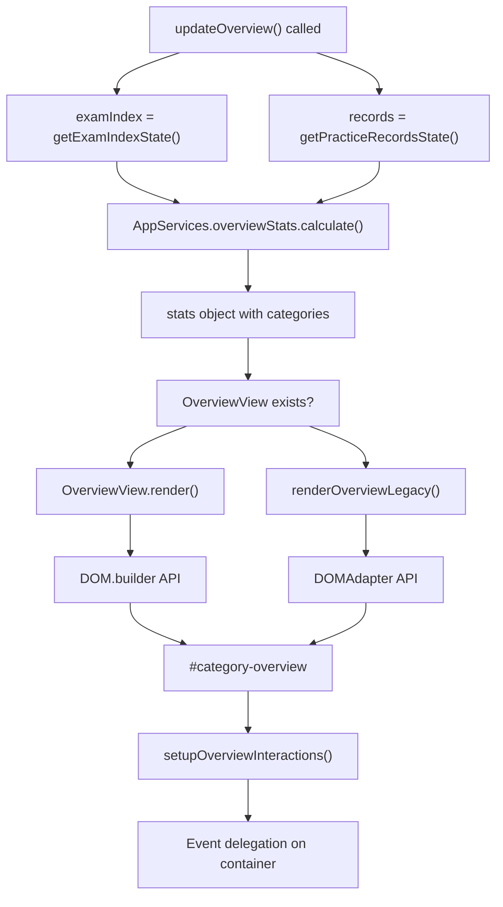
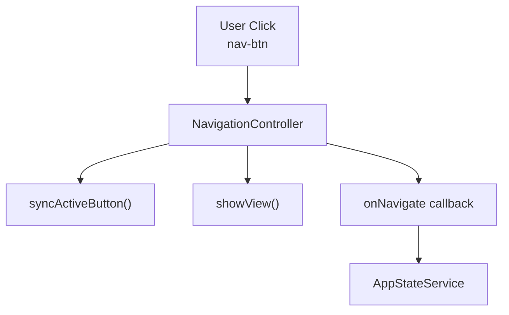
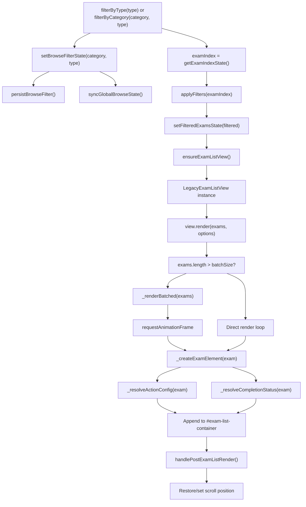
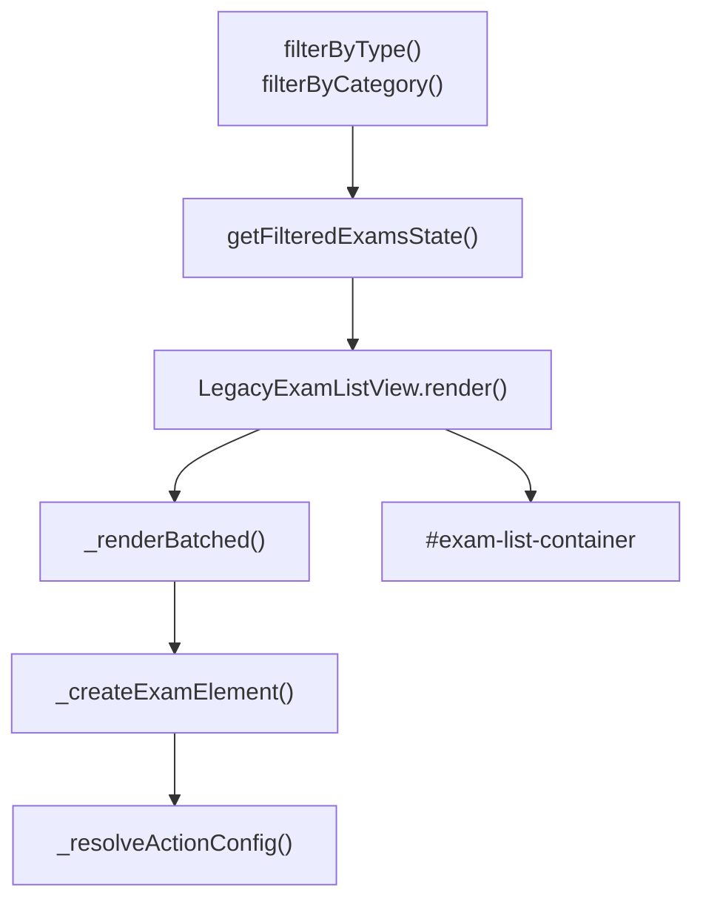
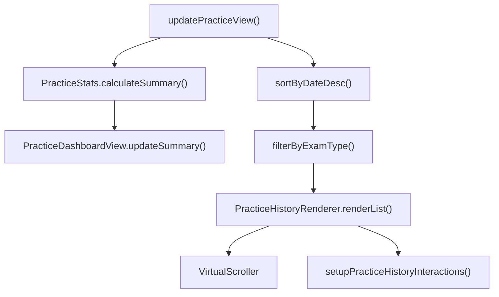
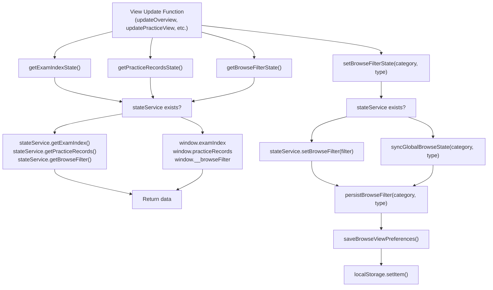
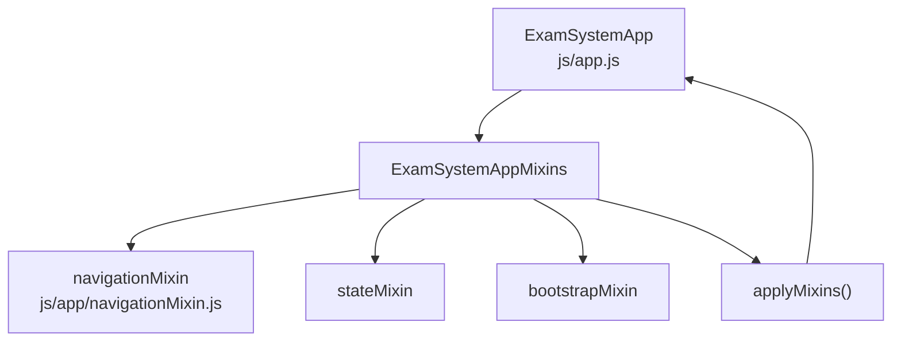
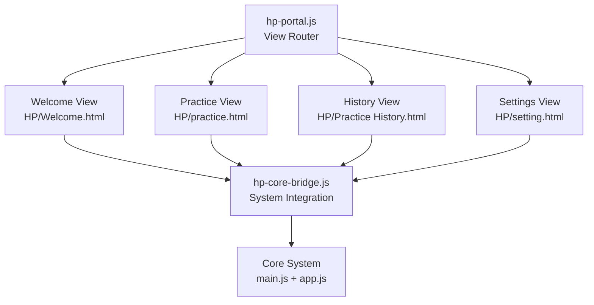
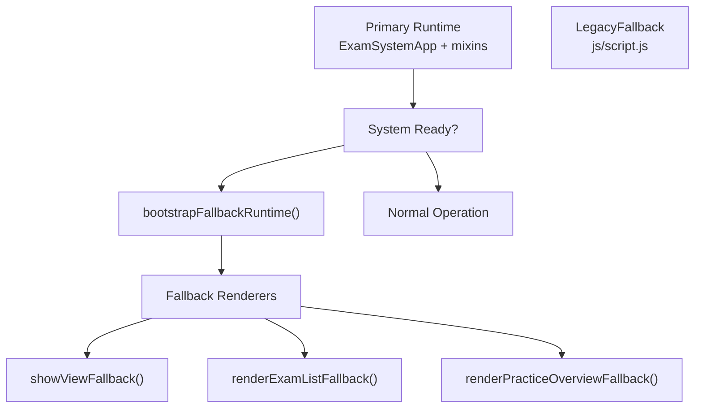

# View Management & Navigation

> **Relevant source files**
> * [css/main.css](https://github.com/sallowayma-git/IELTS-practice/blob/68771116/css/main.css)
> * [index.html](https://github.com/sallowayma-git/IELTS-practice/blob/68771116/index.html)
> * [js/app.js](https://github.com/sallowayma-git/IELTS-practice/blob/68771116/js/app.js)
> * [js/main.js](https://github.com/sallowayma-git/IELTS-practice/blob/68771116/js/main.js)

## Purpose and Scope

This document describes the view management and client-side navigation system used in the IELTS Practice application. It covers the mechanisms for switching between different views (Overview, Browse, Practice, Settings), the navigation controller architecture, view rendering patterns, and integration with the application state system.

For information about application initialization and bootstrapping, see [Application Initialization & Bootstrap](/sallowayma-git/IELTS-practice/3.2-application-initialization-and-lifecycle). For details on state management, see [ExamSystemApp & State Management](/sallowayma-git/IELTS-practice/3.1-examsystemapp-and-state-management). For theme-specific view systems like the Harry Potter portal, see [HP Core Bridge & Plugin Architecture](/sallowayma-git/IELTS-practice/8.2-theme-portals-(academic-melody-bloom)).

---

## View System Architecture

The application uses a single-page application (SPA) pattern with multiple views that are shown/hidden based on user navigation. Views are represented as DOM containers with CSS class toggles rather than full page reloads.

### Core View Structure and Navigation Flow



**View Container Pattern**

Each view is a `<div>` element with:

* Class: `.view`
* ID: `{viewName}-view` (e.g., `overview-view`, `browse-view`)
* Active state: `.view.active` class for the currently displayed view
* CSS: `display: none` when inactive, `display: block` when active [css/main.css L535-L557](https://github.com/sallowayma-git/IELTS-practice/blob/68771116/css/main.css#L535-L557)

The six main view containers defined in [index.html L30-L199](https://github.com/sallowayma-git/IELTS-practice/blob/68771116/index.html#L30-L199)

:

| View ID | Purpose | Key Container Elements |
| --- | --- | --- |
| `#overview-view` | Learning overview with category statistics | `#category-overview` grid container |
| `#browse-view` | Exam library browsing interface | `#exam-list-container`, `#type-filter-buttons` |
| `#practice-view` | Practice history and statistics | `#history-list`, stat cards |
| `#settings-view` | System settings and configuration | System management buttons |
| `#more-view` | Additional tools (clock, vocab) | `.more-tools-grid` with tool cards |
| `#vocab-view` | Vocabulary learning module | `.vocab-view-shell` |

**Navigation Buttons**

Navigation buttons use a data-attribute pattern [index.html L22-L28](https://github.com/sallowayma-git/IELTS-practice/blob/68771116/index.html#L22-L28)

:

* Class: `.nav-btn`
* Attribute: `data-view="{viewName}"`
* Active state: `.nav-btn.active` for the current view's button
* Click handler: `NavigationController` listens for clicks on `[data-view]` buttons

**Sources:** [index.html L22-L28](https://github.com/sallowayma-git/IELTS-practice/blob/68771116/index.html#L22-L28)

 [index.html L30-L199](https://github.com/sallowayma-git/IELTS-practice/blob/68771116/index.html#L30-L199)

 [css/main.css L535-L557](https://github.com/sallowayma-git/IELTS-practice/blob/68771116/css/main.css#L535-L557)

 [js/main.js L1049-L1081](https://github.com/sallowayma-git/IELTS-practice/blob/68771116/js/main.js#L1049-L1081)

 [js/presentation/navigation-controller.js](https://github.com/sallowayma-git/IELTS-practice/blob/68771116/js/presentation/navigation-controller.js)

<old_str>

### Overview View Rendering

The Overview view displays category statistics and entry points for practice.

**Overview Rendering Pipeline**



**Rendering Flow**

[js/main.js L632-L687](https://github.com/sallowayma-git/IELTS-practice/blob/68771116/js/main.js#L632-L687)

 implements the `updateOverview()` function:

1. **Data Retrieval**: Get exam index and practice records via state accessors
2. **Statistics Calculation**: `AppServices.overviewStats.calculate()` computes: * Exam counts per category (P1/P2/P3 reading, P3/P4 listening) * Completion rates and average scores per category * Suite practice availability
3. **Renderer Selection**: Check if `OverviewView` class exists * If available: `OverviewView.render(stats)` with modern `DOM.builder` API * If unavailable: `renderOverviewLegacy(stats)` with `DOMAdapter`
4. **Event Attachment**: `setupOverviewInteractions()` adds delegated event listeners

**Category Card Structure**

Each category card displays:

| Element | Data Source | CSS Class |
| --- | --- | --- |
| Category icon | Hardcoded emoji | `.category-icon` |
| Category title | `stats.categories[].name` | `.category-title` |
| Exam count | `stats.categories[].examCount` | `.category-meta` |
| Completion rate | `stats.categories[].completionRate` | `.category-meta` |
| Average score | `stats.categories[].avgScore` | `.category-meta` |
| Browse button | Action: `browse` | `.btn` with `data-overview-action` |
| Random practice button | Action: `random` | `.btn` with `data-overview-action` |

**Event Delegation**

[js/main.js L814-L877](https://github.com/sallowayma-git/IELTS-practice/blob/68771116/js/main.js#L814-L877)

 implements `setupOverviewInteractions()`:

* Single listener on `#category-overview` container
* Uses `event.target.closest('[data-overview-action]')` to find action elements
* Supported actions via `data-overview-action` attribute: * `suite`: Calls `startSuiteSession()` * `browse`: Calls `browseCategory(category, type)` with `data-category` and `data-type` * `random`: Calls `startRandomPractice(category, type)`

**Suite Practice Card**

The suite practice card is a special overview card that triggers multi-exam practice:

* Displays count of available suite configurations
* Uses `data-overview-action="suite"` to trigger `startSuiteSession()`
* Rendered with distinct styling via CSS class `.suite-practice-card`

**Sources:** [js/main.js L632-L687](https://github.com/sallowayma-git/IELTS-practice/blob/68771116/js/main.js#L632-L687)

 [js/main.js L689-L810](https://github.com/sallowayma-git/IELTS-practice/blob/68771116/js/main.js#L689-L810)

 [js/main.js L814-L877](https://github.com/sallowayma-git/IELTS-practice/blob/68771116/js/main.js#L814-L877)

 [js/services/overviewStats.js](https://github.com/sallowayma-git/IELTS-practice/blob/68771116/js/services/overviewStats.js)

 [js/views/overviewView.js](https://github.com/sallowayma-git/IELTS-practice/blob/68771116/js/views/overviewView.js)

</old_str>

<new_str>

## Navigation Controller

The `NavigationController` manages view switching, button state synchronization, and optional callback execution when navigation occurs.

### NavigationController Initialization and Method Flow

```mermaid
sequenceDiagram
  participant ensureLegacyNavigation()
  participant NavigationController.ensure()
  participant controller instance
  participant click event listener
  participant button[data-view]
  participant app.navigateToView()

  ensureLegacyNavigation()->>NavigationController.ensure(): options object
  NavigationController.ensure()->>NavigationController.ensure(): Check existing instance
  NavigationController.ensure()->>controller instance: Create if needed
  controller instance->>click event listener: Attach to containerSelector
  button[data-view]->>click event listener: User clicks
  click event listener->>controller instance: navigateTo(viewName)
  controller instance->>controller instance: syncActiveButton()
  controller instance->>app.navigateToView(): onNavigate(viewName)
  app.navigateToView()->>app.navigateToView(): showView(viewName)
  note over controller instance,app.navigateToView(): onRepeatNavigate() triggered
```

**Initialization Pattern**

The controller uses a singleton-like pattern with an `ensure()` static method. [js/main.js L1049-L1081](https://github.com/sallowayma-git/IELTS-practice/blob/68771116/js/main.js#L1049-L1081)

 implements `ensureLegacyNavigation()`:

```

```

**Key Methods and Configuration**

| Method/Option | Purpose | Implementation |
| --- | --- | --- |
| `ensure(options)` | Get or create singleton instance | Static method on `NavigationController` class |
| `navigateTo(viewName)` | Switch to specified view | Triggers `onNavigate` callback, syncs buttons |
| `syncActiveButton()` | Update button active states | Adds/removes `activeClass` from buttons |
| `getCurrentView()` | Get current view name | Returns stored `currentView` property |
| `onNavigate(viewName)` | Callback on navigation | Calls `app.navigateToView()` or `window.showView()` |
| `onRepeatNavigate(viewName)` | Callback on repeat click | For browse view, calls `resetBrowseViewToAll()` |
| `containerSelector` | Nav button container | Default: `'.main-nav'` |
| `activeClass` | Active button class | Default: `'active'` |

**Repeat Navigation Handling**

When navigating to the current view (e.g., clicking "Browse" while on Browse), `onRepeatNavigate` is triggered. For the browse view, this resets filters to show all exams via `resetBrowseViewToAll()`.

**Sources:** [js/main.js L1049-L1081](https://github.com/sallowayma-git/IELTS-practice/blob/68771116/js/main.js#L1049-L1081)

 [js/presentation/navigation-controller.js](https://github.com/sallowayma-git/IELTS-practice/blob/68771116/js/presentation/navigation-controller.js)

---

## Navigation Controller

The `NavigationController` manages view switching, button state synchronization, and optional callback execution when navigation occurs.

### NavigationController API



**Initialization Pattern**

The controller uses a singleton-like pattern with an `ensure()` method:

```

```

**Key Methods**

| Method | Purpose | Parameters |
| --- | --- | --- |
| `ensure(options)` | Get or create NavigationController instance | `options`: configuration object |
| `navigateTo(viewName)` | Switch to specified view | `viewName`: 'overview', 'browse', 'practice', or 'settings' |
| `syncActiveButton()` | Update button active states | None |
| `getCurrentView()` | Get current view name | None |

**Legacy Fallback Integration**

[js/main.js L225-L252](https://github.com/sallowayma-git/IELTS-practice/blob/68771116/js/main.js#L225-L252)

 provides a `ensureLegacyNavigation()` function that bridges modern and legacy navigation systems:

* Attempts to use `NavigationController.ensure()` first
* Falls back to `window.ensureLegacyNavigationController()` if needed
* Connects to `window.showView()` for compatibility

**Sources:** [js/main.js L225-L252](https://github.com/sallowayma-git/IELTS-practice/blob/68771116/js/main.js#L225-L252)

 [js/presentation/navigation-controller.js](https://github.com/sallowayma-git/IELTS-practice/blob/68771116/js/presentation/navigation-controller.js)

---

## View Rendering System

Each view has a dedicated rendering strategy and component architecture.

### Browse View Rendering

The Browse view displays filterable exam lists using the `LegacyExamListView` component.

**Browse View Rendering Pipeline**



**LegacyExamListView Architecture**

[js/views/legacyViewBundle.js L389-L638](https://github.com/sallowayma-git/IELTS-practice/blob/68771116/js/views/legacyViewBundle.js#L389-L638)

 defines the `LegacyExamListView` class with these key methods:

| Method | Purpose | Parameters |
| --- | --- | --- |
| `render(exams, options)` | Main render entry point | `exams`: array, `options`: config object |
| `_renderBatched(exams)` | Progressive rendering for large lists | `exams`: array to render |
| `_createExamElement(exam)` | Create single exam item DOM | `exam`: exam object |
| `_resolveActionConfig(exam)` | Determine button configuration | `exam`: exam object |
| `_resolveCompletionStatus(exam)` | Get completion dot color | `exam`: exam object |

**Exam Item Structure**

Each exam item (`div.exam-item`) created by `_createExamElement()` [js/views/legacyViewBundle.js L469-L532](https://github.com/sallowayma-git/IELTS-practice/blob/68771116/js/views/legacyViewBundle.js#L469-L532)

:

1. **Completion Dot**: `span.practice-dot` with color based on recent performance: * Green (`--excellent`): score ≥ 90% * Orange (`--strong`): score ≥ 75% * Orange (`--average`): score ≥ 60% * Red (`--weak`): score < 60% * Gray (default): no recent practice
2. **Exam Info Section**: `div.exam-info` * `h4`: Exam title * `div.exam-meta`: Formatted metadata via `formatExamMetaText(exam)`
3. **Action Buttons**: `div.exam-actions` with dynamic buttons: * If `exam.hasHtml === true`: "开始练习" button calls `startExam(examId)` * If `exam.path` ends with `.pdf`: "查看PDF" button calls `viewPDF(exam.path)` * Optional: "生成HTML" button if PDF-only exam

**Batch Rendering Strategy**

[js/views/legacyViewBundle.js L443-L467](https://github.com/sallowayma-git/IELTS-practice/blob/68771116/js/views/legacyViewBundle.js#L443-L467)

 implements progressive rendering:

```

```

**Filter State Management**

Filter changes flow through:

1. `filterByType(type)` or `filterByCategory(category, type)` called
2. `setBrowseFilterState(category, type)` updates filter state
3. `persistBrowseFilter()` saves to localStorage via `saveBrowseViewPreferences()`
4. `syncGlobalBrowseState()` updates `window.__browseFilter` for legacy code
5. Filter applied to exam index to compute filtered list
6. `setFilteredExamsState(filtered)` stores result
7. View re-rendered with filtered exams

**Post-Render Scroll Management**

[js/main.js L883-L944](https://github.com/sallowayma-git/IELTS-practice/blob/68771116/js/main.js#L883-L944)

 implements `handlePostExamListRender()` to manage scroll position:

* Restores saved scroll position for category/type combination
* Auto-scrolls to last practiced exam if enabled
* Uses `getBrowseListAnchor()` to find target exam

**Sources:** [js/views/legacyViewBundle.js L389-L638](https://github.com/sallowayma-git/IELTS-practice/blob/68771116/js/views/legacyViewBundle.js#L389-L638)

 [js/main.js L196-L236](https://github.com/sallowayma-git/IELTS-practice/blob/68771116/js/main.js#L196-L236)

 [js/main.js L883-L944](https://github.com/sallowayma-git/IELTS-practice/blob/68771116/js/main.js#L883-L944)

 [js/main.js L303-L534](https://github.com/sallowayma-git/IELTS-practice/blob/68771116/js/main.js#L303-L534)

---

### Browse View Rendering

The Browse view displays filterable exam lists using the `LegacyExamListView` component.



**LegacyExamListView Architecture**

The view renderer supports:

* **Batch Rendering**: Large lists rendered in chunks via `requestAnimationFrame`
* **Completion Indicators**: Colored dots show recent practice performance
* **Action Buttons**: Dynamic button configuration based on exam availability
* **Empty States**: Configurable empty state messages with actions

**Exam Item Structure**

Each exam item displays:

* **Completion Dot**: Color-coded performance indicator (green/orange/red)
* **Title and Metadata**: Category and type information
* **Action Buttons**: "开始练习" (Start Practice) or "查看PDF" (View PDF)
* **Optional Generate Button**: For PDF-only exams

[js/views/legacyViewBundle.js L469-L532](https://github.com/sallowayma-git/IELTS-practice/blob/68771116/js/views/legacyViewBundle.js#L469-L532)

 creates exam elements with:

1. Completion status lookup from practice records
2. Dynamic button configuration based on `hasHtml` property
3. Optional PDF and HTML generation buttons

**Batch Rendering Strategy**

For lists exceeding `batchSize` (default: 20), [js/views/legacyViewBundle.js L443-L467](https://github.com/sallowayma-git/IELTS-practice/blob/68771116/js/views/legacyViewBundle.js#L443-L467)

 uses progressive rendering:

```

```

**Sources:** [js/views/legacyViewBundle.js L389-L638](https://github.com/sallowayma-git/IELTS-practice/blob/68771116/js/views/legacyViewBundle.js#L389-L638)

 [js/main.js L206-L223](https://github.com/sallowayma-git/IELTS-practice/blob/68771116/js/main.js#L206-L223)

---

### Practice View Rendering

The Practice view displays practice statistics and history records using multiple components.



**PracticeDashboardView**

[js/views/legacyViewBundle.js L116-L163](https://github.com/sallowayma-git/IELTS-practice/blob/68771116/js/views/legacyViewBundle.js#L116-L163)

 renders four stat cards:

* **Total Practiced**: Count of completed exams
* **Average Score**: Percentage with 1 decimal place
* **Study Time**: Total minutes converted from seconds
* **Streak Days**: Consecutive practice days calculated from date keys

**PracticeHistoryRenderer**

[js/views/legacyViewBundle.js L255-L386](https://github.com/sallowayma-git/IELTS-practice/blob/68771116/js/views/legacyViewBundle.js#L255-L386)

 creates individual record nodes with:

* **Selection Checkbox**: Displayed in bulk delete mode
* **Record Info**: Title, date, duration with color-coded indicators
* **Percentage Display**: Color-coded score (green > 90%, orange > 75%, red < 60%)
* **Delete Button**: Hidden in bulk delete mode

**Virtual Scrolling Integration**

When available, `VirtualScroller` is used for large record lists:

```

```

**Event Delegation**

[js/main.js L954-L1010](https://github.com/sallowayma-git/IELTS-practice/blob/68771116/js/main.js#L954-L1010)

 sets up delegated event handlers for:

* `data-record-action="details"` - Show record modal
* `data-record-action="delete"` - Delete individual record
* Checkbox click - Toggle record selection in bulk mode

**Sources:** [js/views/legacyViewBundle.js L6-L163](https://github.com/sallowayma-git/IELTS-practice/blob/68771116/js/views/legacyViewBundle.js#L6-L163)

 [js/views/legacyViewBundle.js L255-L386](https://github.com/sallowayma-git/IELTS-practice/blob/68771116/js/views/legacyViewBundle.js#L255-L386)

 [js/main.js L954-L1010](https://github.com/sallowayma-git/IELTS-practice/blob/68771116/js/main.js#L954-L1010)

---

### Settings View Rendering

The Settings view provides system management controls without dynamic rendering. Buttons are statically defined in HTML and connected to handler functions via event listeners.

**Button Categories**

| Category | Buttons | Handler Pattern |
| --- | --- | --- |
| System Management | Clear Cache, Load Library, Library Config, Force Refresh | Direct function calls in `main.js` |
| Data Management | Create Backup, Backup List, Export Data, Import Data | `DataIntegrityManager` methods |
| Theme Switching | Theme Switcher Modal | `theme-switcher.js` modal system |

**Sources:** [index.html L111-L163](https://github.com/sallowayma-git/IELTS-practice/blob/68771116/index.html#L111-L163)

---

## State Management Integration

View navigation integrates with the centralized state management system through state accessor functions that bridge modern and legacy approaches.

### State Service Bridge Architecture



**State Service Initialization**

[js/main.js L48-L59](https://github.com/sallowayma-git/IELTS-practice/blob/68771116/js/main.js#L48-L59)

 resolves the state service:

```

```

**State Accessor Functions**

[js/main.js L65-L298](https://github.com/sallowayma-git/IELTS-practice/blob/68771116/js/main.js#L65-L298)

 provides state accessor functions with dual-path support:

| Function | Modern Path | Legacy Fallback | Return Type |
| --- | --- | --- | --- |
| `getExamIndexState()` | `stateService.getExamIndex()` | `window.examIndex` | Array of exam objects |
| `setExamIndexState(list)` | `stateService.setExamIndex(normalized)` | `window.examIndex = normalized` | Normalized array |
| `getPracticeRecordsState()` | `stateService.getPracticeRecords()` | `window.practiceRecords` | Array of record objects |
| `setPracticeRecordsState(records)` | `stateService.setPracticeRecords(enriched)` | `window.practiceRecords = normalized` | Enriched array |
| `getBrowseFilterState()` | `stateService.getBrowseFilter()` | `window.__browseFilter` | `{ category, type }` |
| `setBrowseFilterState(cat, type)` | `stateService.setBrowseFilter(normalized)` | `syncGlobalBrowseState()` | Normalized filter |
| `getFilteredExamsState()` | `stateService.getFilteredExams()` | `localFallbackState.filteredExams` | Array of exam objects |
| `setFilteredExamsState(exams)` | `stateService.setFilteredExams(exams)` | `localFallbackState.filteredExams` | Array copy |
| `getBulkDeleteModeState()` | `stateService.getBulkDeleteMode()` | `localFallbackState.bulkDeleteMode` | Boolean |
| `setBulkDeleteModeState(value)` | `stateService.setBulkDeleteMode(value)` | `localFallbackState.bulkDeleteMode` | Boolean |
| `getSelectedRecordsState()` | `stateService.getSelectedRecords()` | `localFallbackState.selectedRecords` | Set of record IDs |

**ExamSystemApp State Object**

[js/app.js L13-L56](https://github.com/sallowayma-git/IELTS-practice/blob/68771116/js/app.js#L13-L56)

 defines the internal state structure:

```

```

**Global State Synchronization**

[js/main.js L28-L40](https://github.com/sallowayma-git/IELTS-practice/blob/68771116/js/main.js#L28-L40)

 implements `syncGlobalBrowseState()` to maintain backward compatibility:

```

```

**Sources:** [js/main.js L28-L298](https://github.com/sallowayma-git/IELTS-practice/blob/68771116/js/main.js#L28-L298)

 [js/app.js L13-L56](https://github.com/sallowayma-git/IELTS-practice/blob/68771116/js/app.js#L13-L56)

 [js/app/state-service.js](https://github.com/sallowayma-git/IELTS-practice/blob/68771116/js/app/state-service.js)

---

## Navigation Mixin Pattern

The `navigationMixin` extends `ExamSystemApp` with navigation-related methods.

### Mixin Architecture



The mixin pattern is applied during initialization [js/app.js L64-L81](https://github.com/sallowayma-git/IELTS-practice/blob/68771116/js/app.js#L64-L81)

:

```

```

**Navigation Mixin Methods**

Key methods provided by the navigation mixin include:

* `navigateToView(viewName)` - Switch views and update state
* `getCurrentView()` - Get active view name
* `showView(viewName)` - Display specific view
* `updateBrowseView()` - Refresh browse view content
* `updatePracticeView()` - Refresh practice view content

**Sources:** [js/app.js L64-L81](https://github.com/sallowayma-git/IELTS-practice/blob/68771116/js/app.js#L64-L81)

 [js/app/navigationMixin.js](https://github.com/sallowayma-git/IELTS-practice/blob/68771116/js/app/navigationMixin.js)

---

## View Lifecycle and Data Flow

Views follow a consistent lifecycle pattern when activated, with different triggers for updates based on data changes.

### View Activation Flow

```mermaid
sequenceDiagram
  participant User
  participant button.nav-btn[data-view]
  participant NavigationController
  participant app.navigateToView()
  participant showView(viewName)
  participant DOM: div.view elements
  participant View Update Function
  participant State Accessor Functions
  participant View Renderer Component

  User->>button.nav-btn[data-view]: Click
  button.nav-btn[data-view]->>NavigationController: Event bubbles to listener
  NavigationController->>NavigationController: Extract data-view attribute
  NavigationController->>NavigationController: syncActiveButton()
  NavigationController->>app.navigateToView(): onNavigate callback
  app.navigateToView()->>showView(viewName): Call showView
  showView(viewName)->>DOM: div.view elements: Remove .active from all
  showView(viewName)->>DOM: div.view elements: Add .active to target view
  showView(viewName)->>View Update Function: Call view-specific update
  View Update Function->>State Accessor Functions: getExamIndexState(), etc.
  State Accessor Functions-->>View Update Function: Return data
  View Update Function->>View Renderer Component: Pass data to renderer
  View Renderer Component->>DOM: div.view elements: Append/update child elements
  DOM: div.view elements->>User: Display updated view
```

**showView() Implementation**

[js/app/navigationMixin.js](https://github.com/sallowayma-git/IELTS-practice/blob/68771116/js/app/navigationMixin.js)

 provides the view switching logic (referenced in [js/main.js L1049-L1081](https://github.com/sallowayma-git/IELTS-practice/blob/68771116/js/main.js#L1049-L1081)

):

```

```

**View Update Triggers and Event Flow**

| Trigger Event | Affected Views | Update Function | Event Source |
| --- | --- | --- | --- |
| `examIndexLoaded` | Overview, Browse | `updateOverview()`, `loadExamList()` | `loadLibrary()` after exam data loaded |
| `storage-sync` | Practice | `syncPracticeRecords()` | `setupStorageSyncListener()` on storage events |
| `PRACTICE_COMPLETE` | Practice, Overview | `syncPracticeRecords()`, `updateOverview()` | `handleSessionCompleted()` postMessage handler |
| Navigation click | Current view | View-specific update | `NavigationController` navigation |
| `onRepeatNavigate` | Browse | `resetBrowseViewToAll()` | Clicking current nav button |

**Exam Index Loading Pattern**

[js/main.js L1146-L1150](https://github.com/sallowayma-git/IELTS-practice/blob/68771116/js/main.js#L1146-L1150)

 implements the initialization flow:

```

```

**loadLibrary() Data Flow**

The library loading pattern follows these steps:

1. **Check Cache**: `storage.get('exam_index')` to retrieve cached index
2. **Validate Cache**: Check if cache is recent and complete
3. **Build from Source** (if cache invalid): * Read `window.completeExamIndex` from [assets/scripts/complete-exam-data.js](https://github.com/sallowayma-git/IELTS-practice/blob/68771116/assets/scripts/complete-exam-data.js) * Read `window.listeningExamIndex` from [assets/scripts/listening-exam-data.js](https://github.com/sallowayma-git/IELTS-practice/blob/68771116/assets/scripts/listening-exam-data.js) * Merge arrays with sequence numbering via `assignExamSequenceNumbers()`
4. **Persist to Cache**: `storage.set('exam_index', index)`
5. **Update State**: `setExamIndexState(index)`
6. **Dispatch Event**: Fire `examIndexLoaded` custom event
7. **Update Views**: Event listeners trigger `updateOverview()` and initial browse list render

**Practice Records Sync Pattern**

[js/main.js L1168-L1270](https://github.com/sallowayma-git/IELTS-practice/blob/68771116/js/main.js#L1168-L1270)

 implements `syncPracticeRecords()`:

1. **Retrieve Records**: * Primary path: `practiceRecorder.getPracticeRecords()` * Fallback path: `storage.get('practice_records')`
2. **Normalize Data**: Ensure `accuracy`, `percentage`, `duration` fields are present
3. **Update State**: `setPracticeRecordsState(records)`
4. **Trigger UI Update**: `updatePracticeView()`

**Cross-Window Message Handling**

[js/main.js](https://github.com/sallowayma-git/IELTS-practice/blob/68771116/js/main.js)

 implements `setupMessageListener()` to handle practice completion:

```

```

**Sources:** [js/main.js L1084-L1150](https://github.com/sallowayma-git/IELTS-practice/blob/68771116/js/main.js#L1084-L1150)

 [js/main.js L1168-L1270](https://github.com/sallowayma-git/IELTS-practice/blob/68771116/js/main.js#L1168-L1270)

 [js/app/navigationMixin.js](https://github.com/sallowayma-git/IELTS-practice/blob/68771116/js/app/navigationMixin.js)

 [js/main.js L1049-L1081](https://github.com/sallowayma-git/IELTS-practice/blob/68771116/js/main.js#L1049-L1081)

---

## Theme Portal View Systems

Theme portals like the Harry Potter theme implement alternative view systems that coexist with the main application.

### HP Portal View Architecture



**HP View Plugins**

Each HP view has dedicated plugin files:

* `hp-welcome-ui.js` - Category selection modal and statistics
* `hp-practice-render.js` - Exam card grid rendering
* `hp-history-table.js` - Virtual scrolling table and trend visualization
* `hp-settings-bridge.js` - System function connections

**HP Navigation Pattern**

Unlike the main app's class-toggle pattern, HP portal uses separate HTML files with `<a>` tag navigation:

```

```

**Core Bridge Integration**

`hp-core-bridge.js` provides:

* `hpCore.ready(callback)` - Wait for system initialization
* `hpCore.getExamIndex()` - Access exam data
* `hpCore.getRecords()` - Access practice records
* Event listeners for `examIndexLoaded` and `PRACTICE_COMPLETE`

**Sources:** [assets/developer L1-L222](https://github.com/sallowayma-git/IELTS-practice/blob/68771116/assets/developer wiki/hp-overview-usage-todo.md#L1-L222)

 [js/plugins/hp/hp-portal.js](https://github.com/sallowayma-git/IELTS-practice/blob/68771116/js/plugins/hp/hp-portal.js)

 [js/plugins/hp/hp-core-bridge.js](https://github.com/sallowayma-git/IELTS-practice/blob/68771116/js/plugins/hp/hp-core-bridge.js)

---

## Legacy Fallback System

The application includes a comprehensive fallback system for degraded environments.

### Fallback Architecture



**Fallback Activation**

[js/script.js L107-L136](https://github.com/sallowayma-git/IELTS-practice/blob/68771116/js/script.js#L107-L136)

 implements the bootstrap logic:

1. Check if primary runtime functions exist (`loadExamList`, `updatePracticeView`)
2. If available, run smoke test and exit
3. If unavailable, activate fallback renderers
4. Show warning message about degraded mode

**Fallback Renderers**

| Function | Purpose | Implementation |
| --- | --- | --- |
| `showViewFallback()` | Toggle view visibility | Direct class manipulation |
| `renderExamListFallback()` | Display exam list | Simple button list |
| `renderPracticeOverviewFallback()` | Show statistics | Basic stat calculation |

**Smoke Check System**

[js/script.js L91-L105](https://github.com/sallowayma-git/IELTS-practice/blob/68771116/js/script.js#L91-L105)

 runs diagnostic checks:

* Detects which mode is active (primary/fallback/no-service)
* Records timestamp and component availability
* Stores report in `window.__legacySmokeReport`
* Logs exam count and record count

**Sources:** [js/script.js L1-L148](https://github.com/sallowayma-git/IELTS-practice/blob/68771116/js/script.js#L1-L148)

 [js/boot-fallbacks.js](https://github.com/sallowayma-git/IELTS-practice/blob/68771116/js/boot-fallbacks.js)

---

## Summary

The view management system uses a layered architecture:

1. **Navigation Controller**: Manages view switching and button synchronization
2. **View Renderers**: Specialized components for each view type
3. **State Integration**: Bridges modern state service with legacy globals
4. **Mixin Pattern**: Extends core app with navigation capabilities
5. **Event System**: Coordinates updates across views
6. **Fallback System**: Ensures basic functionality in degraded environments
7. **Theme Portals**: Alternative view systems for themed experiences

This architecture supports progressive refactoring by maintaining compatibility between modern component-based design and legacy global state patterns.

**Sources:** [js/main.js L1-L2151](https://github.com/sallowayma-git/IELTS-practice/blob/68771116/js/main.js#L1-L2151)

 [js/app.js L1-L121](https://github.com/sallowayma-git/IELTS-practice/blob/68771116/js/app.js#L1-L121)

 [js/views/legacyViewBundle.js L1-L1043](https://github.com/sallowayma-git/IELTS-practice/blob/68771116/js/views/legacyViewBundle.js#L1-L1043)

 [js/presentation/navigation-controller.js](https://github.com/sallowayma-git/IELTS-practice/blob/68771116/js/presentation/navigation-controller.js)

 [js/app/navigationMixin.js](https://github.com/sallowayma-git/IELTS-practice/blob/68771116/js/app/navigationMixin.js)

 [index.html L1-L408](https://github.com/sallowayma-git/IELTS-practice/blob/68771116/index.html#L1-L408)