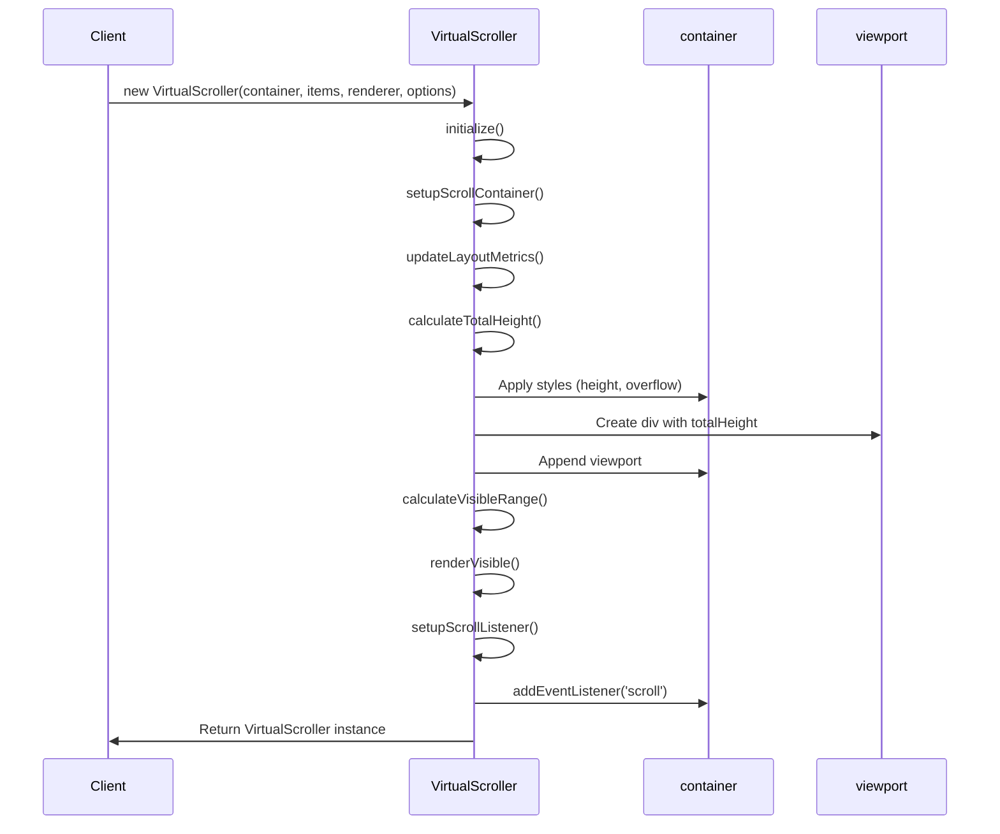
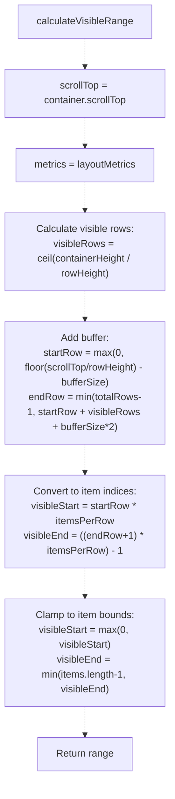
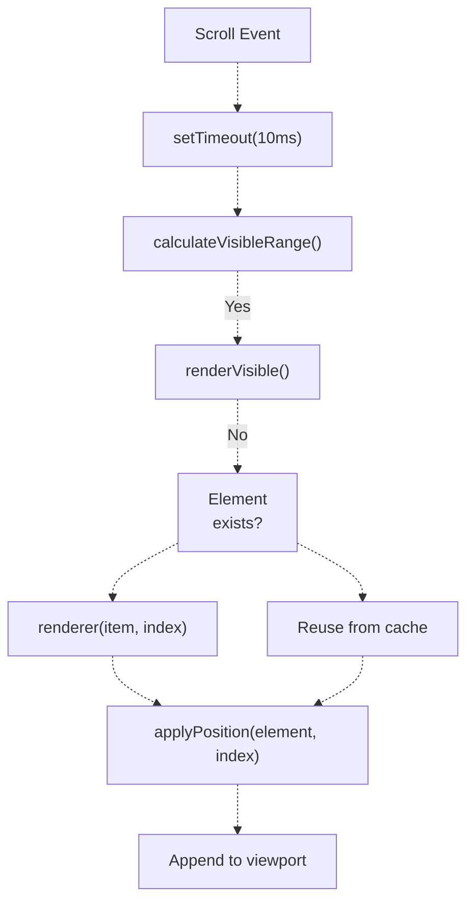
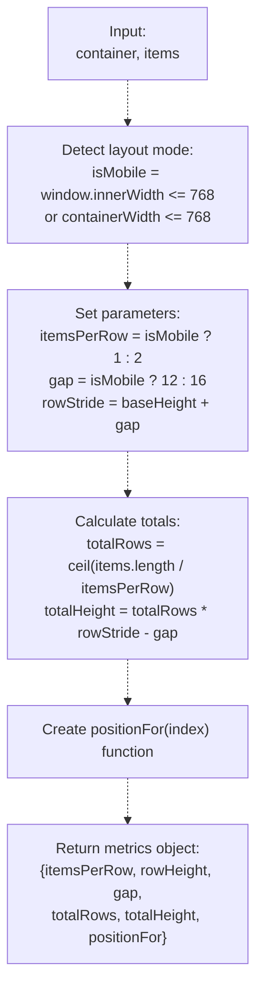
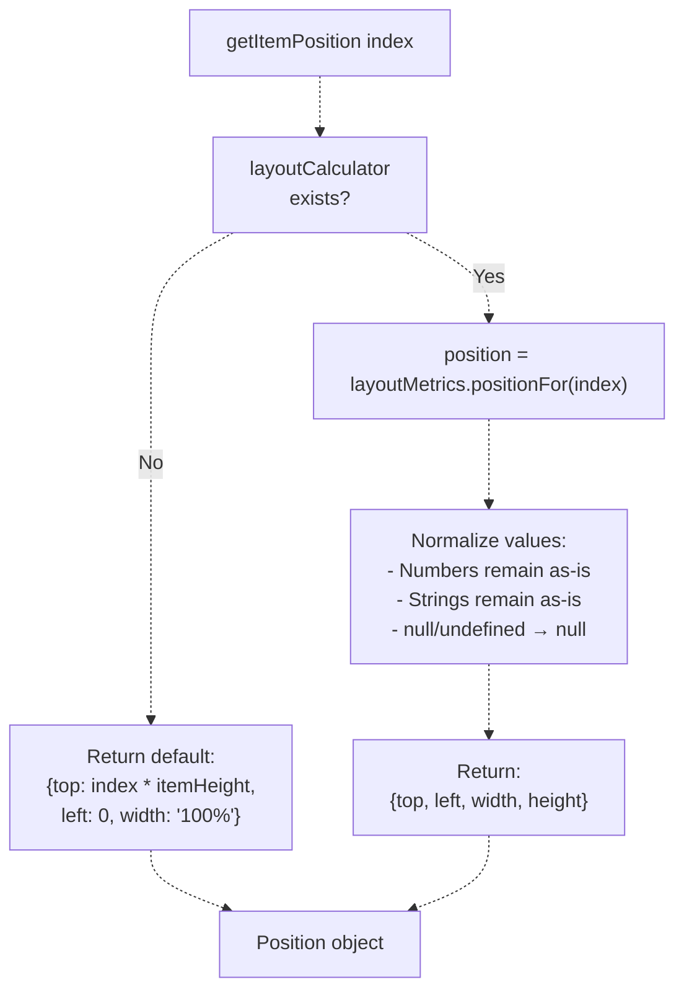
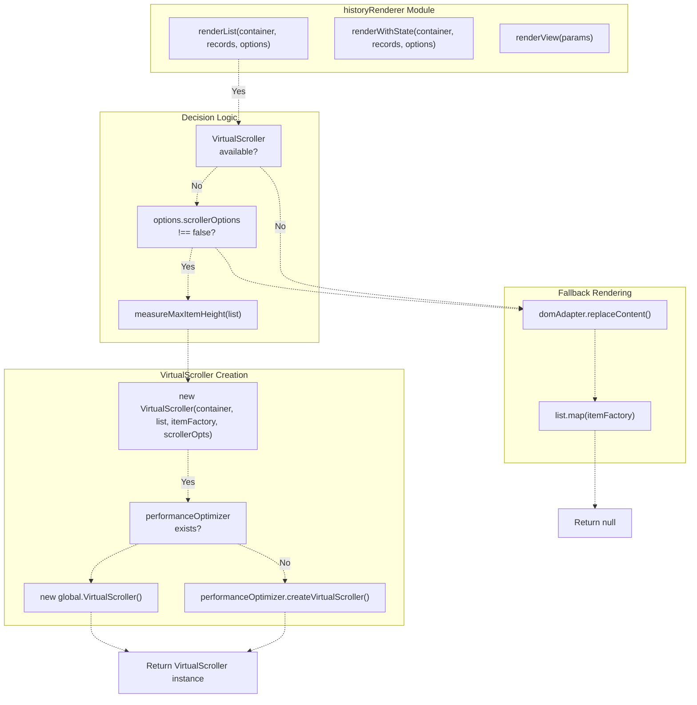
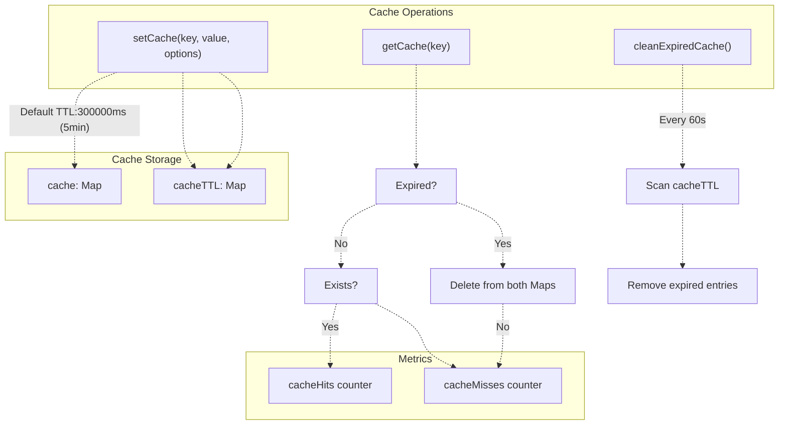
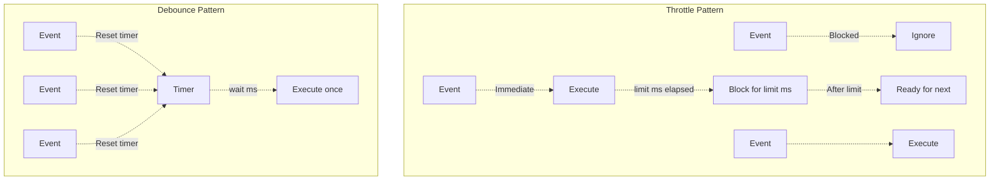
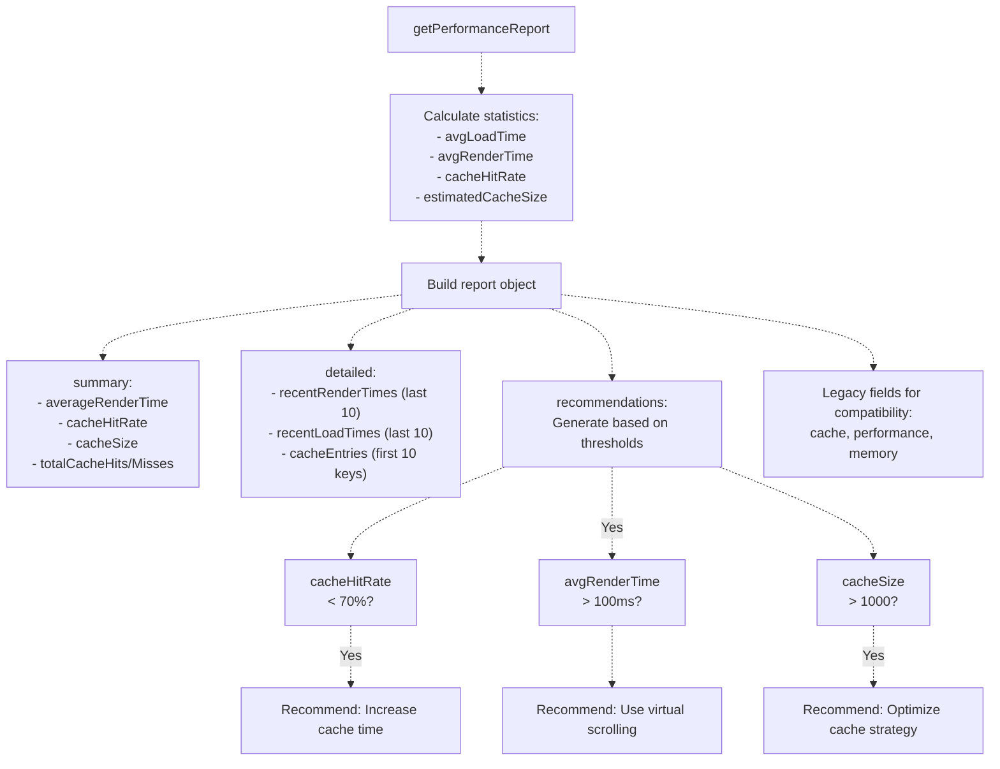

# Virtual Scrolling & Large List Optimization

> **Relevant source files**
> * [assets/scripts/complete-exam-data.js](https://github.com/sallowayma-git/IELTS-practice/blob/92f64eb8/assets/scripts/complete-exam-data.js)
> * [assets/scripts/listening-exam-data.js](https://github.com/sallowayma-git/IELTS-practice/blob/92f64eb8/assets/scripts/listening-exam-data.js)
> * [js/components/PerformanceOptimizer.js](https://github.com/sallowayma-git/IELTS-practice/blob/92f64eb8/js/components/PerformanceOptimizer.js)
> * [js/views/legacyViewBundle.js](https://github.com/sallowayma-git/IELTS-practice/blob/92f64eb8/js/views/legacyViewBundle.js)

## Purpose and Scope

This page documents the virtual scrolling and performance optimization systems used throughout the IELTS practice application to efficiently render large lists of practice records, exam entries, and other data-intensive UI components. The system provides high-performance rendering through viewport-based item virtualization, flexible layout calculations, and comprehensive caching mechanisms.

For information about the DOM utilities that support efficient element creation, see [DOM Utilities & Event Delegation](/sallowayma-git/IELTS-practice/10.3-dom-utilities-and-event-delegation). For details on the practice history UI that extensively uses virtual scrolling, see [Practice History & Record Views](/sallowayma-git/IELTS-practice/9.2-practice-history-and-record-views).

**Sources:** [js/components/PerformanceOptimizer.js L1-L710](https://github.com/sallowayma-git/IELTS-practice/blob/92f64eb8/js/components/PerformanceOptimizer.js#L1-L710)

 [js/views/legacyViewBundle.js L289-L736](https://github.com/sallowayma-git/IELTS-practice/blob/92f64eb8/js/views/legacyViewBundle.js#L289-L736)

---

## VirtualScroller Architecture

The `VirtualScroller` class implements viewport-based rendering, displaying only the items currently visible in the scrollable area plus a configurable buffer. This dramatically reduces DOM node count and improves rendering performance for lists with hundreds or thousands of items.

### Core Components

| Component | Type | Purpose |
| --- | --- | --- |
| `container` | HTMLElement | Scrollable container element |
| `viewport` | HTMLElement | Virtual content area with full height |
| `items` | Array | Complete data array |
| `renderer` | Function | Item-to-DOM conversion function |
| `renderedItems` | Map | Cache of currently rendered elements |
| `layoutCalculator` | Function | Optional layout metrics calculator |

**Sources:** [js/components/PerformanceOptimizer.js L5-L28](https://github.com/sallowayma-git/IELTS-practice/blob/92f64eb8/js/components/PerformanceOptimizer.js#L5-L28)

### Initialization Flow



**Sources:** [js/components/PerformanceOptimizer.js L29-L171](https://github.com/sallowayma-git/IELTS-practice/blob/92f64eb8/js/components/PerformanceOptimizer.js#L29-L171)

### Visible Range Calculation

The scroller calculates which items should be rendered based on scroll position, container height, and buffer size:



**Sources:** [js/components/PerformanceOptimizer.js L75-L94](https://github.com/sallowayma-git/IELTS-practice/blob/92f64eb8/js/components/PerformanceOptimizer.js#L75-L94)

### Rendering Process

The `renderVisible()` method manages the DOM nodes, adding new visible items and removing items that have scrolled out of view:

**Element Lifecycle:**

1. Check if item index is in `renderedItems` Map
2. If not cached, call `renderer(item, index)` to create DOM node
3. Store in `renderedItems` Map
4. Apply absolute positioning via `getItemPosition(index)`
5. Append to `viewport` if not already attached
6. Remove elements with indices outside `[visibleStart, visibleEnd]`

**Sources:** [js/components/PerformanceOptimizer.js L96-L147](https://github.com/sallowayma-git/IELTS-practice/blob/92f64eb8/js/components/PerformanceOptimizer.js#L96-L147)

### Scroll Performance Optimization



The scroll listener uses a 10ms timeout to batch rapid scroll events, improving performance during fast scrolling.

**Sources:** [js/components/PerformanceOptimizer.js L152-L171](https://github.com/sallowayma-git/IELTS-practice/blob/92f64eb8/js/components/PerformanceOptimizer.js#L152-L171)

---

## Layout Calculation System

The virtual scroller supports flexible layouts through the optional `layoutCalculator` function, enabling grid layouts (desktop: 2 columns, mobile: 1 column) in addition to simple list mode.

### Grid Layout Calculator

The `createGridLayoutCalculator` helper in `historyRenderer.helpers` generates a layout calculator optimized for practice history cards:



**Positioning Logic:**

* **Single column (mobile):** `top = row * rowStride`, `left = 0`, `width = 100%`
* **Two columns (desktop):** * Column 0: `left = 0`, `width = calc(50% - gap/2)` * Column 1: `left = calc(50% + gap/2)`, `width = calc(50% - gap/2)`

**Sources:** [js/views/legacyViewBundle.js L319-L367](https://github.com/sallowayma-git/IELTS-practice/blob/92f64eb8/js/views/legacyViewBundle.js#L319-L367)

### Position Calculation

The `getItemPosition()` method delegates to the `layoutCalculator` if provided:



**Sources:** [js/components/PerformanceOptimizer.js L249-L271](https://github.com/sallowayma-git/IELTS-practice/blob/92f64eb8/js/components/PerformanceOptimizer.js#L249-L271)

### Layout Metrics Update

The `updateLayoutMetrics()` method recalculates layout when the scroller is initialized or window resizes:

**Sources:** [js/components/PerformanceOptimizer.js L273-L304](https://github.com/sallowayma-git/IELTS-practice/blob/92f64eb8/js/components/PerformanceOptimizer.js#L273-L304)

---

## Integration with Practice History

The practice history view demonstrates complete integration of virtual scrolling with the UI layer.

### HistoryRenderer Integration



**Sources:** [js/views/legacyViewBundle.js L537-L630](https://github.com/sallowayma-git/IELTS-practice/blob/92f64eb8/js/views/legacyViewBundle.js#L537-L630)

### Height Measurement

Before creating the virtual scroller, `measureMaxItemHeight()` samples up to 30 items to determine the actual rendered height, accounting for dynamic content:

```javascript
// Pseudo-code representation
function measureMaxItemHeight(list) {
    wrapper = create hidden div
    maxHeight = 0
    samples = min(list.length, 30)
    
    for i in 0..samples:
        node = itemFactory(list[i], i)
        wrapper.appendChild(node)
        height = node.offsetHeight
        maxHeight = max(maxHeight, height)
        node.remove()
    
    wrapper.remove()
    return maxHeight + 8  // Safety margin
}
```

This ensures proper spacing even when content varies (long titles, metadata, etc.).

**Sources:** [js/views/legacyViewBundle.js L552-L591](https://github.com/sallowayma-git/IELTS-practice/blob/92f64eb8/js/views/legacyViewBundle.js#L552-L591)

### Item Factory Pattern

The `historyRenderer.createRecordNode()` serves as the item factory, creating each practice record card with appropriate structure and event handlers:

**Record Card Structure:**

* Selection checkbox (in bulk delete mode)
* Record info section with title link and metadata
* Percentage display with color coding
* Delete button (when not in bulk delete mode)

**Sources:** [js/views/legacyViewBundle.js L430-L527](https://github.com/sallowayma-git/IELTS-practice/blob/92f64eb8/js/views/legacyViewBundle.js#L430-L527)

### Scroller Reuse

The renderer supports updating an existing scroller instance rather than recreating it:

```
if (options.scroller && typeof options.scroller.updateItems === 'function') {
    options.scroller.renderer = itemFactory;
    options.scroller.layoutCalculator = scrollerOpts.layoutCalculator;
    options.scroller.updateItems(list);
    if (typeof options.scroller.recalculate === 'function') {
        options.scroller.recalculate();
    }
    return options.scroller;
}
```

This preserves scroll position and avoids unnecessary re-initialization when filter or data changes.

**Sources:** [js/views/legacyViewBundle.js L610-L618](https://github.com/sallowayma-git/IELTS-practice/blob/92f64eb8/js/views/legacyViewBundle.js#L610-L618)

---

## PerformanceOptimizer Features

The `PerformanceOptimizer` class provides a suite of performance enhancement utilities beyond virtual scrolling.

### Cache Management



**Cache Configuration:**

* Default TTL: 5 minutes (300000ms)
* Automatic cleanup: Every 60 seconds
* Custom TTL per item via `options.ttl`

**Sources:** [js/components/PerformanceOptimizer.js L351-L404](https://github.com/sallowayma-git/IELTS-practice/blob/92f64eb8/js/components/PerformanceOptimizer.js#L351-L404)

### Batch Processing

For operations on large datasets, `batchProcess()` splits work into chunks with delays to prevent UI blocking:

**Parameters:**

* `items`: Array to process
* `processor`: Function to apply to each item
* `batchSize`: Items per batch (default: 10)
* `delay`: Milliseconds between batches (default: 5)

**Returns:** Promise resolving to results array

**Sources:** [js/components/PerformanceOptimizer.js L408-L433](https://github.com/sallowayma-git/IELTS-practice/blob/92f64eb8/js/components/PerformanceOptimizer.js#L408-L433)

### Debounce and Throttle



**Use Cases:**

* **Debounce:** Search input, window resize, filter changes
* **Throttle:** Scroll events, mouse movement tracking

**Sources:** [js/components/PerformanceOptimizer.js L436-L462](https://github.com/sallowayma-git/IELTS-practice/blob/92f64eb8/js/components/PerformanceOptimizer.js#L436-L462)

### Render Optimization

The `optimizeRender()` wrapper schedules render operations using `requestAnimationFrame` and tracks performance:

```javascript
optimizeRender(renderFunc) {
    return (...args) => {
        const startTime = performance.now();
        requestAnimationFrame(() => {
            renderFunc(...args);
            const renderTime = performance.now() - startTime;
            this.performanceMetrics.renderTime.push(renderTime);
            // Keep last 100 samples
        });
    };
}
```

**Sources:** [js/components/PerformanceOptimizer.js L489-L509](https://github.com/sallowayma-git/IELTS-practice/blob/92f64eb8/js/components/PerformanceOptimizer.js#L489-L509)

---

## Performance Monitoring

The `PerformanceOptimizer` tracks multiple metrics and generates reports with actionable recommendations.

### Metrics Tracked

| Metric | Type | Purpose |
| --- | --- | --- |
| `renderTime` | Array | Individual render durations |
| `loadTime` | Array | Resource loading times |
| `scrollPerformance` | Array | Scroll event handling times |
| `cacheHits` | Number | Successful cache retrievals |
| `cacheMisses` | Number | Cache misses |

**Sources:** [js/components/PerformanceOptimizer.js L324-L331](https://github.com/sallowayma-git/IELTS-practice/blob/92f64eb8/js/components/PerformanceOptimizer.js#L324-L331)

### Performance Report Structure



**Sources:** [js/components/PerformanceOptimizer.js L603-L654](https://github.com/sallowayma-git/IELTS-practice/blob/92f64eb8/js/components/PerformanceOptimizer.js#L603-L654)

 [js/components/PerformanceOptimizer.js L659-L687](https://github.com/sallowayma-git/IELTS-practice/blob/92f64eb8/js/components/PerformanceOptimizer.js#L659-L687)

### Recommendation Thresholds

The system generates recommendations when metrics exceed these thresholds:

* **Cache Hit Rate < 70%**: Suggests increasing cache TTL or implementing pre-loading
* **Average Render Time > 100ms**: Recommends virtual scrolling or DOM operation reduction
* **Cache Size > 1000 items**: Suggests periodic cleanup or refined caching strategy

**Sources:** [js/components/PerformanceOptimizer.js L659-L687](https://github.com/sallowayma-git/IELTS-practice/blob/92f64eb8/js/components/PerformanceOptimizer.js#L659-L687)

### PerformanceObserver Integration

When available, the system uses the browser's `PerformanceObserver` API to track detailed timing:

```javascript
const observer = new PerformanceObserver((list) => {
    for (const entry of list.getEntries()) {
        if (entry.entryType === 'measure') {
            console.log(`[Performance] ${entry.name}: ${entry.duration.toFixed(2)}ms`);
        }
    }
});
observer.observe({ entryTypes: ['measure'] });
```

**Sources:** [js/components/PerformanceOptimizer.js L514-L528](https://github.com/sallowayma-git/IELTS-practice/blob/92f64eb8/js/components/PerformanceOptimizer.js#L514-L528)

---

## API Reference

### VirtualScroller Constructor

```
new VirtualScroller(container, items, renderer, options)
```

**Parameters:**

* `container` (HTMLElement): Scrollable container
* `items` (Array): Data items to render
* `renderer` (Function): `(item, index) => HTMLElement`
* `options` (Object): * `itemHeight` (Number): Base item height in pixels (default: 120) * `bufferSize` (Number): Items to render beyond viewport (default: 5) * `containerHeight` (Number): Container height override * `layoutCalculator` (Function): Custom layout function

**Sources:** [js/components/PerformanceOptimizer.js L6-L28](https://github.com/sallowayma-git/IELTS-practice/blob/92f64eb8/js/components/PerformanceOptimizer.js#L6-L28)

### VirtualScroller Methods

| Method | Parameters | Description |
| --- | --- | --- |
| `updateItems(newItems)` | Array | Replace items and re-render |
| `recalculate()` | None | Recalculate layout metrics |
| `scrollToIndex(index)` | Number | Scroll to specific item |
| `destroy()` | None | Clean up listeners and DOM |

**Sources:** [js/components/PerformanceOptimizer.js L175-L244](https://github.com/sallowayma-git/IELTS-practice/blob/92f64eb8/js/components/PerformanceOptimizer.js#L175-L244)

### PerformanceOptimizer Methods

| Method | Parameters | Returns | Description |
| --- | --- | --- | --- |
| `setCache(key, value, opts)` | String, Any, Object | void | Store cached value with TTL |
| `getCache(key)` | String | Any\|null | Retrieve cached value |
| `batchProcess(items, fn, size, delay)` | Array, Function, Number, Number | Promise | Process large dataset in batches |
| `debounce(func, wait)` | Function, Number | Function | Create debounced function |
| `throttle(func, limit)` | Function, Number | Function | Create throttled function |
| `createVirtualScroller(...)` | ... | VirtualScroller | Create scroller instance |
| `getPerformanceReport()` | None | Object | Get detailed metrics report |
| `cleanup()` | None | void | Clear caches and metrics |
| `destroy()` | None | void | Full cleanup and teardown |

**Sources:** [js/components/PerformanceOptimizer.js L351-L704](https://github.com/sallowayma-git/IELTS-practice/blob/92f64eb8/js/components/PerformanceOptimizer.js#L351-L704)

---

## Usage Examples

### Basic Virtual Scroller

```javascript
// From legacyViewBundle.js integration
const container = document.getElementById('practice-history-list');
const records = getPracticeRecords(); // Array of 500+ records

const itemFactory = (record) => {
    return historyRenderer.createRecordNode(record, {
        bulkDeleteMode: false,
        selectedRecords: new Set()
    });
};

const scroller = new VirtualScroller(container, records, itemFactory, {
    itemHeight: 120,
    containerHeight: 650,
    bufferSize: 4
});
```

**Sources:** [js/views/legacyViewBundle.js L593-L619](https://github.com/sallowayma-git/IELTS-practice/blob/92f64eb8/js/views/legacyViewBundle.js#L593-L619)

### Grid Layout with Calculator

```javascript
// Create grid layout calculator from historyRenderer.helpers
const layoutCalc = historyRenderer.helpers.createGridLayoutCalculator({
    itemHeight: 120,
    desktopGap: 16,
    mobileGap: 12
});

const scroller = new VirtualScroller(container, records, itemFactory, {
    itemHeight: 120,
    layoutCalculator: layoutCalc
});
```

**Sources:** [js/views/legacyViewBundle.js L319-L367](https://github.com/sallowayma-git/IELTS-practice/blob/92f64eb8/js/views/legacyViewBundle.js#L319-L367)

 [js/views/legacyViewBundle.js L603](https://github.com/sallowayma-git/IELTS-practice/blob/92f64eb8/js/views/legacyViewBundle.js#L603-L603)

### Performance Monitoring

```javascript
const optimizer = new PerformanceOptimizer();

// Cache exam data
optimizer.setCache('exam-list-filtered', filteredExams, { ttl: 60000 });

// Check cache
const cached = optimizer.getCache('exam-list-filtered');

// Get performance stats
const stats = optimizer.getPerformanceStats();
console.log(`Cache hit rate: ${stats.cacheHitRate}%`);
console.log(`Avg render time: ${stats.averageRenderTime}ms`);

// Full report with recommendations
const report = optimizer.getPerformanceReport();
console.log(report.recommendations);
```

**Sources:** [js/components/PerformanceOptimizer.js L351-L687](https://github.com/sallowayma-git/IELTS-practice/blob/92f64eb8/js/components/PerformanceOptimizer.js#L351-L687)

### Batch Processing Large Dataset

```javascript
const optimizer = new PerformanceOptimizer();
const largeDataset = [...Array(10000)]; // 10k items

await optimizer.batchProcess(
    largeDataset,
    (item) => processItem(item), // Your processing function
    50,  // Process 50 items per batch
    10   // 10ms delay between batches
);
```

**Sources:** [js/components/PerformanceOptimizer.js L408-L433](https://github.com/sallowayma-git/IELTS-practice/blob/92f64eb8/js/components/PerformanceOptimizer.js#L408-L433)

---

## Global Exports

Both classes are exported to the global `window` object for access across the application:

```
window.VirtualScroller = VirtualScroller;
window.PerformanceOptimizer = PerformanceOptimizer;
```

The `performanceOptimizer` global instance may be created during application initialization for centralized performance tracking.

**Sources:** [js/components/PerformanceOptimizer.js L707-L709](https://github.com/sallowayma-git/IELTS-practice/blob/92f64eb8/js/components/PerformanceOptimizer.js#L707-L709)