# Vocabulary Learning System

> **Relevant source files**
> * [js/components/vocabSessionView.js](https://github.com/sallowayma-git/IELTS-practice/blob/68771116/js/components/vocabSessionView.js)
> * [js/core/vocabScheduler.js](https://github.com/sallowayma-git/IELTS-practice/blob/68771116/js/core/vocabScheduler.js)
> * [js/core/vocabStore.js](https://github.com/sallowayma-git/IELTS-practice/blob/68771116/js/core/vocabStore.js)
> * [js/utils/vocabDataIO.js](https://github.com/sallowayma-git/IELTS-practice/blob/68771116/js/utils/vocabDataIO.js)
> * [js/views/overviewView.js](https://github.com/sallowayma-git/IELTS-practice/blob/68771116/js/views/overviewView.js)

## Purpose and Scope

The Vocabulary Learning System is a semi-independent module that implements spaced repetition-based vocabulary learning using the SuperMemo SM-2 algorithm. This system operates alongside the main IELTS practice functionality and provides a complete learning workflow including word scheduling, session management, progress tracking, and data import/export.

This document covers the vocabulary module's architecture, learning flow, scheduling algorithm, and data persistence. For information about the main IELTS practice sessions, see [Practice Session System](/sallowayma-git/IELTS-practice/5-practice-session-system). For general storage architecture, see [Storage Architecture & Repositories](/sallowayma-git/IELTS-practice/4.1-storage-architecture-and-repositories).

## System Architecture

The vocabulary system consists of four primary components that work together to provide the complete learning experience:

### Component Overview Diagram

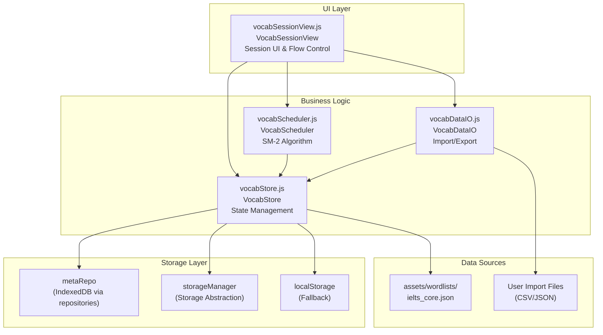

**Sources:** [js/components/vocabSessionView.js L1-L1228](https://github.com/sallowayma-git/IELTS-practice/blob/68771116/js/components/vocabSessionView.js#L1-L1228)

 [js/core/vocabScheduler.js L1-L360](https://github.com/sallowayma-git/IELTS-practice/blob/68771116/js/core/vocabScheduler.js#L1-L360)

 [js/core/vocabStore.js L1-L452](https://github.com/sallowayma-git/IELTS-practice/blob/68771116/js/core/vocabStore.js#L1-L452)

 [js/utils/vocabDataIO.js L1-L340](https://github.com/sallowayma-git/IELTS-practice/blob/68771116/js/utils/vocabDataIO.js#L1-L340)

### Component Responsibilities

| Component | File | Primary Responsibilities |
| --- | --- | --- |
| `VocabSessionView` | `js/components/vocabSessionView.js` | UI rendering, session orchestration, user interaction handling, keyboard shortcuts |
| `VocabScheduler` | `js/core/vocabScheduler.js` | SM-2 algorithm implementation, interval calculation, quality rating processing |
| `VocabStore` | `js/core/vocabStore.js` | Word data persistence, configuration management, review queue state |
| `VocabDataIO` | `js/utils/vocabDataIO.js` | CSV/JSON parsing, import/export, data format validation |

**Sources:** [js/components/vocabSessionView.js L1-L100](https://github.com/sallowayma-git/IELTS-practice/blob/68771116/js/components/vocabSessionView.js#L1-L100)

 [js/core/vocabScheduler.js L1-L50](https://github.com/sallowayma-git/IELTS-practice/blob/68771116/js/core/vocabScheduler.js#L1-L50)

 [js/core/vocabStore.js L1-L100](https://github.com/sallowayma-git/IELTS-practice/blob/68771116/js/core/vocabStore.js#L1-L100)

 [js/utils/vocabDataIO.js L1-L50](https://github.com/sallowayma-git/IELTS-practice/blob/68771116/js/utils/vocabDataIO.js#L1-L50)

## Learning Session Flow

The vocabulary learning session follows a three-stage cycle for each word: recognition → spelling → feedback. The session manages a queue of words based on the SM-2 scheduling algorithm.

### Session State Machine

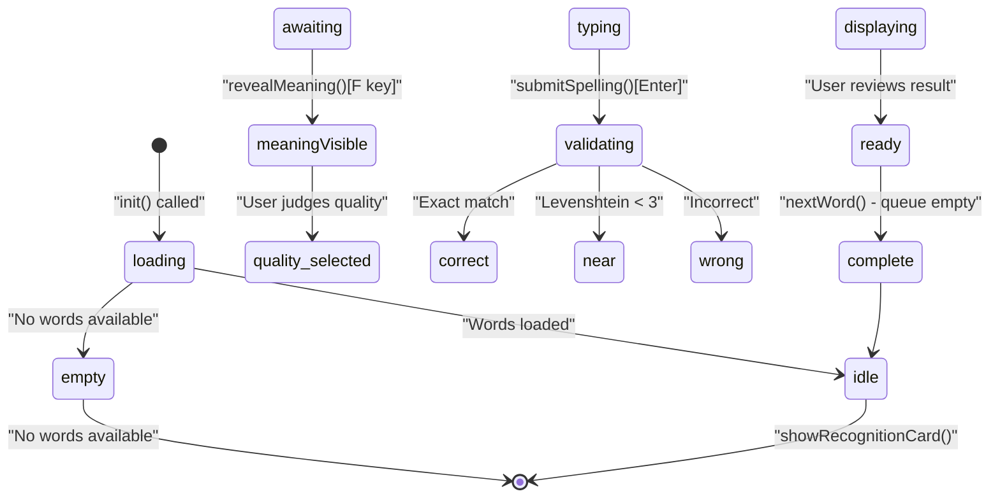

**Sources:** [js/components/vocabSessionView.js L878-L1100](https://github.com/sallowayma-git/IELTS-practice/blob/68771116/js/components/vocabSessionView.js#L878-L1100)

 [js/components/vocabSessionView.js L128-L147](https://github.com/sallowayma-git/IELTS-practice/blob/68771116/js/components/vocabSessionView.js#L128-L147)

### Recognition Stage Implementation

The recognition stage tests whether the user can recall the meaning of a word before seeing it. The user's self-assessment determines the initial quality rating.

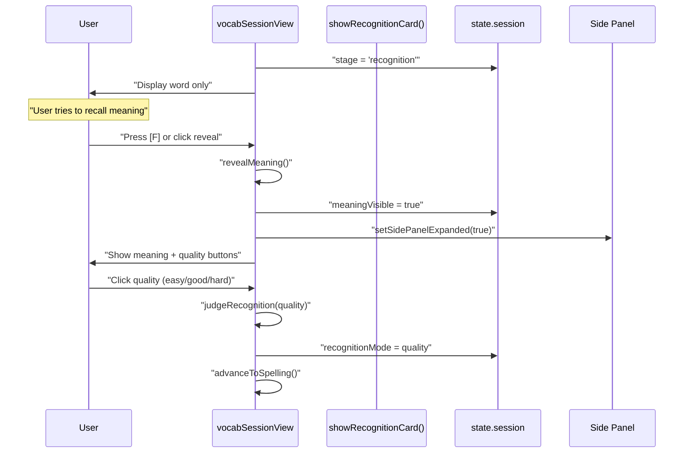

**Sources:** [js/components/vocabSessionView.js L1001-L1050](https://github.com/sallowayma-git/IELTS-practice/blob/68771116/js/components/vocabSessionView.js#L1001-L1050)

 [js/components/vocabSessionView.js L1051-L1100](https://github.com/sallowayma-git/IELTS-practice/blob/68771116/js/components/vocabSessionView.js#L1051-L1100)

### Spelling Stage Implementation

The spelling stage requires the user to type the word correctly, providing objective verification of retention.

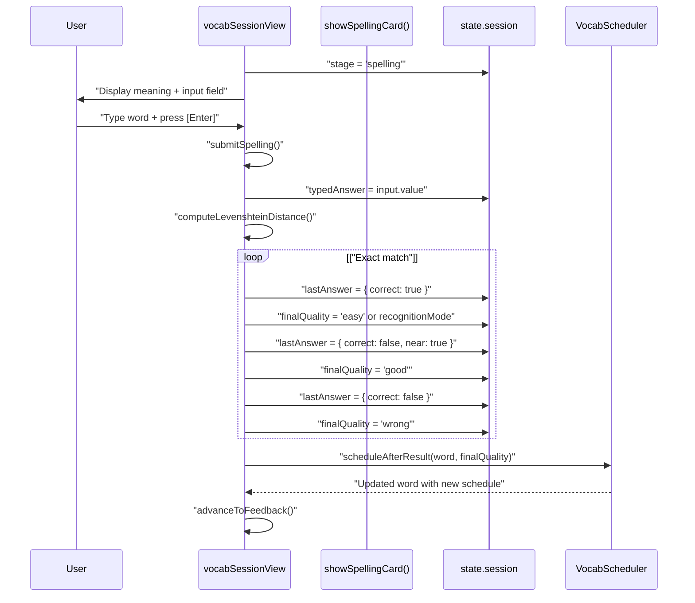

**Sources:** [js/components/vocabSessionView.js L1101-L1180](https://github.com/sallowayma-git/IELTS-practice/blob/68771116/js/components/vocabSessionView.js#L1101-L1180)

 [js/components/vocabSessionView.js L1310-L1370](https://github.com/sallowayma-git/IELTS-practice/blob/68771116/js/components/vocabSessionView.js#L1310-L1370)

### Feedback Stage Implementation

The feedback stage displays the result and allows the user to review the word details before continuing.

**Sources:** [js/components/vocabSessionView.js L1181-L1230](https://github.com/sallowayma-git/IELTS-practice/blob/68771116/js/components/vocabSessionView.js#L1181-L1230)

## SuperMemo SM-2 Algorithm

The vocabulary system implements the SuperMemo SM-2 spaced repetition algorithm to optimize review intervals based on user performance.

### SM-2 Core Concepts

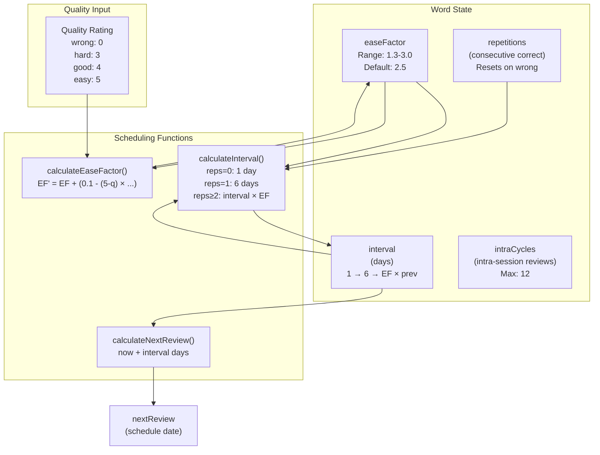

**Sources:** [js/core/vocabScheduler.js L2-L91](https://github.com/sallowayma-git/IELTS-practice/blob/68771116/js/core/vocabScheduler.js#L2-L91)

 [js/core/vocabScheduler.js L193-L249](https://github.com/sallowayma-git/IELTS-practice/blob/68771116/js/core/vocabScheduler.js#L193-L249)

### Algorithm Constants and Configuration

The SM-2 implementation uses the following constants:

| Constant | Value | Purpose |
| --- | --- | --- |
| `MIN_EASE_FACTOR` | 1.3 | Lower bound for difficulty factor |
| `MAX_EASE_FACTOR` | 3.0 | Upper bound for difficulty factor |
| `INITIAL_INTERVAL_DAYS` | 1 | First review interval (day 1) |
| `SECOND_INTERVAL_DAYS` | 6 | Second review interval (day 6) |
| `MAX_INTRA_CYCLES` | 12 | Maximum intra-session review cycles |

**Sources:** [js/core/vocabScheduler.js L3-L9](https://github.com/sallowayma-git/IELTS-practice/blob/68771116/js/core/vocabScheduler.js#L3-L9)

### Three-Tier Initial Difficulty

For new words, the system sets the initial ease factor based on the user's first recognition quality:

| Initial Quality | Ease Factor | Strategy |
| --- | --- | --- |
| `easy` | 2.8 | High starting EF, longer intervals, skip intra-cycles |
| `good` | 2.5 | Standard starting EF, normal progression |
| `hard` | 1.8 | Low starting EF, shorter intervals, requires more reviews |

**Sources:** [js/core/vocabScheduler.js L12-L16](https://github.com/sallowayma-git/IELTS-practice/blob/68771116/js/core/vocabScheduler.js#L12-L16)

 [js/core/vocabScheduler.js L145-L163](https://github.com/sallowayma-git/IELTS-practice/blob/68771116/js/core/vocabScheduler.js#L145-L163)

### Intra-Cycle Adjustments

During learning (before a word graduates to spaced repetition), the system uses intra-cycle adjustments:

```yaml
// Intra-cycle EF adjustments in vocabScheduler.js
INTRA_EF_ADJUSTMENTS = {
    easy: +0.15,   // Boost EF for easy recalls
    good: +0.05,   // Small boost for good recalls
    hard: -0.10    // Reduce EF for difficult recalls
}
```

**Sources:** [js/core/vocabScheduler.js L18-L23](https://github.com/sallowayma-git/IELTS-practice/blob/68771116/js/core/vocabScheduler.js#L18-L23)

 [js/core/vocabScheduler.js L164-L190](https://github.com/sallowayma-git/IELTS-practice/blob/68771116/js/core/vocabScheduler.js#L164-L190)

### Scheduling Decision Tree

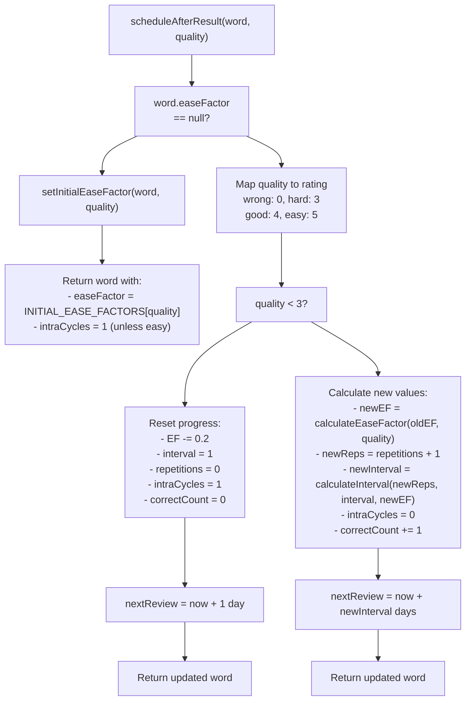

**Sources:** [js/core/vocabScheduler.js L193-L249](https://github.com/sallowayma-git/IELTS-practice/blob/68771116/js/core/vocabScheduler.js#L193-L249)

### SM-2 Formula Implementation

The ease factor calculation follows the standard SM-2 formula:

```yaml
EF' = EF + (0.1 - (5 - q) × (0.08 + (5 - q) × 0.02))

Where:
- EF  = current ease factor
- q   = quality rating (0-5)
- EF' = new ease factor (clamped to [1.3, 3.0])
```

**Sources:** [js/core/vocabScheduler.js L52-L69](https://github.com/sallowayma-git/IELTS-practice/blob/68771116/js/core/vocabScheduler.js#L52-L69)

The interval calculation follows SM-2 progression:

```
interval = {
    1                    if repetitions = 0
    6                    if repetitions = 1
    prev_interval × EF   if repetitions ≥ 2
}
```

**Sources:** [js/core/vocabScheduler.js L71-L91](https://github.com/sallowayma-git/IELTS-practice/blob/68771116/js/core/vocabScheduler.js#L71-L91)

## Data Storage Architecture

The vocabulary system uses a three-tier fallback storage strategy to ensure data persistence across different environments.

### Storage Provider Hierarchy

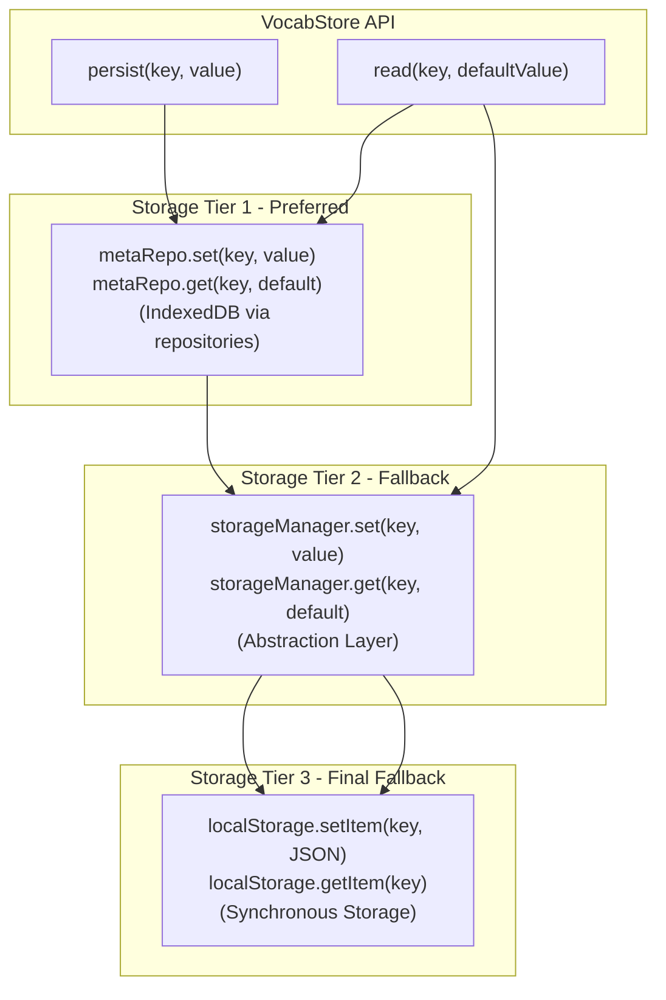

**Sources:** [js/core/vocabStore.js L150-L203](https://github.com/sallowayma-git/IELTS-practice/blob/68771116/js/core/vocabStore.js#L150-L203)

### Storage Keys and Data Structures

The vocabulary system stores three primary data structures:

| Storage Key | Data Type | Content |
| --- | --- | --- |
| `vocab_words` | Array | All vocabulary entries with scheduling metadata |
| `vocab_user_config` | Object | User preferences and learning configuration |
| `vocab_review_queue` | Array | Ordered list of word IDs for current session |

**Sources:** [js/core/vocabStore.js L2-L6](https://github.com/sallowayma-git/IELTS-practice/blob/68771116/js/core/vocabStore.js#L2-L6)

### Word Data Structure

Each word in `vocab_words` contains the following normalized structure:

```yaml
{
    // Identity
    id: "word-1234567890-abc123",
    word: "vocabulary",
    meaning: "词汇；词汇量",
    example: "Building vocabulary is essential for IELTS.",
    note: "",  // User's personal notes
    
    // SM-2 Scheduling Fields
    easeFactor: 2.5,        // null for new words
    interval: 6,            // Days until next review
    repetitions: 2,         // Consecutive correct count
    intraCycles: 0,         // Intra-session review count
    correctCount: 5,        // Total correct attempts
    
    // Optional Metadata
    freq: 0.85,            // Word frequency (0-1), optional
    
    // Timestamps
    lastReviewed: "2024-01-15T10:30:00.000Z",
    nextReview: "2024-01-21T10:30:00.000Z",
    createdAt: "2024-01-01T00:00:00.000Z",
    updatedAt: "2024-01-15T10:30:00.000Z"
}
```

**Sources:** [js/core/vocabStore.js L70-L141](https://github.com/sallowayma-git/IELTS-practice/blob/68771116/js/core/vocabStore.js#L70-L141)

### Configuration Structure

The `vocab_user_config` object contains learning preferences:

```yaml
{
    dailyNew: 20,          // New words per day (0-200)
    reviewLimit: 100,      // Max reviews per day (1-300)
    masteryCount: 4,       // Consecutive correct for mastery (1-10)
    theme: "auto",         // UI theme preference
    notify: true           // Show due word notifications
}
```

**Sources:** [js/core/vocabStore.js L8-L14](https://github.com/sallowayma-git/IELTS-practice/blob/68771116/js/core/vocabStore.js#L8-L14)

### Initialization and Provider Connection

The `VocabStore` connects to storage providers through a registry pattern:

```mermaid
sequenceDiagram
  participant Application Init
  participant VocabStore.init()
  participant StorageProviderRegistry
  participant dataRepositories
  participant VocabStore.state

  Application Init->>VocabStore.init(): "init()"
  VocabStore.init()->>VocabStore.init(): "ensureReadyPromise()"
  VocabStore.init()->>VocabStore.init(): "connectToProviders()"
  VocabStore.init()->>StorageProviderRegistry: "onProvidersReady(callback)"
  StorageProviderRegistry-->>VocabStore.init(): "callback({ repositories, storageManager })"
  VocabStore.init()->>VocabStore.init(): "attachRepositories(repositories)"
  VocabStore.init()->>dataRepositories: "repositories.meta"
  dataRepositories-->>VocabStore.state: "state.metaRepo = meta"
  VocabStore.init()->>VocabStore.init(): "loadState()"
  VocabStore.init()->>VocabStore.state: "read(STORAGE_KEYS.WORDS, [])"
  VocabStore.init()->>VocabStore.state: "read(STORAGE_KEYS.CONFIG, {...})"
  VocabStore.init()->>VocabStore.state: "read(STORAGE_KEYS.REVIEW_QUEUE, [])"
  loop ["No words loaded"]
    VocabStore.init()->>VocabStore.init(): "ensureDefaultLexicon()"
    VocabStore.init()->>VocabStore.init(): "fetch('assets/wordlists/ielts_core.json')"
    VocabStore.init()->>VocabStore.state: "setWordsInternal(normalized)"
  end
  VocabStore.init()->>VocabStore.state: "state.ready = true"
  VocabStore.init()-->>Application Init: "resolve(true)"
```

**Sources:** [js/core/vocabStore.js L284-L337](https://github.com/sallowayma-git/IELTS-practice/blob/68771116/js/core/vocabStore.js#L284-L337)

 [js/core/vocabStore.js L418-L425](https://github.com/sallowayma-git/IELTS-practice/blob/68771116/js/core/vocabStore.js#L418-L425)

## Session Queue Management

The vocabulary session manages word queues to balance reviews and new words according to user configuration.

### Queue Preparation Flow

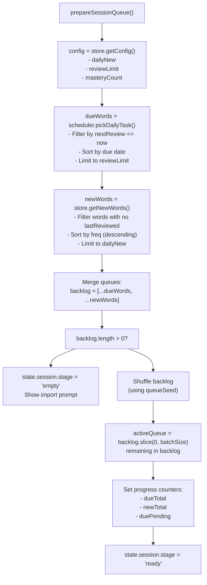

**Sources:** [js/components/vocabSessionView.js L911-L1000](https://github.com/sallowayma-git/IELTS-practice/blob/68771116/js/components/vocabSessionView.js#L911-L1000)

### Daily Task Selection Algorithm

The `pickDailyTask` function in `VocabScheduler` implements priority-based word selection:

```javascript
function pickDailyTask(allWords, limit, options) {
    const reviewLimit = limit;  // Max total words
    const newLimit = options.newLimit;  // Max new words
    const now = options.now || new Date();
    
    // 1. Collect due words (nextReview <= now)
    const dueWords = words.filter(w => 
        w.nextReview && new Date(w.nextReview) <= now
    );
    
    // 2. Sort due words by urgency
    dueWords.sort((a, b) => {
        const nextA = new Date(a.nextReview);
        const nextB = new Date(b.nextReview);
        return nextA - nextB;  // Earlier due date = higher priority
    });
    
    // 3. Take up to reviewLimit due words
    const tasks = dueWords.slice(0, reviewLimit);
    
    // 4. Fill remaining slots with new words
    if (tasks.length < reviewLimit && newLimit > 0) {
        const newWords = words.filter(w => !w.lastReviewed);
        newWords.sort((a, b) => (b.freq || 0) - (a.freq || 0));
        
        const remaining = Math.min(
            newLimit,
            reviewLimit - tasks.length
        );
        tasks.push(...newWords.slice(0, remaining));
    }
    
    return tasks;
}
```

**Sources:** [js/core/vocabScheduler.js L267-L328](https://github.com/sallowayma-git/IELTS-practice/blob/68771116/js/core/vocabScheduler.js#L267-L328)

## Import/Export System

The `VocabDataIO` module provides comprehensive import/export functionality supporting multiple formats and use cases.

### Supported Import Formats

| Format | MIME Types | Use Cases |
| --- | --- | --- |
| JSON (Wordlist) | `application/json`, `text/json` | External vocabulary lists, shared decks |
| JSON (Progress) | `application/json` | Backup/restore, device transfer |
| CSV | `text/csv`, `application/vnd.ms-excel` | Spreadsheet exports, simple word lists |

**Sources:** [js/utils/vocabDataIO.js L2-L10](https://github.com/sallowayma-git/IELTS-practice/blob/68771116/js/utils/vocabDataIO.js#L2-L10)

### Import Type Detection

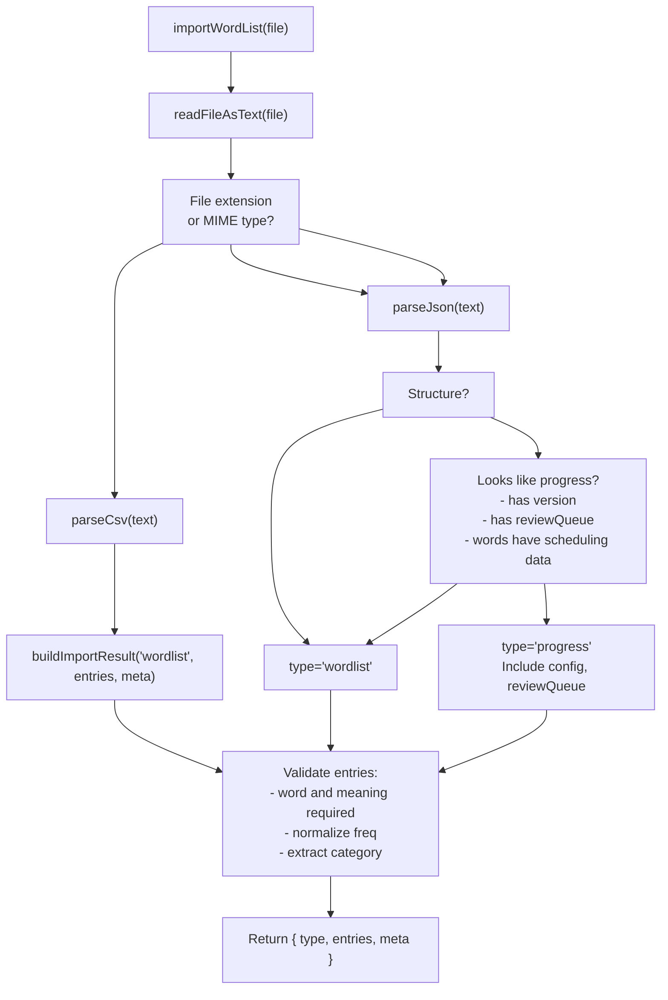

**Sources:** [js/utils/vocabDataIO.js L280-L309](https://github.com/sallowayma-git/IELTS-practice/blob/68771116/js/utils/vocabDataIO.js#L280-L309)

 [js/utils/vocabDataIO.js L218-L263](https://github.com/sallowayma-git/IELTS-practice/blob/68771116/js/utils/vocabDataIO.js#L218-L263)

### CSV Import Format

The CSV parser supports flexible column ordering with header detection:

```
word,meaning,example,freq
vocabulary,词汇；词汇量,Building vocabulary is essential.,0.85
comprehension,理解；理解力,Reading comprehension requires practice.,0.72
```

The parser:

1. Detects delimiter (`,`, `;`, or `\t`)
2. Handles quoted fields with commas
3. Maps columns by header names (case-insensitive)
4. Falls back to positional columns if headers missing

**Sources:** [js/utils/vocabDataIO.js L146-L217](https://github.com/sallowayma-git/IELTS-practice/blob/68771116/js/utils/vocabDataIO.js#L146-L217)

### Progress Export Structure

When exporting progress via `VocabDataIO.exportProgress()`, the system creates a complete backup:

```yaml
{
    version: "1.0.0",
    exportedAt: "2024-01-15T10:30:00.000Z",
    
    // User configuration snapshot
    config: {
        dailyNew: 20,
        reviewLimit: 100,
        masteryCount: 4,
        notify: true
    },
    
    // Complete word list with scheduling data
    words: [
        {
            id: "...",
            word: "vocabulary",
            meaning: "词汇",
            // ... all SM-2 fields and timestamps
        },
        // ... more words
    ],
    
    // Current review queue state
    reviewQueue: ["word-id-1", "word-id-2", ...]
}
```

**Sources:** [js/utils/vocabDataIO.js L311-L325](https://github.com/sallowayma-git/IELTS-practice/blob/68771116/js/utils/vocabDataIO.js#L311-L325)

### Import Processing in VocabSessionView

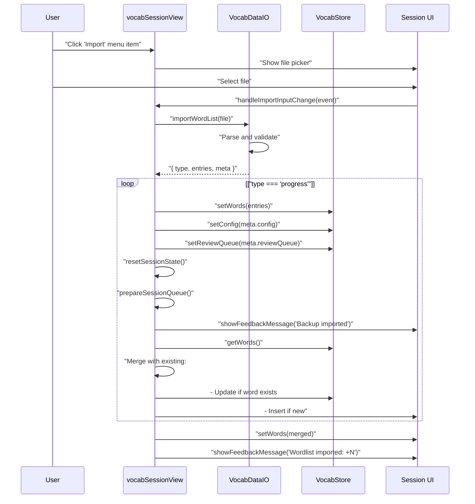

**Sources:** [js/components/vocabSessionView.js L628-L740](https://github.com/sallowayma-git/IELTS-practice/blob/68771116/js/components/vocabSessionView.js#L628-L740)

## User Interface Components

The `VocabSessionView` provides a complete learning interface with responsive design and keyboard navigation.

### Layout Structure

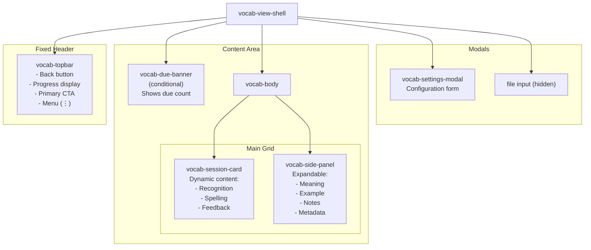

**Sources:** [js/components/vocabSessionView.js L168-L322](https://github.com/sallowayma-git/IELTS-practice/blob/68771116/js/components/vocabSessionView.js#L168-L322)

### Keyboard Shortcuts

The system provides comprehensive keyboard navigation:

| Key | Stage | Action | Handler |
| --- | --- | --- | --- |
| `F` | Recognition | Reveal meaning | `revealMeaning()` |
| `Enter` | Spelling | Submit answer | `submitSpelling()` |
| `Escape` | Any | Close menu/panel | `closeMenu()` or `toggleSidePanel()` |

**Sources:** [js/components/vocabSessionView.js L8-L13](https://github.com/sallowayma-git/IELTS-practice/blob/68771116/js/components/vocabSessionView.js#L8-L13)

 [js/components/vocabSessionView.js L452-L485](https://github.com/sallowayma-git/IELTS-practice/blob/68771116/js/components/vocabSessionView.js#L452-L485)

### Progress Display

The topbar displays real-time progress statistics:

```javascript
// Progress calculation in updateProgressUI()
const stats = {
    completed: session.completed.length,
    total: session.progress.total,
    correct: session.progress.correct,
    near: session.progress.near,
    wrong: session.progress.wrong
};

// Accuracy percentage
const accuracy = stats.total > 0 
    ? Math.round((stats.correct / stats.total) * 100)
    : 0;

// Progress chips shown in UI
`新词 ${newCount}  复习 ${dueCount}  正确率 ${accuracy}%`
```

**Sources:** [js/components/vocabSessionView.js L1231-L1309](https://github.com/sallowayma-git/IELTS-practice/blob/68771116/js/components/vocabSessionView.js#L1231-L1309)

### Settings Modal

The settings modal allows configuration of learning parameters:

```
// Configuration limits enforced in UI
CONFIG_LIMITS = {
    dailyNew: { min: 0, max: 200 },      // 0 = reviews only
    reviewLimit: { min: 1, max: 300 },   // System batches if high
    masteryCount: { min: 1, max: 10 }    // Graduation threshold
}
```

**Sources:** [js/components/vocabSessionView.js L15-L19](https://github.com/sallowayma-git/IELTS-practice/blob/68771116/js/components/vocabSessionView.js#L15-L19)

 [js/components/vocabSessionView.js L556-L626](https://github.com/sallowayma-git/IELTS-practice/blob/68771116/js/components/vocabSessionView.js#L556-L626)

## Integration with Main Application

The vocabulary system integrates with the main IELTS application through the view navigation system.

### Navigation Integration

```javascript
// Return to main app (vocabSessionView.js)
function navigateToMoreView() {
    const vocabView = document.getElementById('vocab-view');
    const moreView = document.getElementById('more-view');
    
    // Try app-level navigation first
    if (window.app && typeof window.app.navigateToView === 'function') {
        window.app.navigateToView('more');
    }
    
    // Fallback: manual DOM manipulation
    vocabView?.classList.remove('active');
    vocabView?.setAttribute('hidden', 'hidden');
    moreView?.classList.add('active');
    moreView?.removeAttribute('hidden');
}
```

**Sources:** [js/components/vocabSessionView.js L323-L341](https://github.com/sallowayma-git/IELTS-practice/blob/68771116/js/components/vocabSessionView.js#L323-L341)

### Initialization Sequence

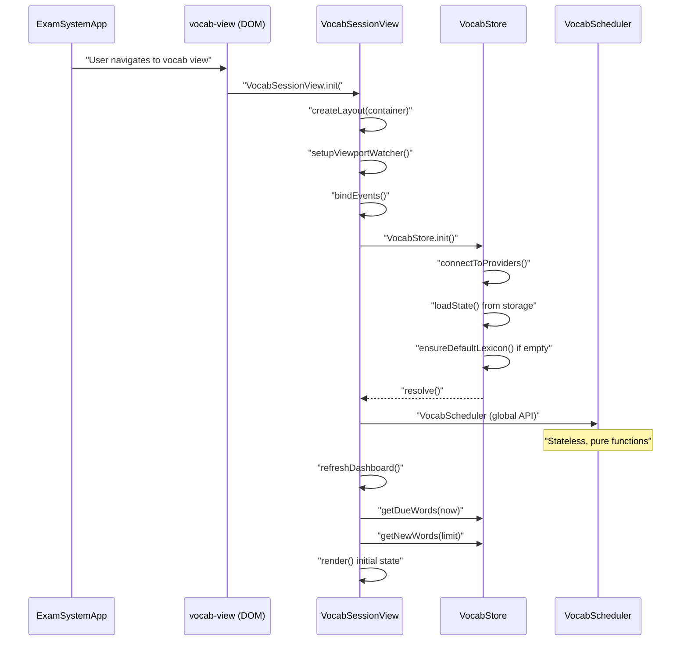

**Sources:** [js/components/vocabSessionView.js L1371-L1450](https://github.com/sallowayma-git/IELTS-practice/blob/68771116/js/components/vocabSessionView.js#L1371-L1450)

## Summary

The Vocabulary Learning System provides a complete, self-contained spaced repetition learning environment with the following key characteristics:

1. **Algorithm-Driven Scheduling**: Implements SuperMemo SM-2 with three-tier initial difficulty and intra-cycle adjustments for optimal review intervals.
2. **Three-Stage Validation**: Each word passes through recognition (self-assessment), spelling (objective test), and feedback (result review) stages.
3. **Resilient Storage**: Three-tier fallback strategy (metaRepo → storageManager → localStorage) ensures data persistence across environments.
4. **Flexible Data Import**: Supports CSV word lists, JSON vocabularies, and complete progress backups with automatic format detection.
5. **User-Configurable Learning**: Adjustable daily goals, review limits, and mastery thresholds with real-time statistics.
6. **Keyboard-First UI**: Comprehensive keyboard shortcuts enable efficient learning without mouse interaction.

The module operates independently from the IELTS practice system but shares the same storage infrastructure, allowing seamless integration while maintaining separation of concerns.