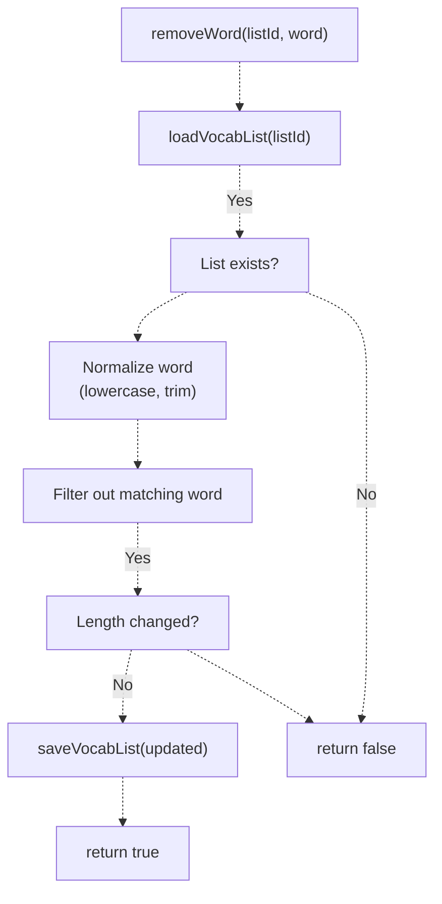

# Vocabulary List Management

> **Relevant source files**
> * [js/app/browseController.js](https://github.com/sallowayma-git/IELTS-practice/blob/92f64eb8/js/app/browseController.js)
> * [js/app/examActions.js](https://github.com/sallowayma-git/IELTS-practice/blob/92f64eb8/js/app/examActions.js)
> * [js/app/main-entry.js](https://github.com/sallowayma-git/IELTS-practice/blob/92f64eb8/js/app/main-entry.js)
> * [js/app/navigationMixin.js](https://github.com/sallowayma-git/IELTS-practice/blob/92f64eb8/js/app/navigationMixin.js)
> * [js/app/spellingErrorCollector.js](https://github.com/sallowayma-git/IELTS-practice/blob/92f64eb8/js/app/spellingErrorCollector.js)
> * [js/components/practiceHistory.js](https://github.com/sallowayma-git/IELTS-practice/blob/92f64eb8/js/components/practiceHistory.js)
> * [js/components/practiceHistoryEnhancer.js](https://github.com/sallowayma-git/IELTS-practice/blob/92f64eb8/js/components/practiceHistoryEnhancer.js)
> * [js/components/practiceRecordModal.js](https://github.com/sallowayma-git/IELTS-practice/blob/92f64eb8/js/components/practiceRecordModal.js)
> * [js/data/dataSources/storageDataSource.js](https://github.com/sallowayma-git/IELTS-practice/blob/92f64eb8/js/data/dataSources/storageDataSource.js)
> * [js/data/index.js](https://github.com/sallowayma-git/IELTS-practice/blob/92f64eb8/js/data/index.js)
> * [js/runtime/lazyLoader.js](https://github.com/sallowayma-git/IELTS-practice/blob/92f64eb8/js/runtime/lazyLoader.js)
> * [js/utils/markdownExporter.js](https://github.com/sallowayma-git/IELTS-practice/blob/92f64eb8/js/utils/markdownExporter.js)

## Purpose and Scope

This document describes the vocabulary list management system, which stores and organizes spelling errors collected from practice sessions. It covers the data structures, storage architecture, deduplication logic, error count tracking, and synchronization to a master list.

For information about how spelling errors are detected during practice sessions, see [Spelling Error Detection System](/sallowayma-git/IELTS-practice/11.1-spelling-error-detection-system). For vocabulary practice features and scheduling, see the more-tools lazy load group documentation.

---

## Vocabulary List Data Structure

### VocabularyList Schema

The system defines a `VocabularyList` type that represents a collection of spelling errors organized by source:


**Sources:** [js/app/spellingErrorCollector.js L20-L47](https://github.com/sallowayma-git/IELTS-practice/blob/92f64eb8/js/app/spellingErrorCollector.js#L20-L47)

### SpellingError Properties

| Property | Type | Description |
| --- | --- | --- |
| `word` | string | The correct spelling of the word |
| `userInput` | string | The user's incorrect spelling |
| `questionId` | string | Question identifier where error occurred |
| `suiteId` | string | Optional suite identifier for multi-exam sessions |
| `examId` | string | Exam identifier |
| `timestamp` | number | Unix timestamp when error was recorded |
| `errorCount` | number | Number of times user made this error |
| `source` | string | Source identifier: 'p1', 'p4', or 'other' |
| `metadata` | Object | Optional additional context (difficulty, context, etc.) |

**Sources:** [js/app/spellingErrorCollector.js L20-L32](https://github.com/sallowayma-git/IELTS-practice/blob/92f64eb8/js/app/spellingErrorCollector.js#L20-L32)

### VocabularyList Properties

| Property | Type | Description |
| --- | --- | --- |
| `id` | string | Unique list identifier (e.g., 'p1', 'p4', 'master') |
| `name` | string | Human-readable list name |
| `source` | string | Source category: 'p1', 'p4', 'all', or 'user' |
| `words` | Array | Array of `SpellingError` objects |
| `createdAt` | number | Unix timestamp of list creation |
| `updatedAt` | number | Unix timestamp of last modification |
| `stats` | Object | Statistics object with `totalWords`, `masteredWords`, `reviewingWords` |

**Sources:** [js/app/spellingErrorCollector.js L34-L47](https://github.com/sallowayma-git/IELTS-practice/blob/92f64eb8/js/app/spellingErrorCollector.js#L34-L47)

---

## Storage Architecture

### Multiple List Strategy

The system maintains separate vocabulary lists organized by practice source, plus a comprehensive master list:


**Sources:** [js/app/spellingErrorCollector.js L52-L71](https://github.com/sallowayma-git/IELTS-practice/blob/92f64eb8/js/app/spellingErrorCollector.js#L52-L71)

 [js/app/spellingErrorCollector.js L159-L180](https://github.com/sallowayma-git/IELTS-practice/blob/92f64eb8/js/app/spellingErrorCollector.js#L159-L180)

### Storage Key Configuration

The `SpellingErrorCollector` class defines storage keys for each list type:

| List ID | Storage Key | Purpose |
| --- | --- | --- |
| `p1` | `vocab_list_p1_errors` | Errors from P1 listening practice |
| `p4` | `vocab_list_p4_errors` | Errors from P4 listening practice |
| `master` | `vocab_list_master_errors` | Comprehensive list combining all sources |
| `custom` | `vocab_list_custom` | User-defined custom vocabulary list |

The storage keys are configured in the constructor at [js/app/spellingErrorCollector.js L60-L65](https://github.com/sallowayma-git/IELTS-practice/blob/92f64eb8/js/app/spellingErrorCollector.js#L60-L65)

### Source Detection Logic

The system automatically categorizes errors by detecting the source from the `examId`:


**Sources:** [js/app/spellingErrorCollector.js L119-L151](https://github.com/sallowayma-git/IELTS-practice/blob/92f64eb8/js/app/spellingErrorCollector.js#L119-L151)

The detection logic checks for patterns like:

* `p1`, `part1`, `part-1`, `100 p1`, `100p1` → source = 'p1'
* `p4`, `part4`, `part-4`, `100 p4`, `100p4` → source = 'p4'
* Otherwise → source = 'other'

---

## List Management Operations

### Initialization Flow


**Sources:** [js/app/spellingErrorCollector.js L52-L96](https://github.com/sallowayma-git/IELTS-practice/blob/92f64eb8/js/app/spellingErrorCollector.js#L52-L96)

### Loading a Vocabulary List

The `loadVocabList(listId)` method retrieves a list from storage:


**Sources:** [js/app/spellingErrorCollector.js L182-L211](https://github.com/sallowayma-git/IELTS-practice/blob/92f64eb8/js/app/spellingErrorCollector.js#L182-L211)

### Creating Empty Lists

When a list doesn't exist, `createEmptyList(listId, source)` generates a new list structure:

| List ID | Default Name |
| --- | --- |
| `p1` | "P1 拼写错误词表" |
| `p4` | "P4 拼写错误词表" |
| `master` | "综合拼写错误词表" |
| `custom` | "自定义词表" |

The method initializes the list with empty `words` array, current timestamps, and zero statistics.

**Sources:** [js/app/spellingErrorCollector.js L159-L180](https://github.com/sallowayma-git/IELTS-practice/blob/92f64eb8/js/app/spellingErrorCollector.js#L159-L180)

### Saving Vocabulary Lists

The `saveVocabList(vocabList)` method persists changes:

1. **Update Statistics:** Recalculates `stats.totalWords` from `words.length`
2. **Update Timestamp:** Sets `updatedAt` to current timestamp
3. **Resolve Storage Key:** Maps list ID to storage key
4. **Persist to Storage:** Calls `storage.set(storageKey, vocabList)`

**Sources:** [js/app/spellingErrorCollector.js L213-L247](https://github.com/sallowayma-git/IELTS-practice/blob/92f64eb8/js/app/spellingErrorCollector.js#L213-L247)

---

## Deduplication and Error Count Tracking

### Word Merging Logic

When saving errors to a list, `mergeErrorsToList(vocabList, errors)` implements deduplication:


**Sources:** [js/app/spellingErrorCollector.js L613-L654](https://github.com/sallowayma-git/IELTS-practice/blob/92f64eb8/js/app/spellingErrorCollector.js#L613-L654)

### Normalization Rules

Words are normalized for comparison using case-insensitive matching:

```javascript
// Normalization at line 622
const normalizedWord = error.word.toLowerCase().trim();

// Finding existing entries at lines 625-627
const existingIndex = vocabList.words.findIndex(w => 
    w.word.toLowerCase().trim() === normalizedWord
);
```

This ensures that "receive", "Receive", and "RECEIVE" are treated as the same word.

**Sources:** [js/app/spellingErrorCollector.js L619-L654](https://github.com/sallowayma-git/IELTS-practice/blob/92f64eb8/js/app/spellingErrorCollector.js#L619-L654)

### Error Count Tracking

The `errorCount` field tracks how many times a user has misspelled a word:

| Operation | Error Count Behavior |
| --- | --- |
| First error | `errorCount = 1` (new word added) |
| Subsequent error | `errorCount++` (existing word updated) |
| Latest metadata | `userInput`, `questionId`, `examId`, `timestamp` updated to most recent |

This allows vocabulary practice systems to prioritize frequently misspelled words.

**Sources:** [js/app/spellingErrorCollector.js L629-L644](https://github.com/sallowayma-git/IELTS-practice/blob/92f64eb8/js/app/spellingErrorCollector.js#L629-L644)

---

## Master List Synchronization

### Synchronization Strategy

The system maintains a master list (`vocab_list_master_errors`) that aggregates errors from all sources:


**Sources:** [js/app/spellingErrorCollector.js L535-L685](https://github.com/sallowayma-git/IELTS-practice/blob/92f64eb8/js/app/spellingErrorCollector.js#L535-L685)

### Save Operation Flow

When `saveErrors(errors)` is called, the following steps occur:

1. **Group by Source:** `groupErrorsBySource(errors)` separates errors into P1, P4, and other categories
2. **Save to Source Lists:** Each group is saved to its respective list via `saveErrorsToList(source, sourceErrors)`
3. **Sync to Master:** All errors are synchronized to the master list via `syncToMasterList(errors)`


**Sources:** [js/app/spellingErrorCollector.js L530-L685](https://github.com/sallowayma-git/IELTS-practice/blob/92f64eb8/js/app/spellingErrorCollector.js#L530-L685)

### Master List Properties

The master list differs from source-specific lists:

* **ID:** `'master'`
* **Source:** `'all'` (indicates aggregation of all sources)
* **Contents:** Contains deduplicated words from P1, P4, and other sources
* **Error Counts:** Reflects cumulative errors across all sources for each word

**Sources:** [js/app/spellingErrorCollector.js L656-L685](https://github.com/sallowayma-git/IELTS-practice/blob/92f64eb8/js/app/spellingErrorCollector.js#L656-L685)

---

## List Manipulation Operations

### Removing Words

The `removeWord(listId, word)` method deletes a word from a list:



**Sources:** [js/app/spellingErrorCollector.js L687-L722](https://github.com/sallowayma-git/IELTS-practice/blob/92f64eb8/js/app/spellingErrorCollector.js#L687-L722)

### Clearing Lists

The `clearList(listId)` method removes all words while preserving list metadata:

1. Load the vocabulary list
2. Set `words = []` (empty array)
3. Update `updatedAt` timestamp
4. Save the modified list

This operation retains the list structure (id, name, source) but clears all vocabulary entries.

**Sources:** [js/app/spellingErrorCollector.js L724-L749](https://github.com/sallowayma-git/IELTS-practice/blob/92f64eb8/js/app/spellingErrorCollector.js#L724-L749)

### Word Count Query

The `getWordCount(listId)` method provides a quick way to check list size without loading full data:

```javascript
// Implementation at lines 250-262
async getWordCount(listId) {
    const list = await this.loadVocabList(listId);
    return list ? list.words.length : 0;
}
```

**Sources:** [js/app/spellingErrorCollector.js L249-L262](https://github.com/sallowayma-git/IELTS-practice/blob/92f64eb8/js/app/spellingErrorCollector.js#L249-L262)

---

## Integration with Practice Sessions

### Lazy Loading Integration

The `SpellingErrorCollector` is part of the `practice-suite` lazy load group, ensuring it's available when practice sessions complete:


**Sources:** [js/runtime/lazyLoader.js L14-L26](https://github.com/sallowayma-git/IELTS-practice/blob/92f64eb8/js/runtime/lazyLoader.js#L14-L26)

 [js/app/spellingErrorCollector.js L752-L760](https://github.com/sallowayma-git/IELTS-practice/blob/92f64eb8/js/app/spellingErrorCollector.js#L752-L760)

### Global Instance

A singleton instance is created and exposed globally:

```javascript
// Global instance creation at lines 752-760
window.SpellingErrorCollector = SpellingErrorCollector;

if (!window.spellingErrorCollector) {
    window.spellingErrorCollector = new SpellingErrorCollector();
    console.log('[SpellingErrorCollector] 全局实例已创建');
}
```

This allows other components to access the collector via `window.spellingErrorCollector`.

**Sources:** [js/app/spellingErrorCollector.js L752-L760](https://github.com/sallowayma-git/IELTS-practice/blob/92f64eb8/js/app/spellingErrorCollector.js#L752-L760)

### Integration Points

The vocabulary list management system integrates with other components:

| Component | Integration Point | Purpose |
| --- | --- | --- |
| Spelling Error Detection | Provides detected errors to save | Errors detected in [11.1](/sallowayma-git/IELTS-practice/11.1-spelling-error-detection-system) are passed to `saveErrors()` |
| Practice Recorder | Session completion triggers save | Practice completion calls collector to store errors |
| Vocabulary Practice | Reads lists for review sessions | Retrieval of words for spaced repetition practice |
| Data Export | Exports vocabulary lists | Lists can be exported via markdown/JSON exporters |

**Sources:** [js/app/spellingErrorCollector.js L270-L310](https://github.com/sallowayma-git/IELTS-practice/blob/92f64eb8/js/app/spellingErrorCollector.js#L270-L310)

 [js/app/spellingErrorCollector.js L530-L563](https://github.com/sallowayma-git/IELTS-practice/blob/92f64eb8/js/app/spellingErrorCollector.js#L530-L563)

---

## Data Consistency and Storage

### Storage Manager Integration

The collector relies on `StorageManager` for persistence:


**Sources:** [js/app/spellingErrorCollector.js L73-L96](https://github.com/sallowayma-git/IELTS-practice/blob/92f64eb8/js/app/spellingErrorCollector.js#L73-L96)

### Initialization Guarantee

The `ensureInitialized()` method ensures storage is ready before operations:

```javascript
// Implementation at lines 99-117
async ensureInitialized() {
    if (this.initialized) {
        return;
    }
    
    // Wait for initialization with timeout (5 seconds)
    let attempts = 0;
    while (!this.initialized && attempts < 50) {
        await new Promise(resolve => setTimeout(resolve, 100));
        attempts++;
    }
    
    if (!this.initialized) {
        throw new Error('SpellingErrorCollector 初始化超时');
    }
}
```

All public methods call `ensureInitialized()` before accessing storage, preventing race conditions.

**Sources:** [js/app/spellingErrorCollector.js L98-L117](https://github.com/sallowayma-git/IELTS-practice/blob/92f64eb8/js/app/spellingErrorCollector.js#L98-L117)

 [js/app/spellingErrorCollector.js L189](https://github.com/sallowayma-git/IELTS-practice/blob/92f64eb8/js/app/spellingErrorCollector.js#L189-L189)

 [js/app/spellingErrorCollector.js L220](https://github.com/sallowayma-git/IELTS-practice/blob/92f64eb8/js/app/spellingErrorCollector.js#L220-L220)

 [js/app/spellingErrorCollector.js L544](https://github.com/sallowayma-git/IELTS-practice/blob/92f64eb8/js/app/spellingErrorCollector.js#L544-L544)