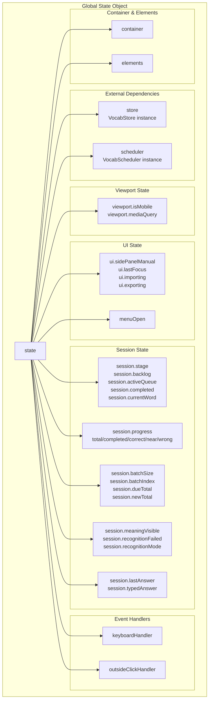
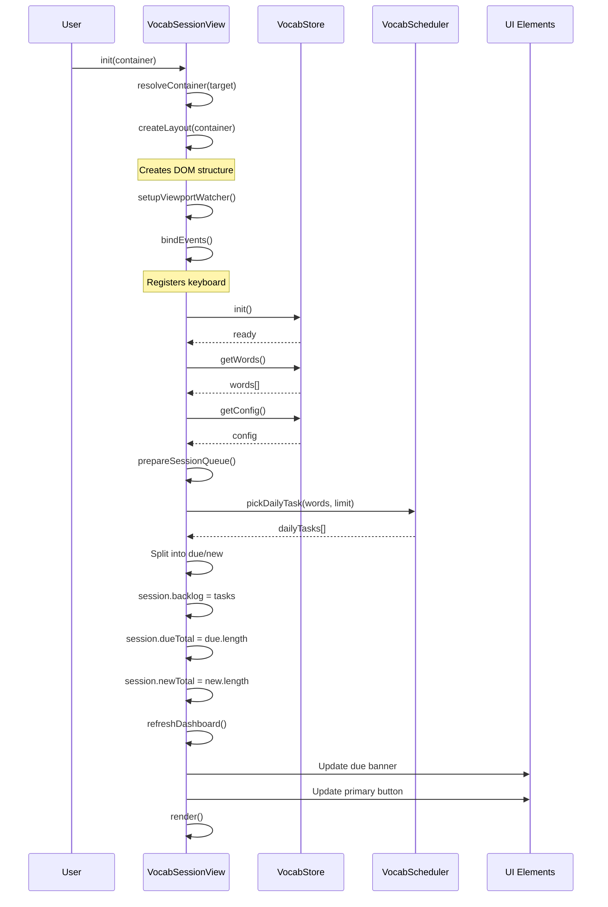
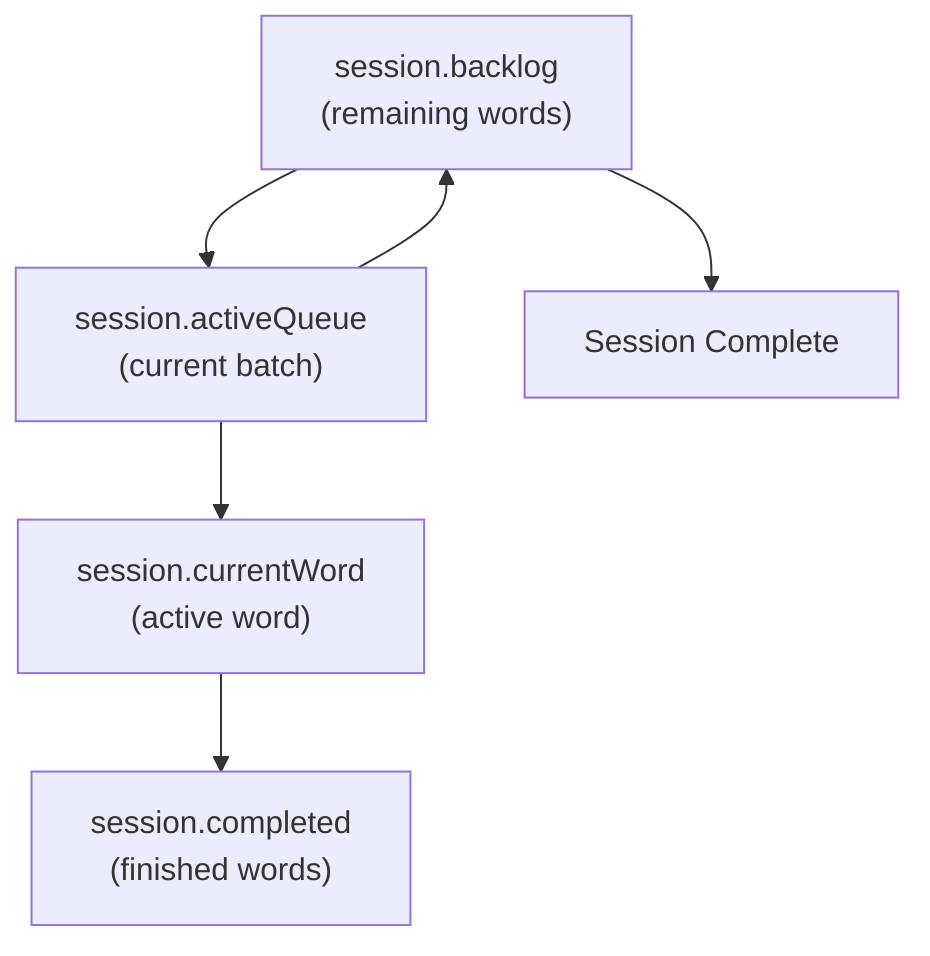
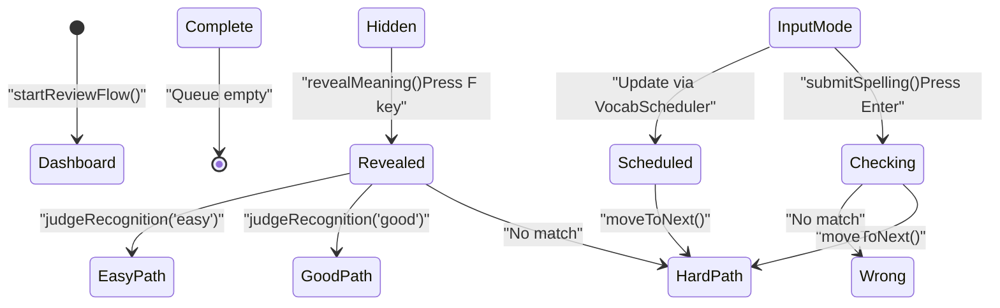
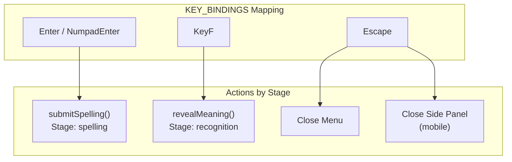
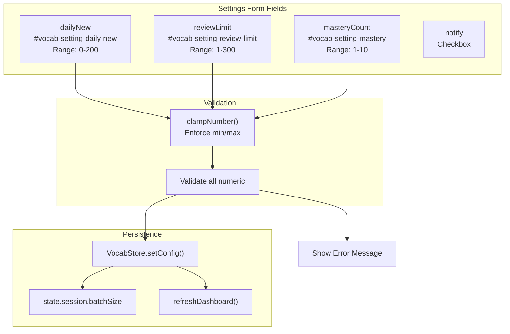
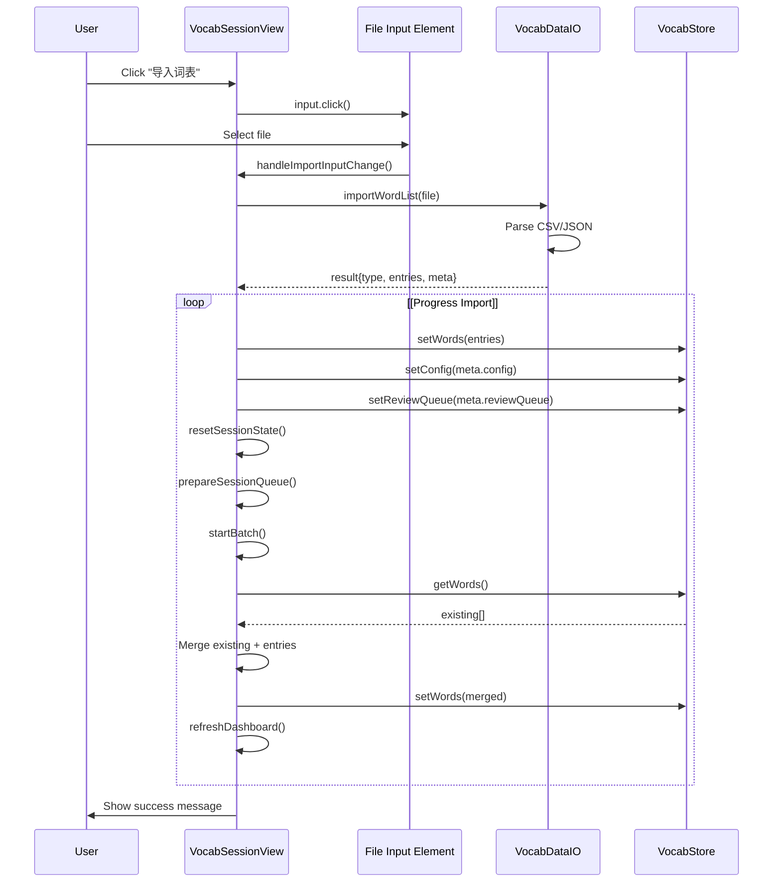

# Vocabulary Session & Learning Flow

> **Relevant source files**
> * [js/components/vocabSessionView.js](https://github.com/sallowayma-git/IELTS-practice/blob/68771116/js/components/vocabSessionView.js)
> * [js/core/vocabScheduler.js](https://github.com/sallowayma-git/IELTS-practice/blob/68771116/js/core/vocabScheduler.js)
> * [js/core/vocabStore.js](https://github.com/sallowayma-git/IELTS-practice/blob/68771116/js/core/vocabStore.js)
> * [js/utils/vocabDataIO.js](https://github.com/sallowayma-git/IELTS-practice/blob/68771116/js/utils/vocabDataIO.js)
> * [js/views/overviewView.js](https://github.com/sallowayma-git/IELTS-practice/blob/68771116/js/views/overviewView.js)

## Purpose and Scope

This document explains the vocabulary learning session management implemented in `VocabSessionView`, including the three-stage learning flow (recognition, spelling, feedback), session state management, UI components, and interaction patterns. The session view orchestrates the learning experience by managing word queues, tracking progress, and coordinating with the scheduler and storage systems.

For information about the underlying spaced repetition algorithm, see [6.2](/sallowayma-git/IELTS-practice/6.2-spaced-repetition-algorithm-(sm-2)). For storage architecture and data import/export, see [6.3](/sallowayma-git/IELTS-practice/6.3-vocabulary-data-storage-and-importexport).

---

## Session State Architecture

The `VocabSessionView` maintains a comprehensive state object that tracks all aspects of the learning session. The state is organized into several logical groups.

**Session State Structure**



The state object is defined at [js/components/vocabSessionView.js L21-L65](https://github.com/sallowayma-git/IELTS-practice/blob/68771116/js/components/vocabSessionView.js#L21-L65)

 with the following key groups:

* **Container & Elements**: DOM references to the view container and UI elements
* **External Dependencies**: References to `VocabStore` and `VocabScheduler` instances
* **Viewport State**: Tracks mobile/desktop mode via media queries [js/components/vocabSessionView.js L27-L30](https://github.com/sallowayma-git/IELTS-practice/blob/68771116/js/components/vocabSessionView.js#L27-L30)
* **UI State**: Manages side panel visibility, focus tracking, and operation flags [js/components/vocabSessionView.js L32-L37](https://github.com/sallowayma-git/IELTS-practice/blob/68771116/js/components/vocabSessionView.js#L32-L37)
* **Session State**: Core learning session data including stage, queues, and current word [js/components/vocabSessionView.js L38-L62](https://github.com/sallowayma-git/IELTS-practice/blob/68771116/js/components/vocabSessionView.js#L38-L62)

**Session Stages**

The `session.stage` field drives the session lifecycle and determines which UI card is rendered:

| Stage | Description | UI State |
| --- | --- | --- |
| `'loading'` | Initial state, loading data | Loading indicator |
| `'empty'` | No words available | Empty state with import CTA |
| `'dashboard'` | Session not started | Due banner, start button |
| `'recognition'` | Recognition test active | Word shown, meaning hidden |
| `'spelling'` | Spelling test active | Input field for typing |
| `'feedback'` | Result shown | Correctness display, side panel |
| `'complete'` | Session finished | Summary statistics |

Sources: [js/components/vocabSessionView.js L21-L65](https://github.com/sallowayma-git/IELTS-practice/blob/68771116/js/components/vocabSessionView.js#L21-L65)

---

## Session Initialization and Queue Management

The session initialization process loads data from `VocabStore`, prepares review queues based on `VocabScheduler`, and sets up the UI for learning.

**Session Initialization Flow**



**Queue Preparation Logic**

The `prepareSessionQueue()` function [js/components/vocabSessionView.js L895-L965](https://github.com/sallowayma-git/IELTS-practice/blob/68771116/js/components/vocabSessionView.js#L895-L965)

 organizes words into review queues:

1. **Retrieve Words**: Calls `VocabStore.getWords()` and `VocabStore.getConfig()`
2. **Calculate Daily Task**: Uses `VocabScheduler.pickDailyTask()` to select words based on: * Due words (words with `nextReview <= now`) * New words (up to `config.dailyNew` limit) * Total limit of `config.reviewLimit`
3. **Split by Type**: Separates due words from new words
4. **Initialize Backlog**: Sets `session.backlog` to the full task list
5. **Set Counters**: Updates `session.dueTotal` and `session.newTotal`
6. **Update Stage**: Sets stage to `'dashboard'` if tasks exist, otherwise `'empty'`

**Batch Management**

Sessions are divided into batches to avoid overwhelming users. The batch system [js/components/vocabSessionView.js L967-L1006](https://github.com/sallowayma-git/IELTS-practice/blob/68771116/js/components/vocabSessionView.js#L967-L1006)

:



The `startBatch()` function [js/components/vocabSessionView.js L967-L1006](https://github.com/sallowayma-git/IELTS-practice/blob/68771116/js/components/vocabSessionView.js#L967-L1006)

:

* Pops up to `session.batchSize` words from `session.backlog`
* Shuffles them using Fisher-Yates algorithm
* Pushes to `session.activeQueue`
* Calls `nextWord()` to begin

Sources: [js/components/vocabSessionView.js L895-L1006](https://github.com/sallowayma-git/IELTS-practice/blob/68771116/js/components/vocabSessionView.js#L895-L1006)

---

## Three-Stage Learning Flow

Each word goes through three sequential stages: recognition, spelling, and feedback. This multi-stage approach reinforces learning through active recall and spelling practice.

**Learning Flow State Machine**



### Recognition Stage

In the recognition stage, the user sees the word and tries to recall its meaning before revealing it.

**Recognition UI Card** [js/components/vocabSessionView.js L1059-L1129](https://github.com/sallowayma-git/IELTS-practice/blob/68771116/js/components/vocabSessionView.js#L1059-L1129)

:

```
┌─────────────────────────────────┐
│  Word: "achieve"                │
│                                 │
│  [Press F to reveal meaning]    │
│                                 │
│  (After reveal)                 │
│  Meaning: 实现；达到；完成        │
│                                 │
│  How well did you remember?     │
│  [Hard] [Good] [Easy]           │
└─────────────────────────────────┘
```

**Recognition Flow** [js/components/vocabSessionView.js L1265-L1336](https://github.com/sallowayma-git/IELTS-practice/blob/68771116/js/components/vocabSessionView.js#L1265-L1336)

:

1. **Display Word**: Shows `currentWord.word` with meaning hidden
2. **User Reveals**: Presses F key or clicks reveal button → `revealMeaning()`
3. **Judgment**: User selects quality rating: * `'hard'`: Recognized but with difficulty * `'good'`: Recognized with some thought * `'easy'`: Instantly recognized
4. **Store Result**: Saves to `session.recognitionMode` and `session.recognitionFailed`
5. **Transition**: Calls `judgeRecognition(quality)` → moves to spelling stage

### Spelling Stage

The spelling stage tests active recall by requiring the user to type the word from memory.

**Spelling UI Card** [js/components/vocabSessionView.js L1131-L1208](https://github.com/sallowayma-git/IELTS-practice/blob/68771116/js/components/vocabSessionView.js#L1131-L1208)

:

```
┌─────────────────────────────────┐
│  Meaning: 实现；达到；完成        │
│                                 │
│  Spell the word:                │
│  ┌─────────────────────────┐   │
│  │ [user types here]       │   │
│  └─────────────────────────┘   │
│                                 │
│  [Submit] or press Enter        │
└─────────────────────────────────┘
```

**Spelling Validation** [js/components/vocabSessionView.js L1338-L1430](https://github.com/sallowayma-git/IELTS-practice/blob/68771116/js/components/vocabSessionView.js#L1338-L1430)

:

The `submitSpelling()` function implements fuzzy matching:

1. **Extract Input**: Get typed answer from input field
2. **Normalize**: Convert both typed and correct answers to lowercase, trim whitespace
3. **Exact Match**: If `typed === correct` → CORRECT
4. **Levenshtein Distance**: Calculate edit distance
5. **Near Match**: If distance ≤ 2 for words longer than 4 characters → NEAR
6. **Wrong**: Otherwise → WRONG
7. **Store Result**: Save to `session.lastAnswer` with quality ('correct', 'near', 'wrong')
8. **Transition**: Advance to feedback stage

**Answer Quality Mapping**:

* `'correct'`: Exact match → maps to 'good' quality for scheduler
* `'near'`: Close match (typo) → maps to 'hard' quality for scheduler
* `'wrong'`: Incorrect → maps to 'wrong' quality for scheduler

### Feedback Stage

The feedback stage displays the result and updates the word's scheduling data via `VocabScheduler`.

**Feedback UI Card** [js/components/vocabSessionView.js L1210-L1263](https://github.com/sallowayma-git/IELTS-practice/blob/68771116/js/components/vocabSessionView.js#L1210-L1263)

:

```
┌─────────────────────────────────┐
│  ✓ Correct! / ✗ Wrong           │
│                                 │
│  Word: achieve                  │
│  Your answer: achive (near)     │
│  Correct: achieve               │
│                                 │
│  [Continue] → Next word         │
└─────────────────────────────────┘
```

**Feedback Processing** [js/components/vocabSessionView.js L1447-L1545](https://github.com/sallowayma-git/IELTS-practice/blob/68771116/js/components/vocabSessionView.js#L1447-L1545)

:

1. **Combine Ratings**: * If recognition failed → use 'wrong' * Otherwise combine recognition quality + spelling result
2. **Update Scheduler**: Calls `VocabScheduler.scheduleAfterResult(word, quality)`
3. **Update Store**: Calls `VocabStore.updateWord(id, updatedWord)`
4. **Update Progress**: Increments counters in `session.progress`
5. **Side Panel**: Shows word details (meaning, example, note field)
6. **Continue**: User clicks continue → `moveToNext()`

**Combined Quality Logic** [js/components/vocabSessionView.js L1464-L1505](https://github.com/sallowayma-git/IELTS-practice/blob/68771116/js/components/vocabSessionView.js#L1464-L1505)

:

| Recognition | Spelling | Final Quality | Scheduler Rating |
| --- | --- | --- | --- |
| easy | correct | 'easy' | 5 (perfect recall) |
| good | correct | 'good' | 4 (correct with thought) |
| hard | correct | 'hard' | 3 (correct but difficult) |
| any | near | 'hard' | 3 (typo but recalled) |
| any | wrong | 'wrong' | 0 (failed) |
| failed | any | 'wrong' | 0 (failed recognition) |

Sources: [js/components/vocabSessionView.js L1059-L1545](https://github.com/sallowayma-git/IELTS-practice/blob/68771116/js/components/vocabSessionView.js#L1059-L1545)

---

## UI Components and Layout

The vocabulary view uses a shell layout with a fixed topbar, main content area, and optional side panel.

**UI Component Hierarchy**

```mermaid
flowchart TD

ROOT["vocab-view-shell<br>state.elements.root"]
TOPBAR["vocab-topbar<br>state.elements.topbar"]
BACK["Back Button"]
TITLE["Titles: 背单词<br>Leitner + 艾宾浩斯"]
PROGRESS_BAR["vocab-progress<br>state.elements.progressBar"]
PROGRESS_CHIPS["Progress Chips<br>state.elements.progressStats"]
PRIMARY_BTN["Primary CTA Button<br>state.elements.primaryButton"]
MENU_BTN["Menu Button (⋮)<br>state.elements.menuButton"]
MENU["Dropdown Menu<br>state.elements.menu"]
DUE_BANNER["vocab-due-banner<br>state.elements.dueBanner"]
DUE_TEXT["Due count text<br>state.elements.dueText"]
START_REVIEW["Start Review Button"]
MAIN["vocab-body"]
GRID["vocab-body__grid"]
SESSION_CARD["vocab-session-card<br>state.elements.sessionCard"]
SIDE_PANEL["vocab-side-panel<br>state.elements.sidePanel"]
LIVE_REGION["ARIA Live Region<br>state.elements.liveRegion"]
IMPORT_INPUT["File Input<br>state.elements.importInput"]
SETTINGS_MODAL["Settings Modal<br>state.elements.settingsModal"]

ROOT --> TOPBAR
ROOT --> DUE_BANNER
ROOT --> MAIN
ROOT --> LIVE_REGION
ROOT --> IMPORT_INPUT
ROOT --> SETTINGS_MODAL

subgraph subGraph3 ["Hidden Elements"]
    LIVE_REGION
    IMPORT_INPUT
    SETTINGS_MODAL
end

subgraph subGraph2 ["Main Content"]
    MAIN
    GRID
    SESSION_CARD
    SIDE_PANEL
    MAIN --> GRID
    GRID --> SESSION_CARD
    GRID --> SIDE_PANEL
end

subgraph subGraph1 ["Banner Section"]
    DUE_BANNER
    DUE_TEXT
    START_REVIEW
    DUE_BANNER --> DUE_TEXT
    DUE_BANNER --> START_REVIEW
end

subgraph subGraph0 ["Top Section"]
    TOPBAR
    BACK
    TITLE
    PROGRESS_BAR
    PROGRESS_CHIPS
    PRIMARY_BTN
    MENU_BTN
    MENU
    TOPBAR --> BACK
    TOPBAR --> TITLE
    TOPBAR --> PROGRESS_BAR
    TOPBAR --> PROGRESS_CHIPS
    TOPBAR --> PRIMARY_BTN
    TOPBAR --> MENU_BTN
    TOPBAR --> MENU
end
```



**Layout Creation** [js/components/vocabSessionView.js L168-L322](https://github.com/sallowayma-git/IELTS-practice/blob/68771116/js/components/vocabSessionView.js#L168-L322)

:

The `createLayout()` function generates the complete DOM structure and populates `state.elements` with references to all interactive elements. The layout includes:

* **Fixed Topbar**: Contains navigation, progress display, and menu
* **Due Banner**: Conditionally shown when due words exist [js/components/vocabSessionView.js L800-L810](https://github.com/sallowayma-git/IELTS-practice/blob/68771116/js/components/vocabSessionView.js#L800-L810)
* **Session Card**: Dynamic content area that changes based on `session.stage`
* **Side Panel**: Slide-out panel for word details (meaning, example, notes)
* **Settings Modal**: Overlay dialog for configuration [js/components/vocabSessionView.js L250-L288](https://github.com/sallowayma-git/IELTS-practice/blob/68771116/js/components/vocabSessionView.js#L250-L288)

**Responsive Behavior** [js/components/vocabSessionView.js L149-L166](https://github.com/sallowayma-git/IELTS-practice/blob/68771116/js/components/vocabSessionView.js#L149-L166)

:

The `setupViewportWatcher()` function monitors viewport width:

* Desktop (> 768px): Side panel docked, always visible during feedback
* Mobile (≤ 768px): Side panel overlay, toggleable via button

Sources: [js/components/vocabSessionView.js L168-L322](https://github.com/sallowayma-git/IELTS-practice/blob/68771116/js/components/vocabSessionView.js#L168-L322)

 [js/components/vocabSessionView.js L149-L166](https://github.com/sallowayma-git/IELTS-practice/blob/68771116/js/components/vocabSessionView.js#L149-L166)

 [js/components/vocabSessionView.js L800-L810](https://github.com/sallowayma-git/IELTS-practice/blob/68771116/js/components/vocabSessionView.js#L800-L810)

---

## Interaction Patterns and Controls

The vocabulary view supports multiple interaction methods to accommodate different user preferences.

**Keyboard Shortcuts**



The keyboard handler [js/components/vocabSessionView.js L452-L485](https://github.com/sallowayma-git/IELTS-practice/blob/68771116/js/components/vocabSessionView.js#L452-L485)

 implements:

| Key | Stage | Action | Function |
| --- | --- | --- | --- |
| Enter | spelling | Submit answer | `submitSpelling()` |
| F | recognition | Reveal meaning | `revealMeaning()` |
| Escape | any | Close menu | `closeMenu()` |
| Escape | any (mobile) | Close side panel | `toggleSidePanel(false)` |

**Side Panel Management**

The side panel displays word details and adapts to viewport and user preference:

1. **Auto Mode** (default): Shows/hides based on stage * Recognition stage + meaning revealed → show * Feedback stage → show * Other stages → hide
2. **Manual Mode**: User toggled via button * Preference stored in `state.ui.sidePanelManual` * Overrides auto behavior

**Side Panel Sync Logic** [js/components/vocabSessionView.js L852-L866](https://github.com/sallowayma-git/IELTS-practice/blob/68771116/js/components/vocabSessionView.js#L852-L866)

:

```javascript
function syncSidePanelVisibility() {
    const manualPreference = state.ui.sidePanelManual;
    let shouldShow;
    if (typeof manualPreference === 'boolean') {
        shouldShow = manualPreference;  // Manual override
    } else {
        // Auto mode
        const stage = state.session.stage;
        const hasWord = !!state.session.currentWord;
        shouldShow = (stage === 'feedback' && hasWord) 
                  || state.session.meaningVisible;
    }
    setSidePanelExpanded(shouldShow);
}
```

**Note Saving** [js/components/vocabSessionView.js L1720-L1770](https://github.com/sallowayma-git/IELTS-practice/blob/68771116/js/components/vocabSessionView.js#L1720-L1770)

:

The side panel includes a note textarea where users can record memory techniques:

1. User types in `state.elements.noteInput`
2. Clicks "Save Note" button → `saveCurrentNote()`
3. Updates `VocabStore.updateWord(id, { note: value })`
4. Shows success/error status in `state.elements.noteStatus`

**Progress Tracking**

The topbar displays real-time progress:

* **Progress Bar**: Visual fill based on `session.progress.completed / session.progress.total` [js/components/vocabSessionView.js L1656-L1660](https://github.com/sallowayma-git/IELTS-practice/blob/68771116/js/components/vocabSessionView.js#L1656-L1660)
* **Chips**: Display counters [js/components/vocabSessionView.js L1661-L1673](https://github.com/sallowayma-git/IELTS-practice/blob/68771116/js/components/vocabSessionView.js#L1661-L1673) : * New words: Count of words without `lastReviewed` * Review: Count of words with `lastReviewed` * Accuracy: `correct / (correct + wrong) * 100%`

Sources: [js/components/vocabSessionView.js L452-L485](https://github.com/sallowayma-git/IELTS-practice/blob/68771116/js/components/vocabSessionView.js#L452-L485)

 [js/components/vocabSessionView.js L852-L866](https://github.com/sallowayma-git/IELTS-practice/blob/68771116/js/components/vocabSessionView.js#L852-L866)

 [js/components/vocabSessionView.js L1720-L1770](https://github.com/sallowayma-git/IELTS-practice/blob/68771116/js/components/vocabSessionView.js#L1720-L1770)

 [js/components/vocabSessionView.js L1656-L1673](https://github.com/sallowayma-git/IELTS-practice/blob/68771116/js/components/vocabSessionView.js#L1656-L1673)

---

## Configuration and Settings Management

Users can customize their learning experience through the settings modal.

**Settings Modal Configuration**



**Settings Form Fields** [js/components/vocabSessionView.js L260-L281](https://github.com/sallowayma-git/IELTS-practice/blob/68771116/js/components/vocabSessionView.js#L260-L281)

:

| Field | Description | Default | Usage |
| --- | --- | --- | --- |
| `dailyNew` | New words per day | 24 | Passed to `VocabScheduler.pickDailyTask()` as `newLimit` |
| `reviewLimit` | Max reviews per day | 24 | Determines `session.batchSize` and total queue size |
| `masteryCount` | Consecutive correct for mastery | 4 | Used by scheduler to graduate words |
| `notify` | Show due banner on entry | true | Controls due banner display |

**Configuration Limits** [js/components/vocabSessionView.js L15-L19](https://github.com/sallowayma-git/IELTS-practice/blob/68771116/js/components/vocabSessionView.js#L15-L19)

:

```javascript
const CONFIG_LIMITS = Object.freeze({
    dailyNew: { min: 0, max: 200 },
    reviewLimit: { min: 1, max: 300 },
    masteryCount: { min: 1, max: 10 }
});
```

**Settings Submission** [js/components/vocabSessionView.js L587-L626](https://github.com/sallowayma-git/IELTS-practice/blob/68771116/js/components/vocabSessionView.js#L587-L626)

:

1. **Extract Values**: Read form data using `FormData API`
2. **Validate**: Use `clampNumber()` to enforce ranges [js/components/vocabSessionView.js L93-L98](https://github.com/sallowayma-git/IELTS-practice/blob/68771116/js/components/vocabSessionView.js#L93-L98)
3. **Persist**: Call `VocabStore.setConfig()` to save
4. **Update Session**: Recalculate `session.batchSize` from new `reviewLimit`
5. **Refresh UI**: Call `refreshDashboard()` to update due counts and primary button
6. **Close Modal**: Call `closeSettingsModal()` and show success message

**Modal Lifecycle**:

* **Open** [js/components/vocabSessionView.js L556-L569](https://github.com/sallowayma-git/IELTS-practice/blob/68771116/js/components/vocabSessionView.js#L556-L569) : * Populate form with current config via `populateSettingsForm()` * Store `document.activeElement` in `state.ui.lastFocus` * Show modal and focus first input
* **Close** [js/components/vocabSessionView.js L571-L585](https://github.com/sallowayma-git/IELTS-practice/blob/68771116/js/components/vocabSessionView.js#L571-L585) : * Hide modal * Clear error messages * Restore focus to `state.ui.lastFocus`

Sources: [js/components/vocabSessionView.js L15-L19](https://github.com/sallowayma-git/IELTS-practice/blob/68771116/js/components/vocabSessionView.js#L15-L19)

 [js/components/vocabSessionView.js L260-L281](https://github.com/sallowayma-git/IELTS-practice/blob/68771116/js/components/vocabSessionView.js#L260-L281)

 [js/components/vocabSessionView.js L587-L626](https://github.com/sallowayma-git/IELTS-practice/blob/68771116/js/components/vocabSessionView.js#L587-L626)

 [js/components/vocabSessionView.js L556-L585](https://github.com/sallowayma-git/IELTS-practice/blob/68771116/js/components/vocabSessionView.js#L556-L585)

---

## Import/Export Integration

The session view integrates with `VocabDataIO` to support vocabulary list import and progress export.

**Import Flow** [js/components/vocabSessionView.js L628-L740](https://github.com/sallowayma-git/IELTS-practice/blob/68771116/js/components/vocabSessionView.js#L628-L740)

:



**Import Types**:

1. **Progress Import** (`type: 'progress'`): * Replaces entire vocabulary database * Includes learning history (easeFactor, interval, repetitions) * Includes config and review queue * Typically from backup export
2. **Wordlist Import** (`type: 'wordlist'`): * Merges with existing words * Updates existing entries by matching `word` field (case-insensitive) * Inserts new entries * Does not affect learning progress

**Export Flow** [js/components/vocabSessionView.js L751-L777](https://github.com/sallowayma-git/IELTS-practice/blob/68771116/js/components/vocabSessionView.js#L751-L777)

:

1. User clicks "导出进度" menu item
2. `handleExportRequest()` calls `VocabDataIO.exportProgress()`
3. Creates JSON blob containing: * All words with progress data * Current configuration * Review queue * Export metadata (version, timestamp)
4. Triggers download via `triggerDownload()` [js/components/vocabSessionView.js L114-L126](https://github.com/sallowayma-git/IELTS-practice/blob/68771116/js/components/vocabSessionView.js#L114-L126)
5. Filename format: `vocab-progress-YYYYMMDD-HHMM.json`

Sources: [js/components/vocabSessionView.js L628-L777](https://github.com/sallowayma-git/IELTS-practice/blob/68771116/js/components/vocabSessionView.js#L628-L777)

 [js/components/vocabSessionView.js L114-L126](https://github.com/sallowayma-git/IELTS-practice/blob/68771116/js/components/vocabSessionView.js#L114-L126)

---

## Session Completion and Statistics

When all words in the session are completed, the view transitions to a completion state showing summary statistics.

**Completion Logic** [js/components/vocabSessionView.js L1547-L1596](https://github.com/sallowayma-git/IELTS-practice/blob/68771116/js/components/vocabSessionView.js#L1547-L1596)

:

```javascript
function moveToNext() {
    // Move current word to completed list
    if (state.session.currentWord) {
        state.session.completed.push(state.session.currentWord);
        state.session.currentWord = null;
    }
    
    // Check if more words in active queue
    if (state.session.activeQueue.length > 0) {
        nextWord();  // Continue with next word
        return;
    }
    
    // Check if more batches in backlog
    if (state.session.backlog.length > 0) {
        startBatch();  // Start next batch
        return;
    }
    
    // Session complete
    state.session.stage = 'complete';
    render();
}
```

**Completion Card** [js/components/vocabSessionView.js L1008-L1057](https://github.com/sallowayma-git/IELTS-practice/blob/68771116/js/components/vocabSessionView.js#L1008-L1057)

:

Displays session summary:

* Total words reviewed
* Accuracy percentage
* Breakdown by quality (correct, near, wrong)
* Button to start new session

**Session Reset** [js/components/vocabSessionView.js L128-L147](https://github.com/sallowayma-git/IELTS-practice/blob/68771116/js/components/vocabSessionView.js#L128-L147)

:

The `resetSessionState()` function clears all session data:

* Empties backlog, active queue, and completed arrays
* Resets progress counters to zero
* Clears current word
* Sets stage to `'loading'`

This is called when:

* Importing progress data
* Starting a new session after completion
* Navigating away from vocab view

Sources: [js/components/vocabSessionView.js L1547-L1596](https://github.com/sallowayma-git/IELTS-practice/blob/68771116/js/components/vocabSessionView.js#L1547-L1596)

 [js/components/vocabSessionView.js L1008-L1057](https://github.com/sallowayma-git/IELTS-practice/blob/68771116/js/components/vocabSessionView.js#L1008-L1057)

 [js/components/vocabSessionView.js L128-L147](https://github.com/sallowayma-git/IELTS-practice/blob/68771116/js/components/vocabSessionView.js#L128-L147)