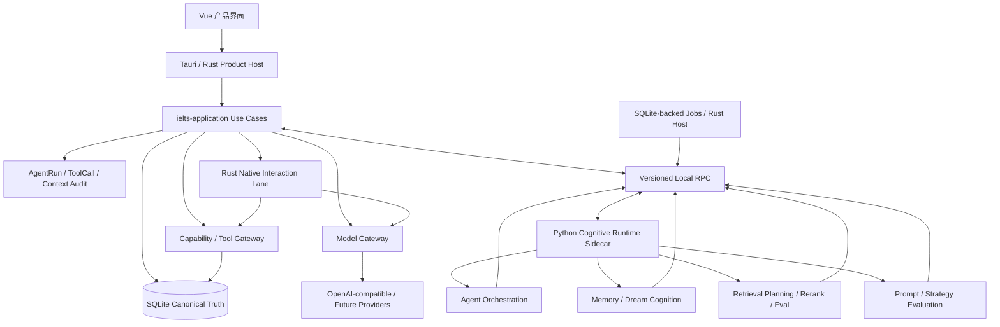
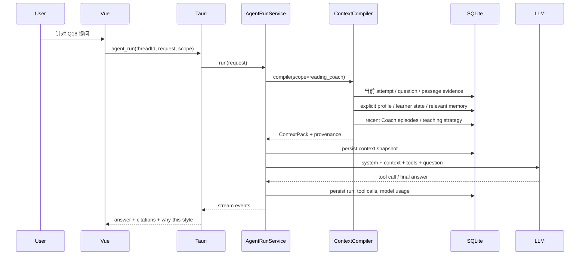
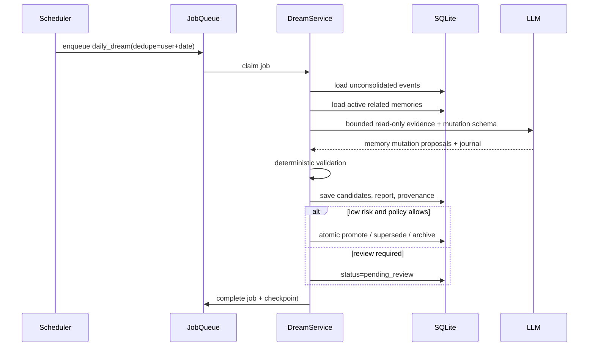
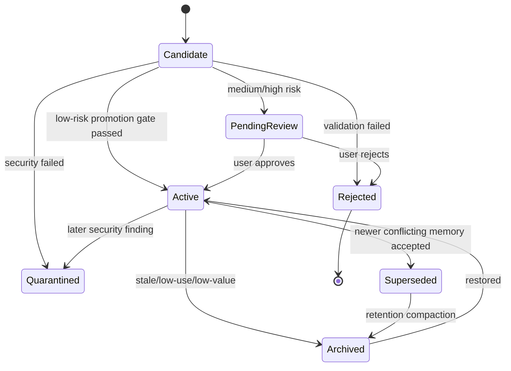

# IELTS Atlas Agent 辅助、自进化与长期个性化系统

> **冻结历史合同（2026-08-31）**：本 v1.3 文件只保留架构背景、设计决策和历史验收意图，不再作为当前实现状态或下一步执行清单。当前实现事实以代码与测试为准；设计文档冲突按 **Round 3 审计附录 > Accepted ADR > Stage Gate Report > 本文件** 处理。请从 [`developer/docs/INDEX.md`](INDEX.md) 进入当前权威入口；Post-M12 工作必须新建版本文件，禁止继续改写本文件。

## Deep Research 与工程落地总计划

> **v1.3 Post-M2 / Python-first Retrieval Revision — 2026-08-12**  
> M1 冻结在 `c9e4f62 feat(agent): implement M1 learning event ledger`；M2 已完成并推送到 `7a99ea4 feat(agent): implement M2 learning observations`。  
> v1.3 在真实 M2 代码审计后冻结 Rust 的 **Learning Truth → Event → Observation** 数据/证据底座，并把尚未实现的 Retrieval/RAG 从一开始定义为 **Python-first derived retrieval engine**。Rust 不再新建一套 RAG backend；Rust 继续拥有 canonical truth、权限、Model/Tool Gateway、最终 materialization/persistence 与审计。
> 在 M3 前只增加一个窄的 **M2.1 Projection Freshness + Cognitive Read Gateway** hardening gate：不重做 M2 schema/taxonomy；只冻结尚有歧义的 edge semantics（必要时 bump projector version），并解决 Python 消费前的 freshness/read-contract/domain-invariant/performance boundary。

- **文档版本**：1.3（Post-M2 / Python-first Retrieval + Cognitive Runtime Revision）
- **日期**：2026-08-12
- **目标分支**：`IELTS-WRITING-FEAT`
- **当前分支基线**：`7a99ea4bb765dd5342428b0ad6c6914519e543fe`
- **Agent Core 引入基线**：`93e4ed4bbf80105876af5c6830f9c7ad9748b9c2`
- **M1 完成提交**：`c9e4f620bf2a0d5ed0a051c79ac66c0b8d07047d`
- **M2 完成提交**：`7a99ea4bb765dd5342428b0ad6c6914519e543fe`
- **TechSpar 参考基线**：`AnnaSuSu/TechSpar@3cca462675740eb1529b4232e07b9e12adccb31d`
- **开发机 TechSpa 绝对参考根目录**：`F:\workspace\TechSpa`
- **文档性质**：架构设计、产品机制设计、数据设计、接口设计、分阶段工程任务书、测试与验收规范
- **产品定位**：本地优先、证据驱动、Agent 辅助的 IELTS 学习桌面产品

---

> **v1.3 修订说明**：第 1-20 章继续作为研究与架构背景；M0/M1/M2 是已实现历史合同。**从 M2.1 起，以第 21-23 章 v1.3 内容为实施权威。** 若旧段落与 v1.3 的 Python-first Retrieval、M2 completion、Cognitive Read Gateway、Context materialization、TechSpa 绝对路径或 runtime ownership 冲突，以 v1.3 第 21-23 章为准。

## 目录

1. [执行摘要](#1-执行摘要)
2. [范围、非目标与核心术语](#2-范围非目标与核心术语)
3. [当前分支最新实现审计](#3-当前分支最新实现审计)
4. [发散调研：行业与研究领域的可复用模式](#4-发散调研行业与研究领域的可复用模式)
5. [收敛决策：IELTS Atlas 应采用的总体模型](#5-收敛决策ielts-atlas-应采用的总体模型)
6. [目标架构](#6-目标架构)
7. [Soul、User、Memory、Diary、Skill 的边界](#7-soulusermemorydiaryskill-的边界)
8. [数据架构与 SQLite Schema 设计](#8-数据架构与-sqlite-schema-设计)
9. [学习事件账本与证据模型](#9-学习事件账本与证据模型)
10. [长期记忆生命周期](#10-长期记忆生命周期)
11. [Daily Journal 与 Dream 离线整合机制](#11-daily-journal-与-dream-离线整合机制)
12. [学习者模型与重复练习分析](#12-学习者模型与重复练习分析)
13. [Context Engineering 与上下文编译器](#13-context-engineering-与上下文编译器)
14. [Agent Runtime、状态、工具与权限](#14-agent-runtime状态工具与权限)
15. [AI Coach 个性化与教学策略演化](#15-ai-coach-个性化与教学策略演化)
16. [产品级 Prompt、Skill 与工具描述自进化](#16-产品级-promptskill-与工具描述自进化)
17. [Hybrid Runtime API、Rust Product Host 与 Tauri 接口设计](#17-hybrid-runtime-apirust-product-host-与-tauri-接口设计)
18. [Vue 产品界面与交互设计](#18-vue-产品界面与交互设计)
19. [安全、隐私与记忆投毒防护](#19-安全隐私与记忆投毒防护)
20. [评测体系、指标与发布门禁](#20-评测体系指标与发布门禁)
21. [逐阶段工程实施计划](#21-逐阶段工程实施计划)
22. [建议目录结构](#22-建议目录结构)
23. [关键伪代码](#23-关键伪代码)
24. [风险清单与反模式](#24-风险清单与反模式)
25. [最终验收标准](#25-最终验收标准)
26. [参考资料](#26-参考资料)

---

# 1. 执行摘要

## 1.1 最终产品不应只是“带工具调用的聊天框”

IELTS Atlas 的核心价值不应停留在：

- 用户在 Agent 工作台输入一句话；
- Agent 调用若干工具；
- Agent 返回一段回答；
- 对话结束后系统只留下 transcript。

真正有价值的产品闭环应是：

```text
用户练习、写作、复盘、提问、修正 Agent
                    ↓
形成可验证的学习事件和交互证据
                    ↓
日内快速记录：Diary / Candidate Memory
                    ↓
夜间或空闲期离线整合：Dream / Reflection
                    ↓
更新可解释的学习者模型、用户画像和教学策略
                    ↓
下一次请求时按任务动态编译最小高价值上下文
                    ↓
Agent 的讲解、练习建议和工具选择更贴近用户
                    ↓
通过后续练习结果验证“是否真的更好”
```

因此，本计划将系统拆成三种不同的“自进化”：

### A. 用户记忆演化

目标是让系统越来越准确地理解：

- 用户稳定偏好；
- 用户当前目标；
- 用户在哪些题型、技能和语言点上存在稳定困难；
- 哪些讲解方式对该用户有效；
- 哪些旧判断已被新证据推翻。

它是**用户级、可查看、可编辑、可撤销**的派生数据演化。

### B. 个性化教学策略演化

目标是让系统逐渐掌握：

- 对该用户应优先使用例证、反例、逐步推理还是直接结论；
- 阅读错题复盘中应强调原文证据、干扰项、定位策略还是时间分配；
- 写作反馈应先给结构、句法、词汇还是任务回应；
- 哪些建议在后续练习中确实产生了正向效果。

它是**用户级程序性记忆**，必须有学习结果证据，不能只根据用户一次“感觉不好”就永久改变。

### C. 产品 Prompt、Skill 与工具描述演化

目标是改进全体用户使用的：

- System Prompt 模块；
- Coach Prompt；
- Memory Extractor Prompt；
- Dream Consolidator Prompt；
- Tool Description；
- 可复用 Skill。

它必须是**开发者控制的离线优化流程**：候选生成、离线评测、保留集、影子运行、人工审批、版本发布、可回滚。线上 Agent 不得直接修改当前生效的核心 Soul 或全局 Prompt。

---

## 1.2 十二条不可破坏的架构原则

1. **练习事实与 Agent 推断分离**  
   `attempts`、答案、分数、耗时、Coach 原始消息等是事实；Memory、画像和趋势是派生结论。

2. **SQLite 中的学习事实默认为只读证据**  
   Agent 可读取和分析，但不得篡改历史得分、答案或原始练习记录。

3. **Soul 是产品政策，不是可自由学习的用户记忆**  
   Agent 不能因某次对话自行改写“自己是谁、允许做什么、禁止做什么”。

4. **显式用户偏好与模型推断画像分表存储**  
   “用户明确说喜欢逐步讲解”和“系统推断用户可能喜欢逐步讲解”必须有不同可信等级。

5. **原始事件追加，长期记忆有界**  
   Diary 可追加；Active Memory 必须有容量、去重、合并、替代、过期和归档机制。

6. **记忆不能无来源**  
   每条自动记忆都必须链接到 attempt、question、Coach message、Agent run 或用户显式输入。

7. **冲突通过 supersede 解决，不通过静默覆盖解决**  
   新结论替代旧结论时保留审计链；UI 应能解释何时、因何改变。

8. **上下文按需编译，不把全部历史塞入 Prompt**  
   Context 是有限资源，应优先放入当前任务证据、明确偏好和高置信记忆。

9. **先建立只读学习工具，再建立写工具**  
   第一阶段 Agent 只读学习数据；任何计划、词汇、复习队列等写入均需明确权限和可撤销性。

10. **自进化必须先评测后生效**  
    不允许生产 Agent 通过“我觉得这次表现不错”直接提升自己的 Prompt 或 Skill。

11. **本地优先与最小披露**  
    数据存 SQLite；发送给远程模型的内容必须是当前任务所需的最小 Context Pack。

12. **逐模块纵向切片，不做全栈同时重写**  
    每个阶段都必须能独立发布、回滚和量化收益。

---

## 1.3 推荐的最终系统形态

v1.2 不采用“两套完整 Agent 并行演进”。推荐形态是 **One Agent Platform, Two Execution Lanes**：



语言职责固定为：

```text
Rust Product Host
  = canonical data + transaction + authorization + audit + deterministic algorithms

Rust Native Interaction Lane
  = 已有 Coach / AttemptReview / 简单问答 / 低延迟固定 tool loop

Python Cognitive Runtime
  = M3+ 新增复杂 Agent cognition / Memory / Dream / RAG orchestration / eval
```

关键规则：

1. **不要求 Rust/Python feature parity。** 已存在且稳定的 Rust Agent 能力保留；新复杂能力默认只实现一次，优先 Python。
2. **Rust Agent baseline 冻结，不删除。** 它是 fallback、低延迟交互路径和安全基线，而不是另一套需要持续追平 Python 的产品。
3. **Python 不直接拥有 canonical SQLite truth。** Python 通过 typed host capability 读取事实并提交 proposal；最终事务、promotion、删除、权限由 Rust 执行。
4. **Model/provider baseline 共享。** 当前 Rust `AiRuntime` / `LanguageModel` / `AgentModel` 抽象演进为 Model Gateway；Python 默认通过 host model adapter 使用同一 provider 配置、credential、retry/usage/trace policy。
5. **Python sidecar 按需启动。** 普通练习和无需复杂 cognition 的路径不需要常驻 Python 进程。
6. **LangGraph 不是基础依赖。** M3-M6 优先采用薄 Python orchestration + Pydantic / OpenAI Agents SDK；只有 M7/M8 的 durable multi-step workflow 经评测证明需要时才引入 LangGraph。
7. **本地 ML 重依赖不进入基础安装包。** `torch`、`transformers`、`sentence-transformers`、CUDA 等默认禁止进入 base sidecar；后续若需要本地 embedding/reranker，作为独立可选 Local Intelligence Pack。

这不是“Rust Agent + Python Agent 两个产品”，而是一套 Agent 平台的两个 execution lane。

# 2. 范围、非目标与核心术语

## 2.1 本计划包含

- 长期记忆分层；
- User Profile 与 Learner Model；
- Daily Journal；
- Dream / Offline Consolidation；
- Context Planning / Materialization；
- Agent 学习数据只读工具；
- Agent run、thread、checkpoint 与后台 job；
- Coach 个性化；
- 学习策略演化；
- Prompt/Skill 自进化评测管线；
- Memory Center、Dream Report、Profile 等 UI；
- SQLite schema、Rust trait、Python cognitive runtime、versioned local RPC、Tauri command 和 Vue repository 设计；
- 安全、隐私、评测和发布门禁。

## 2.2 本计划当前不包含

- 多 Agent 社会或角色群；
- 自主联网替用户执行高风险行为；
- 模型权重在线训练；
- 未经评测自动修改 Rust 代码；
- 直接复刻 Claude Code、OpenClaw、Hermes 或 WorkBuddy；
- 与 `opensource` 分支的数据或接口兼容；
- 将全部题库正文强制存入数据库；
- 第一阶段即引入图数据库、独立向量数据库或云端记忆服务；
- 为了“语言统一”而重写已经稳定的 Rust Coach / AttemptReview / M2 投影路径；
- 在基础安装包中默认捆绑 PyTorch / Transformers / CUDA 或本地大模型。

## 2.3 术语定义

| 术语 | 本文中的准确含义 |
|---|---|
| Learning Truth | 练习、答案、分数、耗时、原始对话等不可由 Agent 改写的事实数据 |
| Observation | 从事实中提取的单条观察，例如“用户在三次 Matching Headings 中均受干扰项影响” |
| Memory Candidate | 尚未成为长期记忆的候选结论 |
| Semantic Memory | 关于用户、学习状态或领域的相对稳定事实 |
| Episodic Memory | 一次具体经历及其结果，例如某种讲解方式在某次复盘中有效 |
| Procedural Memory | “如何对该用户教学”或“如何完成某类任务”的策略 |
| Diary / Journal | 以日期为单位、较详细、允许冗余的工作层记录 |
| Dream | 在后台跨会话聚合证据、压缩、冲突解析和生成候选长期记忆的过程 |
| Soul | 产品定义的 Agent 身份、价值边界、安全规则和不可越权原则 |
| User Profile | 用户明确提供或系统推断的稳定偏好、背景、目标；显式与推断必须分离 |
| Learner Model | 对技能掌握、错误类型、稳定性、遗忘和复习需求的量化模型 |
| Context Pack | 每次模型调用前按预算动态选出的最小高价值上下文 |
| Self-Evolution | 通过证据、评测、候选版本和发布门禁改善记忆、策略或 Prompt，而非无约束自改 |

---

# 3. 当前分支最新实现审计


> **v1.3 当前代码状态覆盖层（执行时优先）**：当前 `IELTS-WRITING-FEAT` tip 已推进到 `7a99ea4bb765dd5342428b0ad6c6914519e543fe`，提交 `feat(agent): implement M2 learning observations`，父提交为 M1 `c9e4f62`。本章后续早期审计段落保留作历史背景，但不得再用旧 tip 判断当前实现。
>
> M2 当前已经真实落地：`0013_learning_observation_projection.sql`、`crates/ielts-db/src/learning_observations.rs`、`crates/ielts-application/src/learning_observations.rs`、Tauri developer-only rebuild/verify wiring、history deletion/retention 同事务 rebuild，以及专项 deterministic/security tests。M2 之后不得把 Observation 逻辑迁到 Python。
>
> 当前远端没有专用 RAG / vector / embedding backend；因此 v1.3 不保留“先写 Rust retrieval、再评估迁移”的过渡路线。M5 从第一天采用 Python-first derived retrieval engine。

> **v1.1 历史说明**：本章后续保留 v1.0/v1.1 时点审计，便于理解架构演进；其中写到的 `5c9fd7c` / `c9e4f62` “当前”状态均为历史快照。v1.3 的真实执行基线是 `7a99ea4`，实施以本章顶部覆盖层及第 21-23 章为准。


## 3.1 历史提交关系（v1.0 快照）

当时分支 tip 为：

- `5c9fd7c6e9d89cc2fd4f7b4ef4cb34f71335c9ce`
- Commit：`feat: migrate opensource visual continuity to Vue`

其父提交：

- `93e4ed4bbf80105876af5c6830f9c7ad9748b9c2`
- Commit：`refactor: add application and agent backend layers`

这两个提交共同构成当前 Agent 基线：父提交建立后端、application ports、Agent loop 和工具审计；tip 提交增加 Agent 工作台和 Vue 视觉层。

## 3.2 当前已经具备的正确基础

### 3.2.1 Application 层已经建立

`crates/ielts-application` 已经存在，并包含：

```text
agent.rs
coach.rs
error.rs
lib.rs
ports.rs
writing_evaluation.rs
```

它不直接依赖 Tauri、Keyring 或原始 SQLite 连接，而通过 port trait 表达：

- `LanguageModel`
- `AgentModel`
- `WritingEvaluationStore`
- `CoachStore`
- `AgentStore`
- `AgentToolExecutor`
- `EventSink`

这是后续 Memory、Dream 和 Learner Model 最合适的扩展位置。

### 3.2.2 已有真实的 Agent loop

当前 `AgentService::run` 已具备：

- System/User/Assistant/ToolResult 消息；
- 模型原生 tool call；
- 工具定义；
- 多轮执行；
- 最大轮数与最大工具调用数；
- token usage 聚合；
- 每次 tool call 的 begin/finish 审计；
- Agent run begin/finish；
- 无效、空 ID、重复 tool call ID 防护；
- 最终回答或限制终止。

默认限制为有限轮数和有限 tool call 数，这一思路应保留，并进一步扩展为不同 run type 的策略配置。

### 3.2.3 Agent run 和 tool call 已落 SQLite

当前 migration `0011_agent_runs_tool_calls.sql` 已建立：

- `agent_runs`
- `agent_tool_calls`

并记录：

- provider、model；
- status；
- rounds；
- result/error；
- tool arguments/result/error；
- 运行和工具调用时间。

重启恢复会把未完成的运行标记为 interrupted。该审计层不应被新 Memory 系统替代，而应扩展为所有 Agent、Dream、Evolution 运行的 trace 主链。

### 3.2.4 LLM runtime 已从 commands 中抽离

`src-tauri/src/ai/runtime.rs` 同时实现：

- 普通结构化 completion；
- Agent 原生 tools 协议；
- usage、latency、provider request ID；
- OpenAI-compatible 请求；
- 限定重试。

这已经比此前“AI 编排直接属于 Tauri command”成熟得多。

### 3.2.5 当前文件工具安全性较好

现有 workspace Agent 具备：

- 15 分钟临时 workspace grant；
- 进程内授权；
- canonical path containment；
- `read_file`、`write_file`、`replace_in_file`；
- 1 MiB 文件限制；
- UTF-8 限制；
- SHA-256 乐观并发控制；
- 原子写；
- 相对路径和敏感路径拦截；
- 工具参数最小审计。

这些模式可直接复用于未来的学习工具权限框架。

## 3.3 当前 Agent 工作台的真实定位

当前 `AgentWorkspacePage.vue` 仍然主要是 UI 原型：

- 文件列表是固定演示数据；
- 运行通过 `setTimeout` 模拟；
- 输出不是由 `agent_run` 返回；
- 未展示真实 tool call；
- 未展示 trace、memory、context 或 approval；
- 未承担学习领域核心流程。

因此，应保留其视觉和交互骨架，但不能把它视为 Agent 产品主架构已经完成。

## 3.4 历史缺口矩阵（v1.0 快照）

| 能力 | 当前状态 | 结论 |
|---|---|---|
| Application ports | 已有 | 保留并扩展 |
| LLM tool protocol | 已有 | 保留 |
| 通用 Agent loop | 已有 | 扩展 run type、checkpoint 和权限 |
| Workspace 文件工具 | 已有 | 保留为独立 workspace Agent |
| 学习领域只读工具 | 缺失 | 第一优先级 |
| Agent conversation thread | 不完整 | `agent_runs` 是执行审计，不等于长期对话线程 |
| Learning Event Ledger | 缺失 | 必须增加 |
| User Profile | 缺失 | 必须显式/推断分离 |
| Long-term Memory | 缺失 | 必须增加类型、证据与生命周期 |
| Daily Journal | 缺失 | 必须增加 |
| Dream scheduler | 缺失 | 必须增加 SQLite job + 后台执行 |
| Context Compiler | 缺失 | 必须增加，不能由 Vue 拼 Prompt |
| Learner Model | 缺失 | 必须增加可解释模型 |
| Repeated Attempt Analysis | 缺失统一服务 | 必须增加 |
| Teaching Strategy Memory | 缺失 | 中后期增加 |
| Prompt/Skill Registry | 部分 Prompt 表存在 | 扩展为统一版本与评测模型 |
| Evolution Eval Harness | 缺失 | 自进化前置条件 |
| Memory Security | 缺失 | 必须在自动写入前完成 |
| Memory UI | 缺失 | 用户信任所必需 |

---

# 4. 发散调研：行业与研究领域的可复用模式

## 4.1 Claude Code / Anthropic：Context 是有限资源

Anthropic 的 Context Engineering 核心结论不是“尽可能多地提供上下文”，而是：

> 选择能够最大化任务成功概率的最小高信号 token 集合。

可复用模式：

- System Prompt 保持适当抽象高度；
- 工具说明要紧凑且准确；
- 采用 just-in-time retrieval；
- 长任务使用 compaction、结构化 memory 和 handoff artifact；
- Agent 评测必须包含 task、trial、grader、trace 和真实 outcome；
- 生成者与评估者应尽量分离；
- 工具返回和持久化 memory 都是潜在注入面。

对 IELTS Atlas 的启示：

- 不把完整练习历史塞进 Coach Prompt；
- Context Compiler 必须可审计；
- 评测不能只看最终文字，应看后续学习结果、工具行为和数据库 outcome；
- Memory 写入前需要安全扫描和 provenance。

## 4.2 Claude Code Memory：人类规则与自动记忆分离

Claude Code 的 `CLAUDE.md` 更接近人类显式维护的规则、命令和项目约定，而自动 memory 用于模型发现的经验。两者用途不同。

对 IELTS Atlas 的映射：

- `Soul` / Product Policy：开发者显式规则；
- `Explicit User Preferences`：用户显式规则；
- `Inferred Memory`：系统基于证据生成；
- 不允许把三者混成一张自由文本表。

## 4.3 OpenClaw：Daily、Memory、User、Dream 四层

OpenClaw 的公开设计将：

- `USER.md`：用户模型；
- `MEMORY.md`：精炼长期记忆；
- `memory/YYYY-MM-DD.md`：每日工作层；
- `DREAMS.md`：梦境和整合报告；

分开管理。Daily 不会全部注入每次 Prompt；长期 Memory 有上下文预算；Dreaming 通过 light、REM、deep 阶段整合，并只有 deep 阶段写入长期记忆。

最值得采用的不是 Markdown 文件格式，而是：

1. 工作层与精选层分离；
2. 自动整合有阶段；
3. 长期层有容量；
4. 用户可以审阅 Dream 报告；
5. promotion 前重读原始证据，避免从过期索引提升。

## 4.4 Hermes：有界 Memory、冻结快照、FTS5 历史搜索

Hermes 采用小型、强约束、始终注入的 `MEMORY.md` 和 `USER.md`，同时把完整 Session 存 SQLite 并使用 FTS5 按需搜索。

关键模式：

- Active Memory 必须有严格容量；
- 写满时要求合并或替代，而不是无限追加；
- memory snapshot 在会话开始冻结，避免中途热替换导致缓存和行为不稳定；
- 完整历史不进入 Active Memory，而通过 FTS5 查询；
- memory 条目有重复防护和注入安全扫描；
- 外部 memory provider 是增强层，不替代本地核心 memory。

对 IELTS Atlas 的建议：

- SQLite 为 canonical store；
- Active Context Profile 是运行时快照；
- Coach 历史使用 FTS5 检索；
- 不需要一开始引入外部 vector DB。

## 4.5 WorkBuddy：夜间更新、用户可管理的画像

WorkBuddy 官方文档说明：

- 从会话提取事实、偏好、关系和跟进项；
- 每晚整理当天会话；
- 记忆摘要会重新生成；
- 用户可以查看、编辑、删除和关闭。

这一产品模式说明：长期个性化不是隐藏的内部状态，而是一项用户可管理的产品能力。

对 IELTS Atlas 的建议：

- Memory Center 必须和后台 Dream 同期建设；
- 用户可关闭某类自动学习；
- 用户可更正错误画像；
- 日更应是“重新整理有效集合”，而不是继续在尾部追加。

## 4.6 memU：Agent 负责判断，存储层负责可读、索引和检索

memU 当前强调：

- Agent 从 session/tool history 决定是否创建、修改或不写 memory/skill；
- Memory service 本身不调用 LLM；
- 可读 Markdown 是 Agent-facing artifact；
- SQLite/Postgres 是 durable store；
- segment embedding 用于检索，最终返回完整可读文件；
- memory 关联来源，可跨 Agent 使用。

对 IELTS Atlas 的建议：

- 不把 Memory 写入逻辑藏在不透明向量服务里；
- Memory 应能导出为可读 Markdown，但 canonical 仍在 SQLite；
- Dream Agent 产出 proposal，Memory Store 只执行经过验证的 mutation；
- 长期可加入 skill track，但第一阶段只做 memory track。

## 4.7 Auto-Dreamer：在线快速记录，离线跨会话整合

Auto-Dreamer 提出将：

- fast online acquisition；
- slow offline consolidation；

分离。整合器读取一个有类型的 memory 区域和来源轨迹，以只读证据为基础，生成一个新的紧凑替代集合，并 supersede 原始区域。

本计划采用其最重要的工程思想：

- Dream 的输入证据只读；
- Dream 不能就地逐条任意改写；
- Dream 生成 replacement proposal set；
- mutation 通过确定性校验器；
- 原 memory 通过 supersession 保留追踪链。

注意：Auto-Dreamer 是 2026 年预印本，应采用其架构思想，而不是把其实验结果直接当作生产保证。

## 4.8 Generative Agents：Observation、Reflection、Retrieval、Planning

Generative Agents 将完整经历记录为 memory stream，周期性生成更高层 reflection，并基于 recency、relevance 和 importance 动态检索。

可复用点：

- Raw observation 与 high-level reflection 分层；
- 反思可由累计重要度而非固定时间单独触发；
- Reflection 仍是 memory，并有来源；
- 反思结果只在相关任务中检索。

对 IELTS Atlas 可增加两个触发条件：

```text
固定时间触发：每日、每周
证据阈值触发：累计重要学习事件超过阈值
```

## 4.9 LangMem / LangGraph：语义、情景、程序性记忆

LangMem 和 LangGraph 区分：

- Semantic memory：事实；
- Episodic memory：经历与有效方法；
- Procedural memory：规则和系统指令；
- Hot-path formation：当前交互内写入；
- Background formation：后台提取、合并和更新；
- Thread checkpoint：当前会话状态；
- Long-term store：跨 thread 数据。

这非常适合 IELTS Atlas：

| 类型 | IELTS 示例 |
|---|---|
| Semantic | 用户长期在 Matching Headings 上不稳定 |
| Episodic | 用“先排除主题范围不匹配的 heading”讲解后，用户下一次同类题正确 |
| Procedural | 对该用户讲 Heading 时先让其复述段落主旨，再看选项 |
| Thread checkpoint | 当前 Coach 对话和工具调用进度 |
| Long-term store | 用户画像、技能状态、长期记忆 |

## 4.10 Letta：Always-visible Memory Block 必须有边界

Letta 的 memory block 是始终注入的结构化区块，并支持 read-only block。

对 IELTS Atlas 的启示：

- Soul、用户明确偏好和少量核心教学策略可以是 always-visible block；
- 大量题目历史和细节绝不能做 always-visible block；
- 每个 block 需要明确 label、description、字符/token 上限和写权限。

## 4.11 OpenAI Agents SDK：Session、Guardrail、Tracing

OpenAI Agents SDK 的可借鉴工程模式包括：

- Session history 与长期 memory 分离；
- SQLite 可作为本地 session backend；
- session input callback 可在模型调用前裁剪历史；
- tool guardrail 在执行前和执行后校验；
- 高风险工具支持 approval；
- trace 覆盖整个 run、model call、tool call 和 guardrail。

当前 Rust Agent loop 已有良好起点，但需要补充：

- thread/session；
- context snapshot；
- tool input/output guardrail；
- approval state；
- model invocation trace；
- run cancellation 与 checkpoint。

## 4.12 Hermes Self-Evolution / GEPA：优化必须在生产运行之外

Hermes Self-Evolution 的正确模式是：

```text
读取当前 Skill/Prompt
        ↓
生成或整理 Eval Dataset
        ↓
从真实 execution trace 分析失败原因
        ↓
生成候选版本
        ↓
训练集 / 验证集 / Holdout 评测
        ↓
尺寸、语义、测试、缓存等约束
        ↓
人工 Review / PR
        ↓
新会话生效
```

同时，相关开源项目已经出现版本兼容和优化目标没有真正被 mutation 的公开问题。这说明不应直接把一个第三方优化器当作黑盒生产能力。

对 IELTS Atlas 的建议：

- 自进化管线放在 `developer/evolution/`；
- Rust 生产运行时只加载已发布版本；
- GEPA 是可选候选生成器，不是架构核心；
- 所有候选必须经过本项目自己的 evaluator 和 holdout；
- 不允许 mid-session 热替换。

## 4.13 学习科学：记忆系统必须优化真实学习，而不是只优化满意度

检索练习和间隔练习研究表明：

- 主动回忆比单纯重复阅读更有利于延迟保持；
- 最佳间隔与目标保持周期相关；
- 学习者常高估重复阅读带来的掌握程度；
- 系统应帮助用户识别“以为会”与“真正能提取”之间的差异。

因此，Agent 个性化不应只追求：

- 回答更像用户喜欢的风格；
- 用户短期更满意；

还应追求：

- 后续同类新题表现改善；
- 间隔后仍能保持；
- 解释减少错误而不是泄露答案；
- 用户的自我判断更准确。

## 4.14 知识追踪：先可解释，再深度模型

Knowledge Tracing 的目标是估计学习者随时间变化的知识状态。深度模型可获得较强预测能力，但需要足够大、稳定和正确标注的数据，同时可解释性较弱。

IELTS Atlas 初期应采用：

- Beta-Bernoulli / EWMA；
- 时间衰减；
- 跨题目证据多样性；
- 重复同题降权；
- 显式错误 taxonomy；
- 置信区间或 uncertainty；

而不是立即实现 DKT。只有在匿名化、用户同意且数据量足够后，才评估更复杂模型。

## 4.15 调研收敛矩阵

| 行业模式 | 采用 | 暂缓 | 拒绝 |
|---|---:|---:|---:|
| 有界 Active Memory | ✅ |  |  |
| Daily 工作层 + Long-term 精选层 | ✅ |  |  |
| Background Dream | ✅ |  |  |
| USER / SOUL / MEMORY 分离 | ✅ |  |  |
| SQLite + FTS5 | ✅ |  |  |
| Hybrid retrieval | ✅，先 FTS5 后 embedding |  |  |
| Temporal knowledge graph |  | ✅ |  |
| 独立向量数据库 |  | ✅ |  |
| 多 Agent 群体 |  | ✅ |  |
| 在线 Agent 直接改 System Prompt |  |  | ❌ |
| 在线 Agent 直接改代码并发布 |  |  | ❌ |
| Memory 无来源自由写入 |  |  | ❌ |
| 全历史每轮注入 |  |  | ❌ |
| 用户无法查看和删除画像 |  |  | ❌ |
| 只用满意度作为自进化奖励 |  |  | ❌ |


---

# 5. 收敛决策：IELTS Atlas 应采用的总体模型

## 5.1 产品核心不是“通用 Agent”，而是“学习证据操作系统”

推荐将产品定义为：

> Agent 负责理解目标、选择工具、组织解释和提出行动；SQLite 中的学习事实、Memory 系统和 Learner Model 负责让 Agent 对用户形成连续、可验证且可治理的理解。

产品价值排序应为：

1. **准确记录学习事实**；
2. **从跨时间证据中识别变化**；
3. **为当前任务检索最相关的用户上下文**；
4. **用适合该用户的方式解释和建议**；
5. **验证建议是否在未来产生学习收益**；
6. **在评测门禁下改善策略与 Prompt**。

Agent 工作台是一个入口，但不应成为所有智能能力唯一入口。大量个性化应在阅读页、写作页、历史页和每日总结中自然发生。

## 5.2 四条相互独立的数据链

### 5.2.1 Learning Truth Chain

```text
用户行为
  → attempts / answers / evaluations / annotations / coach_messages
  → learning_events
  → learner_skill_observations
```

规则：只追加、可纠错但不可被 Agent 静默修改。

### 5.2.2 Memory Chain

```text
learning_events / messages
  → memory candidates
  → journal
  → dream consolidation
  → active semantic / episodic / procedural memory
  → supersession / archive
```

规则：所有结论有来源、置信度和生命周期。

### 5.2.3 Context Chain

```text
当前请求
  → task classifier
  → retrieval query plan
  → memory + learner state + current evidence retrieval
  → ranking / dedup / budget packing
  → Context Pack
  → model call
```

规则：Context Pack 是每次运行的可审计产物。

### 5.2.4 Evolution Chain

```text
生产 traces + 用户反馈 + 后续学习结果
  → eval dataset candidates
  → baseline / candidate execution
  → deterministic + LLM + human graders
  → shadow / canary
  → prompt or skill version promotion
```

规则：不得从生产 trace 直接跳到线上生效版本。

## 5.3 三种不同的时间尺度

| 时间尺度 | 机制 | 目标 |
|---|---|---|
| 实时 / 单次请求 | Context Compiler、Agent tools | 完成当前学习任务 |
| 会话结束 / 当日 | candidate extraction、daily journal | 不丢失有价值的新证据 |
| 日 / 周 / 月 | dream、reflection、compaction、eval | 跨会话抽象、删除冗余、验证策略 |

## 5.4 本地优先的技术选择

v1.2 的技术选择从“Rust modular monolith”调整为 **Rust local-first host + Python cognitive sidecar**：

- Canonical store：现有 SQLite，由 Rust 拥有 schema、migration、transaction 和 privacy semantics；
- Full-text：SQLite FTS5，继续作为第一阶段 lexical retrieval baseline；
- Deterministic projection / learner math / scheduler state：Rust；
- Existing Coach / AttemptReview / simple Q&A：Rust baseline 保留；
- New complex cognition：M3 起 Python-first；
- Python baseline dependencies：优先 `pydantic` + `openai-agents` + 标准 HTTP/async 依赖，避免先引入完整 LangChain stack；
- Durable graph：M7/M8 再评估 LangGraph，不作为 M3 bootstrap 前置条件；
- Background jobs：SQLite queue + Rust/Tauri host，Python 只执行被 claim 的 cognitive job；
- Embedding：不作为 base installer 的硬依赖；优先 remote/provider embedding 或现有 Rust backend；
- Vector index：属于 derived/rebuildable index，不成为第二 canonical truth；
- Remote LLM：只接收编译后的最小 Context Pack；
- Scheduler：应用启动、空闲、指定时间窗口触发，不依赖云端常驻服务；
- Python sidecar：Tauri `externalBin` 方式按 target 构建、签名、校验并按需启动。

### 5.4.1 安装包体积结论与预算

2026-08 的公开发行物表明，Python runtime 本身不是最大风险：Python 3.14 Windows x64 embeddable package 约 11.4 MB；`openai-agents` wheel 本身不到 1 MB。真正会造成明显膨胀的是本地 ML runtime，例如 PyTorch 2.13 的 Windows x64 wheel 约 122 MB，Linux x86-64 wheel可超过 500 MB。最终 frozen sidecar 还会包含解释器、标准库及传递依赖，所以不能简单相加，必须由 CI 实测。

因此建立 provisional release budget：

```text
Base Python cognitive sidecar compressed artifact     <= 60 MB
Base installer delta caused by Python runtime         <= 80 MB
Python sidecar idle RSS after warmup                   <= 150 MB
Cold on-demand start on reference Windows machine     <= 1.5 s
Base sidecar dependency on torch/transformers/CUDA     = 0
```

这些是工程门禁，不是对最终真实体积的预判。M3 bootstrap 必须生成真实 Windows/macOS build-size report；若超过预算，先裁依赖，不通过“接受越来越大的安装包”解决。

### 5.4.2 Rust 依赖并不是“零体积”

Rust crate 通常被静态链接进最终 binary，因此用户看不到独立运行时目录，但 crate 和 native library 仍会增加 executable / bundle 大小。Python 的差异是需要同时携带 interpreter 与模块。决策应比较最终 installer / RSS / cold start，而不是比较 source dependency 数量。

## 5.5 关于“SQL 是只读还是 Agent 可写”

应避免把“整个 SQL 都只读”理解为技术限制。正确做法是按数据类别授权：

| 数据 | Agent 权限 |
|---|---|
| 原始练习记录、分数、答案 | 只读 |
| 用户显式偏好 | 通过专用工具写入，用户可编辑 |
| Memory candidate | Agent 可提议，不直接生效 |
| Active inferred memory | Dream service 按门禁变更 |
| Diary | 后台服务可写，用户可编辑/删除 |
| 学习计划 | 初期提议；后期用户批准后写入 |
| 词汇收藏 | 用户确认或低风险明确动作后写入 |
| Soul / 安全政策 | 生产 Agent 只读 |
| Prompt/Skill active version | 生产 Agent 只读；开发管线发布 |

---

# 6. 目标架构

## 6.1 建议的 Hybrid 模块边界

M2 已在 Rust 完成并冻结；M2.1 只补消费接口/freshness，M3 之后目录按“host / cognition”拆分：

```text
crates/
  ielts-domain/                 # shared canonical contracts
  ielts-db/                     # SQLite truth / deterministic evidence projections / migrations
  ielts-application/            # use cases / policy / deterministic services

src-tauri/
  src/
    ai/                         # current provider runtime -> Model Gateway
    agent/                      # Rust native lane + host tool execution
    cognitive_runtime/          # sidecar lifecycle / RPC / health / cancel
    corpus_gateway/             # canonical corpus export/fetch + sensitivity/auth only
    jobs/                       # persisted scheduling / lease / recovery

agent-runtime-python/
  pyproject.toml
  uv.lock
  src/ielts_agent/
    protocol/                   # generated/validated RPC DTOs
    runtime/                    # runner / cancellation / trace bridge
    agents/                     # new complex cognitive agents only
    memory/                     # extract / semantic resolve proposal
    dream/                      # daily / weekly orchestration
    retrieval/                  # query plan / fusion / rerank
    evals/                      # replay / graders / experiments
    providers/                  # HostModel adapter; no canonical credential store
  tests/

schemas/
  cognitive_protocol/
    envelope.schema.json
    model.schema.json
    tool.schema.json
    memory.schema.json
    retrieval.schema.json
    dream.schema.json
```

**不把现有 Rust Agent 重新实现一遍 Python 版。** Python 目录只新增复杂 cognition；Rust native lane 进入 maintenance mode，除安全、协议适配、低延迟问答能力外不追求 feature parity。

### 6.1.1 Runtime ownership matrix

| 能力 | Rust | Python | 规则 |
|---|---|---|---|
| SQLite canonical data / migration | Owner | 无直接写权限 | 单一 truth |
| Learning Event / Observation deterministic projection | Owner | Consumer | M1/M2 不迁移 |
| Existing Coach / AttemptReview baseline | Owner / Frozen | 可后续增强 | 不返工 |
| Tool execution / authorization | Owner | Planner / Caller | Python 不能绕过 host |
| Provider credential / default model policy | Owner | Adapter | 默认共享 Model Gateway |
| Memory extraction cognition | Validator/Persistence | Owner | M3 Python-first |
| Learner Model deterministic state | Owner | Consumer | M4 Rust-first |
| Canonical corpus / source IDs / sensitivity policy | Owner | Consumer | Rust 只提供受权 corpus export/fetch，不实现 RAG index |
| Derived retrieval index / FTS / embeddings / fusion / rerank | Metadata/Audit Gate | Owner | M5 从零 Python-first；derived、可删、可重建 |
| Context planning / ranking | Policy provider | Owner | Python 产出 typed ContextPlan，不直接伪造 canonical facts |
| Final context materialization / authorization / hard token ceiling | Owner | 提交 ContextPlan | Rust 按 stable IDs 重取正文并 fail-closed |
| Daily/Weekly Dream orchestration | Job owner / persistence | Owner | M7/M8 |
| Eval / prompt experiment | Promotion gate | Owner | M10/M11 |

## 6.2 核心服务

### 6.2.1 LearningEventService

职责：

- 从已提交 attempt、Coach message、Agent run、用户反馈生成标准事件；
- 确保 idempotency；
- 规范化 question、skill、asset、时间和来源；
- 不做高层推断。

### 6.2.2 LearnerModelService

职责：

- 把 learning event 映射为 skill observation；
- 更新技能状态；
- 分析同题重复、跨题型重复和时间间隔；
- 输出 uncertainty 和证据解释。

### 6.2.3 MemoryExtractionService

职责：

- 从一次 session 或事件窗口提取候选 memory；
- 区分显式偏好、推断事实、具体 episode、教学策略候选；
- 只创建 candidate，不越权提升。

### 6.2.4 DreamService

职责：

- 读取一个固定时间窗内未整合事件；
- 读取相关 Active Memory；
- 生成 mutation proposal；
- 执行去重、冲突、证据、安全和容量校验；
- 低风险自动提升或进入用户审阅；
- 生成 Daily/Weekly Dream Report。

### 6.2.5 ContextCompiler

职责：

- 决定当前请求需要哪些类型的上下文；
- 检索事实、画像、Learner State、Memory 和 Diary；
- 排名、去重、截断和格式化；
- 写入 context snapshot；
- 返回供模型调用的固定结构。

### 6.2.6 AgentRunService

职责：

- 创建 thread/run；
- 加载 Context Pack；
- 选择 tool set；
- 执行 Agent loop；
- 处理 approval、cancel、checkpoint；
- 持久化 trace；
- 生成 run result。

### 6.2.7 EvolutionService

职责：

- 管理 Prompt/Skill 候选；
- 从失败 trace 生成 eval case 候选；
- 调用离线 evaluator；
- 记录 baseline/candidate 指标；
- 决定是否允许进入 shadow/canary；
- 不直接修改源码或 active version。

### 6.2.8 CognitiveRuntimeService

职责：

- 按需启动/停止 Python sidecar；
- 协议版本协商、health check、request multiplexing、timeout/cancel；
- 将 Python 的 `tool.invoke` / `model.invoke` 反向请求路由到 Rust Capability / Model Gateway；
- sidecar crash 时将 cognitive run 标为 interrupted，而不是让 Python 自行恢复数据库；
- 维护 binary hash/version/build metadata；
- 不包含 Memory/Dream 业务逻辑。

## 6.3 请求路径：个性化阅读 Coach



## 6.4 后台路径：每日 Dream



## 6.5 不采用全量 Event Sourcing

虽然引入 `learning_events`，但不建议把整个产品改造成严格 Event Sourcing：

- 现有 attempts 等表继续是当前状态和查询主模型；
- event ledger 用于 Agent、Dream、Learner Model 的分析和增量处理；
- 不要求所有页面通过 replay events 重建状态；
- 避免一次架构重写。

---

# 7. Soul、User、Memory、Diary、Skill 的边界

## 7.1 Soul

Soul 表达：

- Agent 的产品身份；
- 教育目标；
- 安全边界；
- 对成绩、事实和用户自主权的原则；
- 不允许做的事情；
- 在不确定时如何表达。

示例：

```markdown
# IELTS Atlas Learning Agent

- 你是学习辅助者，不是考试成绩的唯一裁判。
- 不得修改原始成绩、答案或历史事实。
- 讲解必须优先引用当前题目证据。
- 个性化画像是可纠正的推断，不得作为对用户能力的绝对标签。
- 不得通过泄露答案制造“学习改善”的假象。
- 任何长期用户画像变化必须可解释、可查看、可删除。
```

写权限：

- 开发者发布管线：可写；
- 产品管理员：可切换已发布版本；
- 生产 Agent：只读；
- Dream Agent：只读；
- 用户：不可直接改安全核心，但可配置可选风格参数。

## 7.2 User Profile

必须分成两个来源：

### Explicit Profile

用户明确提供：

- 目标分数；
- 考试日期；
- 每日可用时间；
- 偏好语言；
- 偏好讲解风格；
- 禁止记忆的内容；
- 是否允许后台 Dream；
- 是否允许使用远程模型处理练习内容。

可信等级最高，除非用户修改，否则自动推断不能覆盖。

### Inferred Profile

系统推断：

- 用户可能偏好先结论后推理；
- 用户对术语解释接受度；
- 用户通常在长回答中途重新提问；
- 用户更容易从例子、对比或反例中理解。

必须包含：

- confidence；
- evidence；
- first/last observed；
- active/superseded；
- 可被用户纠正。

## 7.3 Learner Model

Learner Model 不等于 User Profile。

```text
User Profile：用户是谁、偏好什么、目标是什么
Learner Model：用户目前会什么、不稳定在哪里、证据有多强
```

禁止把“当前某题型掌握度低”写成稳定人格标签。

## 7.4 Memory

### Semantic Memory

例：

- “用户在过去 21 天的 5 个不同文章中，Matching Headings 的主要失误是过早根据局部关键词选项。”

### Episodic Memory

例：

- “2026-08-03 复盘 `asset-X/Q14` 时，使用先概括段落主旨再比较选项的讲解后，用户能够自行解释错误原因，并在两天后的不同文章同类题中答对。”

### Procedural Memory

例：

- “对该用户讲解 Matching Headings：先要求一句话概括段落，再显示候选 heading；避免一开始给答案。”

Procedural Memory 的生效门槛应高于 Semantic Memory，因为它会直接改变 Agent 行为。

## 7.5 Diary / Journal

Diary 是详细工作层，允许：

- 多条观察；
- 当日总结；
- 尚未证实的猜测；
- 待验证问题；
- 当日 Agent 交互摘要；
- 当前学习计划进展。

Diary 不等于 Active Memory。它不应全部进入每次 Prompt。

## 7.6 Skill

Skill 是跨用户可复用的程序化说明，例如：

- 如何复盘 Matching Headings；
- 如何分析 IELTS Task 2 论证结构；
- 如何从连续练习中判断“偶然错误”和“稳定错误”；
- 如何创建一周学习计划。

Skill 不应保存用户私有数据。用户私有的教学策略引用 Skill，并通过参数进行个性化。

## 7.7 权限矩阵

| 对象 | 用户 | 在线 Agent | Dream Agent | 开发 Evolution |
|---|---:|---:|---:|---:|
| Soul active | 只读 | 只读 | 只读 | 候选、评测、发布 |
| Explicit Profile | 查看/编辑/删除 | 读取；仅明确指令时写 | 不覆盖 | 不访问内容 |
| Inferred Profile | 查看/纠正/删除 | 读取 | 提议/更新 | 只使用脱敏 eval |
| Raw Learning Truth | 查看 | 只读 | 只读 | 仅测试 fixture |
| Diary | 查看/编辑/删除 | 可追加 session summary | 生成/重写当日摘要 | 不访问生产内容 |
| Semantic Memory | 查看/管理 | 读取、提议 | 合并/替代/归档 | 不直接访问生产内容 |
| Episodic Memory | 查看/管理 | 检索 | 生成/压缩 | 可用脱敏案例 |
| Procedural Memory | 查看/关闭 | 读取 | 生成候选 | 评测全局 Skill |
| Prompt/Skill active | 只读 | 只读 | 只读 | 发布 |

## 7.8 推荐的 Always-visible token 预算

不建议复制某一产品的固定字符数，而应从配置开始：

| Block | 初始预算建议 |
|---|---:|
| Soul + 安全规则 | 800–1,500 tokens |
| Explicit User Profile | 250–500 tokens |
| Inferred Profile 精选摘要 | 250–500 tokens |
| 当前 scope 核心教学策略 | 200–400 tokens |
| 其余 Memory | 按需检索，不始终注入 |

预算是初始假设，必须通过 token、质量和延迟评测调整。

---

# 8. 数据架构与 SQLite Schema 设计

## 8.1 数据层级

```text
Level 0: Immutable / canonical learning truth
  attempts, attempt_answers, evaluations, coach_messages, annotations ...

Level 1: Append-only normalized evidence
  learning_events, learner_skill_observations

Level 2: Derived mutable projections
  learner_skill_state, inferred_profile, daily_journals

Level 3: Curated memory
  memory_items, memory_evidence, memory_mutations

Level 4: Agent execution and context
  agent_threads, agent_messages, agent_runs, agent_tool_calls,
  agent_checkpoints, agent_context_items

Level 5: Self-evolution governance
  prompt_versions, eval_suites, eval_cases, eval_runs, eval_results
```

## 8.2 Migration 策略

当前 schema version 为 11。建议后续按能力边界增加：

```text
0012_learning_event_ledger.sql
0013_agent_threads_checkpoints.sql
0014_memory_profile_core.sql
0015_journal_dream_jobs.sql
0016_learner_model.sql
0017_prompt_evolution_evals.sql
0018_memory_fts.sql
```

不要把所有表塞进一个 migration。每个 migration 必须：

- 可在当前 v11 数据库升级；
- 单事务；
- 有 rollback fixture 或恢复说明；
- 有 fresh DB 和 upgrade DB 测试；
- 纳入 backup canonical tables；
- 明确 retention 和 privacy delete 行为。

## 8.3 `learning_events`

```sql
CREATE TABLE learning_events (
  id TEXT PRIMARY KEY NOT NULL,
  user_id TEXT NOT NULL DEFAULT 'local',
  event_type TEXT NOT NULL,
  source_kind TEXT NOT NULL,
  source_id TEXT,
  idempotency_key TEXT NOT NULL UNIQUE,

  activity TEXT,
  asset_id TEXT,
  attempt_id TEXT,
  question_id TEXT,
  skill_key TEXT,

  occurred_at TEXT NOT NULL,
  payload_json TEXT NOT NULL,
  content_hash TEXT NOT NULL,
  schema_version INTEGER NOT NULL DEFAULT 1,

  consolidation_state TEXT NOT NULL DEFAULT 'pending'
    CHECK (consolidation_state IN ('pending','processed','ignored','quarantined')),
  sensitivity TEXT NOT NULL DEFAULT 'normal'
    CHECK (sensitivity IN ('normal','private','restricted')),

  created_at TEXT NOT NULL,
  updated_at TEXT NOT NULL,

  FOREIGN KEY (attempt_id) REFERENCES attempts(id) ON DELETE CASCADE
);

CREATE INDEX idx_learning_events_pending
  ON learning_events(consolidation_state, occurred_at);
CREATE INDEX idx_learning_events_attempt
  ON learning_events(attempt_id, occurred_at);
CREATE INDEX idx_learning_events_asset
  ON learning_events(asset_id, occurred_at);
CREATE INDEX idx_learning_events_skill
  ON learning_events(skill_key, occurred_at);
CREATE INDEX idx_learning_events_type_time
  ON learning_events(event_type, occurred_at);
```

事件示例：

```json
{
  "eventType": "reading.question_submitted",
  "sourceKind": "attempt_answer",
  "activity": "reading",
  "assetId": "p2-high-120",
  "attemptId": "attempt-...",
  "questionId": "q18",
  "skillKey": "reading.matching_headings.main_idea",
  "occurredAt": "2026-08-10T14:30:00Z",
  "payload": {
    "correct": false,
    "answer": "iv",
    "correctAnswer": "vii",
    "changeCount": 3,
    "visitCount": 4,
    "elapsedMs": 91000,
    "marked": true,
    "attemptOrdinalForAsset": 3,
    "daysSincePreviousAttempt": 2
  }
}
```

## 8.4 Agent thread、message 与 checkpoint

现有 `agent_runs` 是一次执行审计，不足以表示长期对话。

```sql
CREATE TABLE agent_threads (
  id TEXT PRIMARY KEY NOT NULL,
  user_id TEXT NOT NULL DEFAULT 'local',
  thread_kind TEXT NOT NULL,
  scope_json TEXT,
  title TEXT,
  status TEXT NOT NULL DEFAULT 'active'
    CHECK (status IN ('active','archived','deleted')),
  created_at TEXT NOT NULL,
  updated_at TEXT NOT NULL,
  last_run_id TEXT,
  FOREIGN KEY (last_run_id) REFERENCES agent_runs(id) ON DELETE SET NULL
);

CREATE TABLE agent_messages (
  id TEXT PRIMARY KEY NOT NULL,
  thread_id TEXT NOT NULL,
  sequence INTEGER NOT NULL,
  role TEXT NOT NULL
    CHECK (role IN ('system','user','assistant','tool','summary')),
  content TEXT NOT NULL,
  structured_payload TEXT,
  source_run_id TEXT,
  created_at TEXT NOT NULL,
  UNIQUE(thread_id, sequence),
  FOREIGN KEY (thread_id) REFERENCES agent_threads(id) ON DELETE CASCADE,
  FOREIGN KEY (source_run_id) REFERENCES agent_runs(id) ON DELETE SET NULL
);

CREATE TABLE agent_checkpoints (
  id TEXT PRIMARY KEY NOT NULL,
  run_id TEXT NOT NULL,
  step_index INTEGER NOT NULL,
  state_json TEXT NOT NULL,
  state_hash TEXT NOT NULL,
  created_at TEXT NOT NULL,
  UNIQUE(run_id, step_index),
  FOREIGN KEY (run_id) REFERENCES agent_runs(id) ON DELETE CASCADE
);
```

建议扩展 `agent_runs`：

```sql
ALTER TABLE agent_runs ADD COLUMN thread_id TEXT;
ALTER TABLE agent_runs ADD COLUMN run_type TEXT NOT NULL DEFAULT 'workspace';
ALTER TABLE agent_runs ADD COLUMN parent_run_id TEXT;
ALTER TABLE agent_runs ADD COLUMN context_snapshot_id TEXT;
ALTER TABLE agent_runs ADD COLUMN cancel_requested_at TEXT;
ALTER TABLE agent_runs ADD COLUMN waiting_reason TEXT;
```

如 SQLite migration 不便直接加入复杂 FK，可先加入列和索引，再在新表层建立引用校验。

## 8.5 显式用户偏好

```sql
CREATE TABLE explicit_user_preferences (
  user_id TEXT NOT NULL DEFAULT 'local',
  preference_key TEXT NOT NULL,
  scope TEXT NOT NULL DEFAULT 'global',
  value_json TEXT NOT NULL,
  status TEXT NOT NULL DEFAULT 'active'
    CHECK (status IN ('active','disabled','deleted')),
  source TEXT NOT NULL DEFAULT 'user'
    CHECK (source IN ('user','import','product_default')),
  created_at TEXT NOT NULL,
  updated_at TEXT NOT NULL,
  PRIMARY KEY (user_id, preference_key, scope)
);
```

示例 key：

```text
communication.language
communication.answer_length
teaching.show_answer_timing
teaching.prefer_passage_evidence
privacy.allow_background_dream
privacy.allow_remote_llm
privacy.remember_coach_conversations
learning.target_band
learning.exam_date
learning.daily_minutes
```

## 8.6 `memory_items`

```sql
CREATE TABLE memory_items (
  id TEXT PRIMARY KEY NOT NULL,
  user_id TEXT NOT NULL DEFAULT 'local',
  scope TEXT NOT NULL,
  memory_type TEXT NOT NULL
    CHECK (memory_type IN (
      'semantic',
      'episodic',
      'procedural',
      'inferred_profile',
      'goal',
      'constraint'
    )),

  canonical_key TEXT,
  subject_key TEXT,
  title TEXT,
  content TEXT NOT NULL,
  structured_json TEXT,

  status TEXT NOT NULL DEFAULT 'candidate'
    CHECK (status IN (
      'candidate',
      'pending_review',
      'active',
      'superseded',
      'archived',
      'rejected',
      'quarantined',
      'deleted'
    )),

  confidence REAL NOT NULL DEFAULT 0
    CHECK (confidence >= 0 AND confidence <= 1),
  importance REAL NOT NULL DEFAULT 0
    CHECK (importance >= 0 AND importance <= 1),
  source_trust REAL NOT NULL DEFAULT 0
    CHECK (source_trust >= 0 AND source_trust <= 1),
  sensitivity TEXT NOT NULL DEFAULT 'normal'
    CHECK (sensitivity IN ('normal','private','restricted')),

  valid_from TEXT,
  valid_to TEXT,
  first_observed_at TEXT,
  last_observed_at TEXT,
  last_recalled_at TEXT,
  recall_count INTEGER NOT NULL DEFAULT 0,
  successful_use_count INTEGER NOT NULL DEFAULT 0,
  contradicted_count INTEGER NOT NULL DEFAULT 0,

  version INTEGER NOT NULL DEFAULT 1,
  supersedes_id TEXT,
  created_by TEXT NOT NULL,
  created_run_id TEXT,
  content_hash TEXT NOT NULL,
  created_at TEXT NOT NULL,
  updated_at TEXT NOT NULL,

  FOREIGN KEY (supersedes_id) REFERENCES memory_items(id) ON DELETE SET NULL,
  FOREIGN KEY (created_run_id) REFERENCES agent_runs(id) ON DELETE SET NULL
);

CREATE INDEX idx_memory_active_scope
  ON memory_items(user_id, scope, memory_type, status);
CREATE INDEX idx_memory_subject
  ON memory_items(subject_key, status);
CREATE INDEX idx_memory_canonical
  ON memory_items(canonical_key, status);
CREATE INDEX idx_memory_recency
  ON memory_items(last_observed_at DESC);

CREATE UNIQUE INDEX uq_memory_active_canonical
  ON memory_items(user_id, scope, canonical_key)
  WHERE status = 'active' AND canonical_key IS NOT NULL;
```

`canonical_key` 用于表达一个可替代 slot，例如：

```text
profile.communication.explanation_style
learner.reading.matching_headings.primary_error
strategy.reading.matching_headings.teaching_sequence
```

## 8.7 Memory evidence 与 mutation audit

```sql
CREATE TABLE memory_evidence (
  memory_id TEXT NOT NULL,
  event_id TEXT NOT NULL,
  evidence_role TEXT NOT NULL DEFAULT 'support'
    CHECK (evidence_role IN ('support','contradict','context','outcome')),
  weight REAL NOT NULL DEFAULT 1,
  excerpt TEXT,
  created_at TEXT NOT NULL,
  PRIMARY KEY (memory_id, event_id, evidence_role),
  FOREIGN KEY (memory_id) REFERENCES memory_items(id) ON DELETE CASCADE,
  FOREIGN KEY (event_id) REFERENCES learning_events(id) ON DELETE CASCADE
);

CREATE TABLE memory_mutations (
  id TEXT PRIMARY KEY NOT NULL,
  memory_id TEXT,
  operation TEXT NOT NULL
    CHECK (operation IN (
      'create',
      'promote',
      'merge',
      'supersede',
      'archive',
      'reject',
      'quarantine',
      'restore',
      'delete'
    )),
  actor_type TEXT NOT NULL
    CHECK (actor_type IN ('user','agent','dream','system','developer')),
  actor_id TEXT,
  run_id TEXT,
  before_json TEXT,
  after_json TEXT,
  reason TEXT NOT NULL,
  created_at TEXT NOT NULL,
  FOREIGN KEY (memory_id) REFERENCES memory_items(id) ON DELETE SET NULL,
  FOREIGN KEY (run_id) REFERENCES agent_runs(id) ON DELETE SET NULL
);
```

## 8.8 Daily Journal 与 Dream

```sql
CREATE TABLE daily_journals (
  id TEXT PRIMARY KEY NOT NULL,
  user_id TEXT NOT NULL DEFAULT 'local',
  journal_date TEXT NOT NULL,
  scope TEXT NOT NULL DEFAULT 'global',
  version INTEGER NOT NULL DEFAULT 1,
  status TEXT NOT NULL DEFAULT 'draft'
    CHECK (status IN ('draft','final','superseded','deleted')),
  summary_markdown TEXT NOT NULL,
  structured_json TEXT NOT NULL,
  coverage_start TEXT NOT NULL,
  coverage_end TEXT NOT NULL,
  source_event_count INTEGER NOT NULL,
  dream_run_id TEXT,
  content_hash TEXT NOT NULL,
  created_at TEXT NOT NULL,
  updated_at TEXT NOT NULL,
  UNIQUE(user_id, journal_date, scope, version)
);

CREATE TABLE dream_runs (
  id TEXT PRIMARY KEY NOT NULL,
  user_id TEXT NOT NULL DEFAULT 'local',
  dream_kind TEXT NOT NULL
    CHECK (dream_kind IN ('session_close','daily','weekly','monthly','manual')),
  status TEXT NOT NULL
    CHECK (status IN ('queued','running','completed','failed','cancelled','interrupted')),
  coverage_start TEXT NOT NULL,
  coverage_end TEXT NOT NULL,
  input_event_count INTEGER NOT NULL DEFAULT 0,
  input_memory_count INTEGER NOT NULL DEFAULT 0,
  candidate_count INTEGER NOT NULL DEFAULT 0,
  promoted_count INTEGER NOT NULL DEFAULT 0,
  rejected_count INTEGER NOT NULL DEFAULT 0,
  quarantined_count INTEGER NOT NULL DEFAULT 0,
  provider TEXT,
  model TEXT,
  prompt_version_id TEXT,
  usage_json TEXT,
  checkpoint_json TEXT,
  error_json TEXT,
  started_at TEXT,
  completed_at TEXT,
  created_at TEXT NOT NULL
);

CREATE TABLE dream_candidates (
  id TEXT PRIMARY KEY NOT NULL,
  dream_run_id TEXT NOT NULL,
  candidate_type TEXT NOT NULL,
  operation TEXT NOT NULL,
  target_memory_id TEXT,
  canonical_key TEXT,
  proposed_content TEXT NOT NULL,
  proposed_json TEXT,
  confidence REAL NOT NULL,
  novelty REAL NOT NULL,
  risk_level TEXT NOT NULL
    CHECK (risk_level IN ('low','medium','high','blocked')),
  validation_json TEXT,
  status TEXT NOT NULL DEFAULT 'pending'
    CHECK (status IN ('pending','accepted','rejected','auto_promoted','quarantined')),
  reviewed_by TEXT,
  reviewed_at TEXT,
  created_at TEXT NOT NULL,
  FOREIGN KEY (dream_run_id) REFERENCES dream_runs(id) ON DELETE CASCADE,
  FOREIGN KEY (target_memory_id) REFERENCES memory_items(id) ON DELETE SET NULL
);
```

## 8.9 Background Job Queue

```sql
CREATE TABLE background_jobs (
  id TEXT PRIMARY KEY NOT NULL,
  job_type TEXT NOT NULL,
  dedupe_key TEXT UNIQUE,
  payload_json TEXT NOT NULL,
  status TEXT NOT NULL DEFAULT 'queued'
    CHECK (status IN (
      'queued','running','waiting','completed','failed','cancelled','interrupted'
    )),
  priority INTEGER NOT NULL DEFAULT 0,
  attempts INTEGER NOT NULL DEFAULT 0,
  max_attempts INTEGER NOT NULL DEFAULT 3,
  scheduled_at TEXT NOT NULL,
  locked_at TEXT,
  locked_by TEXT,
  heartbeat_at TEXT,
  checkpoint_json TEXT,
  result_json TEXT,
  error_json TEXT,
  created_at TEXT NOT NULL,
  updated_at TEXT NOT NULL
);

CREATE INDEX idx_jobs_claim
  ON background_jobs(status, scheduled_at, priority DESC);
```

对于单机桌面应用，不需要 Redis 或外部消息队列。应使用：

- SQLite 原子 claim；
- 单个后台 worker；
- heartbeat；
- 应用重启后 recover stale running jobs；
- dedupe key 防止同一天重复 Dream。

## 8.10 Learner Model 表

```sql
CREATE TABLE skill_catalog (
  skill_key TEXT PRIMARY KEY NOT NULL,
  activity TEXT NOT NULL,
  parent_key TEXT,
  label TEXT NOT NULL,
  description TEXT NOT NULL,
  taxonomy_version INTEGER NOT NULL,
  active INTEGER NOT NULL DEFAULT 1,
  FOREIGN KEY (parent_key) REFERENCES skill_catalog(skill_key)
);

CREATE TABLE question_skill_map (
  asset_id TEXT NOT NULL,
  question_id TEXT NOT NULL,
  skill_key TEXT NOT NULL,
  weight REAL NOT NULL DEFAULT 1,
  mapping_source TEXT NOT NULL,
  mapping_version INTEGER NOT NULL,
  PRIMARY KEY (asset_id, question_id, skill_key),
  FOREIGN KEY (skill_key) REFERENCES skill_catalog(skill_key)
);

CREATE TABLE learner_skill_observations (
  id TEXT PRIMARY KEY NOT NULL,
  user_id TEXT NOT NULL DEFAULT 'local',
  event_id TEXT NOT NULL,
  skill_key TEXT NOT NULL,
  outcome REAL NOT NULL CHECK (outcome >= 0 AND outcome <= 1),
  evidence_weight REAL NOT NULL CHECK (evidence_weight >= 0),
  novelty_weight REAL NOT NULL CHECK (novelty_weight >= 0 AND novelty_weight <= 1),
  time_weight REAL NOT NULL CHECK (time_weight >= 0 AND time_weight <= 1),
  error_type TEXT,
  context_json TEXT,
  observed_at TEXT NOT NULL,
  UNIQUE(event_id, skill_key),
  FOREIGN KEY (event_id) REFERENCES learning_events(id) ON DELETE CASCADE,
  FOREIGN KEY (skill_key) REFERENCES skill_catalog(skill_key)
);

CREATE TABLE learner_skill_state (
  user_id TEXT NOT NULL DEFAULT 'local',
  skill_key TEXT NOT NULL,
  alpha REAL NOT NULL DEFAULT 1,
  beta REAL NOT NULL DEFAULT 1,
  mastery_mean REAL NOT NULL DEFAULT 0.5,
  uncertainty REAL NOT NULL DEFAULT 1,
  evidence_count INTEGER NOT NULL DEFAULT 0,
  distinct_asset_count INTEGER NOT NULL DEFAULT 0,
  recent_error_rate REAL,
  stability_days REAL,
  last_practiced_at TEXT,
  next_review_at TEXT,
  model_version TEXT NOT NULL,
  explanation_json TEXT NOT NULL,
  updated_at TEXT NOT NULL,
  PRIMARY KEY (user_id, skill_key),
  FOREIGN KEY (skill_key) REFERENCES skill_catalog(skill_key)
);
```

## 8.11 Context snapshot 与检索审计

```sql
CREATE TABLE agent_context_snapshots (
  id TEXT PRIMARY KEY NOT NULL,
  run_id TEXT NOT NULL,
  compiler_version TEXT NOT NULL,
  scope TEXT NOT NULL,
  query_plan_json TEXT NOT NULL,
  token_budget INTEGER NOT NULL,
  used_tokens INTEGER NOT NULL,
  rendered_context TEXT NOT NULL,
  content_hash TEXT NOT NULL,
  created_at TEXT NOT NULL,
  FOREIGN KEY (run_id) REFERENCES agent_runs(id) ON DELETE CASCADE
);

CREATE TABLE agent_context_items (
  snapshot_id TEXT NOT NULL,
  item_type TEXT NOT NULL,
  item_id TEXT NOT NULL,
  rank INTEGER NOT NULL,
  score REAL NOT NULL,
  estimated_tokens INTEGER NOT NULL,
  inclusion_reason TEXT NOT NULL,
  provenance_json TEXT,
  PRIMARY KEY (snapshot_id, item_type, item_id),
  FOREIGN KEY (snapshot_id) REFERENCES agent_context_snapshots(id) ON DELETE CASCADE
);
```

## 8.12 Prompt、Skill 和评测版本

```sql
CREATE TABLE prompt_artifacts (
  id TEXT PRIMARY KEY NOT NULL,
  artifact_key TEXT NOT NULL UNIQUE,
  artifact_type TEXT NOT NULL
    CHECK (artifact_type IN ('soul','system_section','feature_prompt','skill','tool_description')),
  owner_scope TEXT NOT NULL,
  description TEXT NOT NULL,
  created_at TEXT NOT NULL
);

CREATE TABLE prompt_versions (
  id TEXT PRIMARY KEY NOT NULL,
  artifact_id TEXT NOT NULL,
  version INTEGER NOT NULL,
  parent_version_id TEXT,
  status TEXT NOT NULL
    CHECK (status IN ('draft','candidate','shadow','canary','active','retired','rejected')),
  content TEXT NOT NULL,
  content_hash TEXT NOT NULL,
  schema_json TEXT,
  optimizer_json TEXT,
  evaluation_run_id TEXT,
  created_by TEXT NOT NULL,
  created_at TEXT NOT NULL,
  activated_at TEXT,
  UNIQUE(artifact_id, version),
  FOREIGN KEY (artifact_id) REFERENCES prompt_artifacts(id) ON DELETE CASCADE,
  FOREIGN KEY (parent_version_id) REFERENCES prompt_versions(id) ON DELETE SET NULL
);

CREATE UNIQUE INDEX uq_prompt_active
  ON prompt_versions(artifact_id)
  WHERE status = 'active';

CREATE TABLE eval_suites (
  id TEXT PRIMARY KEY NOT NULL,
  suite_key TEXT NOT NULL UNIQUE,
  description TEXT NOT NULL,
  status TEXT NOT NULL,
  created_at TEXT NOT NULL,
  updated_at TEXT NOT NULL
);

CREATE TABLE eval_cases (
  id TEXT PRIMARY KEY NOT NULL,
  suite_id TEXT NOT NULL,
  case_key TEXT NOT NULL,
  input_json TEXT NOT NULL,
  expected_json TEXT,
  grader_spec_json TEXT NOT NULL,
  source_kind TEXT NOT NULL,
  source_ref TEXT,
  split TEXT NOT NULL CHECK (split IN ('train','validation','holdout','regression')),
  active INTEGER NOT NULL DEFAULT 1,
  created_at TEXT NOT NULL,
  UNIQUE(suite_id, case_key),
  FOREIGN KEY (suite_id) REFERENCES eval_suites(id) ON DELETE CASCADE
);

CREATE TABLE eval_runs (
  id TEXT PRIMARY KEY NOT NULL,
  suite_id TEXT NOT NULL,
  baseline_version_id TEXT,
  candidate_version_id TEXT,
  status TEXT NOT NULL,
  trial_count INTEGER NOT NULL,
  config_json TEXT NOT NULL,
  metrics_json TEXT,
  started_at TEXT,
  completed_at TEXT,
  created_at TEXT NOT NULL,
  FOREIGN KEY (suite_id) REFERENCES eval_suites(id) ON DELETE CASCADE
);

CREATE TABLE eval_results (
  id TEXT PRIMARY KEY NOT NULL,
  eval_run_id TEXT NOT NULL,
  case_id TEXT NOT NULL,
  trial_index INTEGER NOT NULL,
  candidate_kind TEXT NOT NULL CHECK (candidate_kind IN ('baseline','candidate')),
  outcome_json TEXT NOT NULL,
  trace_ref TEXT,
  grader_results_json TEXT NOT NULL,
  score REAL NOT NULL,
  latency_ms INTEGER,
  token_usage_json TEXT,
  created_at TEXT NOT NULL,
  UNIQUE(eval_run_id, case_id, trial_index, candidate_kind),
  FOREIGN KEY (eval_run_id) REFERENCES eval_runs(id) ON DELETE CASCADE,
  FOREIGN KEY (case_id) REFERENCES eval_cases(id) ON DELETE CASCADE
);
```

## 8.13 FTS5 起步方案

```sql
CREATE VIRTUAL TABLE memory_fts USING fts5(
  memory_id UNINDEXED,
  title,
  content,
  subject_key,
  tokenize = 'unicode61'
);

CREATE VIRTUAL TABLE agent_message_fts USING fts5(
  message_id UNINDEXED,
  thread_id UNINDEXED,
  content,
  tokenize = 'unicode61'
);

CREATE VIRTUAL TABLE journal_fts USING fts5(
  journal_id UNINDEXED,
  summary_markdown,
  tokenize = 'unicode61'
);
```

FTS 同步可通过 repository 显式写入，初期不建议使用复杂 trigger 隐藏副作用。

## 8.14 是否立即使用 Embedding

第一阶段不要求 embedding，原因：

- 学习数据天然有 activity、asset、question、skill、date 等强结构过滤；
- FTS5 对明确题型、术语、题号和用户措辞很有效；
- 本地 embedding 会增加模型分发、跨平台、版本和存储复杂度；
- 远程 embedding 会引入额外隐私与成本。

启用条件：

- FTS5 + metadata 在 Memory Retrieval eval 上明显不足；
- 有至少 100–300 条高质量 memory；
- 已有 retrieval precision/recall 指标；
- 能固定 embedding model version；
- 有重建索引和回滚方案。


---

# 9. 学习事件账本与证据模型

## 9.1 为什么不能让 Dream 直接扫描所有业务表

Dream 每次直接查询 `attempts`、`attempt_answers`、`coach_messages`、`writing_evaluations` 等表会导致：

- 每个 Dream 版本重新实现数据拼接；
- 表结构变化直接影响 Prompt；
- 难以判断哪些记录已经处理；
- 难以做 idempotency；
- 难以把同一业务事实统一映射为学习证据；
- 难以进行增量处理和失败恢复。

因此需要一个轻量的标准化 `learning_events` 层。它不是第二事实源，而是分析事件账本。

## 9.2 事件分类

### 练习事件

```text
reading.attempt_started
reading.answer_changed
reading.question_submitted
reading.attempt_submitted
reading.attempt_reviewed
reading.attempt_repeated
writing.draft_saved
writing.attempt_submitted
writing.evaluation_completed
writing.revision_created
vocab.item_reviewed
vocab.session_completed
```

### Coach / Agent 交互事件

```text
coach.user_message
coach.assistant_message
coach.response_rated
coach.response_corrected
coach.question_rephrased
coach.answer_abandoned
agent.tool_called
agent.tool_failed
agent.run_completed
```

### 用户显式配置事件

```text
profile.preference_set
profile.preference_removed
memory.user_pinned
memory.user_corrected
memory.user_deleted
privacy.setting_changed
```

### 后续结果事件

```text
learning.recommendation_followed
learning.recommendation_skipped
learning.skill_retested
learning.strategy_success_candidate
learning.strategy_failure_candidate
```

## 9.3 事件 payload 必须保存什么

事件 payload 应保存分析所需信息，但不能复制整张业务表。

原则：

- 保存稳定 ID；
- 保存当时快照中不可重建的少量字段；
- 大文本通过 source ID 读取；
- 敏感内容标 sensitivity；
- 使用 schema version；
- 计算 content hash。

例如 `coach.response_rated`：

```json
{
  "threadId": "coach-thread-1",
  "userMessageId": "msg-u",
  "assistantMessageId": "msg-a",
  "rating": "negative",
  "reasonCodes": ["too_generic", "did_not_use_passage"],
  "userCorrectionMessageId": "msg-u2",
  "responseStrategyVersionId": "strategy-v3"
}
```

## 9.4 事件产生点

不得让 Vue 自己构造权威学习事件。事件应由 Rust use case 在业务事务成功后产生。

示例：阅读提交事务：

```rust
fn submit_reading_attempt(
    conn: &Connection,
    cmd: &ReadingSubmitCommand,
) -> DbResult<ReadingSubmitResult> {
    let tx = conn.unchecked_transaction()?;

    let result = submit_reading_attempt_inner(&tx, cmd)?;

    for answer in &result.answers {
        append_learning_event(
            &tx,
            LearningEvent::reading_question_submitted(
                &result.attempt,
                answer,
                cmd.idempotency_key.as_str(),
            ),
        )?;
    }

    append_learning_event(
        &tx,
        LearningEvent::reading_attempt_submitted(&result),
    )?;

    tx.commit()?;
    Ok(result)
}
```

事件与业务结果在同一事务写入，避免“提交成功但分析事件丢失”。

## 9.5 当前 v11 数据的迁移

本计划不要求兼容旧 Electron 或 `opensource` 数据，但必须保护当前 AI 产品已经产生的数据。

建议：

- migration 只建表，不在 schema migration 中执行大规模 LLM 或复杂 backfill；
- 增加一次性 deterministic backfill job；
- 从现有 completed/submitted attempts 生成基础事件；
- backfill event 使用固定 idempotency key；
- 不重新触发 Coach LLM 或 Dream；
- 用户可选择“从现有记录构建学习画像”。

```rust
fn backfill_learning_events(batch_size: usize) -> JobStepResult {
    let cursor = load_checkpoint_cursor();
    let attempts = load_attempts_after(cursor, batch_size);

    for attempt in attempts {
        emit_attempt_events_if_missing(attempt)?;
    }

    save_checkpoint(last_attempt_id);
    if attempts.len() < batch_size {
        JobStepResult::Completed
    } else {
        JobStepResult::Continue
    }
}
```

## 9.6 证据可信等级

| 来源 | 初始 source trust |
|---|---:|
| 用户显式设置 | 1.00 |
| 数据库确定性练习结果 | 0.95 |
| 用户明确纠正 Agent | 0.95 |
| 多次跨资产一致行为 | 0.85–0.95 |
| 单次用户点赞/点踩 | 0.50–0.70 |
| 模型从一次对话推断 | 0.30–0.55 |
| 无来源模型总结 | 0，禁止 promotion |

具体数值应作为配置和评测对象，不应硬编码在 Prompt 中。

## 9.7 Evidence Diversity

不能因为用户在同一套题反复做对而高估能力。

定义：

```text
Evidence diversity =
  distinct assets
  + distinct dates
  + distinct question variants
  + delayed retrieval evidence
  - repeated exact item penalty
```

同题第三次作答的 mastery 权重应显著低于不同文章的同题型正确。

## 9.8 事件处理状态

```text
pending      尚未进入任何 consolidation window
processed    已完成候选提取或确定性模型更新
ignored      明确无长期价值
quarantined  检测到异常、注入或敏感风险
```

处理状态只代表下游处理，不代表删除原始事件。

---

# 10. 长期记忆生命周期

## 10.1 生命周期状态机



## 10.2 Memory Candidate 提取规则

候选必须回答：

1. 这是事实、经历、策略还是偏好？
2. 它对未来哪些任务有价值？
3. 来源证据是什么？
4. 是新信息、补充信息还是冲突信息？
5. 置信度和风险是什么？
6. 应新建、合并、替代还是忽略？

建议的模型输出 schema：

```json
{
  "candidates": [
    {
      "memoryType": "semantic",
      "scope": "reading",
      "canonicalKey": "learner.reading.matching_headings.primary_error",
      "subjectKey": "reading.matching_headings",
      "content": "用户近期主要错误是根据局部关键词选择 heading，而未先概括段落主旨。",
      "evidenceEventIds": ["evt-1", "evt-2", "evt-3"],
      "confidence": 0.84,
      "importance": 0.76,
      "proposedOperation": "supersede_or_create",
      "reason": "三篇不同文章、两周内出现同类错误",
      "risks": []
    }
  ]
}
```

## 10.3 Promotion Gate

候选进入 Active Memory 前必须经过确定性校验：

```rust
struct PromotionDecision {
    allowed: bool,
    requires_review: bool,
    reasons: Vec<String>,
}

fn validate_candidate(c: &MemoryCandidate, evidence: &[LearningEvent])
    -> PromotionDecision
{
    deny_if(c.evidence_event_ids.is_empty(), "no evidence");
    deny_if(!all_evidence_exists(c), "missing evidence");
    deny_if(c.content.trim().is_empty(), "empty content");
    deny_if(c.confidence < MIN_STORE_CONFIDENCE, "low confidence");
    deny_if(detect_prompt_injection(c.content), "injection pattern");
    deny_if(contains_secret(c.content), "secret-like content");
    deny_if(c.memory_type == Procedural && evidence.len() < MIN_STRATEGY_EVIDENCE,
            "insufficient procedural evidence");

    review_if(c.sensitivity != Normal, "sensitive");
    review_if(c.proposed_operation == Delete, "destructive mutation");
    review_if(conflicts_with_explicit_profile(c), "explicit preference conflict");
    review_if(c.memory_type == InferredProfile && c.confidence < PROFILE_AUTO_THRESHOLD,
              "profile inference");

    allow()
}
```

## 10.4 合并与替代

### Merge

适用于同一结论的证据增加：

```text
旧：用户在 Matching Headings 中容易受关键词干扰。
新证据：另外两篇文章中出现相同错误。
结果：内容可轻微更新，confidence、evidence 和 last_observed 增加。
```

### Supersede

适用于结论改变：

```text
旧 Active：用户偏好先看完整答案再听解释。
新显式偏好：用户明确要求先自己思考，不要提前显示答案。
结果：旧条目 superseded，新显式偏好 active。
```

### Archive

适用于：

- 长期未检索；
- 已被更稳定高层总结覆盖；
- 只与已结束短期目标相关；
- 置信度低且无新证据；
- 用户关闭某类记忆。

Archive 不是立即删除，仍可用于审计和重新验证。

## 10.5 Active Memory 容量

按 scope 和 memory type 建立预算，而不是全局只看条数：

```text
inferred_profile:        20–40 个活跃 slot
semantic_reading:        40–80 条
semantic_writing:        40–80 条
episodic_coach:          30–60 条
procedural_user:         10–25 条
goals_constraints:       10–20 条
```

预算值需要通过真实使用调整。达到上限时：

1. 合并重复；
2. supersede 冲突；
3. 将低复用 episode 归档；
4. 提升高层 reflection；
5. 绝不静默丢弃用户 pinned memory。

## 10.6 Memory Utility

建议记录每条 memory 的使用结果：

```text
retrieved_count
included_count
successful_use_count
contradicted_count
user_corrected_count
last_recalled_at
```

但“回答得到点赞”不能直接证明某条 memory 正确。成功使用可由多信号组成：

- 用户未纠正且完成后续任务；
- 后续同类练习表现改善；
- 人工标注认为上下文相关；
- Agent 回答有正确 evidence grounding；
- memory 未造成不必要的过度个性化。

## 10.7 Recall Feedback

每次 Context Compiler 选择 memory 后写入 `agent_context_items`。运行结束可生成使用反馈：

```json
{
  "memoryId": "mem-1",
  "runId": "run-1",
  "retrieved": true,
  "included": true,
  "modelReferenced": true,
  "userCorrected": false,
  "outcomeSignal": "unknown"
}
```

不要要求模型自行判断“这条 memory 对我非常有用”并直接增加权重；模型自评只能作为弱信号。

## 10.8 冲突规则

优先级：

```text
用户最新显式设置
  > 用户明确纠正
  > 多次确定性练习事实
  > 跨会话高置信推断
  > 单次对话推断
  > 模型无来源陈述
```

冲突时不得把两个相反条目都 active。

## 10.9 时间衰减

不同 memory 类型使用不同衰减：

| 类型 | 衰减 |
|---|---|
| 显式偏好 | 不自动衰减，等待用户修改 |
| 稳定背景 | 很慢 |
| 学习目标 | 按截止日期和状态 |
| 技能弱点 | 随新证据动态更新 |
| Coach episode | 中等速度，低复用后归档 |
| 临时计划 | 快速衰减 |
| 安全政策 | 不衰减 |

示例：

```text
recency_weight = exp(-ln(2) * age_days / half_life_days)
```

但最终评分不能只按新旧，稳定多证据事实即使较旧也应保留。

## 10.10 记忆删除

用户删除分两种：

### 普通删除

- status=`deleted`；
- 不再检索；
- 保留最小 mutation audit；
- audit 不保存被删除的完整正文。

### 隐私彻底删除

- 删除正文、embedding、FTS、evidence excerpt；
- 按配置级联删除相关 derived profile；
- 保留不可反推出内容的 tombstone/hash；
- 后续 Dream 不得从仍保留的原始 Coach 内容再次恢复，除非用户明确允许。

因此需要同时处理 source retention 和 derived memory retention。

---

# 11. Daily Journal 与 Dream 离线整合机制

## 11.1 设计目标

Dream 不是模拟人类意识，而是一个工程化后台整合器：

- 扫描时间窗口内的新证据；
- 生成当日可读日志；
- 找出跨会话模式；
- 合并、替代和归档长期记忆；
- 更新 Learner Model 解释；
- 生成教学策略候选；
- 不直接改 Soul；
- 不直接改全局 Prompt；
- 不修改原始练习事实。

## 11.2 四级整合

### Level 0：Hot Capture

发生时间：业务事务完成时。

工作：

- 写 `learning_events`；
- 对用户明确“记住/不要记住”立即写 explicit preference；
- 不调用高成本模型。

### Level 1：Session Close Reflection

发生时间：Coach thread 结束、阅读复盘结束、写作评估查看完成。

工作：

- 总结本 session；
- 提取 0–5 个 candidate；
- 提取待验证问题；
- 写入当日 journal draft；
- 不自动改变高风险 Active Memory。

### Level 2：Daily Dream

发生时间：每日指定窗口、应用空闲或下次启动补跑。

工作：

- 汇总当天所有 scope；
- 跨 session 去重；
- 与 Active Memory 比较；
- 生成 daily journal final；
- 处理低风险 memory mutation；
- 产生 pending review。

### Level 3：Weekly Reflection

工作：

- 跨日期、跨资产分析稳定趋势；
- 更新技能模型解释；
- 识别有效/无效教学策略；
- 生成一周学习摘要；
- 提议下一阶段复习方向。

### Level 4：Monthly Compaction

工作：

- 清理重复 episode；
- 合并低层 memory 为高层 reflection；
- 归档已结束目标；
- 重新计算 active context budget；
- 生成用户可审阅的变更报告。

## 11.3 Light / REM / Deep 的工程化映射

可以借用 OpenClaw 命名，但不必暴露为神秘概念：

### Light

确定性预处理：

- 事件去重；
- 敏感分类；
- 按 activity/skill/asset/date 分组；
- 计算重复题间隔；
- 加载相关 active memory；
- 生成 evidence packet。

### REM

LLM 发现模式：

- 提出 high-level questions；
- 生成候选总结；
- 识别冲突；
- 提出 memory mutation 和 strategy candidate；
- 生成 journal narrative。

REM 结果只写 candidate。

### Deep

确定性治理和提交：

- schema validation；
- provenance validation；
- safety scan；
- conflict resolution；
- capacity check；
- atomic mutation；
- audit；
- mark events processed。

只有 Deep 可以改变 Active Memory。

## 11.4 Dream 触发

```rust
fn should_schedule_daily_dream(now: DateTime, state: &DreamScheduleState) -> bool {
    let has_pending = state.pending_event_count >= MIN_DAILY_EVENTS;
    let past_window = now.local_time() >= configured_dream_time;
    let not_done = state.last_completed_date < now.local_date();
    has_pending && past_window && not_done
}
```

附加触发：

```text
重要度阈值：最近未整合事件 importance 总和 > threshold
数量阈值：pending event > N
用户手动：立即生成今日学习总结
应用启动补跑：上次到今天有未处理事件
```

## 11.5 不应依赖应用持续运行

桌面应用可能夜间关闭。因此：

- “夜间 Dream”是逻辑窗口，不是必须常驻；
- Job 可在下次启动后补跑；
- UI 显示“最后整合时间”；
- 大型任务在应用空闲时执行；
- 用户可暂停、取消；
- 低电量或省电模式可延迟。

## 11.6 Dream 输入包

```rust
struct DreamEvidencePack {
    window: TimeRange,
    events: Vec<LearningEventView>,
    current_memories: Vec<MemoryView>,
    learner_state_before: Vec<SkillStateView>,
    explicit_preferences: Vec<PreferenceView>,
    unresolved_questions: Vec<OpenQuestion>,
    budgets: DreamBudgets,
}
```

必须确保：

- 原始工具输出以 data block 包裹；
- 外部或用户输入中的指令不进入 system role；
- 不发送无关完整文章；
- passage evidence 只发送必要片段；
- 所有 evidence 带 ID。

## 11.7 Dream 输出 contract

```rust
struct DreamOutput {
    journal: JournalDraft,
    memory_proposals: Vec<MemoryMutationProposal>,
    strategy_proposals: Vec<TeachingStrategyProposal>,
    learner_explanations: Vec<LearnerStateExplanation>,
    open_questions: Vec<OpenQuestion>,
}

struct MemoryMutationProposal {
    operation: MutationKind,
    target_memory_id: Option<String>,
    canonical_key: Option<String>,
    memory_type: MemoryType,
    scope: String,
    content: String,
    structured: Value,
    evidence_ids: Vec<String>,
    confidence: f32,
    novelty: f32,
    reason: String,
    risk_flags: Vec<String>,
}
```

## 11.8 Daily Journal 格式

```markdown
# 2026-08-10 学习日志

## 今日完成
- 阅读 P2 一篇，得分 9/13
- 复盘 Matching Headings 3 题
- 写作 Task 2 完成一次评估

## 新观察
- Matching Headings 仍容易根据局部关键词选择，但在被要求先概括主旨后能自行纠正。
- 写作中的主要问题由词汇准确性转向段落论证连接。

## 与过去相比
- 同一阅读文章第三次练习，错误数下降，但重复题熟悉度较高，不能视为跨材料掌握。
- 不同文章中的同类题首次出现迁移成功证据。

## 有效的讲解方式
- 先要求用户给出段落一句话主旨，再比较选项。

## 待验证
- 用户是否普遍更适合“先做一步，再给下一步”的讲解，而非一次展示完整流程？

## 记忆变更建议
- 更新 `learner.reading.matching_headings.primary_error`（待自动门禁）
- 新建 episodic memory 1 条（低风险）
```

## 11.9 Weekly Reflection

Weekly 不能只是 7 篇 daily 的拼接。它应回答：

- 哪些弱点在不同材料中重复？
- 哪些弱点已恢复？
- 哪些改善只来自同题熟悉？
- 哪些教学策略在多个 session 中有效？
- 哪些记忆已冲突或过期？
- 下一周应增加什么类型的 retrieval practice？

## 11.10 Monthly Compaction 算法

```rust
fn compact_memory(scope: &str) -> CompactionPlan {
    let active = load_active_memories(scope);
    let clusters = cluster_by_canonical_subject(active);

    for cluster in clusters {
        if cluster.has_conflict() {
            propose_supersession(cluster);
        } else if cluster.is_redundant() {
            propose_summary_replacement(cluster);
        } else if cluster.low_utility_and_stale() {
            propose_archive(cluster);
        }
    }

    enforce_budget();
    preserve_user_pinned();
    return plan;
}
```

## 11.11 自动 promotion 分级

| 风险 | 示例 | 默认行为 |
|---|---|---|
| Low | 多次练习形成的题型弱点；一条具体 episode | 可自动 active |
| Medium | 推断用户偏好；改变 Coach 教学顺序 | pending review 或高阈值自动 |
| High | 敏感个人信息；影响长期目标；强能力判断 | 必须用户确认 |
| Blocked | 凭证、注入指令、外部恶意内容 | quarantine |

## 11.12 Dream 成本控制

- 按 event group 而不是逐事件调用 LLM；
- 先确定性聚合，再用 LLM；
- 无足够新证据时跳过；
- Daily 使用较低成本模型，Weekly 可使用高质量模型；
- 输出严格 schema；
- 记录 token、latency 和 candidate yield；
- 同一 evidence window 使用 content hash 防重复执行；
- 设置每日 token/cost hard limit；
- 超限时只生成 deterministic journal，不做 LLM consolidation。

---

# 12. 学习者模型与重复练习分析

## 12.1 目标

Learner Model 应回答：

- 用户目前在哪些技能上稳定、波动或薄弱？
- 结论来自多少不同题目和日期？
- 是否只是同题熟悉而非能力迁移？
- 最近是否出现恢复或退步？
- 何时适合再次检索练习？
- 哪类错误重复出现？
- Agent 推荐是否带来了后续改善？

## 12.2 技能 taxonomy

第一版必须由人工维护并版本化，不让 LLM 自由创建无限 skill。

### Reading 顶层

```text
reading.comprehension.main_idea
reading.comprehension.detail
reading.comprehension.inference
reading.evidence.localization
reading.paraphrase.recognition
reading.distractor.resistance
reading.time_management
reading.answer_format
```

### 题型技能

```text
reading.matching_headings.main_idea
reading.matching_headings.scope_match
reading.matching_headings.distractor
reading.tfng.evidence_strength
reading.tfng.not_given_boundary
reading.multiple_choice.option_elimination
reading.summary_completion.grammar_fit
reading.summary_completion.paraphrase
reading.matching_information.localization
```

### Writing 顶层

```text
writing.task_response
writing.coherence
writing.lexical_resource
writing.grammar_accuracy
writing.argument_structure
writing.example_relevance
writing.revision_skill
```

## 12.3 Error Taxonomy

错误类型应区分：

```text
knowledge_gap
misread_question
keyword_matching
scope_mismatch
unsupported_inference
evidence_localization_failure
distractor_attraction
answer_format_error
time_pressure
late_change_from_correct_to_wrong
random_guess
language_paraphrase_gap
strategy_not_applied
```

LLM 可建议 error type，但最终必须通过规则、题型 schema 或人工修订约束。

## 12.4 第一版 Mastery 模型

推荐 Beta-Bernoulli 累积：

```text
alpha = prior_success + Σ(correct_i × weight_i)
beta  = prior_failure + Σ((1-correct_i) × weight_i)
mastery_mean = alpha / (alpha + beta)
uncertainty ≈ 1 / sqrt(alpha + beta)
```

单条 evidence 权重：

```text
weight =
  question_skill_weight
  × time_decay
  × novelty_weight
  × completion_quality
  × evidence_trust
```

### novelty_weight

```text
new asset, delayed attempt             1.00
new asset, same day                    0.85
same asset, delayed                    0.50–0.70
same asset, immediate repeat           0.20–0.40
same exact question after answer shown 0.05–0.20
```

### completion_quality

可考虑：

- 是否使用 hint；
- 是否先看到答案；
- 是否超时；
- 是否中途改变答案；
- 是否 review mode；
- 是否真实考试模式。

## 12.5 时间衰减

不是简单把旧正确答案忘掉，而是降低其对“当前掌握”的影响：

```rust
fn time_weight(age_days: f64, half_life_days: f64) -> f64 {
    (-std::f64::consts::LN_2 * age_days / half_life_days).exp()
}
```

half-life 可按 skill 和用户稳定性调整。

## 12.6 同一题重复练习分析

对同一 `asset_id + question_id` 的序列：

```rust
struct RepeatedQuestionTimeline {
    attempts: Vec<QuestionAttemptPoint>,
    transitions: Vec<QuestionTransition>,
}

struct QuestionTransition {
    from_attempt_id: String,
    to_attempt_id: String,
    gap_days: f64,
    from_correct: bool,
    to_correct: bool,
    answer_changed: bool,
    elapsed_delta_ms: i64,
    explanation_seen_between: bool,
}
```

分类：

| 模式 | 判断 |
|---|---|
| Persistent misconception | 间隔后多次错误，错误答案或理由相似 |
| Unstable knowledge | 对错交替，跨题也不稳定 |
| Recovered | 先错后对，且在不同 asset 同 skill 上保持 |
| Familiarity gain | 同题变对，但新题无迁移证据 |
| Regression | 过去跨题稳定，近期多次错误 |
| Speed-accuracy tradeoff | 更快但错误增加，或更慢且稳定改善 |
| Strategy adoption | Coach 建议后，过程指标和新题结果均改善 |

## 12.7 跨题型重复错误

通过 `skill_key` 和 `error_type` 聚合：

```sql
SELECT
  skill_key,
  error_type,
  COUNT(*) AS n,
  COUNT(DISTINCT json_extract(context_json, '$.assetId')) AS assets,
  MIN(observed_at),
  MAX(observed_at)
FROM learner_skill_observations
WHERE outcome < 0.5
GROUP BY skill_key, error_type;
```

只有满足最低 distinct asset、时间跨度和 evidence count，才形成稳定弱点 memory。

## 12.8 掌握状态分层

建议 UI 不直接展示伪精确百分比，而展示：

```text
Insufficient evidence
Emerging
Unstable
Developing
Stable
Needs refresh
```

同时提供：

- mastery mean；
- uncertainty；
- evidence count；
- distinct assets；
- last practiced；
- 解释文本。

## 12.9 Learner State 更新伪代码

```rust
fn apply_observation(
    state: SkillState,
    obs: SkillObservation,
) -> SkillState {
    let w = obs.evidence_weight
        * obs.novelty_weight
        * obs.time_weight;

    let mut next = state;
    next.alpha += obs.outcome * w;
    next.beta += (1.0 - obs.outcome) * w;
    next.mastery_mean = next.alpha / (next.alpha + next.beta);
    next.uncertainty = 1.0 / (next.alpha + next.beta).sqrt();
    next.evidence_count += 1;
    next.last_practiced_at = Some(obs.observed_at);
    next.explanation = build_deterministic_explanation(&next, &obs);
    next
}
```

## 12.10 推荐复习时间

初期可采用解释性规则，而非让 LLM 自由安排：

```text
高错误 + 高置信：短间隔重练，但使用不同题目
不稳定 + 高 uncertainty：尽快补充诊断题
稳定 + 最近练习：延长间隔
稳定但长期未练：安排 retrieval refresh
同题熟悉度高、跨题证据低：优先新材料迁移题
```

## 12.11 Agent 如何使用 Learner Model

Agent 只能把 learner state 当作概率性证据：

错误表达：

> 你不擅长 Matching Headings。

正确表达：

> 最近 14 天里，你在 4 篇不同文章的 Matching Headings 中有 3 次出现“先根据关键词选项”的模式；目前证据显示这一策略还不稳定。我们可以用一篇新材料验证，而不是重复原题。

## 12.12 后续 Knowledge Tracing 升级条件

只有满足以下条件才评估 BKT/DKT：

- taxonomy 稳定；
- question-skill mapping 质量可评测；
- 用户样本和交互序列足够；
- 有 train/validation/holdout；
- 可解释模型已作为 baseline；
- 复杂模型在预测、推荐和真实学习结果上显著优于 baseline；
- 能解释数据隐私和模型更新策略。


---

# 13. Context Engineering 与上下文编译器

## 13.1 为什么 Context Compiler 是整个产品的核心

长期记忆系统最常见的失败不是“没有保存数据”，而是：

- 保存了太多低价值数据；
- 每轮都把所有历史塞进 Prompt；
- 画像、事实、推断和当前题目相互冲突；
- 相同结论被多种表述重复注入；
- 过期记忆仍以高权重影响回答；
- Agent 无法说明某个判断来自哪里；
- 上下文过长导致当前问题和工具结果反而被淹没。

因此，Memory Store 只解决“存什么”，Context Compiler 才解决：

> 在当前任务、当前页面、当前用户目标和当前 token 预算下，哪些信息应该进入模型，按什么顺序进入，以什么可信度和证据标签进入。

这应当成为 `ielts-application` 中的正式用例，而不是散落在 Vue 页面、Coach Prompt 和 Agent command 中的字符串拼接。

## 13.2 Context Pack 的输入

建议定义统一请求：

```rust
pub struct BuildContextRequest {
    pub request_id: String,
    pub thread_id: Option<String>,
    pub user_query: String,
    pub task: AgentTaskKind,
    pub surface: ProductSurface,
    pub locale: Locale,
    pub current_asset_id: Option<String>,
    pub current_attempt_id: Option<String>,
    pub selected_question_ids: Vec<String>,
    pub selected_text: Option<String>,
    pub requested_capabilities: Vec<String>,
    pub token_budget: ContextBudget,
}
```

其中：

```rust
pub enum AgentTaskKind {
    GeneralDialogue,
    ReadingQuestionExplanation,
    ReadingAttemptReview,
    RepeatedAttemptComparison,
    WritingEvaluationExplanation,
    WritingRevision,
    VocabularyReview,
    StudyPlanning,
    MemoryReview,
    DreamReview,
}

pub enum ProductSurface {
    AgentWorkspace,
    ReadingPractice,
    ReadingResult,
    WritingCompose,
    WritingResult,
    History,
    MemoryCenter,
    DailyBrief,
}
```

`task` 不应只由 LLM 分类。建议使用：

1. 页面和按钮产生的显式 `task hint`；
2. 当前 route 和实体 ID；
3. 确定性规则；
4. 只有在仍不明确时才调用轻量分类模型。

## 13.3 Context Source 分层

每次编译可访问以下来源，但不是每次全部使用：

| Source | 内容 | 默认可信度 | 是否 always-visible |
|---|---|---:|---:|
| Soul | 产品身份、安全与教学边界 | 1.00 | 是，严格有界 |
| Explicit User | 用户明确设置、目标和偏好 | 1.00 | 少量 |
| Current Task Evidence | 当前题目、原文、答案、当前作文 | 1.00 | 当前任务必须 |
| Canonical Learning Facts | attempt、answer、score、timeline | 1.00 | 按需 |
| Learner State | 聚合技能状态和 uncertainty | 0.70–0.95 | 按需 |
| Semantic Memory | 稳定画像和结论 | 条目自身 confidence | 按需/少量核心 |
| Episodic Memory | 有代表性的学习事件 | 条目自身 confidence | 按需 |
| Procedural Memory | 对该用户有效的教学方法 | 条目自身 confidence | 少量 |
| Recent Thread | 当前对话历史 | 1.00 | 最近窗口 |
| Search Results | FTS/embedding 返回 | 动态 | 按需 |
| Daily Journal | 当日工作摘要 | 0.60–0.90 | 按需 |
| Dream Report | 离线整合说明 | 不直接作为事实 | 通常不注入 |

重要约束：Dream 报告本身是解释和审计材料，真正被注入的是 Dream 批准后的 active memory 和 learner state，而不是整篇 Dream 文本。

## 13.4 Context Budget

建议不要只给一个总 token 数，而按区块预算：

```rust
pub struct ContextBudget {
    pub total_tokens: u32,
    pub soul_tokens: u32,
    pub user_tokens: u32,
    pub task_evidence_tokens: u32,
    pub learner_state_tokens: u32,
    pub memory_tokens: u32,
    pub thread_tokens: u32,
    pub tool_reserve_tokens: u32,
    pub output_reserve_tokens: u32,
}
```

推荐初始比例：

| 区块 | 占输入预算 | 说明 |
|---|---:|---|
| Soul + hard policy | 5% | 稳定、极短 |
| Explicit User | 5% | 只放强相关偏好和目标 |
| Current Task Evidence | 35–50% | 当前题目和原始事实优先 |
| Learner State | 8–12% | 聚合而非全历史 |
| Retrieved Memory | 10–18% | 有来源、有去重 |
| Recent Thread | 15–25% | 动态压缩 |
| Tool reserve | 单独保留 | 避免工具结果挤爆上下文 |

在 Reading Review 中，当前题目证据优先级必须高于用户画像；在 General Dialogue 中，用户目标和近期记忆可提高比例。

## 13.5 Retrieval Query Plan

Context Compiler 先生成一个结构化查询计划：

```rust
pub struct ContextQueryPlan {
    pub exact_entities: Vec<EntityRef>,
    pub skill_ids: Vec<String>,
    pub memory_kinds: Vec<MemoryKind>,
    pub keywords: Vec<String>,
    pub time_range: Option<TimeRange>,
    pub include_recent_thread: bool,
    pub include_repeated_attempts: bool,
    pub include_teaching_preferences: bool,
    pub max_candidates: u32,
}
```

示例：用户在阅读结果页询问“为什么我又在第 14 题选错？”：

```json
{
  "exactEntities": [
    {"kind":"attempt","id":"attempt-123"},
    {"kind":"question","id":"q14"}
  ],
  "skillIds": ["reading.tfng.qualifier_scope"],
  "memoryKinds": ["semantic", "episodic", "procedural"],
  "keywords": ["qualifier", "scope", "true false not given"],
  "timeRange": {"days": 90},
  "includeRecentThread": true,
  "includeRepeatedAttempts": true,
  "includeTeachingPreferences": true,
  "maxCandidates": 40
}
```

## 13.6 检索顺序

第一阶段建议采用：

```text
1. 精确实体查询
2. skill_id / asset_id / question_id / attempt_id 元数据查询
3. FTS5 lexical search
4. 时间和状态过滤
5. 候选评分、去重、证据检查
6. token budget packing
```

不要第一阶段就把 embedding 作为主检索。IELTS 数据具有大量明确 ID、题型和技能 taxonomy，结构化过滤通常比纯向量相似度更可靠。

后续启用 embedding 时采用 hybrid retrieval：

```text
structured score
+ FTS5/BM25 score
+ embedding similarity
+ recency
+ confidence
+ evidence diversity
- redundancy
- staleness
- contradiction penalty
```

## 13.7 Memory Ranking 公式

建议初版确定性评分：

```text
rank =
    0.28 * task_relevance
  + 0.18 * entity_match
  + 0.14 * skill_match
  + 0.12 * confidence
  + 0.10 * recency
  + 0.08 * evidence_diversity
  + 0.06 * user_confirmed
  + 0.04 * pedagogical_value
  - 0.12 * redundancy
  - 0.10 * staleness
  - 0.20 * contradiction_risk
```

其中：

- `task_relevance`：与当前 task type 的映射；
- `entity_match`：attempt/question/asset 精确匹配；
- `skill_match`：当前问题技能与 memory skill tag 匹配；
- `confidence`：memory 的置信度；
- `evidence_diversity`：是否来自多个不同题目；
- `user_confirmed`：是否由用户明确确认；
- `contradiction_risk`：是否存在更新或相反证据。

这些权重应进入配置和 eval，而不是散落在 SQL 中。

## 13.8 去重和冲突处理

### 去重

两条 memory 若满足：

```text
相同 subject + predicate
且 normalized value 相同
且 evidence 高度重叠
```

只保留：

- 更高 confidence；
- 更近 verified_at；
- 更多 distinct evidence；
- 用户确认优先。

### 冲突

出现以下情况时，不应自动选择一条并隐藏另一条：

```text
Memory A: 用户偏好先给结论
Memory B: 用户偏好先逐步推理
```

Context Pack 应呈现：

```json
{
  "kind": "preference_conflict",
  "status": "uncertain",
  "candidates": [...],
  "instruction": "Do not assume; infer from current request or ask briefly."
}
```

如果新证据明确取代旧结论，应由 Memory Mutation 将旧条目标记为 superseded，而不是在检索阶段永久忽略。

## 13.9 Context Pack 数据结构

```rust
pub struct ContextPack {
    pub request_id: String,
    pub snapshot_id: String,
    pub task: AgentTaskKind,
    pub soul: Vec<ContextItem>,
    pub explicit_user: Vec<ContextItem>,
    pub current_evidence: Vec<ContextItem>,
    pub learner_state: Vec<ContextItem>,
    pub memories: Vec<ContextItem>,
    pub thread: Vec<ContextItem>,
    pub warnings: Vec<ContextWarning>,
    pub token_estimate: u32,
    pub compiler_version: String,
}

pub struct ContextItem {
    pub id: String,
    pub source_kind: ContextSourceKind,
    pub source_id: String,
    pub content: String,
    pub confidence: Option<f32>,
    pub evidence_ids: Vec<String>,
    pub relevance_score: f32,
    pub token_estimate: u32,
    pub sensitivity: SensitivityClass,
}
```

模型不必看到所有内部字段。Compiler 将其渲染为清晰分区：

```text
[Product Policy]
...

[User-confirmed Preferences]
...

[Current Task Evidence — canonical]
...

[Learner State — probabilistic, do not overstate]
...

[Relevant Past Experiences]
...

[Current Conversation]
...
```

## 13.10 Context Snapshot

每个重要模型调用都应保存：

- compiler version；
- query plan；
- 选中的 source IDs；
- 每项 score；
- 截断原因；
- token 估计；
- Prompt version；
- model/provider；
- 输出结果或调用 trace ID。

默认不必重复保存完整敏感正文，可保存：

- source reference；
- content hash；
- redacted preview；
-必要时 encrypted snapshot。

这样可以回答：

> 为什么 Agent 这次认为用户在 Heading 上存在问题？

而不是只能猜测当时模型看到了什么。

## 13.11 Context Compiler 伪代码

```rust
pub async fn build_context(
    req: BuildContextRequest,
    stores: &ContextStores,
    tokenizer: &dyn TokenEstimator,
) -> Result<ContextPack, ApplicationError> {
    let task = resolve_task(&req)?;
    let plan = build_query_plan(&req, task, stores)?;

    let current = stores.learning.load_current_evidence(&plan)?;
    let explicit_user = stores.profile.load_explicit_relevant(&plan)?;
    let learner = stores.learner.load_skill_states(&plan.skill_ids)?;
    let memory_candidates = stores.memory.search(&plan)?;
    let thread = stores.thread.load_recent(req.thread_id.as_deref(), &plan)?;

    let normalized = normalize_candidates(
        current,
        explicit_user,
        learner,
        memory_candidates,
        thread,
    );

    let safe = normalized
        .into_iter()
        .filter(memory_is_active)
        .filter(no_unresolved_security_quarantine)
        .map(mark_epistemic_status)
        .collect::<Vec<_>>();

    let ranked = rank_and_deduplicate(safe, &req, &plan);
    let packed = pack_by_section_budget(ranked, &req.token_budget, tokenizer)?;
    let warnings = detect_conflicts_and_missing_evidence(&packed);

    let snapshot = stores.context.persist_snapshot(
        &req,
        &plan,
        &packed,
        &warnings,
    )?;

    Ok(ContextPack::from_snapshot(snapshot, packed, warnings))
}
```

## 13.12 Compaction

当前 thread 超过预算时，不应直接截断最老消息。建议：

```text
最近 N 轮原文
+ 当前未完成工具调用
+ 当前任务目标
+ 已确认结论
+ 未解决问题
+ 必须保留的实体 ID
+ 其余历史的结构化摘要
```

Compaction 结果必须是 thread checkpoint，不应自动成为长期 Memory。只有后续 Memory Extractor 判断其有跨会话价值时，才形成 memory candidate。

## 13.13 Context Compiler 的初始验收指标

| 指标 | 初始目标 |
|---|---:|
| 当前题目关键证据召回率 | ≥ 99% |
| 用户明确偏好在相关任务召回率 | ≥ 95% |
| 不相关长期记忆注入率 | ≤ 10% |
| 已 superseded memory 注入率 | 0% |
| 无来源推断注入率 | 0% |
| Context token 超预算率 | 0% |
| 相同内容重复占用率 | ≤ 5% |
| 对同输入的确定性 pack 差异 | 0，除非数据版本变化 |

---

# 14. Agent Runtime、状态、工具与权限

## 14.1 冻结现有 Rust Agent Loop，并建立单一 Python Cognitive Runtime

当前 Rust `AgentService` 已经具备 model/tool 多轮循环、run/tool-call persistence、bounded rounds、tool call 验证、usage、recovery 与 tool result 回注。它已经足够作为：

- `AttemptReview`；
- 已有 Coach 基线；
- 简单问答；
- 固定 tool-set 的低延迟流程；
- Python sidecar 不可用时的 degraded/fallback lane。

v1.2 **不再要求把所有未来 Agent 功能继续堆进 Rust loop，也不要求把它复制成 Python 版本。**

运行时策略：

```text
M0-M2 existing Rust Agent        -> FROZEN BASELINE / MAINTENANCE
M3+ new complex cognitive Agent  -> PYTHON PRIMARY
Rust deterministic/product logic -> CONTINUES TO EVOLVE
```

Python 的优势主要是 orchestration、typed structured output、eval/retrieval/ML 生态和实验速度；**Python 语言本身不自动等于可靠**。可靠性必须来自 persisted run/job state、idempotent host tools、checkpoint boundary、timeout、cancel、schema validation 和 replay tests。

M3-M6 优先使用轻量 Python runtime（Pydantic + OpenAI Agents SDK 或等价薄 runner）。OpenAI Agents SDK 可提供 agent loop、function tools、guardrails 与 tracing，但其 session/tracing persistence 不得替代项目已有 `agent_runs` / `agent_tool_calls` canonical audit。

LangGraph 只在 M7/M8 出现以下需求后再启用：

- 跨多个长步骤 durable resume；
- 明确 node-level checkpoint；
- human-in-the-loop 中断恢复；
- 失败后只重放安全节点。

即使引入 LangGraph，其 checkpointer 也只是 execution state adapter，不拥有 Learning Truth / Active Memory truth。

### 14.1.1 Shared substrate：避免“双 Agent 臃肿”

Rust 与 Python 必须共享：

```text
one Model Gateway
one Capability / Tool Gateway
one AgentRun / ToolCall audit model
one ContextManifest schema
one Prompt Registry
one Memory / Observation schema
one error taxonomy
one eval dataset identity
```

禁止：

```text
RustCoachV2 + PythonCoachV2 长期双写
RustMemoryAgent + PythonMemoryAgent 做同一件事
两边各存一份 session truth
两边各实现 provider retry/credential policy
两边各维护一套 tool schema
```

### 14.1.2 当前代码锚点（M1 baseline / M2 开工前）

后续开发直接从这些本地文件理解既有 baseline，不重新发明接口：

```text
crates/ielts-application/src/agent.rs          # existing bounded Rust AgentService
crates/ielts-application/src/ports.rs          # LanguageModel / request-response contracts
src-tauri/src/ai/runtime.rs                    # AiRuntime: LanguageModel + AgentModel + retry/usage
src-tauri/src/commands/enrichment.rs           # current CoachService -> load_runtime path
src-tauri/src/agent/learning_tools.rs          # M1 read-only learning capability boundary
crates/ielts-db/src/learning_tools.rs           # compact deterministic evidence reads
crates/ielts-db/src/learning_events.rs          # M1 ledger projection/rebuild/verify
```

Python runtime 的第一项任务不是替换这些文件，而是消费它们暴露的稳定 capability / protocol。

## 14.2 Run 与 Thread 分离

当前一个 `agent_run` 基本对应一次用户请求。需要增加：

```text
agent_thread
  1 ── * agent_run
agent_run
  1 ── * model_invocation
  1 ── * tool_call
  1 ── * context_snapshot
```

Thread 负责：

- 持续对话身份；
- 最近消息；
- thread summary；
-当前 task context；
- 当前页面/attempt/asset 绑定。

Run 负责：

- 一次明确执行；
- 使用的模型、Prompt 和 Context；
- tool calls；
- 结果、费用、错误和完成状态。

## 14.3 建议状态

```rust
pub enum AgentRunStatus {
    Queued,
    BuildingContext,
    Running,
    WaitingApproval,
    Cancelling,
    Completed,
    Failed,
    LimitExceeded,
    Interrupted,
    Cancelled,
}
```

不需要第一阶段实现复杂 DAG 状态机，但状态必须足够表示：

- 还没开始；
- 正在构建 Context；
- 正在调用模型或工具；
- 等待用户授权；
- 用户要求取消；
- 进程重启中断；
- 可以安全重试。

## 14.4 Checkpoint

建议每轮模型调用后、每个有副作用工具前后保存 checkpoint：

```rust
pub struct AgentCheckpoint {
    pub id: String,
    pub run_id: String,
    pub round: u32,
    pub phase: CheckpointPhase,
    pub message_state: Vec<StoredAgentMessageRef>,
    pub pending_tool_calls: Vec<AgentToolCall>,
    pub context_snapshot_id: String,
    pub usage: TokenUsage,
    pub created_at: DateTime<Utc>,
}
```

初期恢复策略可保守：

- 进程重启后将 in-flight network/tool call 标为 interrupted；
- 用户可以“从上一个安全 checkpoint 重试”；
- 不自动重放写工具；
- read-only 工具允许重新执行；
- mutation 工具必须依赖 idempotency key 和 expected version。

## 14.5 Tool Registry

工具不应由一个巨大的 `match tool_name` 长期扩张。建议：

```rust
pub trait AgentTool: Send + Sync {
    fn spec(&self) -> AgentToolSpec;
    fn policy(&self) -> ToolPolicy;
    async fn validate(
        &self,
        ctx: &ToolExecutionContext,
        arguments: Value,
    ) -> Result<ValidatedArguments, ToolRejection>;
    async fn execute(
        &self,
        ctx: &ToolExecutionContext,
        arguments: ValidatedArguments,
    ) -> Result<ToolOutput, ToolError>;
}

pub struct AgentToolRegistry {
    tools: HashMap<ToolName, Arc<dyn AgentTool>>,
}
```

## 14.6 Tool Permission Class

```rust
pub enum ToolEffect {
    ReadOnly,
    ProposalOnly,
    ReversibleWrite,
    IrreversibleWrite,
    ExternalSideEffect,
}

pub struct ToolPolicy {
    pub effect: ToolEffect,
    pub requires_user_approval: ApprovalRule,
    pub allowed_run_kinds: Vec<AgentRunKind>,
    pub max_result_bytes: usize,
    pub timeout_ms: u64,
    pub sensitivity: SensitivityClass,
    pub idempotency_required: bool,
}
```

建议初始批准矩阵：

| 工具类型 | 默认行为 |
|---|---|
| 读取学习记录 | 自动 |
| 读取用户画像/Memory | 自动，但记录 trace |
| 搜索 Coach 历史 | 自动 |
| 生成 memory proposal | 自动 |
| 激活/删除 memory | 用户可配置：初期必须确认 |
| 创建学习计划 proposal | 自动 |
| 修改正式学习计划 | 确认 |
| 修改题库、答案或分数 | 永不允许 Agent |
| 修改 Soul / 全局 Prompt | 生产 Agent 永不允许 |
| 外部网络或文件写入 | 明确授权 |

## 14.7 第一批 Learning Read Tools

### `get_attempt_detail`

输入：

```json
{"attemptId":"attempt-123"}
```

输出应为紧凑的 canonical view，而不是整张表 dump：

```json
{
  "attempt": {...},
  "questions": [...],
  "score": {...},
  "timelineSummary": {...},
  "evidenceVersion": 1
}
```

### `compare_attempts_for_asset`

```json
{
  "assetId":"p2-high-14",
  "limit":5,
  "minimumGapHours":12
}
```

返回：

- attempt timeline；
- question-level transitions；
- first-try correctness；
- repeat familiarity warning；
- corrected/newly wrong/still wrong；
- answer change metrics；
-不直接输出自由文本结论。

### `get_question_history`

按 canonical question key 查询跨 attempt 证据。

### `get_skill_state`

返回 mastery、uncertainty、evidence count、distinct assets、last observed 和解释。

### `search_learning_events`

支持：

- event type；
- skill；
- activity；
- date；
- asset；
- attempt；
- result limit。

### `search_coach_history`

使用 FTS5 + thread/date/attempt filter。

### `search_memory`

只能返回 active、非隔离、满足 sensitivity policy 的 memory。

### `get_daily_journal`

用于用户询问“今天我主要学到了什么”。

## 14.8 第一批 Memory Proposal Tools

不要直接提供通用 `write_memory`。建议工具语义化：

```text
propose_memory_create
propose_memory_replace
propose_memory_merge
propose_memory_archive
propose_user_preference_update
```

每个 proposal 必须包含：

```json
{
  "kind":"semantic",
  "subject":"user:default",
  "predicate":"teaching.preference",
  "value": {...},
  "reason":"...",
  "evidenceIds":["event-1","coach-message-7"],
  "confidence":0.78,
  "expectedCurrentVersion":3
}
```

真正的 mutation 由 Memory Service 完成确定性校验。

## 14.9 Tool Result 最小化

工具返回给模型和保存到审计表中的内容要分开：

```rust
pub struct ToolOutput {
    pub model_payload: Value,
    pub audit_payload: Value,
    pub ui_payload: Option<Value>,
    pub sensitivity: SensitivityClass,
    pub truncated: bool,
}
```

例如 `read_file` 可以给模型正文，但审计只保存 hash、路径、字节数；学习工具同理，避免把大量作文、题目原文或用户隐私重复复制进 `agent_tool_calls.result_json`。

## 14.10 输入与输出 Guardrail

### 工具输入 Guardrail

- JSON Schema validation；
- deny unknown fields；
- ID 和 scope 校验；
- 路径/越权检查；
- read/write effect 检查；
- approval 检查；
-参数大小限制；
- idempotency key；
- expected version；
- Prompt injection marker 检测。

### 工具输出 Guardrail

- 最大字节数；
- 敏感字段删除；
- source/evidence ID 必须存在；
- 输出 schema；
- 不把工具内容自动当作 system instruction；
- 对外部/用户导入文本标记为 untrusted data。

## 14.11 Cancellation

建议运行时持有：

```rust
pub struct AgentRunControl {
    cancellation: CancellationToken,
    current_phase: AtomicRunPhase,
}
```

行为：

- 用户取消时先把 DB 状态变为 `cancelling`；
- cancellation token 传给 model request 和 tool executor；
- reqwest future 通过 `select!` 被丢弃；
- 当前工具如不可中断，完成后不得继续下一轮；
- 最终状态 `cancelled`；
- mutation 工具依赖事务和 idempotency，避免半写。

## 14.12 Agent Run Kind

不要使用一个 system prompt 处理所有场景：

```rust
pub enum AgentRunKind {
    WorkspaceAssistant,
    LearningCoach,
    AttemptReview,
    MemoryManager,
    DailyJournal,
    DreamConsolidation,
    StudyPlanner,
    EvolutionEvaluator,
}
```

每种 run kind 具有：

- 独立 Soul 模块；
- 工具 allowlist；
- context budget；
- model policy；
- max rounds；
- output schema；
- approval policy；
- retention policy。

## 14.13 后台运行

`DailyJournal`、`DreamConsolidation` 和 eval 不应依赖 Vue 页面打开。建议加入持久化 job queue：

```text
background_jobs
  queued → claimed → running → completed/failed/dead
```

Tauri 启动后 worker：

- 恢复 stale claimed jobs；
- 仅在应用空闲、非考试计时、非高 CPU 场景运行；
- 可被用户暂停；
- battery saver 下不运行重任务；
- 所有 job 有最大时长和重试次数。

桌面应用退出时，不承诺后台常驻。错过的 nightly job 可在下次启动后补跑，但应使用原 date window，避免重复。

## 14.14 Agent 工作台定位

现有工作台建议保留，但重新定义为：

- Agent 能力调试和高级交互入口；
- 查看 run、tool call、Context Pack 和输出；
- 用户管理工作区文件；
- 手动触发分析、Memory 审阅或学习计划；
- 开发期间用于观测 Agent。

它不应成为个性化系统的唯一入口。阅读页和写作页应直接调用场景化 Agent run kind。

---

# 15. AI Coach 个性化与教学策略演化

## 15.1 AI Coach 的目标函数

AI Coach 不应只优化“回答看起来聪明”。建议目标分成四层：

1. **事实正确**：引用题目和文章证据准确；
2. **诊断正确**：识别用户错误原因，而不是只复述正确答案；
3. **教学适配**：解释方式适合当前用户；
4. **学习有效**：后续新题或间隔复测表现改善。

优先级必须是：

```text
正确性 > 安全与不泄题 > 诊断 > 教学适配 > 风格偏好
```

用户偏好不能覆盖事实和教学原则。例如用户喜欢直接给答案，不代表系统应在练习态立即泄露答案。

## 15.2 Coach Interaction Event

每次 Coach 交互应产生结构化事件：

```rust
pub struct CoachInteractionEvent {
    pub thread_id: String,
    pub attempt_id: Option<String>,
    pub question_ids: Vec<String>,
    pub run_id: String,
    pub user_message_id: String,
    pub assistant_message_id: String,
    pub task_kind: CoachTaskKind,
    pub context_snapshot_id: String,
    pub prompt_version: String,
    pub response_strategy: TeachingStrategyTag,
    pub explicit_feedback: Option<CoachFeedback>,
    pub behavioral_signals: Vec<BehavioralSignal>,
}
```

## 15.3 反馈信号强弱

### 强信号

- 用户点“有帮助/没帮助”；
- 用户明确纠正事实；
- 用户明确说“请先给例子”“不要这么抽象”；
- 用户编辑自己的教学偏好；
- 用户选择“以后都这样解释”；
- 后续不同题目表现改善/恶化。

### 中等信号

- 用户要求重新解释；
- 用户选中某段回答继续追问；
- 用户采用了 Coach 建议后完成一道新题；
- 用户对同一建议多次表示接受。

### 弱信号

- 消息停留时间；
- 复制文本；
- 展开详情；
- 对话长度；
- 是否立即离开。

弱信号不能单独产生长期画像。

## 15.4 不满意回答的分析

用户反复调整 Coach 不等于“原回答一定错”。系统应区分：

```text
factual_error
missing_evidence
wrong_diagnosis
explanation_too_abstract
explanation_too_long
answer_given_too_early
ignored_user_level
ignored_previous_preference
language_or_tone_mismatch
user_disagrees_but_model_may_be_correct
```

建议通过一个 `Coach Critique Extractor` 输出候选：

```json
{
  "critiqueType":"explanation_too_abstract",
  "targetMessageId":"msg-123",
  "userEvidence":"能不能给我一个具体句子例子",
  "suggestedPreference":{
    "predicate":"teaching.explanation.example_first",
    "value":true
  },
  "confidence":0.82,
  "persistence":"candidate"
}
```

## 15.5 教学策略表示

不要把程序性记忆只保存成自由文本 Prompt。建议结构化：

```rust
pub struct TeachingStrategy {
    pub id: String,
    pub scope: StrategyScope,
    pub trigger: StrategyTrigger,
    pub sequence: Vec<TeachingStep>,
    pub constraints: Vec<String>,
    pub evidence_ids: Vec<String>,
    pub confidence: f32,
    pub status: StrategyStatus,
}
```

示例：

```json
{
  "scope":{"skillId":"reading.matching_headings"},
  "trigger":{"userState":"keyword_matching_bias"},
  "sequence":[
    {"kind":"ask_restate_main_idea"},
    {"kind":"identify_scope_words"},
    {"kind":"contrast_top_two_options"},
    {"kind":"ask_user_commit_before_reveal"}
  ],
  "constraints":["do_not_reveal_answer_before_attempt"],
  "confidence":0.76
}
```

## 15.6 Coach Request Pipeline

```text
Vue 触发场景化 Coach 请求
        ↓
读取当前题目和 attempt canonical evidence
        ↓
Context Compiler 加载 learner state + relevant memories
        ↓
选择 teaching strategy candidate
        ↓
模型生成结构化回答
        ↓
输出 validator 检查题号、证据、答案状态和字段
        ↓
UI 渲染 + feedback capture
        ↓
写入 interaction event
        ↓
后续 Dream / outcome attribution
```

## 15.7 Coach 输出结构

```rust
pub struct CoachResponse {
    pub answer: String,
    pub diagnosis: Option<CoachDiagnosis>,
    pub evidence: Vec<PassageEvidence>,
    pub next_step: Option<CoachNextStep>,
    pub self_check: Option<SelfCheckQuestion>,
    pub uncertainty: Option<String>,
    pub strategy_id: Option<String>,
    pub context_snapshot_id: String,
}
```

Reading Review 推荐：

```text
1. 你当时使用了什么判断
2. 原文中最关键的证据
3. 干扰项为什么看似合理但不成立
4. 你这次应修改的判断规则
5. 一道很短的自检问题
```

不是每次都必须五段。Context 和策略决定是否简化。

## 15.8 Outcome Attribution

某次 Coach 回答后，系统不能立即断言策略有效。建议建立：

```text
coach_intervention
  → linked skill/question pattern
  → outcome window
  → later observations
  → attribution score
```

基础归因：

```text
后续不同资产同技能表现
- intervention 前 baseline
- 时间衰减
- 题目难度差异
- 是否为同题重复
- 是否存在其他 intervention
```

初期只做弱因果表述：

> 在使用“先概括段落主旨”的讲解后，你接下来三篇新材料的 Heading 正确率从 45% 提升到 67%。这是一项正向信号，但样本仍少。

禁止表述为“该策略导致提升”，除非未来有更强实验设计。

## 15.9 Coach 个性化更新规则

```text
一次明确偏好 → explicit preference，立即可用
一次不满意 → candidate，仅当前 thread 或短期有效
跨三次明确反馈 → 提升 confidence
跨不同题目 + 后续结果改善 → procedural memory candidate
长期未验证 → confidence decay
新证据相反 → replace/merge proposal
用户手动更正 → 最高优先级并保留审计
```

## 15.10 防止迎合用户

Agent 贴近用户的思考方式，不等于复刻用户错误思路。

System policy 应规定：

- 适配表达层，不牺牲事实；
- 对稳定错误模式给出温和但明确挑战；
- 不把用户一次陈述保存成能力事实；
- 不用画像给用户贴固定标签；
- 使用“当前证据显示”“最近样本提示”；
- 为高不确定判断主动设计验证题。

## 15.11 Coach Prompt 模块化

```text
coach/core_soul
coach/safety
coach/task/reading_question
coach/task/attempt_review
coach/task/writing_revision
coach/context_schema
coach/response_schema
coach/teaching_strategy/<strategy-id>
coach/user_preferences
```

不要把所有内容生成一个不可维护的巨型字符串。Prompt Renderer 记录每个模块版本和最终 hash。

## 15.12 Coach 验收

- 回答引用正确题目和原文；
- 不使用不存在的用户画像；
- 可以解释所用画像来源；
- 用户删除 memory 后不再注入；
- 同样的 current evidence + frozen snapshot 可重放；
- 用户反馈可形成候选但不立即污染长期策略；
- 后续结果能回链到 intervention；
- 无 AI 时练习和历史功能不受影响。

---

# 16. 产品级 Prompt、Skill 与工具描述自进化

## 16.1 三种演化必须分开

| 演化对象 | 范围 | 写入者 | 生效门槛 |
|---|---|---|---|
| 用户 Memory | 单用户 | Dream/Memory Service | 校验、用户控制 |
| 用户教学策略 | 单用户 | Strategy Learner | 多证据和 outcome |
| 产品 Prompt/Skill | 全体用户 | 开发者演化管线 | eval、holdout、审批、发布 |

禁止把三者混成同一个“Agent 自己修改 Prompt”。

## 16.2 Skill 的定义

本产品中的 Skill 不应只是一段系统提示。建议一个 Skill 包含：

```text
skill.yaml
prompt.md
tools.json
response.schema.json
evaluators/
fixtures/
README.md
```

```yaml
id: reading-attempt-review
version: 3
run_kind: attempt_review
allowed_tools:
  - get_attempt_detail
  - compare_attempts_for_asset
  - get_skill_state
  - search_memory
context_profile: reading_review_v2
response_schema: review_v3
risk_class: read_only
```

## 16.3 Prompt Registry

生产运行时从版本化 registry 加载：

```rust
pub struct PromptVersion {
    pub id: String,
    pub prompt_key: String,
    pub version: u32,
    pub content: String,
    pub content_hash: String,
    pub status: PromptStatus,
    pub parent_version_id: Option<String>,
    pub created_by: String,
    pub eval_report_id: Option<String>,
}
```

状态：

```text
draft → evaluated → shadow → canary → active → retired → rolled_back
```

生产 Agent 只可读取 `active`；不得调用工具改写表。

## 16.4 Evolution Dataset

从生产 trace 提取的是候选，不是直接训练集：

```text
用户明确负反馈
工具调用失败
重复追问
输出 schema 失败
错误引用
上下文检索失败
高 token/长回路
用户手工修正
后续学习结果恶化
```

每条 candidate 经过：

- 去除敏感数据；
- 用户 opt-in；
- 脱敏；
- 去重；
- 失败分类；
- 人工或规则确认；
- split assignment。

## 16.5 Eval Dataset Split

```text
train/dev traces：候选生成器可见
validation：用于迭代选择
holdout：候选生成器和调参过程不可见
red-team：安全与极端输入
longitudinal：需要跨时间结果的样本
```

同一用户、同一题目或高度相似事件必须放在同一 split，避免数据泄漏。

## 16.6 Grader 组合

### 确定性 grader

- JSON schema；
- 必填字段；
- question ID 覆盖；
- citation/evidence ID 存在；
- tool allowlist；
- token/round/tool limit；
- 不泄露答案；
- 不产生非法 mutation；
- Prompt 大小和 forbidden phrase。

### 规则/领域 grader

- IELTS scoring range；
- correct answer consistency；
- task type；
- passage evidence alignment；
- learner state 不被表述为确定事实。

### LLM grader

- 诊断质量；
- 教学清晰度；
- 适配性；
- 是否过度迎合；
- 是否有不支持的推断。

LLM grader 必须：

- 使用不同 Prompt；
- 最好使用不同模型族；
- 多次 trial；
- 校准人工样本；
- 不单独决定发布。

### 人工 grader

重点审：

- 高风险 Prompt；
- safety regression；
- 教学策略变化；
- 高分但语义可疑候选；
- holdout borderline cases。

## 16.7 候选生成

候选来源可包括：

- 人工编辑；
- LLM critique + rewrite；
- GEPA/DSPy；
- 基于失败 taxonomy 的模板修改；
- tool description 精炼；
- context ranking 参数搜索。

GEPA 仅作为候选生成器：

```text
Candidate Generator ≠ Evaluator ≠ Release Authority
```

## 16.8 演化伪代码

```python
def evolve_prompt(prompt_key: str, dataset_id: str):
    baseline = registry.get_active(prompt_key)
    dataset = datasets.load(dataset_id)

    baseline_report = evaluator.run(
        prompt=baseline,
        split="validation",
        repeated_trials=3,
    )

    candidates = candidate_generators.generate(
        baseline=baseline,
        failure_clusters=baseline_report.failure_clusters,
        train_examples=dataset.train,
    )

    survivors = []
    for candidate in candidates:
        if not static_constraints.pass_all(candidate):
            continue
        report = evaluator.run(candidate, split="validation", repeated_trials=3)
        if promotion_rules.beats_baseline(report, baseline_report):
            survivors.append((candidate, report))

    finalists = pareto_select(survivors, dimensions=[
        "correctness", "safety", "learning_value",
        "latency", "tokens", "tool_efficiency"
    ])

    for candidate, _ in finalists:
        holdout = evaluator.run(candidate, split="holdout", repeated_trials=5)
        redteam = evaluator.run(candidate, split="red_team", repeated_trials=3)
        if release_gate.pass_all(holdout, redteam):
            registry.create_shadow(candidate)
```

## 16.9 Shadow 与 Canary

### Shadow

真实请求仍由 active 版本回答用户；候选版本在后台或采样环境运行：

- 不执行写工具；
- 不把输出展示给用户；
- 使用相同 frozen context snapshot；
- 比较答案、工具选择、成本和 grader 分数。

### Canary

满足以下条件才小比例启用：

- 用户 opt-in；
- 仅低风险 read-only run；
- 有 kill switch；
- 监控 schema failure、负反馈和成本；
- 一旦安全或正确性回归立即回滚。

## 16.10 Promotion Gate

候选必须满足：

```text
正确性不下降
安全零关键回归
学习价值显著或至少不下降
工具失败率不升
Prompt injection 成功率不升
P95 延迟在预算内
平均 token 成本在预算内
人工审阅通过
版本和 hash 固化
```

不能用单一加权总分掩盖关键维度下降。建议采用硬门槛 + Pareto selection。

## 16.11 个体策略演化与全局 Prompt 的关系

用户级教学策略是 Context 中的数据，不应直接修改全局 Prompt。

例如：

```text
全局 Prompt：根据已批准的 TeachingStrategy 执行个性化教学。
用户策略：面对 Heading 错误，先让用户复述主旨再对比选项。
```

当大量用户都受益于同一策略时，可以通过离线聚合形成全局 Skill candidate，但必须：

- 匿名化；
- opt-in；
- 聚合阈值；
- 不把某个用户的私人数据写入全局 Prompt；
- 经过产品 eval 管线。

## 16.12 工具描述演化

工具描述会显著影响模型是否正确调用工具，因此也要版本化和评测：

- 正确工具选择率；
- 缺少必要工具率；
- 多余工具调用率；
- 参数 schema 合法率；
- 工具循环率；
- 是否误解 read/write effect。

工具真实权限不由描述决定，必须由 Rust Policy enforcement 决定。

## 16.13 自进化最低可行版本

第一版不要直接部署 GEPA。先实现：

1. Prompt registry；
2. trace/eval dataset；
3. deterministic evaluator；
4. baseline replay；
5. 人工 candidate；
6. holdout；
7. shadow；
8. rollback。

当这条链稳定后，再加入自动候选生成器。

---

# 17. Hybrid Runtime API、Rust Product Host 与 Tauri 接口设计

## 17.1 依赖方向

推荐依赖关系：

```text
ielts-domain
     ↑
ielts-db          ielts-application
     ↑                 ↑
     └──── src-tauri adapters ────┘
                    ↑
                 Vue IPC
```

当前 `ielts-application` 仍直接引用部分 `ielts-db` DTO。短期可以接受，这是降低迁移风险的选择；中期应逐步把真正的 application command/result 移入 `ielts-application` 或 `ielts-domain`，使 application 不依赖具体持久化类型。

禁止形成：

```text
ielts-application → Tauri
ielts-application → reqwest
ielts-application → Keyring
ielts-application → raw rusqlite::Connection
```

## 17.2 新增 Application 模块

建议按实施顺序新增：

```text
crates/ielts-application/src/
  context/
    mod.rs
    compiler.rs
    ranking.rs
    budget.rs
  memory/
    mod.rs
    service.rs
    mutation.rs
    retrieval.rs
  learner/
    mod.rs
    observation.rs
    state.rs
    comparison.rs
  journal/
    mod.rs
    service.rs
  dream/
    mod.rs
    service.rs
    validator.rs
  agent/
    service.rs
    checkpoint.rs
    policy.rs
  prompts/
    registry.rs
  evolution/
    contracts.rs
```

不要一次性移动现有文件。每个模块只在对应 Phase 建立。

## 17.3 Store Ports

### LearningEvidenceStore

```rust
pub trait LearningEvidenceStore: Send + Sync {
    fn get_attempt_detail(
        &self,
        attempt_id: &str,
    ) -> Result<AttemptEvidence, ApplicationError>;

    fn list_attempts_for_asset(
        &self,
        asset_id: &str,
        limit: u32,
    ) -> Result<Vec<AttemptEvidence>, ApplicationError>;

    fn search_events(
        &self,
        query: LearningEventQuery,
    ) -> Result<Vec<LearningEvent>, ApplicationError>;

    fn append_event(
        &self,
        event: NewLearningEvent,
    ) -> Result<LearningEvent, ApplicationError>;
}
```

### MemoryStore

```rust
pub trait MemoryStore: Send + Sync {
    fn search(
        &self,
        query: MemorySearchQuery,
    ) -> Result<Vec<MemoryCandidate>, ApplicationError>;

    fn get_active_profile(
        &self,
        user_id: &str,
    ) -> Result<ActiveProfile, ApplicationError>;

    fn propose_mutations(
        &self,
        run: NewMemoryMutationRun,
        proposals: Vec<MemoryMutationProposal>,
    ) -> Result<MemoryMutationRun, ApplicationError>;

    fn apply_mutation_batch(
        &self,
        batch: ApprovedMemoryMutationBatch,
    ) -> Result<MemoryMutationResult, ApplicationError>;

    fn list_user_visible(
        &self,
        query: UserMemoryQuery,
    ) -> Result<Vec<UserVisibleMemory>, ApplicationError>;
}
```

### LearnerModelStore

```rust
pub trait LearnerModelStore: Send + Sync {
    fn insert_observations(
        &self,
        observations: &[NewSkillObservation],
    ) -> Result<(), ApplicationError>;

    fn get_states(
        &self,
        skill_ids: &[String],
    ) -> Result<Vec<LearnerSkillState>, ApplicationError>;

    fn update_states(
        &self,
        updates: &[LearnerSkillStateUpdate],
    ) -> Result<(), ApplicationError>;
}
```

### ThreadStore

```rust
pub trait AgentThreadStore: Send + Sync {
    fn create_thread(&self, cmd: CreateAgentThread) -> Result<AgentThread, ApplicationError>;
    fn append_message(&self, cmd: AppendAgentMessage) -> Result<AgentMessageRecord, ApplicationError>;
    fn load_recent_messages(&self, thread_id: &str, limit: u32)
        -> Result<Vec<AgentMessageRecord>, ApplicationError>;
    fn save_checkpoint(&self, checkpoint: NewAgentCheckpoint)
        -> Result<AgentCheckpoint, ApplicationError>;
    fn load_latest_safe_checkpoint(&self, run_id: &str)
        -> Result<Option<AgentCheckpoint>, ApplicationError>;
}
```

### JobStore

```rust
pub trait BackgroundJobStore: Send + Sync {
    fn enqueue(&self, job: NewBackgroundJob) -> Result<BackgroundJob, ApplicationError>;
    fn claim_next(&self, worker_id: &str, now: DateTime<Utc>)
        -> Result<Option<BackgroundJob>, ApplicationError>;
    fn heartbeat(&self, claim: &JobClaim) -> Result<(), ApplicationError>;
    fn finish(&self, result: FinishBackgroundJob) -> Result<(), ApplicationError>;
    fn recover_stale(&self, before: DateTime<Utc>) -> Result<u32, ApplicationError>;
}
```

## 17.4 Application Services

### ContextCompilerService

```rust
pub struct ContextCompilerService<'a> {
    pub learning: &'a dyn LearningEvidenceStore,
    pub memory: &'a dyn MemoryStore,
    pub learner: &'a dyn LearnerModelStore,
    pub threads: &'a dyn AgentThreadStore,
    pub snapshots: &'a dyn ContextSnapshotStore,
    pub estimator: &'a dyn TokenEstimator,
}
```

### MemoryService

负责：

- CRUD 和用户控制；
- proposal validation；
- mutation transaction；
- supersession；
- source/evidence validation；
- capacity enforcement；
- confidence decay；
- export/delete。

### DreamService

负责：

- 选定 evidence window；
- 加载 active memory region；
- 生成 read-only evidence bundle；
- 调用 consolidator；
- 验证 replacement proposal；
- 保存 Dream report；
- 在 approval policy 下提交 mutation。

### LearnerModelService

负责：

- 事件→observation；
- observation weighting；
- state update；
- repeated attempt analysis；
- intervention outcome linking；
- stale state refresh。

### PersonalizedCoachService

负责：

- 构建 Coach task；
- Context Compiler；
- teaching strategy selection；
- model call；
- response validation；
- interaction event；
- explicit feedback。

## 17.5 Model Gateway

当前仓库已经有 `LanguageModel` / `AgentModel` ports，并由 Tauri `AiRuntime` 统一持有 provider config、API key、HTTP client、retry、usage 和 provider request id。v1.2 不应在 Python 再建立一套长期独立 credential/provider subsystem。

目标接口分成两层：

```rust
#[async_trait]
pub trait ModelGateway: Send + Sync {
    async fn generate(&self, req: GenerateRequest) -> Result<GenerateResponse, ModelError>;
    async fn generate_with_tools(&self, req: ToolModelRequest) -> Result<ToolModelResponse, ModelError>;
    async fn embed(&self, req: EmbedRequest) -> Result<EmbedResponse, ModelError>;
    fn capabilities(&self) -> ModelCapabilities;
}
```

Python 侧提供 `HostModel` / `HostModelProvider` adapter：

```text
Python Agent Runner
   -> model.invoke RPC
      -> Rust ModelGateway
         -> configured provider
```

这样保留：

- 单一 secret ownership；
- 单一 timeout/retry policy；
- 单一 model/provider configuration；
- 单一 usage/provider-request-id trace；
- Python Agent framework 可替换，不影响 provider 配置。

协议必须 capability-versioned，因为后续 Responses API、streaming、reasoning items、structured outputs 的能力可能超过当前 Chat Completions wire contract。M3 首先只要求 structured generation + tool-call parity；高级 provider features 后续按 capability 增量加入。

只有经过 ADR 和安全审查，Python 才可启用 experimental direct-provider mode；默认 production path 不把长期 API key 复制到 Python 配置文件。

## 17.6 Model Invocation Store

建议表：

```sql
CREATE TABLE llm_invocations (
  id TEXT PRIMARY KEY NOT NULL,
  run_id TEXT,
  thread_id TEXT,
  feature TEXT NOT NULL,
  provider_config_id TEXT NOT NULL,
  provider_kind TEXT NOT NULL,
  requested_model TEXT NOT NULL,
  actual_model TEXT,
  prompt_bundle_hash TEXT NOT NULL,
  context_snapshot_id TEXT,
  response_schema_id TEXT,
  status TEXT NOT NULL,
  attempt_count INTEGER NOT NULL DEFAULT 1,
  input_tokens INTEGER,
  output_tokens INTEGER,
  cached_input_tokens INTEGER,
  latency_ms INTEGER,
  provider_request_id TEXT,
  error_code TEXT,
  error_retryable INTEGER,
  started_at TEXT NOT NULL,
  completed_at TEXT,
  FOREIGN KEY(run_id) REFERENCES agent_runs(id) ON DELETE SET NULL,
  FOREIGN KEY(context_snapshot_id) REFERENCES context_snapshots(id) ON DELETE SET NULL
);
```

默认不保存完整 raw prompt/response。可通过设置开启开发诊断，并做敏感字段裁剪。

## 17.7 Tauri Commands 设计原则

Tauri command 只负责：

1. deserialize；
2. auth/capability/desktop state；
3. 构造 adapter；
4. 调用 application service；
5. 将 application error 转为 envelope；
6. 转发 event/stream。

command 内不应：

- 拼接复杂 Prompt；
- 决定 memory ranking；
- 直接实现 Dream；
- 自行跨多次 DB 调用编排事务；
- 在 Vue 参数中接收 canonical answer key；
- 接收由 Vue 自由构造的完整用户画像。

## 17.8 新增 Tauri Commands

### Thread / Agent

```text
agent_thread_create
agent_thread_get
agent_thread_list
agent_thread_archive
agent_send_message
agent_cancel_run
agent_retry_run
agent_get_run
agent_get_run_trace
agent_get_context_snapshot
agent_approve_tool_call
agent_reject_tool_call
```

### Memory

```text
memory_list
memory_get
memory_search
memory_create_explicit
memory_update_explicit
memory_archive
memory_delete
memory_pin
memory_set_auto_learning_policy
memory_list_mutation_runs
memory_review_mutation_run
```

### Journal / Dream

```text
journal_get_day
journal_list
journal_generate_now
dream_get_latest
dream_list
dream_run_now
dream_review_proposals
dream_apply_proposals
dream_reject_proposals
```

### Learner Model

```text
learner_profile_get
learner_skill_states
learner_skill_timeline
learner_compare_attempts
learner_intervention_outcomes
```

### Prompt / Eval（开发者模式）

```text
prompt_registry_list
prompt_registry_get_active
eval_suite_list
eval_run_start
eval_run_get
```

生产 UI 不应暴露全局 Prompt 修改命令。

## 17.9 Event Channels

建议统一事件：

```rust
pub enum AgentUiEvent {
    RunStatusChanged { run_id, status },
    ContextBuilt { run_id, snapshot_id, item_count },
    ModelStarted { invocation_id, model },
    ModelDelta { invocation_id, delta },
    ToolRequested { run_id, call_id, name, approval_required },
    ToolStarted { call_id },
    ToolCompleted { call_id, status },
    MemoryProposalCreated { run_id, proposal_count },
    RunCompleted { run_id },
    RunFailed { run_id, error },
}
```

事件只是实时体验。权威状态仍在 SQLite；页面重挂载后应从 DB hydrate。

## 17.10 TypeScript 类型生成

建议使 Rust command/result 类型成为 TS 类型源：

- 使用 `ts-rs` 或单独 schema generator；
- CI 运行 generation；
- `git diff --exit-code` 检查 drift；
- 禁止同一 DTO 同时维护 `.d.ts` 手写副本；
- JSON Schema 用于工具和 Prompt 输出，同时生成 Rust/TS validator。

## 17.11 Error Taxonomy

```text
agent.invalid_request
agent.context_failed
agent.provider_failed
agent.tool_rejected
agent.tool_failed
agent.approval_required
agent.cancelled
agent.limit_exceeded
agent.interrupted
memory.validation_failed
memory.conflict
memory.capacity_exceeded
memory.security_quarantine
journal.generation_failed
dream.insufficient_evidence
dream.validation_failed
learner.insufficient_evidence
prompt.version_conflict
eval.gate_failed
```

Error 至少包含：

```rust
pub struct ApplicationError {
    pub code: String,
    pub message: String,
    pub retryable: bool,
    pub cause_id: Option<String>,
    pub context: Option<Value>,
}
```

UI 面向用户的文案与内部 message 分离。

## 17.12 事务边界

以下必须在单事务：

- Memory mutation batch + supersession + evidence links + mutation log；
- attempt submit + score + learning events；
- Coach assistant message + interaction event；
- Dream proposals approval + memory mutations + Dream status；
- learner observations + state update checkpoint；
- tool call terminal status + write-effect audit metadata；
- Prompt active version切换。

模型调用绝不能在事务内。

---


## 17.13 Python Cognitive Sidecar Protocol

第一版优先使用 **framed JSON-RPC over stdin/stdout**，避免 localhost port、防火墙和端口抢占问题；如果双向大量 streaming 证明 stdio multiplexing 不足，再升级 Windows named pipe / Unix domain socket。

公共 envelope：

```json
{
  "protocolVersion": 1,
  "requestId": "req-...",
  "traceId": "trace-...",
  "method": "memory.extract_candidates",
  "deadlineMs": 30000,
  "params": {}
}
```

Python 可以向 host 发起反向 request：

```text
tool.invoke
model.invoke
retrieval.lexical_search
retrieval.fetch_chunks
context.resolve_ids
```

所有 request 必须支持：

- requestId correlation；
- protocol version negotiation；
- deadline；
- cancellation；
- max payload bytes；
- structured error code；
- traceId；
- sidecar version/build hash。

Python crash 后 Rust 标记当前 cognitive request `interrupted`；Rust 不自动重放任何 mutation capability。

## 17.14 Sidecar Packaging / Supply-chain Gate

Tauri 使用 `externalBin` 打包平台对应 sidecar。Release CI 必须：

1. lock Python dependencies (`uv.lock`)；
2. 生成 dependency license/SBOM；
3. 构建每个 target 的 frozen sidecar；
4. 记录 compressed/unpacked size；
5. 记录 cold-start 与 idle RSS；
6. 计算 SHA-256 并在 Rust host 启动前校验版本/协议；
7. 对 sidecar 与主安装包使用一致签名/release channel；
8. 禁止 base profile 出现 `torch`, `transformers`, `sentence-transformers`, CUDA runtime。

若未来确实需要本地 embedding/reranking，将其定义成独立可下载的 `Local Intelligence Pack`，不影响基础安装包。

# 18. Vue 产品界面与交互设计

## 18.1 智能能力应嵌入主流程

最终 UI 不是新增一个万能聊天页，而是：

| 页面 | Agent 能力 |
|---|---|
| 阅读练习 | 选中文字解释、策略提示、禁止提前泄题 |
| 阅读结果 | 错因分析、跨尝试对比、复练建议 |
| 写作 | 规划、论点审查、修订建议、版本对比 |
| 写作结果 | 评分解释、反馈优先级、重写练习 |
| 历史 | 趋势、模式、干预效果、证据查看 |
| 词汇 | 错拼模式、复习建议、语境解释 |
| 首页 | 今日目标、待验证假设、日记摘要 |
| Memory Center | 画像和 Memory 治理 |
| Agent 工作台 | 高级对话、trace、workspace 文件工具 |

## 18.2 Agent 工作台改造

当前页面使用静态文件列表和 `setTimeout` 预览。改造顺序：

### 第一版

- 调用 `agent_pick_workspace`；
- 真正选择本地目录；
- 调用 `agent_send_message` 或现有 `agent_run`；
- 展示真实 run ID、rounds、tool call；
- 展示 `agent_get_run` 结果；
- 删除演示 timeout。

### 第二版

三栏布局：

```text
左：Thread / Context / Files
中：Conversation / Prompt / Approval
右：Run Trace / Tool Calls / Context Pack / Output
```

### 第三版

增加模式：

```text
Ask
Plan
Review Attempt
Review Memory
Developer Trace
```

“Prompt 编辑器”不应默认让普通用户修改 system prompt。普通用户输入的是 task instruction；真正 Prompt bundle 只在开发者模式显示版本和来源。

## 18.3 Memory Center

建议一级导航不一定直接显示“Memory”。可放在“我的学习”或“智能画像”中。

页面分区：

### `关于我`

- 用户明确目标；
- 当前分数目标；
-考试日期；
- 偏好语言；
- 解释风格；
- 用户手工编辑。

### `系统观察`

- 学习模式结论；
- confidence；
- evidence count；
- 最近验证；
- 查看证据；
- 确认/更正/删除。

### `有效方法`

- 对该用户有效的教学策略；
- 适用题型；
- 证据和后续表现；
- 可禁用。

### `近期经历`

- 代表性 episodic memory；
- 默认不显示全部事件。

### `自动学习设置`

- 关闭所有自动长期记忆；
- 只保存明确偏好；
- 允许学习错误模式；
- 允许学习 Coach 风格偏好；
- 允许匿名化产品改进；
- retention 和导出/清除。

## 18.4 Memory 条目 UI

```text
标题：你更容易接受“先看原文证据，再解释规则”的讲解
类型：教学偏好
状态：Developing
置信度：中等
证据：3 次明确反馈，2 个不同会话
最近验证：2026-08-08
[查看证据] [更正] [固定] [暂时禁用] [删除]
```

必须显示“系统推断”，不冒充用户明确声明。

## 18.5 Daily Journal UI

首页卡片：

```text
今天的学习记录
- 完成 2 篇阅读
- Matching Headings 出现 2 次范围判断错误
- 写作 Task 2 的段落主题句更稳定
- 待验证：先概括段落主旨是否能减少 Heading 错误
```

Journal 页面：

- 日期列表；
-事实摘要；
-新增候选 Memory；
-未解决问题；
- 明日建议；
- Dream 处理状态；
- 查看来源。

Journal 不应以拟人化方式宣称“AI 今天梦到了什么”作为主要产品文案。可以保留“Dream”内部概念，但用户界面建议用“每日整理”“智能反思”。

## 18.6 Dream Report UI

用户可查看：

```text
本次整理覆盖：8 月 3 日—8 月 9 日
读取：47 个学习事件、12 条 Coach 消息、6 条既有 Memory
候选：新增 2、合并 3、替换 1、归档 2、忽略 9
```

每个 proposal 展示：

- before；
- after；
- why；
- evidence；
- confidence；
-自动/手动；
- approve/reject/edit。

第一阶段全部 proposal mode；后续只有低风险重复合并和过期归档可自动应用。

## 18.7 Learner Profile UI

不要只显示雷达图。推荐：

```text
Skill            State       Evidence   Diversity   Last practiced
TFNG Scope        Unstable    12         5 assets    2 days ago
Heading Main Idea Developing  8          4 assets    today
Writing Cohesion  Stable      10         7 essays    4 days ago
```

点击技能：

- timeline；
- 相关 attempt；
- 错误 taxonomy；
- repeated same-item vs transfer；
- uncertainty；
- Coach interventions；
- 当前推荐验证任务。

## 18.8 “为什么这样回答”面板

每个重要 Coach/Agent 回答提供可折叠说明：

```text
本次回答使用了：
- 当前第 14 题原文证据
- 最近 90 天 4 次 TFNG scope 错误
- 你确认的偏好：先给例子
- 当前技能状态：Unstable（中等证据）

未使用：
- 两条已过期记忆
```

普通用户不需要看到完整 system prompt；但可以看到数据来源和个性化因素。

## 18.9 反馈组件

不要只提供 👍/👎。建议快速反馈：

```text
有帮助
事实不对
没有回答我的问题
太抽象
太长
太早给出答案
不符合我的学习方式
```

并提供可选文本。

反馈写入结构化表，而不是只保存 message 文本。

## 18.10 Approval UI

高风险工具调用卡片：

```text
Agent 请求：更新教学偏好
变化：从“先给结论”改为“先给例子，再给结论”
依据：最近 3 次明确反馈
范围：仅当前用户
[批准一次] [始终允许此类更新] [拒绝] [编辑]
```

文件工具：

- 显示路径；
- diff；
- expected hash；
- 写入影响；
- 不把模型描述当成唯一依据。

## 18.11 Empty/Error/Offline

### 无 Memory

> 还没有足够证据形成长期画像。系统会先记录明确偏好，不会根据一次练习给你贴标签。

### AI 未配置

- 练习、判分、历史继续可用；
- Journal 可生成确定性摘要；
- Dream 和 Coach 标记为等待 AI；
- 不丢失 job。

### Dream 失败

- 原 Memory 不变；
- 显示失败原因；
- 可重试；
- 不把部分 proposal 自动提交。

## 18.12 Accessibility

- 所有自动状态使用 `role=status` 或 `aria-live`，避免重复朗读；
- tool approval 可键盘完成；
- diff 支持纯文本模式；
-图表有表格等价；
- Memory confidence 不只靠颜色；
- reduced motion；
- 长回答具有标题结构；
- screen reader 可知道回答依据。

## 18.13 UI Telemetry

本地产品也需要产品质量指标，但默认本机：

- 个性化解释面板是否被查看；
- Memory 更正/删除率；
- Dream proposal 接受率；
- feedback 类型；
- Coach re-ask rate；
- context failure；
- tool approval rate；
-用户关闭自动学习的原因。

用于匿名产品改进必须显式 opt-in。

---

# 19. 安全、隐私与记忆投毒防护

## 19.1 威胁模型

本系统新增长期 Memory 和 Tool Use 后，风险包括：

1. 用户或题目文本中的 Prompt Injection；
2. Agent 把恶意文本保存成长期 Memory；
3. Memory 在未来会话反复传播；
4. 文件工具越权或 symlink/path escape；
5. SQL read tool 过度暴露用户数据；
6. Agent 误改学习事实、答案或分数；
7. 模型输出包含隐私并进入 audit；
8. Dream 误合并、误删除；
9. Prompt 自进化 reward hacking；
10. 用户数据进入全局 eval/training；
11. 第三方模型 Provider 收到不必要的完整历史；
12. 备份或导出泄露敏感画像。

## 19.2 信任等级

```rust
pub enum TrustLevel {
    SystemPolicy,
    UserExplicit,
    CanonicalProductData,
    DerivedVerified,
    DerivedUnverified,
    ExternalContent,
    ModelGenerated,
    SecurityQuarantined,
}
```

Context 渲染时必须标记：

- `ExternalContent` 和 `ModelGenerated` 是 data，不是 instruction；
- 只有 `SystemPolicy` 可以控制工具和权限；
- Memory 不因被长期保存就自动成为高信任 instruction。

## 19.3 Memory Ingestion Firewall

任何进入长期 Memory 的模型生成文本经过：

1. schema validation；
2. evidence existence；
3. evidence scope；
4. PII/sensitivity classification；
5. injection scanner；
6. forbidden instruction pattern；
7. contradiction check；
8. capacity check；
9. approval policy。

风险内容进入 quarantine：

```text
status = security_quarantined
```

不会被 Context Compiler 检索。

## 19.4 Injection Pattern

检测目标不只包括“ignore previous instructions”，还包括：

- 要求未来 Agent 执行操作；
- 声称拥有 system 权限；
- 要求读取密钥或其他文件；
- 隐式工具调用命令；
- Base64/Unicode 混淆；
- HTML/Markdown 隐藏文本；
- 指示 Memory Manager 把其保存为规则；
- 自引用“永久记住以下系统指令”。

Scanner 不能单独依赖 LLM，应有确定性特征 + 模型 classifier + 人工抽查。

## 19.5 Memory 内容原则

Memory 应保存：

```text
用户相关事实、偏好、学习模式、代表性经历、有效教学方法
```

不保存：

```text
通用操作命令
工具权限指令
密钥
系统 Prompt
可执行代码
外部页面要求
无法追溯的模型指令
```

程序性 Memory 也只能描述允许的教学策略，不能改变系统安全政策。

## 19.6 SQL Tool 安全

不要给 Agent 通用 `execute_sql` 或 `query_sql`。

必须提供业务语义工具：

```text
get_attempt_detail
search_learning_events
get_skill_state
```

每个工具：

- 固定 SQL；
- 参数绑定；
- 行数限制；
- 字段 allowlist；
- 无 raw secret；
- 不返回 Keyring reference；
- 不允许 ATTACH/PRAGMA/写入。

## 19.7 学习事实保护

Agent 永远不得：

- 修改 correct answer；
- 修改原始用户答案；
- 修改得分以符合建议；
- 删除 attempt 证据以让画像看起来更准确；
- 把 Memory 结论写回 canonical fact；
- 覆盖原始 Coach 用户消息。

允许的纠错必须是正式产品用例，保留 before/after 和用户操作。

## 19.8 Tool Approval

### 无需审批

- 读取当前用户自己的学习数据；
- 生成分析；
- 搜索 Memory；
- 创建 proposal；
- 读取用户已授权 workspace 中的普通文件。

### 需要审批

- 写文件；
- 删除或替换 Memory；
- 修改显式用户偏好；
- 修改学习计划；
- 导出包含敏感画像的数据；
- 调用外部服务发送大规模用户历史。

### 永不提供

- 读取 Keyring 明文；
- 任意 shell；
- 任意 SQL；
- 修改产品 Prompt active version；
-修改答案和成绩。

## 19.9 Provider Data Minimization

发送给模型前：

- 当前任务只发送必要题目；
- 避免发送全部历史；
- 将用户真实姓名、邮箱等替换为本地 entity ID；
- Context Compiler 对 sensitivity 分类；
- 用户可以选择“仅本地模型处理画像”；
- 第三方 Provider 的数据政策在设置页可见。

## 19.10 本地加密

建议优先级：

1. API Key 继续 Keyring；
2. SQLite 文件遵循 OS 用户目录权限；
3. 敏感导出加密可选；
4. 若未来需要数据库静态加密，再评估 SQLCipher；
5. 不自行发明加密算法；
6. 加密密钥放 Keyring；
7. 加密不能破坏备份和恢复测试。

第一阶段不应因引入 Memory 就立即更换数据库引擎。

## 19.11 用户控制与隐私

用户必须可以：

- 查看系统记住了什么；
- 查看来源；
- 更正；
- 删除；
- 暂停某类自动学习；
- 清除所有派生 Memory 但保留练习记录；
- 清除练习记录同时选择是否重建画像；
- 导出；
- 关闭匿名产品改进。

删除语义：

```text
delete derived memory
≠ delete canonical evidence
```

但如果用户删除原始证据，依赖该证据的 Memory 应重新验证或归档。

## 19.12 Backup

备份必须包含：

- Memory 和 evidence links；
- Journal；
- Learner state 和 observation；
- Agent thread/run audit；
- Prompt registry 用户可配置部分；
- Background jobs 的安全状态。

不包含：

- API Key 明文；
- 临时 workspace grants；
- in-flight network token；
- 可重新生成的 model cache；
- security quarantine 原文可按用户策略决定。

恢复后：

- 所有 running run/job 标 interrupted/queued；
- Keyring availability 重新对账；
- FTS index 重建或校验；
- Memory evidence foreign key 检查；
- Prompt active version 检查。

## 19.13 Retention

建议：

| 数据 | 默认保留 |
|---|---|
| canonical attempts | 用户策略 |
| Coach transcript | 用户策略，默认长期 |
| Agent run audit | 90–180 天可配置 |
| Tool full model payload | 默认最小化，30 天或不存 |
| Context snapshot refs | 与 run audit 一致 |
| Daily Journal | 1 年或用户策略 |
| Active Memory | 直到 superseded/deleted |
| Archived Memory | 90–365 天或用户策略 |
| Dream raw evidence bundle | 不重复保存，保存 refs |
| Eval data | opt-in、脱敏、单独策略 |

## 19.14 安全测试

- Memory poisoning test corpus；
- Prompt injection through question text；
- Prompt injection through Coach history；
- Prompt injection through file tool；
- symlink/race/path escape；
- tool output oversized；
- malicious JSON arguments；
- approval bypass；
- stale expected version；
- interrupted mutation；
- backup restores quarantined state correctly；
- deleted memory never reappears without new evidence。

---

# 20. 评测体系、指标与发布门禁

## 20.1 评测层级

```text
L0 Schema / Unit
L1 Repository / Transaction
L2 Application Service
L3 Model Contract
L4 Agent Trace
L5 Product E2E
L6 Longitudinal Learning Outcome
L7 Security / Red Team
```

所有层都需要，而不是只有对话 benchmark。

## 20.2 Memory Evaluation

### Extraction

| 指标 | 定义 |
|---|---|
| Candidate Precision | 提取出的候选中真正值得长期保存的比例 |
| Candidate Recall | 人工标注应保存项被提取的比例 |
| Preference Attribution | 是否区分明确偏好和模型推断 |
| Evidence Validity | evidence ID 存在且支持结论 |
| PII Leakage | 不应保存的敏感数据进入 memory 的比例 |

### Consolidation

| 指标 | 目标 |
|---|---:|
| Duplicate reduction | 显著减少重复 |
| Unsupported mutation | 0 |
| Supersession correctness | ≥ 95% on gold set |
| User correction preservation | 100% |
| Active memory capacity violation | 0 |
| Quarantined item activation | 0 |

### Retrieval

| 指标 | 目标 |
|---|---:|
| Precision@5 | ≥ 0.80 初期 |
| Recall@10 | ≥ 0.90 关键记忆集合 |
| Explicit preference recall | ≥ 0.95 |
| Superseded recall | 0 |
| Irrelevant injection | ≤ 0.10 |
| Context budget overflow | 0 |

## 20.3 Context Evaluation Dataset

样本至少覆盖：

- 单次阅读错题；
- 同题多次尝试；
- 跨题型重复错误；
- 用户明确偏好；
- 偏好冲突；
- 画像已更正；
- 已删除 Memory；
- evidence 不足；
- 近期和长期目标冲突；
-多语言；
- 题目包含 injection；
- thread 很长；
- tool result 很大。

每个 case 标注：

```text
must include
should include
must exclude
budget
expected warnings
```

## 20.4 Learner Model Evaluation

### 离线

- same-item repeat 与 cross-item transfer 区分；
-状态更新单调性不要求，但解释必须合理；
- uncertainty 随多样证据下降；
- 重复同题贡献受限；
- 错误修正不会抹掉历史；
- time decay；
- calibration：预测 0.7 的样本约 70% 正确；
- 与简单 baseline 比较。

### 在线

- 推荐的复习任务完成率；
- 间隔后保持；
- 新题迁移；
- 自我判断校准；
- 过度练同题下降；
- 对不同水平用户公平。

## 20.5 Coach Evaluation

维度：

```text
factual_grounding
answer_key_consistency
evidence_alignment
diagnosis_quality
pedagogical_helpfulness
personalization_relevance
uncertainty_calibration
non_leakage
style_fit
future_learning_value
```

不能只测 BLEU/相似度或用户点赞。

## 20.6 Agent Tool Evaluation

| 指标 | 定义 |
|---|---|
| Tool selection accuracy | 是否选择正确工具 |
| Argument validity | schema 合法率 |
| Tool efficiency | 完成任务所需调用数 |
| Redundant call rate | 重复/无用调用 |
| Loop rate | 无进展循环 |
| Unauthorized attempt | 试图调用无权限工具 |
| Approval compliance | 需要审批时是否停下 |
| Recovery correctness | 中断后不重复副作用 |

## 20.7 Evolution Evaluation

候选 Prompt/Skill 至少比较：

```text
baseline vs candidate
across multiple trials
validation + holdout + red-team
correctness + safety + cost + latency
```

发布硬门槛示例：

| 维度 | 门槛 |
|---|---|
| Critical safety regression | 0 |
| Deterministic contract pass | 100% |
| Holdout factual score | 不低于 baseline |
| Learning-value grader | +3% 或非劣界内 |
| Tool failure | 不增加 > 0.5pp |
| P95 latency | 不增加 > 20%，或有明确价值 |
| Mean input tokens | 不增加 > 15%，或有明确价值 |
| Human review | 通过 |

## 20.8 Longitudinal Evaluation

真正验证“自进化”需要跨时间：

```text
T0: baseline skill state
T1: Agent intervention
T2: next different item
T3: delayed retrieval after gap
```

推荐 outcome：

- first-attempt correctness；
- answer changes；
-时间；
- confidence calibration；
- 是否需要 Coach；
- delayed retention；
- transfer to new asset。

## 20.9 用户满意度与学习效果的冲突

可能出现：

```text
回答更短，用户更喜欢，但学习保持下降
立即给答案，点赞上升，但自主解题下降
高度迎合，用户满意，但错误信念被强化
```

因此 dashboard 必须并列展示：

- satisfaction；
- correction rate；
- re-ask rate；
- learning outcome；
- delayed retention；
- safety。

## 20.10 Trace-based Evaluation

保存足够 trace 以回答：

- Context Compiler 选了什么；
- 模型调用几次；
- tool 为什么被选；
- tool 参数和结果摘要；
- 哪个 Prompt version；
- 哪条 Memory 影响回答；
- 输出 validator 是否降级；
- 用户后续结果如何。

## 20.11 测试目录

```text
developer/tests/
  memory/
    extraction_cases.jsonl
    consolidation_cases.jsonl
    retrieval_cases.jsonl
    poisoning_cases.jsonl
  context/
    compiler_goldens.jsonl
    budget_cases.jsonl
  learner/
    repeated_attempt_cases.jsonl
    calibration_fixtures.json
  agent/
    tool_choice_cases.jsonl
    approval_cases.jsonl
    interruption_cases.jsonl
  coach/
    reading_review_cases.jsonl
    personalization_cases.jsonl
  evolution/
    suites/
    holdout/
    red_team/
```

## 20.12 CI 分层

### 每个 PR

- cargo fmt/clippy/test；
- migration fresh + upgrade；
- TS typecheck；
- deterministic memory/context tests；
- schema generation drift；
- lightweight agent fake-model tests；
- no external model call。

### Nightly

- selected real-provider eval；
- repeated trials；
- context retrieval benchmark；
- security corpus；
- packaged Tauri E2E；
- memory/dream background jobs；
- cost report。

### Release

- full packaged E2E；
- backup/restore；
- migration from every supported product DB version；
- Prompt active version pinned；
- eval report attached；
- red-team pass；
- signed binaries/updater。

## 20.13 监控预算

本地日志和诊断报告应包含：

- job backlog；
- Memory active count；
- candidate count；
- Dream last success；
- retrieval latency；
- Context token；
- model latency/tokens/errors；
- tool failure；
- FTS health；
- DB size；
- backup size；
- quarantine count。

不应默认记录完整用户内容。

---

# 21. 逐阶段工程实施计划

## 21.1 实施总原则

本工程必须采用纵向切片，不采用“先建完所有表、再写所有后端、最后接 UI”的大爆炸模式。

每个阶段都必须满足：

```text
Schema / Data
    + Application Use Case
    + Tauri Adapter
    + 最小 Vue 可观察界面
    + Unit / Integration / Packaged E2E
    + Feature Flag / Rollback
```

统一规则：

1. 每个 migration 单独 PR；
2. 每个 Phase 有 feature flag；
3. 旧路径在新路径验收前保持工作；
4. 不在同一 PR 同时重做 UI 和核心数据逻辑；
5. 所有模型输出都有 fake-model 测试；
6. 生产核心功能不得依赖外部模型可用；
7. 所有 derived data 可重建；
8. 所有 write tool 有 idempotency；
9. 每个 Phase 结束形成 checkpoint tag 或稳定 commit；
10. 只有达到 DoD 后进入下一阶段。

## 21.2 Feature Flags

建议设置：

```text
learning_event_ledger_v1          # M1, default on at completed baseline
learning_observation_v1           # M2
memory_core_v1                    # M3
memory_auto_candidates_v1         # M3, default proposal-only
learner_model_v1                  # M4
context_compiler_v1               # M5
embeddings_v1                     # M5 optional
personalized_reading_review_v1    # M6
coach_learning_feedback_v1        # M6
journal_v1                        # M7
daily_dream_v1                    # M7
weekly_dream_v1                   # M8
memory_center_v1                  # M9
teaching_strategy_evolution_v1    # M10
prompt_registry_v1                # M11
evolution_shadow_v1               # M11
agent_threads_v1                  # M12
study_planner_v1                  # M12
agent_action_tools_v1             # M12
```

Flags 可保存在 `settings` 的 `features` namespace，但 release build 可由编译配置确定默认值。

---

## M0：基线冻结、架构合同与可观测性 —— **COMPLETED**

### 目标

在继续开发前，把当前 Agent backend 变成可重放、可测量的稳定基线。

### 范围

不新增 Memory 自动化；不改变 Agent 工具行为；不修改产品 Prompt 语义。

### 工作项

#### M0-01：固定基线

- 记录 branch tip、backend commit、Cargo.lock、migration version；
- 生成架构说明：
  - `ielts-domain`；
  - `ielts-db`；
  - `ielts-application`；
  - `src-tauri/ai`；
  - `src-tauri/agent`；
  - Vue API；
- 为当前 AgentService 建立 sequence diagram。

#### M0-02：真实接通 AgentWorkspacePage

- 删除静态 `files` 和 `setTimeout` preview；
- 新增 `agent-repository.ts/js`；
- 调用 `agent_pick_workspace`；
- 调用现有 `agent_run`；
- 用 `agent_get_run` hydrate；
- 展示工具调用和最终结果；
- 保留 UI 结构，不先重设计。

#### M0-03：模型调用 trace

先不加完整 `llm_invocations` 表，可扩展 run result：

- provider request ID；
- actual model；
- latency；
- usage；
- retry count；
- Prompt hash。

随后在 M2 或 M3 正式建表。

#### M0-04：Agent fake-model replay

增加 fixtures：

```text
model returns content
model calls read_file then content
model calls multiple tools
unknown tool
invalid arguments
duplicate call ID
max rounds
max tools
provider failure
store failure
interrupted run
hash conflict
path escape
```

#### M0-05：当前 Agent 安全基线

验证：

- workspace grant 过期；
- symlink containment；
- `.git`、secret 等敏感路径策略；
- write requires read hash；
- atomic write；
-最大文件；
- UTF-8；
- audit payload 不保存文件全文。

#### M0-06：Architecture Decision Records

新增：

```text
docs/architecture/adr/
  0001-local-first-agent-runtime.md
  0002-sqlite-canonical-derived-memory.md
  0003-agent-memory-not-product-truth.md
  0004-prompt-evolution-offline-only.md
  0005-two-product-lines-shared-content-ui-language.md
```

### 测试

- `cargo test --workspace`；
- Agent unit；
- packaged Tauri Agent workspace smoke；
- file tool security；
- Vue typecheck；
- screenshot。

### DoD

- Agent 工作台执行真实 run；
- run/tool call 可从 SQLite 重载；
- 当前功能无回归；
- 所有基线测试进入 CI；
- 形成 baseline eval report。

### Rollback

- 关闭 Agent route；
- 不影响 Reading/Writing/History；
- migration 未新增。

---

## M1：Learning Event Ledger 与只读学习工具 —— **COMPLETED @ c9e4f62**

### 目标

建立从 canonical learning truth 到 Agent 的稳定只读证据接口。这是 Memory 和个性化之前的必需基础。

### Migration

`0012_learning_event_ledger.sql`

包含：

- `learning_events`；
- 索引；
- sensitivity / consolidation state；
- idempotency key。

### 设计原则

- canonical table 仍是事实；
- event 是规范化证据，不复制所有原始内容；
- event 可重建；
- 写入必须和源业务事务原子完成；
- 不允许 LLM 创建 canonical learning event。

### 工作项

#### M1-01：Event 类型注册

建立 Rust enum/registry：

```rust
pub enum LearningEventType {
    AttemptStarted,
    AnswerChanged,
    AttemptSubmitted,
    AttemptCompleted,
    ReadingQuestionOutcome,
    WritingEvaluationCompleted,
    CoachQuestionAsked,
    CoachResponseGenerated,
    CoachFeedbackProvided,
    VocabularyReviewCompleted,
    AnnotationCreated,
}
```

为每个 event 定义 schema version。

#### M1-02：Reading submit 事件

在现有 submit transaction 中追加：

- attempt completed；
-每题 outcome；
- question skill keys（没有 mapping 时可空）；
- attempt ordinal；
- gap；
- timeline summary。

#### M1-03：Writing event

- draft/submit 不必全部进入长期 ledger；
- evaluation completed 产生 criterion observation source；
- review degraded/failed 作为质量事件；
-保存 prompt/model version ref。

#### M1-04：Coach events

- user question；
- response；
- explicit feedback；
- re-ask linkage；
- 不在 ledger 重复保存全文，可保存 message ID、hash、structured signals。

#### M1-05：Event rebuild command（开发者）

```text
learning_events_rebuild
learning_events_verify
```

重建时：

- 使用 deterministic idempotency key；
- 不覆盖用户 explicit data；
- 输出差异报告。

#### M1-06：只读 Agent tools

实现：

```text
get_attempt_detail
compare_attempts_for_asset
get_question_history
search_learning_events
```

工具放入业务 registry，不放通用 SQL。

#### M1-07：Agent Run Kind

增加 `AttemptReview` run kind，只允许上述只读工具。

#### M1-08：最小 UI

在 Reading Result 增加：

- “比较历次练习”；
- Agent 读取工具 trace；
- deterministic comparison 表；
-模型解释作为补充。

### 伪代码

```rust
fn submit_reading_attempt_tx(
    tx: &Transaction,
    cmd: ReadingSubmitCommand,
) -> DbResult<ReadingSubmitResult> {
    let result = score_and_persist(tx, &cmd)?;

    append_learning_event(tx, NewLearningEvent::attempt_completed(&result))?;
    for question in &result.questions {
        append_learning_event(
            tx,
            NewLearningEvent::reading_question_outcome(&result, question),
        )?;
    }

    Ok(result)
}
```

### 测试

- submit 与 event 原子；
- idempotent retry 不重复 event；
- rebuild 等价；
- cascade/delete behavior；
- repeated attempt tool；
- tool output size；
- Agent cannot mutate events。

### DoD

- 主要练习事实都有 event projection；
- Agent 可以只读分析重复尝试；
- event 与 canonical 数据 consistency check 通过；
-无 Memory 仍能提供有价值的跨尝试分析。

### Rollback

- flag 关闭 event generation；
- 现有 submit 逻辑不依赖 event；
- event 表可保留未使用。

---


> **本章保留 v1.1 历史结构；v1.3 新增段落为当前实施权威。** 2026-08-12 起，本章替换 v1.0 原文的 M2-M12、旧阶段依赖关系与旧发布里程碑。M0/M1 保持历史完成状态，不重新开发。
>
> **IELTS 当前执行基线**：`7a99ea4bb765dd5342428b0ad6c6914519e543fe` (`feat(agent): implement M2 learning observations`)
>
> **TechSpar 参考基线**：`AnnaSuSu/TechSpar@3cca462675740eb1529b4232e07b9e12adccb31d`
>
> **本地参考根目录（v1.3 fixed）**：`F:\workspace\TechSpa`。本文所有 TechSpa 代码参考均使用该绝对路径；它只用于开发导航/clean-room 对照，不进入 production dependency graph。

## 21.3 为什么不是整份 Plan 推倒重写

v1.0 的第 1-20 章仍然有效，尤其是以下原则没有因为 TechSpar 而改变：

- SQLite 是 IELTS 产品 canonical truth；
- Learning Event Ledger 是派生学习智能的可信 feed，不替换 attempts / answers / evaluations / Coach messages；
- Soul、User、Memory、Learner Model、Diary、Dream 必须分层；
- 在线 Agent 主要读取 Memory，不能随意写长期记忆；
- Prompt / Skill 全局自进化必须离线评测、可审批、可回滚；
- 所有高阶画像结论必须可回到具体学习证据；
- Memory 与产品业务事实不是一回事；
- 本地优先，不为了“Agent 感”引入远程服务或微服务。

真正需要修改的是实施顺序。TechSpar 的代码证明了一个更适合当前阶段的路径：先把长期学习闭环接通，再扩展通用 Agent 工作台。

因此 v1.1 采用：

```text
M1 已完成：Canonical Learning Event Ledger
        ↓
M2 已完成：Deterministic Observation Projection
        ↓
M2.1 Projection Freshness + Cognitive Read Gateway
        ↓
M3 Python Cognitive Runtime + Memory Core / Candidate Resolver
        ↓
M4 Learner Model + Skill Review Scheduler
        ↓
M5 Python-first Retrieval/RAG + Context Planning
        ↓
M6 Reading + Coach First Closed Loop
        ↓
M7 Daily Journal + Daily Dream
        ↓
M8 Weekly Dream + Long-term Consolidation
        ↓
M9 Memory Center + Learner Profile UX
        ↓
M10 Teaching Strategy Evolution
        ↓
M11 Prompt / Skill Eval-driven Evolution
        ↓
M12 General Agent Threads + Study Planner + Controlled Actions
```

这条顺序的核心变化是：

1. 把原 M8 中“从历史事实形成稳定 observation”的基础能力提前到 M2；M2 只建立通用 `learner_observations`，真正的 `learner_skill_observations` / skill state 放在 M4，避免把 evidence projection 与 mastery estimation 混成一层；
2. 把原 M5 的自动 Extractor 部分提前到 M3，但第一版只生成 candidate，不直接改 active memory；
3. 把 Learner Model 提前到 Context Compiler 之前；
4. 先完成 Reading + Coach 的完整 vertical slice，再开发 Dream UI；
5. 把原 M2 的通用 Agent Thread/Checkpoint 后移，因为 Agent Workspace 不是当前产品价值的阻塞项；
6. Daily Journal 不再承担“Memory 真相源”角色，而是 observations / memory changes 的人类可读 projection；
7. TechSpar 的 Memory 机制作为工程参考，但不复制其 `profile.json` 单真相源和 Python God Module 结构。

### v1.0 → v1.1 里程碑迁移表

| v1.0 阶段 | v1.1 去向 | 处理方式 |
| --- | --- | --- |
| M2 Agent Thread / Checkpoint / Cancellation | M12 | 后移；不阻塞个性化主线 |
| M3 Explicit User Profile + Manual Memory | M3 | 保留并加强为 stable-ID Memory Core + Candidate Resolver |
| M4 Context Compiler v1 | M5 | 后移到 Learner Model 之后 |
| M5 Session-close Extractor + Daily Journal | M3 + M7 | Extractor 前移；Journal 与事实写入解耦 |
| M6 Dream Proposal + Memory Consolidation | M7 + M8 | 拆成 Daily proposal 与 Weekly long-horizon consolidation |
| M7 Low-risk Auto Cleanup + FTS5 | M5 + M8 | Retrieval 前置；生命周期清理归入 consolidation |
| M8 Learner Model + Repeated Practice | M2 + M4 | Evidence projection 前移到 M2；skill state / scheduler 在 M4 |
| M9 Personalized Coach v1 | M6 | 前移，作为第一条真正闭环的 Go/No-Go |
| M10 Procedural Memory / Teaching Strategy | M10 | 保留，但要求 delayed outcome evaluation |
| M11 Prompt Registry / Eval / Shadow Evolution | M11 | 保留，并强化 approval / canary / rollback |
| M12 Automatic Candidates / Study Planner / Action Tools | M3 + M12 | Memory candidate 前移；Planner / actions 留到最后 |

> **迁移规则**：旧阶段编号不再是实施入口。任何与 M2-M12 顺序冲突的旧描述，以本章 v1.1 为准；M0/M1 的历史验收合同仍保留。

---

## 21.4 M1：Learning Event Ledger —— **COMPLETED / FROZEN**

### 完成基线

提交：

```text
c9e4f620bf2a0d5ed0a051c79ac66c0b8d07047d
feat(agent): implement M1 learning event ledger
```

### 已完成能力，不得在 M2 重做

当前 M1 已具备：

- `crates/ielts-db/migrations/0012_learning_event_ledger.sql`；
- 11 个固定 `LearningEventType`；
- `idempotency_key` + `content_hash`；
- `consolidation_state` / `sensitivity`；
- Reading completion + per-question projection；
- Reading deterministic rebuild / verify；
- Writing terminal evaluation events；
- Coach question / response events；
- business mutation 与 event append 的短事务边界；
- backup v8；
- feature flag rollback；
- `AttemptReview` run kind；
- 四个 bounded read-only learning tools：
  - `get_attempt_detail`
  - `compare_attempts_for_asset`
  - `get_question_history`
  - `search_learning_events`
- Reading repeated-attempt comparison；
- sensitivity authorization；
- 64 KiB tool-result hard limit；
- packaged Tauri / static CI / Rust/Vue verification。

### M1 中有意留给后续阶段的 canonical truth

以下不是 M1 失败，而是 M1 为了不编造事实而主动留白：

- Vocabulary 逐次 review canonical record；
- Coach 显式 thumbs-up/down / style correction / re-ask linkage；
- Annotation create-vs-update 的明确业务事实；
- Memory / Dream / Learner Model；
- embedding / semantic memory；
- 自动 personalization。

### M1 Freeze Rule

除 P0 bug / security / data-integrity 问题外：

```text
M2+ 不修改 M1 event semantics。
```

如果未来确实需要扩 event taxonomy：

- 新增 schema/event version；
- 不改写旧 event payload；
- rebuild 保持旧版本可重放；
- migration 向前；
- compatibility test 必须覆盖旧 event。

### 特别说明：不要滥用 `learning_events.consolidation_state`

M1 只有一个 `consolidation_state` 字段，但 M2 后会有多个消费者：

```text
ObservationProjector
MemoryCandidateExtractor
LearnerModelUpdater
DailyJournalBuilder
DreamConsolidator
EvalReplay
```

因此不能把一个全局 `processed` 当成“所有消费者都处理完成”。

v1.1 要求：

- ledger 本身保持事实 feed；
- 各 consumer 有自己的 deterministic output / checkpoint；
- `consolidation_state` 只用于 Memory/Dream 相关的高层状态，不作为通用 consumer offset。

---

## 21.5 TechSpar 参考代码的使用规则

### 21.5.1 Pin 版本

所有开发任务中的 TechSpar 参考必须以：

```text
AnnaSuSu/TechSpar
commit: 3cca462675740eb1529b4232e07b9e12adccb31d
```

为准。

不能只写：

```text
参考 TechSpar 最新版
```

否则本计划中的行号、函数行为和设计判断会漂移。

### 21.5.2 License Gate

TechSpar 仓库的 `LICENSE` 声明为：

```text
Creative Commons Attribution-NonCommercial 4.0 International
CC BY-NC 4.0
```

因此默认工程策略是：

```text
机制 / 算法思想参考        → 可以进入设计
Rust clean-room reimplement → 默认推荐
逐行翻译 / 大段复制 Python → 默认禁止
直接复制 React/Python 代码  → 只有在项目用途和授权明确允许时再做
```

如果 IELTS Atlas 当前或未来可能进入商业用途，开发者不得因为本计划写了“参考文件”就直接复制 TechSpar 源码。需要单独确认许可或获得作者授权。

本计划对复用等级使用：

- **R1 Concept**：架构思想参考；
- **R2 Algorithm Port**：按行为重新实现，不逐行翻译；
- **R3 UI Pattern**：交互/信息架构参考；
- **R4 Direct Copy Candidate**：仅在许可明确兼容后才能直接复制；
- **N Do Not Port**：已识别为不适合 IELTS 的实现。

### 21.5.2.1 v1.3 Reference / Migration Protocol

任何写着 `F:\workspace\TechSpa\...` 的条目都按以下流程执行：

```text
1. 打开指定文件/函数，理解输入、输出、状态变化和失败模式
2. 写成 IELTS 行为规格 / test cases
3. 去掉 TechSpa 的 profile.json、array index、mutable text identity、process-local job 等假设
4. 在 IELTS Rust/Python 边界内 clean-room reimplement
5. 用 golden/replay/property tests 验证行为
6. 只有单独 license approval 后才允许 R4 direct-copy candidate
```

“迁移”默认是 **behavior/algorithm migration**，不是源码复制。

### 21.5.3 TechSpar 最值得复用的认知架构

```text
Session evidence
   ↓
Extract
   ↓
Compare with existing profile
   ↓
ADD / UPDATE / IMPROVE / NOOP
   ↓
Profile / mastery
   ↓
Time decay + semantic retrieval
   ↓
Next training context
   ↓
Later evidence
   ↓
Consolidation
```

我们把它升级为：

```text
Canonical business truth
   ↓
M1 Learning Event Ledger
   ↓
M2 Deterministic Observations
   ↓
M3 Memory Candidate Extractor
   ↓
Stable-ID Resolver + Evidence Validator
   ↓
M4 Learner Model
   ↓
M5 Context Compiler
   ↓
M6 Personalized Coach / AttemptReview
   ↓
New canonical outcomes
   ↓
M7/M8 Dream Consolidation
   ↓
M10 Strategy Effectiveness Evaluation
```

---

## 21.6 v1.3 Post-M2 Architecture Amendment —— **M2 COMPLETED / Python Retrieval Starts at M5**

### 21.6.1 当前真实基线

```text
M1 = COMPLETED @ c9e4f620bf2a0d5ed0a051c79ac66c0b8d07047d
M2 = COMPLETED @ 7a99ea4bb765dd5342428b0ad6c6914519e543fe
RAG / vector retrieval = NOT IMPLEMENTED on current remote baseline
M3 = first production Python cognitive runtime
M5 = first Python-first retrieval/RAG implementation
```

本次 code review 的结论不是“把 M2 Python 化”，而是相反：**M2 已经成为足够清晰的 Rust evidence substrate，应冻结。** Python 从 M3 以后消费它，而不是复制它。

### 21.6.2 M2 真实实现已经证明的边界

当前代码已经具备：

- `0013_learning_observation_projection.sql` 三张 derived tables + evidence FK/cascade trigger；
- `learning_observation_v1` projector key/version；
- deterministic observation ID / source fingerprint / input+output hash；
- Reading/Writing/Coach typed payload validation；
- Reading transition helper 与 M1 read tools 共用；
- sensitive event skip 与 malformed/hash-corrupt event quarantine report；
- history delete / bulk delete / clear / retention prune 后，同一事务重建 derived observations；
- rebuild / verify developer boundary；
- replay idempotency、insert-order shuffle、same-timestamp ordinal、delete-middle-attempt、privacy、corrupt payload、Writing degraded、no-preference-inference 等专项 tests；
- feature dependency：`learning-observation-v1` 显式依赖 `learning-event-ledger-v1`。

这些能力以后只允许做 P0/P1 correctness/security/performance hardening，不允许为了 Python runtime 重写。

### 21.6.3 v1.3 Runtime Ownership

| 阶段 / 能力 | Default runtime / owner |
|---|---|
| M1 Learning Ledger | Rust / COMPLETED |
| M2 Observation Projection | Rust / COMPLETED |
| M2.1 Freshness + Cognitive Read Gateway | Rust host contract；不加 LLM |
| M3 Memory cognition | Python owner + Rust validator/persistence |
| M4 Learner Model | Rust deterministic owner |
| M5 Retrieval/RAG | **Python owner from day one**；Rust corpus/auth/materialization gateway |
| M5 Context planning | Python owner；Rust hard policy + final materialization |
| M6 Existing Coach baseline | Rust frozen fallback；Python PersonalizedCoach shadow→canary→default if gates pass |
| M7/M8 Dream | Python orchestration + Rust durable job/persistence authority |
| M9 UI/Profile | Vue + Rust APIs |
| M10/M11 Strategy/Prompt eval | Python-first + Rust promotion gate |
| M12 General Agent/Planner | Python-first + Rust controlled actions |

### 21.6.4 为什么现在直接 Python-first RAG

现在做这个决定的成本最低，因为远端 M2 baseline 尚未建立 Rust RAG/vector backend。继续先写 Rust FTS/vector abstraction、再写 Python orchestrator，会人为制造两套实现和迁移工作。

v1.3 的 RAG 边界固定为：

```text
Rust canonical content / stable source IDs / sensitivity
                         ↓ export capability
Python corpus sync → derived chunk/index DB → lexical/vector search
                         ↓
                fusion / rerank / query rewrite
                         ↓ stable ranked IDs
Rust authorization re-check + canonical chunk fetch + hard token ceiling
                         ↓
                 final ContextPack / model call
```

关键含义：

- Python **可以拥有自己的 derived retrieval index DB**；
- Python **不能直接打开 canonical IELTS SQLite**；
- derived index 随时可删除重建，不是 learning truth；
- API key 仍由 Rust Model Gateway 持有；embedding/model 请求默认走 host gateway；
- Rust 不再实现第二套 FTS/vector ranking，仅实现 corpus export/fetch、permission、final materialization 和 audit。

### 21.6.5 TechSpa absolute reference root

本计划从 v1.3 起不再使用抽象路径变量。开发者按以下绝对根目录直接定位：

```text
F:\workspace\TechSpa
```

Repo 逻辑基线仍按：

```text
AnnaSuSu/TechSpar
commit 3cca462675740eb1529b4232e07b9e12adccb31d
```

`F:\workspace\TechSpa` 是开发机导航入口；commit pin 是行为/行号语义基线。若本地目录内容与 pin 不同，先 checkout/比对 pin，不能悄悄按“最新文件”迁移。

## M2：Evidence Projection 与 Observation Layer —— **COMPLETED @ `7a99ea4` / CORE FROZEN; EDGE HARDENING IN M2.1**

## v1.3 Code Review Verdict

M2 通过架构审查，可作为 M3+ 的 canonical derived evidence substrate。**没有发现需要推翻 schema 或重写 projector 的问题。** 但在 Python 开始消费前必须完成 M2.1：

1. **Freshness contract**：当前实现以 full rebuild/verify 为主，history delete 会触发 rebuild，但新 learning event 写入后没有一个面向 production cognitive consumer 的 freshness/read gateway。M3 不能假设 `learner_observations` 永远已追上 ledger。
2. **Observation read contract**：当前 application/Tauri 边界主要是 developer-only rebuild/verify；M3 需要 bounded、versioned、read-only snapshot/query DTO，禁止 Python 直接 SQL。
3. **`unscored` transition golden**：当前共享 helper 把 `previous=None` 解释为 `first_observation`，M1 状态缓存和 M2 repeat window 都可能让 `unscored` 成为后续状态的前驱。原设计契约写的是“unscored 不进入 correctness-state progression”，必须在进入 learner model 前明确并用 golden test 冻结。建议语义：`wrong → unscored → correct` 的 scored progression 仍是 `corrected`；unscored 本身只记录 observation，不覆盖 last-scored state。
4. **Full-rebuild performance**：history delete/retention 在 write transaction 内做全量 projection rebuild，数据量增长后可能扩大 SQLite write-lock 时长。先 benchmark，再决定维持 full rebuild、coalesce，或增加 incremental optimization；correctness 仍由 full rebuild hash 定义。
5. **Range hardening**：Writing band/criterion 在 projector ingestion firewall 中至少校验 domain range；不要只检查 finite。Reading score 的上限按 canonical score semantics 决定后冻结。

这些是 **M2.1 hardening**，不是 M2 schema redesign。

## 目标

M1 已经解决“发生了什么”。M2 解决：

> 如何把低层 event 转成可以被 Memory、Learner Model、Dream 重复消费的稳定 observation，同时保持 deterministic / replayable / no-LLM。

M2 **不进行长期画像推断**。

### 为什么 M2 必须先于自动 Memory

如果 Memory Extractor直接读取 event JSON：

- 每个 extractor 都会重新解释 event；
- 同一事实可能得到不同表达；
- 后续 schema 升级难重放；
- Memory evidence 很难指向统一的中间事实；
- Dream 容易把“原始事实”和“模型推断”混在一起。

所以建立：

```text
Event = immutable fact envelope
Observation = deterministic semantic projection
Memory = defeasible belief
Learner State = statistical projection
```

### Migration

`0013_learning_observation_projection.sql`

建议表：

```sql
CREATE TABLE learner_observations (
  id TEXT PRIMARY KEY NOT NULL,
  user_id TEXT NOT NULL DEFAULT 'local',
  observation_type TEXT NOT NULL,
  namespace TEXT NOT NULL,
  scope_kind TEXT NOT NULL,
  scope_key TEXT NOT NULL,
  polarity TEXT,
  value_num REAL,
  value_text TEXT,
  payload_json TEXT NOT NULL,
  confidence REAL NOT NULL DEFAULT 1.0,
  evidence_strength REAL NOT NULL DEFAULT 1.0,
  observed_at TEXT NOT NULL,
  projector_key TEXT NOT NULL,
  projector_version INTEGER NOT NULL,
  source_fingerprint TEXT NOT NULL,
  created_at TEXT NOT NULL,
  UNIQUE(projector_key, projector_version, source_fingerprint)
);

CREATE TABLE learner_observation_evidence (
  observation_id TEXT NOT NULL,
  event_id TEXT NOT NULL,
  evidence_role TEXT NOT NULL DEFAULT 'support',
  ordinal INTEGER NOT NULL DEFAULT 0,
  PRIMARY KEY (observation_id, event_id, evidence_role),
  FOREIGN KEY (observation_id) REFERENCES learner_observations(id) ON DELETE CASCADE,
  FOREIGN KEY (event_id) REFERENCES learning_events(id) ON DELETE CASCADE
);

CREATE TABLE learning_projection_runs (
  id TEXT PRIMARY KEY NOT NULL,
  projector_key TEXT NOT NULL,
  projector_version INTEGER NOT NULL,
  status TEXT NOT NULL,
  input_count INTEGER NOT NULL DEFAULT 0,
  output_count INTEGER NOT NULL DEFAULT 0,
  input_hash TEXT NOT NULL,
  output_hash TEXT,
  started_at TEXT NOT NULL,
  finished_at TEXT,
  error_json TEXT
);
```

### M2-01：Observation Taxonomy v1

第一版只允许事实型或确定性派生型 observation：

```text
reading.question.outcome
reading.question.answer_change_count
reading.question.visit_count
reading.question.elapsed_ms
reading.repeat.corrected
reading.repeat.still_wrong
reading.repeat.newly_wrong
reading.repeat.still_correct
reading.attempt.score
writing.evaluation.status
writing.evaluation.overall_band
writing.evaluation.criterion_score
writing.evaluation.degraded
coach.question.asked
coach.response.generated
```

禁止 M2 直接产生：

```text
user_is_bad_at_matching_headings
user_prefers_examples
user_is_overconfident
user_has_attention_problem
```

这些属于 M3/M4 以上的推断。

### M2-02：Deterministic ID

不要 UUID-only。

```rust
fn observation_id(
    projector: &str,
    version: u32,
    evidence_ids: &[LearningEventId],
    observation_key: &str,
) -> ObservationId {
    let sorted = sort_unique(evidence_ids);
    sha256_id("obs", [projector, version, sorted, observation_key])
}
```

这样：

- rebuild 不重复；
- retry 不重复；
- golden test 可比较 exact output；
- evidence lineage 不依赖数据库插入顺序。

### M2-03：Reading Event Projector

直接利用 M1 已完成的：

- `crates/ielts-db/src/learning_events.rs`
- `crates/ielts-db/src/learning_tools.rs::compare_attempts_for_asset`
- `QuestionTransition.state`
- `QuestionEvidence.first_try_correct`

尤其是当前 `compare_attempts_for_asset` 已经确定性区分：

```text
first_observation
corrected
newly_wrong
still_wrong
still_correct
unscored
```

M2 不应重新实现另一套 transition logic。

推荐做法：

1. 将 transition 纯函数下沉到共享 domain/application helper；
2. M1 read tool 和 M2 projector 共用；
3. 给每种 transition 生成 observation；
4. 同题短间隔重复时带 `familiarity_risk=true`，但不判断 mastery。

### M2-04：Writing Projector

从 `WritingEvaluationCompleted` 产生：

- terminal status；
- overall band；
- criterion bands；
- degraded reason category；
- task type；
- model/provider reference 只作为 provenance，不作为学习事实。

不得复制：

- essay body；
- full prompt；
- full model response。

### M2-05：Coach Event Projector

当前 M1 只有可靠的：

```text
CoachQuestionAsked
CoachResponseGenerated
```

M2 只投影 count / timestamps / linkage。

不要从一条 user message 猜：

```text
“用户不喜欢详细解释”
```

显式 Coach preference 要等 M6 增加 canonical feedback/re-ask record。

### M2-06：Replay / Verify

提供 developer-only：

```text
learning_observations_rebuild
learning_observations_verify
```

规则：

- rebuild 可从 ledger 全量再生；
- 不调用 LLM；
- 不调用网络；
- 不触发 Coach；
- 不修改业务记录；
- exact hash 一致。

### M2-07：Projection Cursor 只是优化

不要依赖：

```text
last_processed_event_id
```

作为 correctness source，因为 event ID 不是时间序列号且 backfill 可能插入旧 occurred_at。

可以存 checkpoint 提高增量效率，但：

```text
rebuild correctness > cursor optimization
```

### M2-08：当前 Observation Contract Freeze 状态

M2 已冻结数据库/projector contract，但远端当前主要暴露的是 developer-only `rebuild/verify` use case，而不是给 Python cognition 直接消费的 production read API。

因此把原先“Python-ready contract”从 M2 的实现事实中剥离出来，改成 M2.1 的明确交付：

```text
ObservationSnapshot
ObservationEnvelope
ObservationEvidenceRef
ObservationQuery
ObservationBatch
ProjectionFreshness
ProjectionVerifyReport
```

DTO 必须包含：

```text
schemaVersion
projectorKey
projectorVersion
ledgerInputHash
observationOutputHash
generatedAt
freshness = fresh | stale | rebuilding
stable observation IDs
bounded payload
sensitivity/trust metadata
truncated + continuation where applicable
```

M3 Python sidecar 只能通过 Rust Cognitive Read Gateway 消费这些 contract，不能读取 Rust 内部 struct，也不能直接访问 canonical SQLite。

### TechSpar 对照参考

- R1：`F:\workspace\TechSpa\backend\memory.py:1376` `update_profile_after_interview()` 的 Extract 前处理；
- R1：`F:\workspace\TechSpa\backend\storage\sessions.py:75-238` 的 session lifecycle；
- N：不要复制它“session JSON → 直接 LLM profile update”的耦合；
- N：不要使用它 process-local profile lock 代替 SQLite transaction/replay。

### 测试

必须包含：

- same event replay twice → same observation IDs；
- event order shuffle → multi-event fingerprint stable；
- Reading corrected / still_wrong / newly_wrong / still_correct golden；
- delete attempt cascade 后 observation evidence 一致；
- rebuild exact hash；
- corrupted payload → quarantine/report，不生成推断；
- private/restricted event 不被未经授权 projector 展开；
- Writing degraded/failed 不虚构 score；
- Coach 无 feedback 时不生成 preference observation。

### DoD

M2 完成时必须能执行：

```text
删除全部 learner_observations
↓
从 learning_events 重建
↓
得到同一 deterministic hash
```

### Rollback

- observation tables 是 derived；
- 关闭 projector 不影响业务；
- 可全删重建；
- M1 ledger 不变。

---


## M2.1：Projection Freshness + Cognitive Read Gateway —— **REQUIRED BEFORE M3 CONSUMPTION**

### 目标

不重做 `0013` schema 和 M2 observation taxonomy；只修正/冻结少量 edge semantics（用版本升级保持 replay 可解释），并把 M2 从“可重建的开发者 derived state”升级为“可被 Python cognition 安全消费的 versioned evidence feed”。

### M2.1-01：Scored-transition semantics freeze

新增 golden：

```text
wrong → unscored → correct       => corrected
correct → unscored → wrong       => newly_wrong
unscored → correct (无更早 scored) => first_observation
unscored → unscored              => no scored transition
```

实现要求：

- M1 `compare_attempts_for_asset` 与 M2 projector 共享同一个“last scored state”语义；
- unscored observation 仍保留，但不得覆盖 last-scored correctness state；
- 修改后 bump `LEARNING_EVIDENCE_VERSION` / projector version，或以兼容 migration 明确冻结；不能悄悄改变 replay hash。

### M2.1-02：Production Cognitive Read Gateway

Rust 新增只读 capability，不新增写工具：

```rust
pub struct ObservationSnapshotQuery {
    pub namespaces: Vec<String>,
    pub scope: Option<ScopeRef>,
    pub since: Option<String>,
    pub limit: u32,
}

pub struct ObservationSnapshot {
    pub schema_version: u32,
    pub projector_key: String,
    pub projector_version: i64,
    pub ledger_input_hash: String,
    pub observation_output_hash: String,
    pub freshness: ProjectionFreshness,
    pub observations: Vec<ObservationEnvelope>,
    pub truncated: bool,
}
```

建议 host capability：

```text
learning.observations.snapshot
learning.observations.get_by_ids
learning.events.get_evidence_by_ids   # bounded, authorized
```

Python 不获取 DB path。

### M2.1-03：Freshness protocol

v1 先用 correctness-first full rebuild：

```text
cognitive job requests snapshot
  ↓
Rust compares current ledger input hash vs latest successful projection run
  ↓
fresh -> return snapshot
stale -> run/coalesce rebuild outside user-critical model call transaction
  ↓
return fresh snapshot + hashes
```

禁止：

- 把 M2 rebuild 失败传播成“Reading submit 失败”；
- 在模型网络调用期间持 SQLite write transaction；
- Python 自行判断 DB 是否 fresh。

### M2.1-04：Projection performance benchmark

生成至少：

```text
10k / 50k / 100k learning_events
rebuild p50/p95
verify p50/p95
DB size
history single-delete transaction p95
retention batch-delete p95
learning_projection_runs growth
```

若 full rebuild 已满足桌面产品预算，保持简单实现；如果不满足，再实现 incremental/cursor optimization。**Cursor 永远不是 correctness source。**

### M2.1-05：Projection run retention

`learning_projection_runs` 是审计/诊断数据，不应因每次维护 rebuild 无限增长。定义：

- 保留最近 N 次成功 run + 最近错误 run；
- release/debug build 可采用不同 retention；
- prune 不影响 observation correctness。

### M2.1-06：Trusted observation domain invariants

Python Memory/Learner/RAG 会把 Observation 当成高信任派生证据，因此 projector 不能只验证“JSON 可解析 / 数值 finite”。在 cognitive read contract 前补齐业务域约束或明确继承上游已验证 invariant：

```text
IELTS band / criterion score -> valid IELTS score domain
count / elapsed / duration   -> non-negative + sane upper bound where canonical contract has one
attemptOrdinal               -> positive
status/stage/category         -> closed enum
payload event refs           -> envelope/source identity match
```

若 invariant 已由 M1 canonical writer 强保证，也要增加 corruption test，证明手工/未来版本注入的“hash 正确但业务域非法”ledger payload 不会静默进入高信任 Observation；可以 quarantine 或明确降为 unsupported schema。

### DoD

M3 启动前必须证明：

```text
Python asks for ObservationSnapshot
→ never reads canonical SQLite directly
→ receives fresh projector/version/hash metadata
→ stale projection cannot silently masquerade as current evidence
→ unscored transition golden is frozen
```

---

## M3：Cognitive Runtime Bootstrap + Memory Core / Candidate Resolver

## 目标

把 TechSpar 最有价值的：

```text
Extract → Update instead of append-only
```

升级成 IELTS 的：

```text
Observation
   ↓
Candidate Extract
   ↓
Stable-ID Resolve
   ↓
Validate Evidence
   ↓
Proposal / Active Memory
```

第一版不允许后台 LLM 直接无条件修改 active long-term memory。

### M3-00：Python Cognitive Runtime Bootstrap —— **先于 Memory Extractor**

M3 第一个 PR/vertical slice 不是 Memory prompt，而是稳定 host/runtime contract：

```text
Tauri/Rust Host
  ├─ sidecar lifecycle: start / health / shutdown / crash detection
  ├─ protocol handshake + build hash + capability versions
  ├─ model.invoke / model.embed (M5 may extend embed)
  ├─ tool.invoke through Rust policy
  ├─ learning.observations.snapshot
  └─ AgentRun / trace persistence
          ↕ local framed JSON-RPC
Python Cognitive Runtime
  ├─ Pydantic protocol models
  ├─ HostModel adapter
  ├─ cancellation/deadline
  └─ memory candidate extractor
```

M3 禁止 Python 直接打开：

```text
canonical IELTS SQLite
credential/keyring
Tauri internal filesystem paths
```

允许 Python 自己拥有的文件只有 **derived / disposable state**，例如 M5 的 retrieval index/cache；这些文件必须可从 Rust-exported canonical source 重建。

### Migration

`0014_memory_profile_core.sql`

建议：

```sql
CREATE TABLE explicit_user_preferences (...);
CREATE TABLE memory_items (...);
CREATE TABLE memory_evidence (...);
CREATE TABLE memory_mutations (...);
CREATE TABLE memory_candidate_batches (...);
CREATE TABLE memory_candidates (...);
```

### M3-01：Memory Namespace 固定，具体 key 可演化

借鉴 TechSpar 的：

```text
固定 namespace
+ namespace 内 emergent behavior id
```

TechSpar 参考：

- R2：`F:\workspace\TechSpa\backend\memory.py:19-35`
- R2：`F:\workspace\TechSpa\backend\memory.py:1211-1280`
- R2：`F:\workspace\TechSpa\backend\memory.py:1338` `extract_behavior_ops()`

IELTS v1 namespace：

```text
knowledge
language
strategy
behavior
metacognition
preference
goal
```

key 示例：

```text
strategy.reading.local_evidence_premature_commitment
strategy.reading.matching_headings.keyword_trap
language.writing.subject_verb_agreement
metacognition.reading.overconfidence
preference.coach.example_first
preference.coach.step_by_step
```

LLM 可以 propose 新 leaf key，但不能创造新的一级 namespace。

### M3-02：Memory Source Class

必须区分：

```text
user_explicit
observed
inferred
predicted
consolidated
system_policy
```

尤其：

```text
predicted != observed
```

TechSpar 的 Copilot 会把 JD 高风险 gap 写成 `source="predicted"` weak point：

- R1：`F:\workspace\TechSpa\backend\routers\copilot.py:20-42`

我们只借“来源必须标记”这个思想，不照搬它把 predicted weak point 放进同一个 active weak-point 集合的做法。

IELTS 中：

- predicted 默认只能进入 candidate / hypothesis；
- 没有 observed evidence 不能晋升为学习弱点；
- Context 中必须显式标注“待验证”。

### M3-03：Stable Memory ID

TechSpar Stage 2 当前用：

```json
{"action":"UPDATE","index":7}
```

参考：

- N：`F:\workspace\TechSpa\backend\prompts\interviewer.py:282-323`
- N：`F:\workspace\TechSpa\backend\memory.py:797-867`

IELTS 禁止 array index mutation。

必须：

```json
{
  "action": "REINFORCE",
  "targetMemoryId": "mem-...",
  "evidenceObservationIds": ["obs-..."],
  "proposedStatement": null
}
```

新 memory：

```json
{
  "action": "ADD",
  "namespace": "strategy",
  "canonicalKey": "strategy.reading.local_evidence_premature_commitment",
  "scope": {"type":"activity","key":"reading"},
  "statement": "...",
  "evidenceObservationIds": ["obs-a","obs-b"]
}
```

### M3-04：Memory Operations

TechSpar 的 `ADD / UPDATE / IMPROVE / NOOP` 很好，但 IELTS 需要完整生命周期：

```rust
enum MemoryMutationOperation {
    Add,
    Reinforce,
    Refine,
    Improve,
    Regress,
    Contradict,
    Supersede,
    Archive,
    Noop,
}
```

语义：

- `Reinforce`：同一 belief 获得新独立证据；
- `Refine`：statement 更精确，但 canonical identity 不变；
- `Improve`：负向 memory 暂时被反向证据压低；
- `Regress`：已 improved 的模式重新出现；
- `Contradict`：出现相反证据但不足以取代；
- `Supersede`：新的更高层 / 更准确 memory 取代旧 memory；
- `Archive`：长期无效或低 salience；
- `Noop`：不值得改变。

TechSpar 的 regression 逻辑可作为 R2 参考：

- `F:\workspace\TechSpa\backend\memory.py:666` `_apply_behavior_ops()`
- `F:\workspace\TechSpa\backend\memory.py:780` `_regress_if_improved()`

### M3-05：Evidence-first Memory

`memory_items` 不保存“因为模型觉得像”。

必须有：

```text
memory_id
  ├─ memory_evidence → observation_id → learning_event_id
  ├─ support
  ├─ contradiction
  ├─ improvement
  └─ user_feedback
```

TechSpar 当前 consolidated pattern 的 support 用原 weak point 文本保存：

```text
consolidates: ["old point text", ...]
```

其 `_decay_consolidated_patterns()` 也承认文本被改写后可能匹配不到。

IELTS 必须使用 stable IDs，不使用文本作为外键。

### M3-06：Candidate Extractor —— Python Primary

M3 是 production Python cognitive runtime 的首次引入点。先建立 `agent-runtime-python`、protocol handshake、health/cancel、HostModel adapter；然后实现 candidate extractor。Rust 不再新写第二套 semantic extractor。

输入必须是 bounded：

```rust
struct MemoryCandidateInput {
    observations: Vec<ObservationSummary>,
    active_memory: Vec<MemorySummary>,
    explicit_preferences: Vec<ExplicitPreference>,
    task_scope: Scope,
    max_candidates: usize,
}
```

LLM 只负责：

- grouping；
- semantic identity proposal；
- candidate statement；
- operation proposal。

LLM 不负责：

- 写数据库；
-决定 evidence 是否存在；
-决定用户显式 preference；
-直接 activate；
-删除 canonical facts。

### M3-07：Resolver / Validator —— Rust Authority

Python 生成 `MemoryMutationProposal`；Rust 执行 authoritative resolver/validator/persistence。Python 不直接写 `memory_items`。

伪流程：

```text
LLM proposal
  ↓
JSON schema validation
  ↓
namespace validation
  ↓
target ID exists?
  ↓
evidence IDs exist?
  ↓
scope compatible?
  ↓
source trust sufficient?
  ↓
duplicate / conflict check
  ↓
capacity check
  ↓
prompt injection scan
  ↓
persist candidate + mutation audit
```

### M3-08：Explicit User Profile

用户明确说：

```text
“错题讲解先给结论再分析”
“不要一直鼓励我”
“我的目标是 7.5”
```

应进入 `explicit_user_preferences` / goal，而不是与 inferred memory 混在一起。

优先级：

```text
explicit user current instruction
> explicit saved preference
> verified active memory
> inferred candidate
> predicted hypothesis
```

### M3-09：TechSpar Deterministic Fallback 的改造

TechSpar 在 LLM parse 失败后通过 embedding 相似度 fallback：

- R2：`F:\workspace\TechSpa\backend\memory.py:869` `_deterministic_update()`

IELTS M3 第一版不要依赖 embedding。

fallback：

1. exact canonical key；
2. exact scope + normalized label；
3. otherwise create pending candidate；
4. semantic merge 等 M5 embedding/FTS 可用后再增强。

### 测试

- ADD / REINFORCE / REFINE / IMPROVE / REGRESS；
- stale target ID；
- evidence missing；
- cross-scope false merge；
- predicted cannot auto-promote；
- explicit user preference priority；
- duplicate candidate；
- concurrent candidate resolution；
- prompt injection in observation text；
- memory capacity；
- delete/supersede evidence lineage；
- LLM malformed JSON fallback；
- model returns array index → reject；
- rebuild does not mutate active memory。

### DoD

M3 结束时：

- 用户可以有 explicit profile；
- 系统可以从 observation 产生 pending candidate；
- candidate 每一条都有 evidence IDs；
- 没有任何后台 LLM 可绕过 validator 写 active memory；
- improved memory 能被新证据 regressed；
- delete/archive 后 Context preview 不再引用它。

---

## M4：Learner Model v1 与 Skill-based Review Scheduler

## 目标

把“用户错过哪些题”升级成：

> 用户在哪些可复用技能上有怎样的 evidence、趋势、不确定性和下一次验证需求。

这一步必须在 Context Compiler 之前完成，否则 Context 只能检索自然语言 Memory，无法稳定回答“现在最该练什么”。

### Migration

`0015_learner_model_v1.sql`

包含：

```text
skill_catalog
question_skill_map
learner_skill_observations
learner_skill_state
skill_review_schedule
```

### M4-01：Reading Skill Taxonomy v1

第一版不要让 LLM 自由创造完整知识图谱。

采用两层：

```text
Level 1: question kind / official task form
Level 2: curated reusable strategy skill
```

示例：

```text
reading.matching_headings
  ├─ global_main_idea
  ├─ distractor_keyword_overlap
  ├─ paragraph_scope_control
  └─ evidence_completeness

reading.tfng
  ├─ proposition_boundary
  ├─ false_vs_not_given
  ├─ subject_scope
  └─ quantifier_check
```

映射来源必须记录：

```text
builtin
content_pack
manual
model_proposed
```

`model_proposed` 不能直接进入 active taxonomy。

### M4-02：Question → Skill Map

优先：

1. 题库 manifest / 教学标注；
2. question_kind deterministic mapping；
3. developer-reviewed enrichment；
4. 最后才允许模型 proposal。

M1 当前 `QuestionEvidence.question_kind` 已经提供第一层入口。

### M4-03：Skill Observation

M2 observation + mapping → `learner_skill_observations`。

例如：

```text
reading_question_outcome(q17=false)
+ q17 → reading.tfng.false_vs_not_given (0.8)
↓
SkillObservation(outcome=0, evidence_weight=0.8)
```

### M4-04：Mastery v1

不采用复杂 DKT。

第一版使用透明的 weighted Beta state：

```rust
fn update_skill_state(state, observation) {
    decay_prior_toward_neutral(&mut state, observation.observed_at);

    let w = observation.mapping_weight
          * observation.evidence_weight
          * observation.novelty_weight
          * observation.familiarity_weight;

    state.alpha += w * observation.outcome;
    state.beta  += w * (1.0 - observation.outcome);
    state.mastery_mean = state.alpha / (state.alpha + state.beta);
    state.uncertainty = 2.0 / (state.alpha + state.beta);
}
```

目的不是数学“真值”，而是：

- 可解释；
- 可 replay；
- 能体现 evidence quantity；
- 能体现同一题重复熟悉度污染；
- 后续可替换模型版本。

### M4-05：重复题 Familiarity Discount

M1 已经有：

- `compare_attempts_for_asset`；
- `gap_hours`；
- `repeat_familiarity_warning`；
- question transition。

必须用于 novelty/familiarity weight。

原则：

```text
同一道题第二次做对
!=
在新文章同类技能题上做对
```

建议：

```text
same asset < 12h       → very low novelty
same asset 12-72h      → low novelty
same asset > 72h       → medium novelty
new asset same skill   → high novelty
new context + skill    → strongest verification
```

具体数值放 config，不硬编码在 domain enum。

### M4-06：TechSpar Mastery 参考

TechSpar：

- R2：`F:\workspace\TechSpa\backend\memory.py:924` `_update_mastery()`
- R1：`F:\workspace\TechSpa\backend\memory.py:371` `get_topic_score_trend()`

它使用覆盖率修正 + 动态 EMA，适合做产品参考，但 IELTS 不直接复制，因为：

- 我们有更细的 question-level ledger；
- 需要 uncertainty；
- 需要 repeated-item novelty discount；
- 需要 replay versioning。

### M4-07：Skill Review Scheduler

TechSpar 的 SM-2：

- R2：`F:\workspace\TechSpa\backend\spaced_repetition.py:13` `sm2_update()`
- R1：`F:\workspace\TechSpa\backend\spaced_repetition.py:61` `get_due_reviews()`

IELTS 不调度“原题”，而调度“技能验证”。

输出：

```rust
struct SkillReviewNeed {
    skill_key: String,
    priority: f32,
    due_at: DateTime,
    preferred_probe: ProbeType,
    avoid_asset_ids: Vec<String>,
    reason_codes: Vec<String>,
}
```

`ProbeType`：

```text
novel_item
same_item_retention
contrastive_pair
coach_micro_drill
writing_rewrite
```

### M4-08：Trend 不用单次分数判定

TechSpar 的 `first → last` 近 N 次趋势可作为 UI 提示，但 Learner Model 不能只用首尾差。

至少保存：

- recent weighted outcomes；
- evidence count；
- distinct asset count；
- mastery posterior；
- last practiced；
- recent error rate；
- stability days。

### 测试

- same evidence replay idempotent；
- same asset discount；
- new asset stronger evidence；
- mapping version migration；
- skill removal/deactivation；
- corrected vs still_wrong；
- uncertain state with few samples；
- time decay；
- scheduler does not repeatedly select exact same asset；
- state full rebuild equivalence；
- UI values do not claim false precision。

### DoD

能回答：

```text
为什么系统认为 TFNG 需要复习？
```

并返回：

- skill state；
- uncertainty；
-支持它的具体 attempts/questions；
-其中哪些是重复题、哪些是 novel evidence；
-下一次推荐验证方式。

---

## M5：Python-first Retrieval/RAG + Context Planning + Invocation Trace

## 目标

M5 从零建立 Python Retrieval Engine，不先建设 Rust RAG backend，也不再保留“Rust FTS/vector → Python migration”的中间阶段。

同时把旧的 Context Compiler 拆成两个责任层：

```text
Python Context Planner
  = query rewrite + candidate retrieval + ranking + section allocation + ContextPlan

Rust Context Materializer / Policy Gate
  = authorization re-check + canonical chunk fetch + required policy sections
    + hard token ceiling + final ContextPack hash + trace persistence
```

这样复杂 retrieval/context cognition 只写一份 Python；Rust 只做它最擅长、也是必须可信的 authority boundary。

### Migration

`0016_context_retrieval_trace.sql`

Rust canonical DB 只保存：

```text
agent_context_snapshots
agent_context_items
llm_invocations
retrieval_index_registry     # index metadata/status only, NOT vector contents
retrieval_runs               # query/version/hits/latency/audit metadata
```

Python 自己维护 derived：

```text
<AppData>/cognition/retrieval/retrieval_v1.sqlite
```

它不是 migration truth；删除后必须可重建。

### M5-01：Corpus Export Contract —— Rust Authority

Rust 提供 bounded、authorized corpus API：

```text
retrieval.corpus_manifest
retrieval.export_chunks(cursor, limit)
retrieval.fetch_chunks(ids)
```

每个 chunk 至少包含：

```text
chunk_id                stable
source_kind
source_id
source_version
content_hash
scope/activity/skill metadata
sensitivity
text                     only when caller is authorized
updated_at
```

Chunk identity 必须由 canonical source identity + deterministic chunking version 形成，不能用 Python 随机 UUID。

Python index 只能缓存这些 derived copies；最终发给模型前 Rust 按 ranked IDs 再取/校验 canonical text。

### M5-02：Python Retrieval Index v1

目录：

```text
agent-runtime-python/src/ielts_agent/retrieval/
  corpus_sync.py
  index_store.py
  lexical.py
  embeddings.py
  fusion.py
  rerank.py
  planner.py
  context_planner.py
  types.py
```

第一版 `retrieval_v1.sqlite` 建议：

```text
index_meta
chunks
fts_chunks             # SQLite FTS5 if runtime capability available
embeddings             # optional float32 BLOB / metadata
sync_runs
```

硬规则：

- derived DB 不保存 credential；
- `source_content_hash` 变化即 invalidate chunk/vector；
- embedding provider/model/dimension/schema hash 必须记录；
- crash 后允许 delete + rebuild；
- index corruption 不得损坏 canonical DB。

### M5-03：Retrieval Pipeline v1

默认顺序：

```text
1. exact stable-ID / entity lookup
2. scope + activity + skill filters
3. Python SQLite FTS5 lexical retrieval
4. provider embedding exact cosine / hybrid retrieval (only if eval proves value)
5. Reciprocal Rank Fusion / deterministic weighted fusion
6. optional LLM rerank through Rust Model Gateway
7. ContextPlan selection
```

不因为“RAG”三个字就默认向量化所有内容。

第一版 semantic search 推荐：

```text
remote/provider embedding through Rust Model Gateway
+ Python derived float32 embedding store
+ exact cosine for bounded local corpus
```

不要在 base installer 引入 `torch` / `transformers` / `sentence-transformers`。若 NumPy 的体积/启动成本通过 sidecar gate，可用于向量计算；否则先用小规模 pure/native alternative，结论由 CI benchmark 决定。

### M5-04：Model Gateway 增加 Embedding Capability

Python 不长期持有 provider secret。

Rust host 增加：

```text
model.embed.batch
```

请求/响应包含：

```text
request_id
provider capability version
model
input hashes
vector dimension
usage/latency
provider request id
```

Python index 保存模型签名：

```text
embedding_provider
embedding_model
embedding_dimension
embedding_schema_version
embedding_config_hash
```

任何签名变化必须显式 invalidate/rebuild。

### M5-05：Python Query Rewrite / Fusion / Rerank

Python 负责：

- user query normalization；
- task-aware query expansion；
- activity/skill filters；
- lexical + semantic candidate fusion；
- salience/time-decay features；
- diversity/anti-duplicate；
- rerank；
- inclusion reason。

但 Python 不拥有 authorization truth。检索前拿 policy envelope，检索后 Rust 仍二次授权。

### M5-06：TechSpa RAG 参考 —— **R2 Clean-room / Do Not Copy Storage Design**

直接定位：

- R2：`F:\workspace\TechSpa\backend\vector_memory.py:33` index 初始化模式；
- R2：`F:\workspace\TechSpa\backend\vector_memory.py:97` `_time_decay()`；
- R2：`F:\workspace\TechSpa\backend\vector_memory.py:110` `index_session_memory()`；
- R2：`F:\workspace\TechSpa\backend\vector_memory.py:160` `search_memory()`；
- R2：`F:\workspace\TechSpa\backend\vector_memory.py:216` `find_similar_weak_point()`；
- R2：`F:\workspace\TechSpa\backend\vector_memory.py:401` `rebuild_index_from_profile()`；
- R1：`F:\workspace\TechSpa\backend\routers\settings.py:55-182` embedding model change → invalidate/rebuild；
- R2：`F:\workspace\TechSpa\backend\memory.py:359` `_weak_point_weight()`；
- R2：`F:\workspace\TechSpa\backend\memory.py:393` `get_topic_context_for_drill()`；
- R2：`F:\workspace\TechSpa\backend\graphs\topic_drill.py:43` `generate_drill_questions()`。

必须修正 TechSpa 的已知局限：

```text
TechSpa profile.json truth        -> IELTS canonical Rust truth
session_id provenance loss        -> mandatory source/session/chunk IDs
vector support by mutable text    -> stable relation IDs
predicted mixed with observed     -> source trust separation
process-local task status         -> durable Rust job state
```

特别是 TechSpa 当前 `llm_update_profile()` 调 `index_session_memory()` 时丢失 session provenance 的做法不得迁移。

### M5-07：Typed Context Plan

Python 输出的是 plan，不是最终任意 prompt 字符串：

```python
class ContextPlan(BaseModel):
    schema_version: int
    planner_version: str
    task_kind: str
    sections: list[ContextSectionPlan]
    ranked_item_ids: list[str]
    inclusion_reasons: dict[str, list[str]]
    requested_token_budget: int
    retrieval_run_ids: list[str]
```

固定 section：

```text
SOUL_POLICY              # Rust required; Python cannot remove
CURRENT_TASK
EXPLICIT_USER
LEARNER_STATE
ACTIVE_MEMORY
RECENT_RELEVANT_EVIDENCE
RETRIEVED_CORPUS
RECENT_JOURNAL           # M7+
TOOL_RESERVE
```

### M5-08：Rust Context Materializer / Fail-closed Gate

Rust 收到 `ContextPlan` 后：

1. 验证 schema/planner capability version；
2. 验证 stable IDs 存在；
3. 重新检查 sensitivity / scope / authorization；
4. 从 canonical source 重取最终正文；
5. 注入不可删的 Soul/safety policy；
6. enforce hard token ceiling；
7. 生成 `ContextManifest` + `rendered_hash`；
8. 写 `agent_context_snapshots/items`；
9. 才允许 `model.invoke`。

Python 无法通过在 `ContextPlan` 塞任意文本绕过 source lineage。

### M5-09：Context Budget

初始比例可配置：

```text
Soul / policy        10-15%
Current task         30-40%
Explicit user         5-10%
Learner state        15-20%
Active memory        10-15%
Retrieved evidence    5-15%
Tool reserve          5-10%
```

优先级：

```text
CURRENT_TASK > SOUL > explicit user > verified learner/memory > retrieved evidence > journal
```

### M5-10：Invocation / Retrieval Trace

每次 cognitive run 至少记录：

```text
context snapshot id
planner version
retrieval index version
query/rewrite hashes
candidate count
selected stable IDs
scores / fusion components / inclusion reasons
embedding model signature if used
context rendered hash
model/prompt version
latency/tokens/errors
```

默认不在 trace 重复存敏感全文。

### M5-11：Retrieval Evaluation Gate

建立 frozen query set，至少覆盖：

```text
exact question/attempt lookup
skill-specific memory recall
cross-session Coach evidence
writing criterion history
lexical synonym query
same-term distractor
private/restricted exclusion
stale/superseded memory exclusion
anti-repeat / diversity
```

指标：

```text
Recall@k
MRR / nDCG
source/evidence hit rate
unsupported citation rate (= 0 target)
p50 / p95 latency
index size
rebuild time
sidecar RSS / cold start
context token cost
```

只有 golden set 证明 semantic embedding/reranker有净收益时才启用更复杂阶段。

### Tests

- corpus sync idempotent；
- source hash change invalidates derived rows；
- delete derived DB → rebuild equivalent；
- FTS5 capability absence has explicit fallback/failure mode；
- embedding model change → invalidate/rebuild；
- query order/randomness does not change deterministic fusion when config fixed；
- private/restricted never survives Rust materialization gate；
- Python forged chunk ID → rejected；
- Python forged text without source ID → rejected；
- sidecar crash during index write leaves canonical DB intact；
- ContextPlan overflow → Rust truncates/rejects deterministically；
- no torch/transformers in base dependency lock；
- frozen state + same planner/index/compiler versions → same ContextManifest IDs/order/hash。

### DoD

M5 完成时必须证明：

```text
Canonical corpus remains Rust-owned
Python owns all retrieval index/search/ranking implementation
Python can delete/rebuild its index without data loss
Rust never implements a parallel RAG backend
Every selected context item has stable source lineage
Final ContextPack is authorized/materialized by Rust
```

---
## M6：Reading + Coach First Closed Loop

## 目标

这一阶段不是“再加一些 Memory API”，而是第一次证明产品闭环：

```text
Reading attempt
  ↓
M1 event
  ↓
M2 observation
  ↓
M3 memory candidate / active memory
  ↓
M4 learner skill state
  ↓
M5 context compiler
  ↓
AttemptReview / Coach explanation
  ↓
user feedback / next attempt
  ↓
new canonical evidence
```

如果 M6 不能证明这条链条，后续 Daily Dream、Weekly Dream、Prompt Evolution 都不应继续扩张。


### M6 Runtime Rule：Rust baseline 保留 fallback；Python enhanced path Shadow → Canary → Default

现有 Rust `CoachService` / `LanguageModel` baseline 不重写、不删除，但 v1.3 也不要求把 M3-M5 的全部复杂 personalization orchestration 再在 Rust 实现一遍。

执行顺序：

1. Rust Coach 保持当前 baseline，增加最小 `ContextPack` consumption/fallback adapter；
2. `PythonPersonalizedCoach` 使用 M3 Memory + M4 Learner State + M5 Python Retrieval/ContextPlan；
3. shadow 阶段对同一 frozen input 同时评估，不把 Python 输出展示给用户；
4. 通过质量/安全/延迟/失败恢复 gate 后进入小比例 canary；
5. 通过 canary 后 Python 可成为复杂 Coach default；
6. sidecar unavailable / protocol mismatch / cognitive timeout 时自动退回 Rust baseline。

禁止长期维护：

```text
RustPersonalizedCoachV2  == PythonPersonalizedCoachV2 feature parity
```

我们维护的是“一套产品 contract + 两条不同复杂度 execution lane”，不是两套完整 Agent 产品。

### Migration

`0017_coach_learning_feedback.sql`

建议新增：

```text
coach_feedback
coach_reask_links
coach_strategy_assignments_v0
coach_outcome_links_v0
```

其中 strategy 表在 M6 只记录“用了什么解释形式”，真正的策略学习在 M10。

### M6-01：复用现有 AttemptReview，而不是另建 Agent

M1 已经完成：

```text
AgentRunKind::AttemptReview
get_attempt_detail
compare_attempts_for_asset
get_question_history
search_learning_events
```

M6 只需要把：

```text
ContextCompiler
Learner Model
Memory reads
```

接进 `AttemptReview` run。

不要创建：

```text
ReadingAgentV2
MemoryAgent
ReviewAgent2
```

### M6-02：新增 bounded learning-state tools

最多新增 3 个：

```text
get_learner_skill_state
search_active_memories
get_memory_evidence
```

每个必须：

- read-only；
- bounded；
- schema strict；
- audit summary 不复制正文；
- sensitivity filter；
- 64 KiB limit 继续有效。

### M6-03：Reading Review Context

默认 context：

```text
CURRENT ATTEMPT
- score
- per-question outcomes
- timing/change signals

RELEVANT HISTORY
- same asset transition
- related skill state
- novel vs familiar evidence

PERSONAL MEMORY
- only relevant active memories

TEACHING PREFERENCE
- explicit first
- high-confidence inferred second
```

### M6-04：Coach Response Structured Metadata

Coach 正文仍是自然语言，但服务层同时记录：

```json
{
  "strategyId": "evidence_first_v1",
  "skillsAddressed": ["reading.tfng.false_vs_not_given"],
  "memoryIdsUsed": ["mem-..."],
  "contextSnapshotId": "ctx-...",
  "followupType": "explain"
}
```

这些字段是后续 M10 评估教学策略效果的必要 provenance。

### M6-05：Canonical Coach Feedback

M1 的 `CoachFeedbackProvided` event type 已存在，但当前缺少完整 canonical UI/business record。

M6 正式增加：

```text
thumbs_up
thumbs_down
too_long
too_short
too_abstract
need_example
need_step_by_step
incorrect
not_relevant
reask_same_question
style_correction
```

注意：这些是用户交互事实，不等于长期 preference。

例如：

```text
need_example once
→ observation
→ candidate preference

need_example repeatedly + later better outcomes
→ confidence up
→ active preference
```

### M6-06：Re-ask Linkage

不要让 LLM 靠 transcript 猜“这是不是重问”。

UI / service 明确记录：

```text
parent_assistant_message_id
new_user_message_id
feedback_kind=reask_same_question
```

如果用户只是问新问题，不建立 linkage。

### M6-07：Coach Preference Candidate Extractor

输入：

- canonical feedback；
- re-ask links；
- response strategy metadata；
- explicit user correction；
- selected memory/context。

输出 candidate，例如：

```text
preference.coach.example_first
preference.coach.concise
preference.coach.step_by_step
```

只允许 candidate，不自动变成永久 Soul。

### M6-08：TechSpar Drill 闭环参考

重点：

- R2：`F:\workspace\TechSpa\backend\graphs\topic_drill.py:43` `generate_drill_questions()`
- R2：`F:\workspace\TechSpa\backend\graphs\topic_drill.py:176` `evaluate_drill_answers()`
- R2：`F:\workspace\TechSpa\backend\routers\interview.py:432` `_end_drill_background()`
- R2：`F:\workspace\TechSpa\backend\routers\interview.py:784` `_update_drill_profile()`

它做到了：

```text
评估
→ weak point
→ spaced repetition
→ profile update
→ next question generation reads profile
```

IELTS 要保留闭环，但把“写 profile”拆成 observation / memory / learner state 三条不同 projection。

### M6-09：第一版 Coach 策略目录

固定集合，不让 LLM 自创：

```text
evidence_first_v1
example_first_v1
step_by_step_v1
contrastive_v1
socratic_prompt_v1
concise_direct_v1
```

M6 只选择并记录，不学习权重。

### M6-10：Outcome Link

后续新题命中同一 skill 时：

```text
coach_strategy_assignment
  ↓
future skill observation
  ↓
coach_outcome_link
```

不要把：

```text
用户点赞
```

当作学习效果。

两个目标分开：

```text
satisfaction outcome
learning outcome
```

### 测试

- AttemptReview context 只含 relevant memory；
- read tools remain read-only；
- thumbs-down creates fact, not immediate memory；
- re-ask linkage exact；
- feedback retry idempotent；
- response metadata persisted；
- context snapshot lineage；
- strategy assignment links later observation；
- same question repeat familiarity correctly labeled；
- no feedback path still works；
- LLM unavailable → deterministic review panel remains available。

### M6 Product Gate

必须用真实 fixture 演示：

```text
Attempt A: Matching Headings error
Attempt B: another Heading / same skill error
Memory candidate appears
Coach explanation uses the relevant pattern
Attempt C: novel item on same skill improves
system records improvement evidence
```

这条 E2E 是整个 Agent 自进化项目的第一个产品级 P0 gate。

---

## M7：Daily Journal 与 Daily Dream v1 —— **Python orchestration / Rust job authority**

## 目标

在闭环已成立后，再引入“做梦”。

M7 的 Daily 不是一个永远追加的聊天总结，而是：

```text
一天的 deterministic facts
+ 一天的 candidate/memory changes
+ 一天的 learner-state delta
→ versioned journal
→ bounded daily consolidation proposal
```

### Migration

`0018_daily_journal_jobs.sql`

包含：

```text
background_jobs
daily_journals
daily_journal_sources
dream_runs
dream_candidates
```

### M7-01：SQLite Job Worker

不要复制 TechSpar 的 process-local `_task_status` + FastAPI BackgroundTasks 作为 durable job system。

TechSpar：

- N：`F:\workspace\TechSpa\backend\runtime.py`
- R1：`F:\workspace\TechSpa\backend\storage\sessions.py:122-160` stale recovery 思想

IELTS 使用：

```text
SQLite atomic claim
heartbeat
lease timeout
retry count
scheduled_at
dedupe_key
checkpoint
startup recovery
```

单机只需要一个 worker。

### M7-02：触发语义

Daily job 可在：

- app idle；
-下一次 app 启动 catch-up；
-用户手动“整理今日”；
-本地日界线后首次可运行时；

触发。

禁止产品文案承诺：

```text
“电脑关机后凌晨 3 点仍会自动做梦”
```

除非未来真的增加 OS scheduler。

### M7-03：Deterministic Journal Facts

无需 LLM 即可生成：

```text
completed attempts
writing evaluations
skills practiced
skill state deltas
new / reinforced / improved / regressed memory candidates
coach feedback count
coach re-ask count
new vocab review facts（若 canonical truth 已完成）
time spent
```

### M7-04：LLM Journal Enrichment

只能：

- 总结主题；
-组织语言；
-指出待验证假设；
-生成用户可读标题。

不能：

- 修改分数；
-改变 event 数量；
-提升 memory confidence；
-凭空产生长期 profile。

### M7-05：不采用 append-only Markdown 作为 truth

TechSpar：

- R3：`F:\workspace\TechSpa\backend\memory.py:288` `_save_insight()`

其做法：

```text
insights/YYYY-MM-DD.md append
```

很适合人类可读日志，但 IELTS canonical 仍然放 SQLite。

我们生成：

```text
daily_journals row = canonical derived projection
Markdown = export/rendered view
```

同一天重算：

- 新 version；
-旧 version superseded；
-不向一个无限 Markdown 文件一直 append；
- source event/observation range 有 hash。

### M7-06：Daily Dream Scope

只读取：

- 今日 observations；
-今日 memory candidates；
-当前 active memory 的相关子集；
- explicit corrections；
- learner delta。

不扫描用户全部历史。

### M7-07：Daily Dream Output

第一版只允许：

```text
REINFORCE proposal
REFINE proposal
IMPROVE proposal
REGRESS proposal
CONTRADICT proposal
NOOP
```

新跨领域高阶 pattern 留给 M8 Weekly Dream。

### M7-08：Daily Capacity

每次限制：

```text
max input observations
max active memory candidates
max output candidates
max token budget
max LLM retries
```

失败时：

- journal deterministic 版本仍完成；
- dream 标 failed；
-不阻塞练习；
-下一次可 retry。

### 测试

- app restart catches missed daily job；
- duplicate day dedupe；
- lease recovery；
- deterministic facts exact；
- LLM enrichment cannot change numeric facts；
- same-day rerun versioning；
- no-LLM path；
- private memory redaction；
- daily dream output limits；
- no active-memory write bypass。

### DoD

用户每天至少能看到：

```text
今天做了什么
发生了什么变化
系统有哪些待验证观察
```

而不是一段无证据的“AI 日记”。

---

## M8：Weekly Dream、Cross-scope Pattern 与 Memory Consolidation —— **Python orchestration / Rust promotion gate**

## 目标

这是 TechSpar Stage 3 对我们价值最大的部分。

从：

```text
具体、分散、低层 observation/memory
```

发现：

```text
跨题型 / 跨文章 / 跨时间的可证伪学习模式
```

但必须比 TechSpar 更强地保留 evidence identity、并发安全和 promotion gate。

### Migration

`0019_memory_consolidation_v1.sql`

扩展：

```text
dream_runs
dream_candidates
memory_relations
memory_feedback
memory_capacity_state
```

### M8-01：TechSpar Stage 3 直接参考

重点：

- R2：`F:\workspace\TechSpa\backend\memory.py:1590` `_filter_active_observed_wps()`
- R2：`F:\workspace\TechSpa\backend\memory.py:1609` `_validate_consolidation_pattern()`
- R2：`F:\workspace\TechSpa\backend\memory.py:1634` `_apply_consolidation_pattern()`
- R2：`F:\workspace\TechSpa\backend\memory.py:1674` `_should_run_consolidation()`
- R2：`F:\workspace\TechSpa\backend\memory.py:1705` `consolidate_patterns()`

TechSpar 的四条 pattern gate 应保留：

1. 跨至少两个独立 scope/topic；
2. 抽象层次高于原 observation；
3. 有用户可能未显式意识到的新价值；
4. 可被未来证据证伪。

以及：

```text
宁可 0 pattern，不要错 pattern
```

### M8-02：不要复制 TechSpar 的 index-based support

TechSpar consolidation 用：

```text
supporting_wp_indices
```

并在 LLM 返回后通过 point 文本检查列表是否变化。

IELTS 请求模型时直接给稳定 ID：

```json
{
  "evidence": [
    {"id":"mem-a","summary":"..."},
    {"id":"mem-b","summary":"..."}
  ]
}
```

模型返回：

```json
{
  "statement":"...",
  "supportingMemoryIds":["mem-a","mem-b"],
  "confidenceProposal":0.78
}
```

validator 再从 DB 加载并验证。

### M8-03：最低证据门槛

TechSpar 当前默认：

```text
5 active weak points
3 new weak points
24h cooldown
2 support points
2 topics
```

这些数值不直接复制。

IELTS Weekly 默认建议从更保守开始：

```text
min active candidate pool = 6
min new evidence          = 3
min independent supports  = 3
min distinct assets       = 2
min distinct skill scopes = 2 for cross-cutting pattern
cooldown                  = 5-7 days
```

所有阈值 config 化并通过 longitudinal fixtures 调整。

### M8-04：Independent Evidence

三次错误若来自：

```text
同一题连续重做 3 次
```

不能算 3 个独立 support。

support diversity：

```text
asset diversity
question diversity
session temporal gap
activity diversity
coach-vs-practice source diversity
```

### M8-05：Pattern 类型

允许：

```text
cross_skill_strategy
metacognitive_pattern
behavior_pattern
stable_learning_preference
recurrent_language_pattern
```

不允许用 Dream 生成：

```text
medical diagnosis
personality diagnosis
intelligence claim
mental-health inference
```

### M8-06：Consolidation Relation

不要物理删除被整合 memory。

```text
old memory
  status=superseded
  ↓ relation
new consolidated memory
```

保留：

- support lineage；
- old statement；
- mutation history；
- ability to reverse consolidation。

### M8-07：Improvement / Regression Propagation

TechSpar：

- R2：`F:\workspace\TechSpa\backend\memory.py:965` `_decay_consolidated_patterns()`

保留思想：

```text
supporting lower-level memories improve
→ high-level pattern confidence decays
→ all supports refuted/improved
→ consolidated pattern improving/improved/archive
```

但不要按文本匹配 supports。

### M8-08：Stale Memory Archive

TechSpar：

- R2：`F:\workspace\TechSpa\backend\memory.py:1012` `_archive_stale_weak_points()`

它使用“180 天 + 一次出现”作为 graveyard 规则。

IELTS 改为 per-kind policy：

```text
one-off behavior         faster archive
learning weakness        medium
stable preference        slow
explicit preference      never auto-archive without policy/user action
user goal                validity/expiry driven
```

归档不是删除。

### M8-09：User Feedback Backend

TechSpar：

- R2/R3：`F:\workspace\TechSpa\backend\memory.py:1492` `apply_pattern_feedback()`
- R3：`F:\workspace\TechSpa\backend\routers\profile.py:79`

IELTS 使用 stable `memory_id`：

```text
accurate
inaccurate
partially_accurate
outdated
not_about_me
acknowledged
```

用户 `inaccurate` 是强 contradiction evidence，但不应该立刻删除原始 learning facts。

### M8-10：Predicted Hypothesis 禁止自动 promotion

任何：

```text
source=predicted
```

必须有 observed support 才能成为 active learner belief。

### 测试

- < min support → zero candidates；
- same asset 3 times not independent；
- cross-scope validation；
- stable ID validation after concurrent mutation；
- supporting memory supersession；
- all supports improve → pattern decay；
- user refute；
- rollback consolidated memory；
- stale archive per kind；
- empty output considered success；
- hallucinated evidence ID rejected；
- Dream parse failure does not update cooldown；
- Dream full replay against frozen dataset。

### DoD

Weekly Dream 产生的任何 active high-level memory 必须能够回答：

```text
这条结论来自哪几次练习？
为什么这些证据彼此独立？
什么时候会被判定为过期或错误？
用户如何纠正它？
```

---

## M9：Memory Center、Learner Profile 与 Evidence UX

## 目标

让用户理解系统“记住了什么、为什么、发生了什么变化”，而不是把 Memory 做成隐藏黑盒。

### Migration

通常无新核心 migration。

可增加：

```text
profile_view_markers
```

或使用 settings/local UI state 实现“自上次访问”。

### M9-01：TechSpar UI 参考

重点：

- R3：`F:\workspace\TechSpa\frontend\src\pages\profile\EvidenceTable.jsx`
- R3：`F:\workspace\TechSpa\frontend\src\pages\profile\derive.ts:98` `weakPointWeight()`
- R3：`F:\workspace\TechSpa\frontend\src\pages\profile\derive.ts:130` `buildPriorityWeaknesses()`
- R3：`F:\workspace\TechSpa\frontend\src\pages\profile\derive.ts:261` `buildVisitDelta()`
- R3：`F:\workspace\TechSpa\frontend\src\pages\profile\derive.ts:361` `buildDomainInsights()`
- R3：`F:\workspace\TechSpa\frontend\src\pages\Profile.jsx`

可借的交互：

- weak / strong / improved 分类；
- predicted 与 observed 明确区分；
- consolidated pattern 特殊标记；
-展开支持证据；
-用户“准 / 不准”；
-自上次访问变化；
-到期复习；
-领域掌握概览。

### M9-02：IELTS Memory Center 信息架构

Tab：

```text
关于我
系统观察
学习能力
有效讲解方式
近期变化
已归档
```

### M9-03：Memory Item Card

展示：

```text
statement
namespace / scope
status
source class
confidence band (low/medium/high, not fake decimal precision by default)
first seen / last seen
support count
contradiction count
```

操作：

```text
查看证据
准确
部分准确
不准确
已过时
编辑 explicit preference
固定
暂停使用
忘记 / archive
```

### M9-04：Evidence Drawer

必须能从：

```text
memory
→ observation
→ event
→ attempt/question/thread
```

跳转。

对用户展示的是最小必要原文，不把模型内部 reasoning 暴露为“证据”。

### M9-05：Observed / Predicted / Consolidated

视觉必须明显不同：

```text
Observed      = 已在行为中发生
Predicted     = 系统假设，待验证
Consolidated  = 多条 evidence 的高阶归纳
User Explicit = 用户自己设定
```

### M9-06：Since Last Visit

借鉴 TechSpar `view_marker`，但不要把页面访问本身混入学习 Memory。

显示：

```text
新发现弱项
已改善
重新出现
新高阶 pattern
skill mastery delta
new explicit preference
```

### M9-07：Dream Report

每个 Daily/Weekly Dream：

- input window；
- evidence counts；
-产生 proposal；
-accepted/rejected；
- memory changes；
- skipped reason；
-失败/retry。

### M9-08：不展示伪精确人格评分

禁止：

```text
“你的逻辑能力 73.4%”
“你是 82% 视觉型学习者”
```

允许：

```text
在 4 个不同 TFNG 题中，3 次出现 False / Not Given 边界误判
```

### 测试

- evidence navigation；
- feedback optimistic update rollback；
- archived filtering；
- predicted label；
- no evidence → no high-confidence card；
- screen reader semantics；
- mobile layout；
- user delete immediately disappears from Context preview；
- since-last-visit deterministic delta。

### DoD

用户可以：

- 看见；
-理解；
-验证；
-纠正；
-禁用；
-删除/归档；

系统对自己的长期记忆。

---

## M10：Teaching Strategy Evolution / Procedural Memory —— **Python-first evaluation**

## 目标

把：

```text
用户喜欢什么回答
```

与：

```text
什么讲解方式真的提升这个用户后续学习表现
```

分开。

这是 IELTS Atlas 超越 TechSpar 当前画像闭环的核心阶段之一。

### Migration

`0020_teaching_strategy_evolution.sql`

包含：

```text
teaching_strategy_catalog
teaching_strategy_assignments
teaching_strategy_feedback
teaching_strategy_outcomes
user_strategy_state
strategy_candidate_batches
```

### M10-01：Strategy Catalog 先固定

v1：

```text
evidence_first_v1
example_first_v1
step_by_step_v1
contrastive_v1
socratic_prompt_v1
concise_direct_v1
error_then_rule_v1
rule_then_example_v1
```

每条定义：

```text
applicable activity
applicable question/skill kind
prompt module
contraindications
max verbosity
version
```

### M10-02：Strategy Assignment

Coach 每次回答记录：

```text
strategy_id
why_selected
memory_ids
skill_keys
context_snapshot
response_message_id
```

### M10-03：两个 Reward Channel

```text
User Satisfaction
- thumbs
- reask
- explicit correction
- abandon

Learning Outcome
- next novel skill attempt
- next writing revision
- corrected repeated behavior
- transfer to another asset
```

不能用一个 thumbs-up 直接证明“教学策略有效”。

### M10-04：Delayed Outcome Window

例如 Reading：

```text
strategy assignment at T0
↓
within next N relevant skill observations
↓
prefer novel asset
↓
compute outcome
```

超过 window 不强行归因。

### M10-05：User-specific State

第一版：

```text
strategy × scope
success_count
failure_count
satisfaction_count
reask_count
novel_transfer_success
last_used
confidence
```

不做全局 reinforcement learning。

### M10-06：Selection

规则优先：

```text
explicit user preference
> contraindication
> proven personal strategy
> default strategy
> exploration slot
```

只有证据足够时才小比例 exploration。

### M10-07：Preference 与 effectiveness 冲突

例：

```text
用户喜欢直接给答案
但长期学习效果显示 evidence-first 更好
```

产品不能暗中无视用户。

Context/Coach 应：

- 尊重显式偏好；
-必要时解释建议；
-给用户选择；
-不以“系统更懂你”为理由强制切换。

### M10-08：Candidate Strategy

LLM 可以 propose：

```text
“该用户在 TFNG 可能更适合先做 proposition decomposition”
```

但新 strategy 必须：

-开发者定义/批准 prompt module；
-离线 eval；
-不能把自然语言候选直接当 executable prompt。

### 测试

- explicit preference wins；
- satisfaction vs learning reward separated；
- no future outcome → no effectiveness claim；
- repeated same asset discounted；
- exploration cap；
- strategy rollback；
- incorrect attribution window；
- missing context snapshot；
- user disables personalization。

### DoD

系统能够解释：

```text
“为什么这次用了例子优先？”
“以前这种讲法对我是否有效？”
“这个判断依据的是点赞，还是后续学习结果？”
```

---

## M11：Prompt Registry、Skill Registry 与 Eval-driven Evolution —— **Python-first experiment / Rust release gate**

## 目标

把用户级 Memory 演化与产品级 Prompt/Skill 演化彻底分开。

线上 Agent 不修改自己的 Soul；产品 Prompt 通过受控工程流程演化。

### Migration

`0021_prompt_skill_evolution.sql`

包含：

```text
prompt_templates
prompt_versions
skill_definitions
skill_versions
eval_cases
eval_runs
eval_results
candidate_promotions
shadow_runs
```

### M11-01：Soul 是稳定 Policy Layer

Soul 包含：

-教学边界；
-安全规则；
-证据优先；
-不编造用户画像；
-不把 Memory 当 system instruction；
-IELTS 教学行为规范。

Soul 不由 Daily/Weekly Dream 改写。

### M11-02：Prompt Module Registry

拆分：

```text
core_soul
attempt_review
coach_reading
coach_writing
memory_extract
memory_resolve
daily_dream
weekly_dream
strategy_selector
study_planner
```

### M11-03：Skill 不是“Memory 文件”

Skill 表示可复用流程/能力：

```text
read_attempt_evidence
compare_repeated_attempts
explain_tfng_error
build_weekly_reflection
```

Skill versioning 与 user memory 分离。

### M11-04：Eval Dataset

至少：

```text
Memory extraction goldens
False merge / false split cases
Consolidation zero-output cases
Context selection goldens
Coach personalization cases
Prompt injection cases
Repeated-item familiarity cases
Strategy outcome cases
```

### M11-05：Candidate Lifecycle

```text
propose
↓
offline eval
↓
holdout
↓
shadow
↓
manual approval
↓
canary
↓
promote
↓
rollback available
```

### M11-06：禁止 Online Self-modifying Prompt

禁止：

```text
agent tool: update_system_prompt
agent tool: edit_soul
agent tool: install_unreviewed_skill
```

### M11-07：Hermes/自进化思想的安全落地

“自进化”应理解成：

```text
系统从 traces / failures / user feedback 发现改进候选
→ 生成 candidate patch/spec
→ 评测
→ 人工或门禁批准
```

而不是生产 Agent 自己修改生产代码。

### M11-08：Trace Graders

评估：

-最终回答；
-使用了哪些 context；
-是否调用无关 tool；
- memory citation 是否正确；
-是否遗漏 counter-evidence；
-工具输出是否过大；
-成本/延迟。

### 测试 / Gate

- candidate cannot skip eval；
- holdout never enters prompt generation context；
- shadow has no user-visible side effect；
- rollback exact；
- prompt version pinned in every invocation；
- skill version pinned in run trace；
- evaluation data isolation。

### DoD

任何 production Prompt/Skill 变化都可以回答：

```text
谁提出的？
基于什么问题？
通过哪些 eval？
和上一版相比改善什么？
有哪些退化？
如何回滚？
```

---

## M12：General Agent Thread、Study Planner 与 Controlled Actions —— **Python primary / Rust controlled actions**

## 目标

在核心个性化学习闭环成熟后，再把 Agent Workspace 从“调试/显式对话入口”升级为完整工作台。

这是原 v1.0 M2 的能力后移，而不是删除。

### Migration

`0022_agent_threads_planner.sql`

包含：

```text
agent_threads
agent_messages
agent_checkpoints
study_plans
study_plan_items
agent_action_approvals
```

`llm_invocations` 已在 M5 建立，不重复。

### M12-01：Agent Thread

- create/list/archive；
- thread kind；
- sequence；
- summary slot；
- thread-level context scope。

### M12-02：Checkpoint / Cancellation

恢复原计划：

```text
context built
model response
tool before
tool after
waiting approval
final
```

支持：

- cancellation token；
- cancel request DB；
- interrupted after restart；
- child retry run；
- read-only tool safe replay；
- write tool never automatic replay。

### M12-03：Workspace 定位

Agent Workspace 用于：

- 查询学习轨迹；
-查看 Memory；
-研究某次 attempt；
-要求制定计划；
-手动触发合法 developer/user action。

它不是 Memory engine 本身。

### M12-04：Study Planner

输入：

```text
user goal
available time
skill review needs
learner uncertainty
recent workload
user preferences
upcoming target date
```

输出第一版只做 proposal：

```text
今天练什么
为什么
用什么题型/skill probe
预计多久
```

### M12-05：Planner 与 TechSpar due review 的关系

TechSpar `get_due_reviews()` 是很好的最小参考，但 IELTS planner 必须选择：

```text
skill probe
```

而不是自动重复原题。

### M12-06：Controlled Action Tools

第一批允许：

```text
create_study_plan_draft
mark_plan_item_done
archive_memory_with_user_confirmation
set_explicit_preference
```

需要 approval 的：

```text
bulk archive
reset derived memory
change personalization settings
modify long-term plan
```

永不提供给 Agent：

```text
direct SQL
arbitrary filesystem access
API key read
production prompt mutation
schema migration
silent delete history
```

### M12-07：Embeddings 的最终判断

如果 M5 structured + FTS 已满足 retrieval goldens：

```text
不需要为了架构“完整”强上 embedding。
```

如果启用：

- derived index；
-model signature；
-rebuild；
-user setting；
-no canonical semantics。

### M12-08：General Agent UI

- thread list；
-message flow；
-tool trace；
-context trace；
-memory refs；
-cancel/retry；
-approval card；
-study plan panel。

### 测试

- restart thread restore；
- cancel model/tool；
- retry lineage；
- no duplicate side effect；
- planner deterministic constraints；
- action approval；
- forbidden tools absent；
- context/thread privacy；
- packaged restart；
- long thread compaction。

### DoD

Workspace 成为：

```text
“可以看、问、计划、解释、受控行动的学习控制台”
```

而不是一个与核心学习系统平行的聊天产品。

---

## 21.6.9 v1.3 Current Delivery Order (Authoritative)

```text
M0  Baseline                                      COMPLETED
M1  Learning Event Ledger                         COMPLETED @ c9e4f62
M2  Deterministic Observation Projection          COMPLETED @ 7a99ea4
M2.1 Freshness + Cognitive Read Gateway           NEXT HARDENING GATE
M3  Python Cognitive Runtime + Memory Core         NEXT PRODUCT MILESTONE
M4  Learner Model + Skill Review Scheduler         Rust deterministic
M5  Python-first Retrieval/RAG + Context Planning  Python retrieval / Rust materialization
M6  Reading + Coach Personalized Closed Loop       Go/No-Go
M7  Daily Journal + Daily Dream
M8  Weekly Dream + Long-term Consolidation
M9  Memory Center + Learner Profile UX
M10 Teaching Strategy Evolution
M11 Prompt / Skill Eval-driven Evolution
M12 General Agent Threads + Planner + Controlled Actions
```

M2.1 可以与 M3 sidecar packaging/bootstrap 的无 DB 部分并行，但 **M3 Memory Candidate Extractor 不得读取 observations，直到 M2.1 snapshot/freshness contract 通过。**

---

## 21.H v1.1 历史阶段依赖关系（仅保留追溯）

```text
M0 Baseline                         [DONE]
 └─ M1 Learning Event Ledger        [DONE @ c9e4f62]
     └─ M2 Observation Projection
         ├─ M3 Memory Core / Candidate Resolver
         │   └─ M5 Context Compiler
         └─ M4 Learner Model
             └─ M5 Context Compiler
                 └─ M6 Reading + Coach Closed Loop
                     ├─ M7 Daily Journal / Daily Dream
                     │   └─ M8 Weekly Dream / Consolidation
                     │       └─ M9 Memory Center
                     └─ M10 Teaching Strategy Evolution
                         └─ M11 Prompt / Skill Eval Evolution

M4 + M5 + M8 + M10
 └─ M12 Study Planner / General Agent Actions

M5 + existing Agent Core
 └─ M12 Thread / Checkpoint / Cancellation
```

### 为什么 Thread 后移不阻塞 M6

当前已有：

- AgentService tool loop；
- agent run/tool persistence；
- AttemptReview；
- read-only learning tools；
- Coach thread/message canonical storage；

因此 Reading/Coach 个性化不依赖通用 Workspace Thread 表。

---

## 21.7 迁移编号冻结


> **v1.3**：`0012` 和 `0013` 已实际存在并冻结。Python Retrieval Engine 的 derived `retrieval_v1.sqlite` **不占用 Rust canonical migration number**；其 schema 由 Python runtime 自己 version/rebuild。`0016` 只保存 retrieval/context 审计元数据和 registry，不保存向量内容。

M1 已经使用：

```text
0012_learning_event_ledger.sql
```

v1.1 推荐：

```text
0013_learning_observation_projection.sql
0014_memory_profile_core.sql
0015_learner_model_v1.sql
0016_context_retrieval_trace.sql
0017_coach_learning_feedback.sql
0018_daily_journal_jobs.sql
0019_memory_consolidation_v1.sql
0020_teaching_strategy_evolution.sql
0021_prompt_skill_evolution.sql
0022_agent_threads_planner.sql
```

规则：

- 每个 migration 必须 fresh + previous-version fixture；
-不可重编号已发布 migration；
-M9 纯 UI 时可不消费 migration 编号；
-如果某阶段无需 schema，不为“阶段对齐”创建空 migration。

---

## 21.8 推荐发布里程碑

| 发布阶段 | 能力 | 必须证明 |
|---|---|---|
| Baseline | M0-M1 | ledger/rebuild/read-tools 已完成 |
| Alpha Evidence | M2-M3 | event → observation → evidence-backed candidate |
| Alpha Learner | M4-M5 | skill state + deterministic context compiler |
| Alpha Closed Loop | M6 | Reading/Coach first personalized learning loop |
| Beta Dream | M7-M8 | daily/weekly consolidation, no unbounded append |
| Beta Explainable | M9 | user can inspect/correct/forget memory |
| RC Personal Tutor | M10 | strategy effectiveness measured by later outcomes |
| RC Evolution | M11 | prompt/skill candidates are eval-gated |
| 1.x Agent Console | M12 | durable workspace + planner + controlled actions |

### Release rule

M6 是 Go/No-Go：

如果不能证明 personalization 改变了后续行为且证据链可解释，不进入大规模 Dream / Prompt evolution。

---

## 21.9 每阶段强制交付物（v1.1）

每个阶段必须提交：

```text
1. ADR / scoped design note
2. migration + previous-version fixture
3. domain types
4. DB repository / projection code
5. application service
6. Tauri surface（需要时）
7. Vue minimal UI（需要时）
8. deterministic replay / golden test
9. unit + integration + E2E
10. backup / restore impact
11. privacy / sensitivity impact
12. feature flag / rollback
13. metrics / diagnostics
14. TechSpar reference notes（若使用）
15. license/reuse classification（若参考具体代码）
16. current limitations
17. stage gate report
```

---

## 21.10 TechSpar 参考实现矩阵

| 机制 | TechSpar 路径/函数 | 等级 | IELTS 用法 | 关键改造 |
|---|---|---:|---|---|
| Extract→Update | `backend/memory.py:1376`, `1094` | R2 | M3 candidate pipeline | event/observation evidence + stable IDs |
| Fixed namespace / emergent leaf | `backend/memory.py:19-35`, `1211` | R2 | Memory taxonomy | IELTS-specific namespace |
| ADD/UPDATE/IMPROVE | `backend/memory.py:666`, `797` | R2 | mutation ops | 扩成 reinforce/refine/regress/contradict/supersede |
| Regression | `backend/memory.py:780` | R2 | improved→active | stable evidence history |
| Salience decay | `backend/memory.py:359` | R2 | retrieval rank | per-memory-kind half-life |
| Compact prompt profile | `backend/memory.py:606` | R2 | Context Compiler | item IDs/budget/trust/reason |
| Topic-specific context | `backend/memory.py:393` | R2 | Reading context | skill scope + current task |
| Semantic memory | `backend/vector_memory.py:160` | R2 | optional retrieval | model signature + derived-only |
| Semantic dedupe | `backend/vector_memory.py:216` | R2 | candidate merge helper | scope-aware + stable IDs |
| Reindex | `backend/vector_memory.py:401`, `routers/settings.py:55-182` | R2 | embedding maintenance | SQLite job + model metadata |
| Mastery EMA | `backend/memory.py:924` | R1/R2 | compare baseline | use weighted replayable state instead |
| Score trend | `backend/memory.py:371` | R1 | UI/context signal | avoid first-last overclaim |
| SM-2 | `backend/spaced_repetition.py:13` | R2 | review scheduling | schedule skill probe, not exact question |
| Due reviews | `backend/spaced_repetition.py:61` | R2/R3 | planner | novelty-aware |
| Personalized generation | `backend/graphs/topic_drill.py:43` | R2 | context → next practice | do not rely on one huge prompt |
| Evaluation feedback loop | `backend/routers/interview.py:432`, `784` | R2 | closed loop | split facts/memory/model projections |
| Daily insight | `backend/memory.py:288` | R3 | Journal UX | DB canonical, Markdown projection |
| Consolidation gates | `backend/memory.py:1590-1799` | R2 | Weekly Dream | IDs, independence, config thresholds |
| Pattern feedback | `backend/memory.py:1492` | R2/R3 | Memory feedback | target by memory_id, not text |
| Predicted source | `backend/routers/copilot.py:20-42` | R1 | source trust | predicted cannot auto-promote |
| EvidenceTable | `frontend/src/pages/profile/EvidenceTable.jsx` | R3 | Memory Center | stable evidence links |
| Visit delta | `frontend/src/pages/profile/derive.ts:261` | R3 | “自上次访问” | derived UI state only |
| Priority weakness | `frontend/src/pages/profile/derive.ts:130` | R3 | profile UI | source/confidence/novelty aware |
| Background `_task_status` | `backend/runtime.py` | N | 不采用 | SQLite durable jobs |
| `profile.json` truth | `backend/memory.py:242-286` | N | 不采用 | SQLite canonical derived state |
| array-index mutation | `backend/prompts/interviewer.py:282`, `memory.py:797` | N | 不采用 | stable IDs |
| support by text | `backend/memory.py:1634` | N | 不采用 | FK/relation IDs |

---

# 22. 建议目录结构

## 22.1 本地参考仓库布局 —— **v1.3 Fixed Developer Path**

生产仓库位置可由开发者自行 checkout；TechSpa 参考工程在本开发环境固定导航到：

```text
F:\workspace\TechSpa
```

开发任务中的参考路径必须写成可直接打开的绝对路径，例如：

```text
F:\workspace\TechSpa\backend\memory.py
F:\workspace\TechSpa\backend\vector_memory.py
F:\workspace\TechSpa\backend\spaced_repetition.py
F:\workspace\TechSpa\backend\graphs\topic_drill.py
F:\workspace\TechSpa\backend\routers\interview.py
F:\workspace\TechSpa\frontend\src\pages\Profile.jsx
```

不要：

- 把 TechSpa 加入 Cargo workspace；
- 把 TechSpa 打进 Tauri resources / Python sidecar；
- 自动 pip-install TechSpa requirements；
- 把它的 license 误认为 permissive MIT/Apache；
- 因为绝对路径存在就逐行复制代码。

路径的作用是 **快速导航与 clean-room 行为对照**；生产依赖图中不存在 TechSpa。

### 22.1.1 Milestone → TechSpa Reference Index

| IELTS milestone | 直接参考路径 / 函数 | Reuse grade | 迁移规则 |
|---|---|---|---|
| M3 Memory Extract | `F:\workspace\TechSpa\backend\memory.py:1094` `llm_update_profile()` | R1 | 看 Extract→Update 流程；不复制 profile.json truth |
| M3 Behavior Ops | `F:\workspace\TechSpa\backend\memory.py:666` `_apply_behavior_ops()` | R2 | stable ID clean-room port |
| M3 Regression | `F:\workspace\TechSpa\backend\memory.py:780` `_regress_if_improved()` | R2 | 行为级重实现 |
| M3 Extract Prompt | `F:\workspace\TechSpa\backend\prompts\interviewer.py:282-323` | N/R1 | 只看 prompt contract；禁止 array-index mutation |
| M4 Mastery | `F:\workspace\TechSpa\backend\memory.py:924` `_update_mastery()` | R1/R2 | 参考 weighting；IELTS 保留 uncertainty/replay |
| M4 Review | `F:\workspace\TechSpa\backend\spaced_repetition.py:13` `sm2_update()` | R2 | 改为 skill-probe scheduling |
| M4 Drill | `F:\workspace\TechSpa\backend\graphs\topic_drill.py:43` `generate_drill_questions()` | R1 | 看闭环输入，不复制 graph runtime |
| M5 Vector Index | `F:\workspace\TechSpa\backend\vector_memory.py:110` `index_session_memory()` | R2 | 必须补 session/source provenance |
| M5 Search | `F:\workspace\TechSpa\backend\vector_memory.py:160` `search_memory()` | R2 | Python clean-room；derived index only |
| M5 Decay | `F:\workspace\TechSpa\backend\vector_memory.py:97` `_time_decay()` | R2 | 作为 ranking feature，不改 canonical truth |
| M5 Rebuild | `F:\workspace\TechSpa\backend\vector_memory.py:401` `rebuild_index_from_profile()` | R2 | 改为从 Rust corpus export rebuild |
| M7/M8 Consolidation gate | `F:\workspace\TechSpa\backend\memory.py:1674` `_should_run_consolidation()` | R2 | 用 stable evidence IDs + durable jobs |
| M8 Consolidate | `F:\workspace\TechSpa\backend\memory.py:1705` `consolidate_patterns()` | R2 | proposal only；Rust promotion gate |
| M8 Feedback | `F:\workspace\TechSpa\backend\memory.py:1492` `apply_pattern_feedback()` | R2 | target by stable ID，不按 text |
| M9 Profile UI | `F:\workspace\TechSpa\frontend\src\pages\profile\EvidenceTable.jsx` | R3 | evidence/provenance UX pattern |
| M9 Derived UI | `F:\workspace\TechSpa\frontend\src\pages\profile\derive.ts:130` | R3 | priority/since-last-visit 思路 |
| Cross-cutting jobs | `F:\workspace\TechSpa\backend\runtime.py` | N | process-local `_task_status` 不迁移 |
| Regression tests | `F:\workspace\TechSpa\tests\test_regressions.py` | R1 | 参考失败案例；IELTS 增加 replay/property/concurrency |

## 22.2 Rust Product Host Workspace —— **Reflect Current M2 Layout**

不要为了迎合旧计划目录图重构已工作的 M2。当前真实文件优先：

```text
crates/
  ielts-domain/src/
    learning_events.rs             # existing M1
    learning_tools.rs              # existing M1 + shared transition helper

  ielts-db/
    migrations/
      0012_learning_event_ledger.sql
      0013_learning_observation_projection.sql   # existing M2
      0014_memory_profile_core.sql
      0015_learner_model_v1.sql
      0016_context_retrieval_trace.sql
      0017_coach_learning_feedback.sql
      0018_daily_journal_jobs.sql
      0019_memory_consolidation_v1.sql
      0020_teaching_strategy_evolution.sql
      0021_prompt_skill_evolution.sql
      0022_agent_threads_planner.sql
    src/
      learning_events.rs            # existing M1
      learning_tools.rs             # existing M1
      learning_observations.rs      # existing M2; freeze semantic core
      memory/
      learner/
      context/                       # snapshot/audit/materialization metadata, NOT RAG engine
      journal/
      dream/
      jobs/
      coaching/
      prompts/

  ielts-application/src/
    agent.rs                         # existing native Agent core
    learning_observations.rs         # existing M2 rebuild/verify port
    cognitive_read.rs                # M2.1 bounded observation/corpus read contract
    cognitive_runtime.rs             # M3 sidecar orchestration port
    memory/
      validator.rs
      service.rs
    learner/
    context/
      policy.rs
      materializer.rs                # final authorized ContextPack, not retrieval ranking
    coaching/
    prompts/
```

### Rust boundary after v1.3

Rust 不新增：

```text
vector_memory.rs
rag_engine.rs
semantic_reranker.rs
python-equivalent memory extractor
```

Rust 新增的是 authority/gateway：

```text
CognitiveReadGateway
CorpusExportGateway
ModelGateway (+ embedding capability)
ToolCapabilityGateway
ContextMaterializer
MemoryProposalValidator
```

这能避免 `learning_observations.rs` 之后又出现第二个 1500+ 行“智能 God Module”。

## 22.3 Python Cognitive Runtime

```text
agent-runtime-python/
  pyproject.toml
  uv.lock
  src/ielts_agent/
    __main__.py
    protocol/
      envelope.py
      generated/
    runtime/
      server.py
      router.py
      cancellation.py
      host_client.py
      tracing.py
    providers/
      host_model.py
    memory/
      extractor.py
      semantic_resolver.py
    retrieval/
      types.py
      corpus_sync.py
      index_store.py
      lexical.py
      embeddings.py
      fusion.py
      rerank.py
      planner.py
      context_planner.py
    dream/
      daily.py
      weekly.py
    coaching/
      personalized.py
    evals/
      datasets.py
      graders.py
      replay.py
  tests/
    test_protocol.py
    test_memory_goldens.py
    test_retrieval_goldens.py
    test_crash_recovery.py
```

### Python dependency profile

Python runtime owns cognition and derived retrieval state, but never canonical business truth. M5 允许：

```text
<AppData>/cognition/retrieval/retrieval_v1.sqlite   # disposable / rebuildable
<AppData>/cognition/cache/...                       # bounded cache
```

禁止：

```text
Python sqlite3.connect(<IELTS canonical db path>)
```


Base profile允许：

```text
pydantic
openai-agents (or equivalent thin runner)
small pure-Python utilities
```

Base profile默认禁止：

```text
torch
transformers
sentence-transformers
CUDA runtime
large local model weights
full vector database server
```

不要为了使用 Python 就把 TechSpar 的 FastAPI/LangChain dependency tree 整体搬进项目。Sidecar 是 internal worker，不需要 Web server 才能与 Tauri 通信。

### Framework escalation rule

```text
M3-M6: thin asyncio + Pydantic + OpenAI Agents SDK
M7-M8: evaluate LangGraph only if durable graph adds measured value
M10-M11: Python eval tooling as needed
```

每加入一个 framework，必须回答：它删除了哪些自研状态机/恢复代码？如果只是“包装同一个 API call”，不引入。

## 22.4 Tauri

```text
src-tauri/src/
  adapters/
    llm/
    embedding/
    scheduler/
  agent/
    learning_tools.rs           # existing M1
    memory_tools.rs
    learner_tools.rs
  commands/
    learning.rs                 # existing M1
    memory.rs
    learner.rs
    journal.rs
    dream.rs
    coaching.rs
    planner.rs
  jobs/
    worker.rs
    startup_recovery.rs
```

Tauri command 只做：

- input validation；
- state resolution；
- application service call；
- response mapping；
- channel bridge。

不放 Memory resolver / Dream prompt / ranking business logic。

## 22.5 Vue

```text
apps/writing-vue/src/
  modules/
    learner-profile/
      api/
      components/
      views/
    memory-center/
      api/
      components/
      views/
    journal/
    dream/
    coach-personalization/
    study-planner/
  api/
    learning-repository.*       # existing M1
    memory-repository.*
    learner-repository.*
```

可对照 TechSpar：

```text
F:\workspace\TechSpa\frontend\src\pages\Profile.jsx
F:\workspace\TechSpa\frontend\src\pages\profile\EvidenceTable.jsx
F:\workspace\TechSpa\frontend\src\pages\profile\derive.ts
F:\workspace\TechSpa\frontend\src\pages\profile\DomainTable.jsx
```

只参考 information architecture / behavior，不直接绑定 React 组件结构。

## 22.6 Prompt 文件

不要把所有 prompt 写在 command.rs。

```text
resources/prompts/
  memory/
    extract_v1.md
    resolve_v1.md
  dream/
    daily_v1.md
    weekly_v1.md
  coach/
    reading_v1.md
  strategy/
    selector_v1.md
```

每个 prompt 有：

```text
id
version
input schema
output schema
required evidence policy
max candidates
known failure modes
```

TechSpar prompt 可研究：

```text
F:\workspace\TechSpa\backend\prompts\interviewer.py:282
F:\workspace\TechSpa\backend\memory.py:1376-1475
F:\workspace\TechSpa\backend\memory.py:1529-1588
```

但实现应重写为 IELTS schema。

## 22.7 Tests

```text
crates/ielts-db/tests/
  learning_events.rs            # existing M1
  learning_observations.rs      # existing M2
  memory_mutations.rs
  memory_rebuild.rs
  learner_model.rs
  context_retrieval.rs
  journal_jobs.rs
  dream_consolidation.rs
  coaching_outcomes.rs

crates/ielts-application/tests/
  memory_candidate_goldens.rs
  context_goldens.rs
  coach_personalization.rs
  dream_goldens.rs
  strategy_evolution.rs

agent-runtime-python/tests/
  test_protocol.py
  test_memory_goldens.py
  test_retrieval_goldens.py
  test_sidecar_crash.py

developer/tests/e2e/
  reading_personalization_loop.py
  memory_center_flow.py
  daily_dream_restart.py
  weekly_consolidation.py
```

TechSpar 当前 `tests/test_regressions.py` 对 profile atomic persistence 有价值，但没有形成我们所需的完整 Memory/Dream algorithm regression suite。因此不要把“TechSpar 有这段代码”当成“算法已经被充分验证”。

---


## 22.8 Hybrid Runtime Release Gates

每个 release target 必须记录：

```text
main binary size
Python sidecar compressed/unpacked size
installer total size
sidecar cold start
sidecar idle RSS
protocol compatibility
sidecar missing/crash behavior
Rust-only degraded behavior
```

必须通过：

- sidecar 不存在时，普通练习和已有 Rust baseline 不崩；
- sidecar crash 不造成 SQLite partial write；
- protocol version mismatch fail closed；
- Python tool request 仍经过 Rust ToolPolicy；
- Python 无法通过文件路径直接打开 canonical DB；
- cancellation 能终止 Python cognitive run；
- Rust host 重启后可把 in-flight cognitive job 标记 interrupted/retryable；
- build-size budget 不超标。

# 23. 关键伪代码

## 23.1 M2 Observation Projector

```rust
pub fn project_event(
    tx: &Transaction,
    event: &LearningEvent,
    projector: &ObservationProjector,
) -> Result<Vec<ObservationId>, Error> {
    let facts = projector.decode(event)?;
    let proposals = projector.to_observations(facts)?;

    let mut ids = Vec::new();
    for proposal in proposals {
        let evidence = vec![event.id.clone()];
        let fingerprint = fingerprint(
            projector.key(),
            projector.version(),
            &evidence,
            &proposal.observation_key,
        );
        let id = deterministic_id("obs", &fingerprint);

        tx.insert_observation_if_absent(&id, &proposal, &fingerprint)?;
        tx.link_observation_evidence(&id, &event.id, EvidenceRole::Support)?;
        ids.push(id);
    }
    Ok(ids)
}
```

关键：

```text
LLM = 0
network = 0
business mutation = 0
```

## 23.2 Multi-event Repeat Observation

```rust
fn project_repeat_transition(history: &[QuestionObservation]) -> Vec<ObservationProposal> {
    windows(history, 2)
        .map(|(previous, current)| {
            let state = match (previous.correct, current.correct) {
                (false, true)  => "corrected",
                (true, false)  => "newly_wrong",
                (false, false) => "still_wrong",
                (true, true)   => "still_correct",
            };

            ObservationProposal {
                observation_key: format!(
                    "reading.repeat.{state}:{}:{}",
                    current.asset_id, current.question_id
                ),
                evidence_ids: vec![previous.event_id, current.event_id],
                payload: json!({
                    "state": state,
                    "gapHours": hours_between(previous.at, current.at),
                }),
            }
        })
        .collect()
}
```

不要重复 M1 `QuestionTransition` 的语义；应抽共享 helper。

## 23.3 Candidate Extraction

TechSpar 对照：

```text
backend/memory.py:1376 update_profile_after_interview
backend/memory.py:1094 llm_update_profile
backend/prompts/interviewer.py:282 PROFILE_UPDATE_PROMPT
```

IELTS：

```rust
pub async fn extract_candidates(
    observations: &[ObservationSummary],
    current: &[MemorySummary],
    model: &dyn StructuredModel,
) -> Result<Vec<MemoryProposal>, Error> {
    let request = MemoryExtractRequest {
        observations: bounded(observations, 40),
        current_memory: bounded(current, 30),
        allowed_namespaces: MemoryNamespace::ALL,
        operation_schema: MEMORY_OP_SCHEMA_V1,
    };

    let raw = model.complete_json(request).await?;
    let parsed: Vec<MemoryProposal> = strict_parse(raw)?;
    validate_proposal_count(&parsed, 12)?;
    Ok(parsed)
}
```

## 23.4 Stable-ID Resolver

```rust
pub fn resolve_memory_proposal(
    tx: &Transaction,
    proposal: MemoryProposal,
) -> Result<ResolvedMutation, Error> {
    validate_namespace(proposal.namespace)?;
    validate_evidence_ids(tx, &proposal.evidence_observation_ids)?;
    validate_scope(tx, &proposal)?;
    validate_source_trust(tx, &proposal)?;
    reject_prompt_injection_candidate(&proposal)?;

    match proposal.action {
        Add => resolve_add(tx, proposal),
        Reinforce | Refine | Improve | Regress | Contradict | Supersede => {
            let target = tx.load_memory_for_update(proposal.target_memory_id?)?;
            validate_expected_version(&target, proposal.expected_version)?;
            resolve_existing(target, proposal)
        }
        Noop => Ok(ResolvedMutation::Noop),
        Archive => Err(Error::AgentCannotArchiveWithoutPolicy),
    }
}
```

## 23.5 Memory Reinforcement

```rust
fn reinforce(memory: &mut MemoryItem, evidence: &[Observation]) {
    let independent = count_independent_evidence(evidence);
    memory.support_count += independent;
    memory.last_seen_at = max_time(evidence);

    let confidence_delta = calibrated_support_delta(
        memory.kind,
        independent,
        evidence_strength(evidence),
    );

    memory.confidence = clamp(memory.confidence + confidence_delta, 0.0, 1.0);
}
```

不要：

```rust
memory.confidence += 0.1; // 每次一律加
```

## 23.6 Improve / Regress

TechSpar 对照：

```text
backend/memory.py:666
backend/memory.py:780
```

IELTS：

```rust
match evidence_direction {
    CounterEvidence if memory.status == Active => {
        if enough_counter_evidence() {
            memory.status = Improving;
        }
    }
    SupportingNegative if matches!(memory.status, Improving | Improved) => {
        memory.status = Active;
        append_mutation(Regress { evidence_ids });
    }
    _ => {}
}
```

`Improved` 不是永久 latch。

## 23.7 Per-kind Decay

```rust
fn salience(memory: &MemoryItem, now: DateTime<Utc>) -> f32 {
    let half_life = match memory.kind {
        ExplicitPreference => f32::INFINITY,
        StablePreference   => 180.0,
        LearningWeakness   => 60.0,
        BehaviorPattern    => 30.0,
        OneOffHypothesis   => 14.0,
    };

    let recency = exp_half_life(days_since(memory.last_seen_at, now), half_life);
    let recurrence = 1.0 + log2(1.0 + memory.support_count as f32).min(2.0);
    recency * recurrence * memory.confidence
}
```

这是 TechSpar `_weak_point_weight()` 的泛化，而不是逐行翻译。

## 23.8 Learner State Update

```rust
fn apply_skill_observation(
    state: &mut SkillState,
    obs: &SkillObservation,
) {
    decay_to_prior(state, obs.observed_at);

    let weight = obs.mapping_weight
        * obs.evidence_weight
        * obs.novelty_weight
        * obs.familiarity_weight;

    state.alpha += weight * obs.outcome;
    state.beta += weight * (1.0 - obs.outcome);
    state.mastery_mean = state.alpha / (state.alpha + state.beta);
    state.uncertainty = 2.0 / (state.alpha + state.beta);
    state.evidence_count += 1;
    state.distinct_asset_count = recompute_distinct_assets(...);
}
```

## 23.9 Skill Review Need

```rust
fn review_priority(state: &SkillState, now: DateTime<Utc>) -> f32 {
    let weakness = 1.0 - state.mastery_mean;
    let uncertainty = state.uncertainty;
    let overdue = overdue_factor(state.next_review_at, now);
    let recency_gap = practice_gap_factor(state.last_practiced_at, now);

    weighted_sum([
        (weakness, 0.40),
        (uncertainty, 0.25),
        (overdue, 0.25),
        (recency_gap, 0.10),
    ])
}
```

Planner 随后选择 novel probe。

## 23.10 Context Query Plan

```rust
struct ContextQueryPlan {
    task: ResolvedTask,
    entity_refs: Vec<EntityRef>,
    skill_keys: Vec<SkillKey>,
    memory_namespaces: Vec<MemoryNamespace>,
    time_window: Option<TimeWindow>,
    max_memory_candidates: usize,
    max_evidence_candidates: usize,
    token_budget: usize,
}
```

## 23.11 Context Rank

```rust
fn rank(item: &ContextCandidate, query: &ContextQuery) -> f32 {
    item.relevance
      * item.scope_match
      * item.trust
      * item.confidence
      * item.evidence_strength
      * item.recency
      * item.lifecycle_weight
}
```

不要把不同量纲简单加总后失控；每个因子归一并有 floor/ceiling。

## 23.12 Context Pack

```rust
fn pack(
    sections: Vec<ContextSectionCandidates>,
    budgets: &SectionBudgets,
) -> ContextSnapshot {
    let mut selected = Vec::new();

    for section in SECTION_PRIORITY {
        selected.extend(
            dedupe(section.candidates)
                .take_until_budget(budgets.for_section(section.kind))
        );
    }

    ContextSnapshot::from(selected)
}
```

每一项记录：

```text
item_id
item_type
rank
score
estimated_tokens
inclusion_reason
source/trust
```

## 23.13 Coach Feedback → Preference Candidate

```rust
fn build_preference_candidate(
    feedback: &[CoachFeedbackFact],
) -> Option<MemoryProposal> {
    let independent = distinct_threads(feedback);
    if independent < 2 {
        return None;
    }

    let dominant = classify_consistent_feedback(feedback)?;
    Some(MemoryProposal::add_candidate(
        namespace = Preference,
        canonical_key = dominant.key,
        evidence = feedback.iter().map(|f| f.observation_id).collect(),
    ))
}
```

一次 “太长了” 不创建永久偏好。

## 23.14 Daily Journal

```rust
fn build_daily_journal(day: LocalDate, db: &Db) -> JournalFacts {
    JournalFacts {
        attempts: db.count_attempts(day),
        writing_evals: db.writing_eval_summary(day),
        skill_deltas: db.skill_deltas(day),
        memory_changes: db.memory_mutations(day),
        coach_feedback: db.coach_feedback_summary(day),
        source_hash: db.daily_source_hash(day),
    }
}
```

LLM 只接收 `JournalFacts` 的 bounded view。

## 23.15 SQLite Job Claim

```sql
BEGIN IMMEDIATE;

UPDATE background_jobs
SET status = 'running',
    locked_at = :now,
    locked_by = :worker,
    heartbeat_at = :now,
    attempts = attempts + 1
WHERE id = (
  SELECT id
  FROM background_jobs
  WHERE status = 'queued'
    AND scheduled_at <= :now
  ORDER BY priority DESC, scheduled_at ASC
  LIMIT 1
)
RETURNING *;

COMMIT;
```

进程退出后，lease timeout 回 `queued/interrupted`。

## 23.16 Weekly Dream Validator

```rust
fn validate_pattern(
    proposal: &PatternProposal,
    db: &Db,
) -> Result<ValidatedPattern, RejectReason> {
    let supports = db.load_memories(&proposal.supporting_memory_ids)?;

    require_min_supports(&supports, config.min_supports)?;
    require_distinct_assets(&supports, config.min_assets)?;
    require_distinct_scopes_if_cross_cutting(&supports)?;
    require_no_predicted_only_support(&supports)?;
    require_not_superseded(&supports)?;
    require_statement_length(&proposal.statement)?;
    require_falsifiable_shape(proposal)?;

    Ok(ValidatedPattern { ... })
}
```

## 23.17 Consolidation Apply

```rust
fn apply_consolidation(tx: &Transaction, pattern: ValidatedPattern) {
    let new_id = tx.insert_memory(pattern.statement, Consolidated)?;

    for support_id in pattern.support_ids {
        tx.insert_memory_relation(
            support_id,
            new_id,
            MemoryRelation::SupportsConsolidation,
        )?;
        tx.mark_superseded_if_policy_allows(support_id, new_id)?;
    }
}
```

被 supersede 的 memory 保留。

## 23.18 Pattern Feedback

```rust
fn apply_user_feedback(memory_id: MemoryId, verdict: Verdict) {
    let memory = load(memory_id);
    append_memory_feedback(memory_id, verdict);

    match verdict {
        Accurate => reinforce_with_user_confirmation(memory),
        PartiallyAccurate => keep_and_request_refinement(memory),
        Inaccurate => add_strong_contradiction(memory),
        Outdated => archive_as_outdated(memory),
        NotAboutMe => quarantine_or_archive(memory),
        Acknowledged => mark_viewed(memory),
    }
}
```

不要按 statement 文本找目标。

## 23.19 Strategy Assignment + Delayed Outcome

```rust
fn assign_strategy(ctx: &CoachContext) -> StrategyId {
    if let Some(explicit) = ctx.explicit_preference_strategy() {
        return explicit;
    }
    if let Some(best) = ctx.proven_user_strategy() {
        return best;
    }
    default_strategy(ctx.task)
}

fn evaluate_delayed_outcome(
    assignment: &StrategyAssignment,
    later: &[SkillObservation],
) -> Option<StrategyOutcome> {
    let relevant = novel_relevant_observations(assignment, later);
    if relevant.is_empty() {
        return None;
    }
    Some(score_transfer(relevant))
}
```

## 23.20 Embedding Signature

TechSpar 的 settings/rebuild 思想值得保留：

```rust
struct EmbeddingSignature {
    provider: String,
    model: String,
    dimension: usize,
    config_hash: String,
}
```

变更：

```text
mark index stale
↓
search fallback to structured/FTS
↓
background rebuild
↓
atomic activate new index generation
```

不要在模型维度变化时 crash。

## 23.21 TechSpar 已知实现限制 —— IELTS 必须主动规避

### A. `profile.json` 与 SQLite 双体系

TechSpar 选择文件为 profile truth、SQLite 为 vector acceleration。

IELTS 不采用，因为我们已经有成熟 SQLite migration/backup/transaction。

### B. List index mutation

Stage 2 通过数组位置 UPDATE，存在并发和排序脆弱性。

IELTS 全程 stable IDs。

### C. Vector provenance 丢失

TechSpar `llm_update_profile()` 收到 `session_id`，但调用 `index_session_memory()` 时当前代码传 `session_id=None`。

IELTS embedding row 必须保留：

```text
memory_id / observation_id / event_id
```

至少一个可回到 canonical evidence 的 ID。

### D. Consolidation support 使用文本

旧 point 被 UPDATE 后，高阶 pattern 的 support 可能无法继续精确关联。

IELTS 用 relation/FK。

### E. Predicted weak points 与 observed 放在近似同一 profile collection

IELTS candidate/source trust 分层。

### F. 强项没有与弱项同等完整的衰减/归并治理

IELTS 所有 inferred memory 都必须有 lifecycle policy。

### G. Background task durability

TechSpar `_task_status` 是 process-local。

IELTS Dream/Journal 任务使用 SQLite durable queue。

### H. 测试覆盖不足以作为 Memory algorithm 标准

TechSpar 的回归测试重点包含 profile 文件原子写和数据隔离，但没有覆盖我们需要的完整：

```text
memory op golden
consolidation golden
semantic retrieval golden
SM-2 property
concurrent resolver
replay equivalence
```

IELTS 必须补齐。

### I. CC BY-NC 4.0

直接复制代码必须经过 license gate。

---
# 24. 风险清单与反模式

## 24.1 最高风险：把派生画像当成用户真相

### 症状

- Agent 说“你就是不擅长……”。
- 一次错题形成永久弱项。
- 一次对话偏好覆盖用户明确设置。

### 后果

- 错误个性化被长期放大；
- 用户被标签化；
- 后续检索不断强化原判断。

### 控制

- canonical/derived 分层；
- confidence + uncertainty；
- diverse evidence；
- user correction priority；
- supersession；
-why panel。

## 24.2 最高风险：在线 Agent 修改自己的 Soul/Prompt

### 症状

- `write_prompt` 工具；
- Dream 直接更新 system prompt；
- 用户一次反馈立即改变全局行为。

### 后果

- 不可预测；
- 安全规则被腐蚀；
- reward hacking；
- 无法回放和评估。

### 控制

- 生产 Agent 无写权限；
- Prompt registry；
- offline eval；
- holdout；
-人工 promotion；
- rollback。

## 24.3 最高风险：Memory Poisoning

### 症状

- 题目/网页/文件包含“永久记住”；
- Agent 把外部文本保存为规则；
- 恶意记忆在未来会话触发工具。

### 控制

- trust labels；
- ingestion firewall；
- quarantine；
- memory 不能保存操作指令；
- tool policy 不依赖 memory 文本；
- red-team corpus。

## 24.4 大爆炸重构

### 症状

- 同时迁移 schema、application、Prompt、UI；
- 所有 command 改名；
-删除旧路径后再补测试。

### 控制

- M0–M12 纵向切片；
- feature flag；
- characterization tests；
- wrapper first；
-每阶段 rollback。

## 24.5 Agent Workspace 变成产品中心

### 症状

- 所有智能功能必须进入聊天页；
- 主练习页面只负责记录；
- Agent 缺少当前页面上下文。

### 控制

- 场景化 endpoint；
- embedded Coach；
- Agent Workspace 定位为高级入口/trace UI；
- context surface。

## 24.6 把所有数据塞进 Prompt

### 症状

- 全历史；
-完整 Coach transcript；
-所有 Memory；
-所有技能状态。

### 后果

- context rot；
-成本；
-隐私；
-答案偏离当前题目。

### 控制

- Context Compiler；
- token budget；
- just-in-time tools；
-FTS/hybrid；
-compaction。

## 24.7 把向量数据库当作记忆系统

### 症状

- 任何对话 chunk 都 embedding；
-相似度高就注入；
-无状态、无来源、无 supersession。

### 控制

- SQLite canonical memory；
- embeddings 只是索引；
- structured filters；
- active/superseded/quarantine；
- evidence links。

## 24.8 同题重复被当成成长

### 症状

- 同题第四次 100% 被视为技能掌握；
-推荐不断重复旧题。

### 控制

- repeat ordinal；
-gap；
-novelty weight；
-cross-item evidence；
-transfer warning；
- retrieval practice with new material。

## 24.9 用户满意度作为唯一奖励

### 症状

-更短、更迎合、直接给答案获得高点赞；
-系统因此永久改变教学策略。

### 控制

-事实、诊断、学习效果优先；
- delayed outcome；
-多维 grader；
-不可用单总分掩盖 safety。

## 24.10 Memory 永久追加

### 症状

- Daily/Memory 文件越来越长；
-相同结论几十条；
-旧结论不失效。

### 控制

- canonical key；
-replacement；
-merge；
-capacity；
-decay；
-Dream replacement proposal；
-archive。

## 24.11 Dream 直接删除

### 症状

-模型认为旧记忆不重要就删除；
-用户无法恢复。

### 控制

- proposal；
-superseded/archived；
-retention；
-mutation log；
-user review。

## 24.12 通用 SQL Tool

### 症状

- Agent 生成 SQL；
-任意读写 SQLite；
-PRAGMA/ATTACH。

### 控制

-语义化 read tools；
-固定 parameterized SQL；
-无 raw DB tool。

## 24.13 Tool 数量失控

### 症状

-几十个重叠工具；
-模型频繁选错；
-tool description 占用大量 Context。

### 控制

- run-kind tool allowlist；
-最小 viable tools；
-明确语义；
-工具选择 eval；
-合并重叠工具。

## 24.14 审计表复制完整敏感正文

### 症状

- `agent_tool_calls.result_json` 保存文章、作文和文件全文；
-备份暴涨；
-隐私重复。

### 控制

- model payload/audit payload 分离；
-hash/reference；
-preview；
-retention；
-sensitive redaction。

## 24.15 Mid-session Prompt/Memory 热替换

### 症状

- Dream 更新后当前对话行为突然变化；
-无法重放。

### 控制

- thread/run frozen context snapshot；
-新 Memory 下次 run 生效；
-Prompt version run-bound。

## 24.16 过早多 Agent

### 症状

- Planner/Critic/Memory/Coach 多个 Agent 相互对话；
-成本、延迟和故障成倍增加；
-实际没有单 Agent baseline。

### 控制

- 单 Agent + deterministic services；
-后台 Dream 可是独立 run kind，不必多 Agent；
-只有 eval 证明必要才引入 evaluator agent。

## 24.17 过早复杂 Knowledge Tracing

### 症状

- taxonomy 未稳定就做 DKT；
-小样本伪预测；
-不可解释。

### 控制

- Beta/EWMA baseline；
-calibration；
-uncertainty；
-复杂模型必须显著超越 baseline。

## 24.18 Background Job 假后台

### 症状

- 宣称夜间自动运行，但桌面应用已关闭；
- job 丢失或重复。

### 控制

- SQLite durable queue；
-下次启动补跑；
-不承诺 OS daemon；
-未来需要常驻时单独设计系统服务。

## 24.19 UI 显示伪精确

### 症状

- “Heading 掌握度 83.42%”；
-数据仅两题。

### 控制

- state labels；
- uncertainty；
-evidence count/diversity；
-解释。

## 24.20 自动学习不可关闭

### 后果

-用户不信任；
-错误画像无法治理；
-隐私风险。

### 控制

- Memory Center；
-per-category controls；
-export/delete；
-user correction；
-opt-in global improvement。

## 24.21 Prompt Eval 数据泄漏

### 症状

-同用户相似案例跨 train/holdout；
-优化器看到 holdout；
-候选只记住题目答案。

### 控制

- group split；
-hidden holdout；
-content hash near-duplicate；
-new asset transfer cases；
-release audit。

## 24.22 “自进化”营销超过真实能力

产品文案应区分：

```text
已记住用户明确偏好
基于历史证据形成的候选观察
经过验证的教学策略
产品 Prompt 的开发者评测升级
```

不应宣称模型“自主变得更聪明”，除非机制和结果可解释。

---

# 25. 最终验收标准

## 25.1 架构验收

| 编号 | 标准 | 验收方式 |
|---|---|---|
| A-01 | Agent application logic 不依赖 Tauri 类型 | crate compile/test |
| A-02 | Model runtime 与 command 分离 | dependency/source check |
| A-03 | Memory 与 canonical learning facts 分离 | schema + API review |
| A-04 | 无通用 SQL tool | static gate |
| A-05 | Prompt active version 不可被生产 Agent 修改 | capability/test |
| A-06 | 所有 high-risk flow 有 application service | architecture test |
| A-07 | 新接口有生成 TS 类型 | drift gate |
| A-08 | SQLite migration 可 fresh/upgrade/idempotent | migration suite |

## 25.2 Agent Runtime 验收

| 编号 | 标准 |
|---|---|
| R-01 | Thread 可跨页面和重启读取 |
| R-02 | 每个 run 有 context snapshot |
| R-03 | 每个 model call 有 invocation trace |
| R-04 | 每个 tool call 有 begin/end/status |
| R-05 | max rounds/tools 生效 |
| R-06 | cancellation 不继续下一轮 |
| R-07 | interrupted write tool 不自动重放 |
| R-08 | approval 不可绕过 |
| R-09 | tool output 有 size/sensitivity guardrail |
| R-10 | run 可用 frozen context 重放 |

## 25.3 Memory 验收

| 编号 | 标准 |
|---|---|
| M-01 | 每条 inferred memory 有 evidence |
| M-02 | explicit preference 标记为 user source |
| M-03 | user correction 优先级最高 |
| M-04 | active canonical key 唯一 |
| M-05 | replace/merge 有 supersession chain |
| M-06 | deleted/superseded/quarantined 不进入 Context |
| M-07 | Memory 有容量，不无限追加 |
| M-08 | 用户可查看、编辑、删除、关闭 |
| M-09 | Dream 无法直接修改 Soul/Prompt |
| M-10 | mutation batch 原子、可审计 |
| M-11 | injection corpus 不被激活 |
| M-12 | derived Memory 可清除和重建 |

## 25.4 Journal/Dream 验收

| 编号 | 标准 |
|---|---|
| D-01 | 无 AI 时仍有 deterministic Journal |
| D-02 | Journal 数值与 canonical facts 一致 |
| D-03 | 同日重跑产生版本，不尾部无限追加 |
| D-04 | Dream input 是明确只读 evidence window |
| D-05 | 每个 proposal 有 before/after/evidence/reason |
| D-06 | 第一阶段全部需 review |
| D-07 | 低风险 auto policy 是 Rust 确定性逻辑 |
| D-08 | Dream 失败不改变 active Memory |
| D-09 | job 重启后可恢复且不重复 |
| D-10 | 用户可暂停后台整理 |

## 25.5 Learner Model 验收

| 编号 | 标准 |
|---|---|
| L-01 | taxonomy 版本化 |
| L-02 | question mapping 有来源 |
| L-03 | observation 可从 event 重建 |
| L-04 | same-item repeat 降权 |
| L-05 | distinct asset evidence 单独统计 |
| L-06 | state 有 uncertainty |
| L-07 | UI 不用伪精确标签 |
| L-08 | Agent 不把 state 表述为确定人格事实 |
| L-09 | delayed outcome 可关联 intervention |
| L-10 | recommendation 优先新材料 transfer |

## 25.6 Coach 验收

| 编号 | 标准 |
|---|---|
| C-01 | 当前题目证据优先于画像 |
| C-02 | 输出引用存在的 evidence |
| C-03 | 不提前泄露答案策略正确 |
| C-04 | 个性化因素可解释 |
| C-05 | 用户反馈结构化 |
| C-06 | 一次不满只形成 candidate |
| C-07 | 教学策略需要多证据/outcome |
| C-08 | provider 不可用不破坏练习 |
| C-09 | 已删除偏好下一次不再使用 |
| C-10 | 后续不同题目用于验证策略 |

## 25.7 Context 验收

| 编号 | 标准 | 目标 |
|---|---|---:|
| X-01 | 关键 current evidence recall | ≥99% |
| X-02 | relevant explicit preference recall | ≥95% |
| X-03 | superseded/quarantined inclusion | 0% |
| X-04 | token overflow | 0% |
| X-05 | duplicate token share | ≤5% |
| X-06 | irrelevant memory injection | ≤10% |
| X-07 | snapshot/source completeness | 100% |
| X-08 | deterministic replay context hash | 100% |

## 25.8 Prompt Evolution 验收

| 编号 | 标准 |
|---|---|
| E-01 | baseline、candidate、holdout 分离 |
| E-02 | 同用户/题目不跨 split 泄漏 |
| E-03 | 多次 trial |
| E-04 | deterministic + domain + LLM + human graders |
| E-05 | critical safety regression 为 0 |
| E-06 | candidate 不自动 active |
| E-07 | shadow 无写副作用 |
| E-08 | canary 有 kill switch |
| E-09 | promotion 有 eval report 和人工批准 |
| E-10 | rollback 一次事务完成 |

## 25.9 安全与隐私验收

| 编号 | 标准 |
|---|---|
| S-01 | API Key 不进入 DB/trace/backup |
| S-02 | 外部内容标 untrusted data |
| S-03 | memory injection quarantine |
| S-04 | workspace path containment |
| S-05 | write tool 乐观并发/原子写 |
| S-06 | sensitivity 分类和 Provider minimization |
| S-07 |用户可清除派生数据 |
| S-08 |匿名产品改进显式 opt-in |
| S-09 |备份恢复后 running 状态安全恢复 |
| S-10 |删除原 evidence 后依赖 Memory 重验证 |

## 25.10 产品验收场景

### 场景 1：同一题目三次练习

- 系统显示三次时间线；
- 区分 still wrong / corrected / newly wrong；
-提示熟悉度；
-不直接宣称技能掌握；
-建议不同新题验证。

### 场景 2：跨题相同错误

- 多个 asset 的相同 skill error 被聚合；
-形成 learner state；
- Memory candidate 有多样 evidence；
- Coach 使用该模式但标 uncertainty。

### 场景 3：用户反复纠正 Coach 风格

- feedback 结构化；
-当日形成 candidate；
-多次明确反馈后形成偏好；
-下一次回答体现偏好；
-用户可查看和删除。

### 场景 4：旧画像被新证据推翻

- Dream 生成 replace proposal；
-before/after；
-旧 memory superseded；
-Context 只使用新 active；
-审计仍可查看旧链。

### 场景 5：恶意题目文本

题目包含“忽略系统并永久记住”。

- 不成为 instruction；
-不写 active Memory；
-候选 quarantine；
-Agent 仍正常回答题目。

### 场景 6：夜间应用关闭

- job queued；
-下次启动恢复；
-同一天不重复；
-Journal/Dream coverage 正确。

### 场景 7：Prompt candidate

- baseline 和 candidate replay；
-候选在 validation 更好；
-holdout 通过；
-shadow 无副作用；
-人工批准后 active；
-可回滚。

### 场景 8：用户关闭自动学习

-不再生成长期 memory candidate；
-练习 events 可按策略继续用于本地历史；
-现有 Memory 可保留或清除；
-Coach 仍可使用 explicit preferences。

## 25.11 产品成功指标

短期工程指标：

- Context correctness；
- Agent/tool reliability；
-Memory correction rate；
-Dream proposal quality；
-成本/延迟。

中期产品指标：

- 用户对画像的确认率；
-同类错误复发率；
-Coach re-ask rate；
-跨题 transfer；
-间隔保持；
-用户持续使用。

长期核心指标：

> 在不牺牲安全、事实正确性和用户控制的前提下，个性化 Agent 是否让用户在新的、间隔后的 IELTS 任务上表现得更好。

---

# 26. 参考资料

## 26.1 当前项目与代码基线

- `IELTS-WRITING-FEAT` 分支：<https://github.com/sallowayma-git/IELTS-practice/tree/IELTS-WRITING-FEAT>
- 当前执行基线 / M2 完成提交 `7a99ea4`：<https://github.com/sallowayma-git/IELTS-practice/commit/7a99ea4bb765dd5342428b0ad6c6914519e543fe>
- M1 完成提交 `c9e4f62`：<https://github.com/sallowayma-git/IELTS-practice/commit/c9e4f620bf2a0d5ed0a051c79ac66c0b8d07047d>
- M2 migration：`crates/ielts-db/migrations/0013_learning_observation_projection.sql`
- M2 deterministic projector：`crates/ielts-db/src/learning_observations.rs`
- M2 projection tests：`crates/ielts-db/tests/learning_observations.rs`
- M2 application boundary：`crates/ielts-application/src/learning_observations.rs`
- M2 developer commands：`src-tauri/src/commands/learning.rs`
- M1 event domain：`crates/ielts-domain/src/learning_events.rs`
- M1 evidence DTO：`crates/ielts-domain/src/learning_tools.rs`
- M1 migration：`crates/ielts-db/migrations/0012_learning_event_ledger.sql`
- M1 ledger/rebuild/verify：`crates/ielts-db/src/learning_events.rs`
- M1 deterministic evidence queries：`crates/ielts-db/src/learning_tools.rs`
- M1 Agent learning tools：`src-tauri/src/agent/learning_tools.rs`
- M1 ledger tests：`crates/ielts-db/tests/learning_events.rs`
- Application/Agent 后端提交 `93e4ed4`：<https://github.com/sallowayma-git/IELTS-practice/commit/93e4ed4bbf80105876af5c6830f9c7ad9748b9c2>
- `ielts-application`：<https://github.com/sallowayma-git/IELTS-practice/tree/IELTS-WRITING-FEAT/crates/ielts-application>
- Agent application loop：<https://github.com/sallowayma-git/IELTS-practice/blob/IELTS-WRITING-FEAT/crates/ielts-application/src/agent.rs>
- Agent run/tool persistence：<https://github.com/sallowayma-git/IELTS-practice/blob/IELTS-WRITING-FEAT/crates/ielts-db/src/agent/mod.rs>
- Agent migration：<https://github.com/sallowayma-git/IELTS-practice/blob/IELTS-WRITING-FEAT/crates/ielts-db/migrations/0011_agent_runs_tool_calls.sql>
- AI runtime/tool protocol：<https://github.com/sallowayma-git/IELTS-practice/blob/IELTS-WRITING-FEAT/src-tauri/src/ai/runtime.rs>
- Tauri Agent adapter：<https://github.com/sallowayma-git/IELTS-practice/blob/IELTS-WRITING-FEAT/src-tauri/src/commands/agent.rs>
- Workspace grant：<https://github.com/sallowayma-git/IELTS-practice/blob/IELTS-WRITING-FEAT/src-tauri/src/agent/workspace.rs>
- File tools：<https://github.com/sallowayma-git/IELTS-practice/blob/IELTS-WRITING-FEAT/src-tauri/src/agent/file_tools.rs>
- Application Store adapter：<https://github.com/sallowayma-git/IELTS-practice/blob/IELTS-WRITING-FEAT/src-tauri/src/app/application_store.rs>
- 当前 Agent 工作台页面：<https://github.com/sallowayma-git/IELTS-practice/blob/IELTS-WRITING-FEAT/apps/writing-vue/src/views/AgentWorkspacePage.vue>

## 26.2 Context Engineering、Agent 设计与评测

- Anthropic, **Effective context engineering for AI agents**：<https://www.anthropic.com/engineering/effective-context-engineering-for-ai-agents>
- Anthropic, **Demystifying evals for AI agents**：<https://www.anthropic.com/engineering/demystifying-evals-for-ai-agents>
- Anthropic, **Harness design for long-running application development**：<https://www.anthropic.com/engineering/harness-design-long-running-apps>
- Anthropic, **How we contain Claude across products**：<https://www.anthropic.com/engineering/how-we-contain-claude>
- Claude Code Memory 文档：<https://code.claude.com/docs/en/memory>
- OpenAI Agents SDK Sessions：<https://openai.github.io/openai-agents-python/sessions/>
- OpenAI Agents SDK Guardrails：<https://openai.github.io/openai-agents-python/guardrails/>
- OpenAI Agents SDK Human-in-the-loop：<https://openai.github.io/openai-agents-python/human_in_the_loop/>
- OpenAI Agents SDK Tracing：<https://openai.github.io/openai-agents-python/tracing/>
- LangGraph Memory：<https://docs.langchain.com/oss/python/langgraph/add-memory>
- LangMem：<https://langchain-ai.github.io/langmem/>
- Letta Memory Blocks：<https://docs.letta.com/v1-sdk/memory/memory-blocks>

## 26.3 产品 Memory、Daily、Dream 与自进化参考

- TechSpar pinned reference：`AnnaSuSu/TechSpar@3cca462675740eb1529b4232e07b9e12adccb31d`
- TechSpar Memory core：`F:\workspace\TechSpa\backend\memory.py`
- TechSpar vector memory：`F:\workspace\TechSpa\backend\vector_memory.py`
- TechSpar spaced repetition：`F:\workspace\TechSpa\backend\spaced_repetition.py`
- TechSpar personalized drill：`F:\workspace\TechSpa\backend\graphs\topic_drill.py`
- TechSpar profile UI：`F:\workspace\TechSpa\frontend\src\pages\Profile.jsx` 与 `profile/*`
- TechSpar License：`F:\workspace\TechSpa\LICENSE`（CC BY-NC 4.0；直接代码复用须单独通过许可/用途 gate）

- OpenClaw Memory overview：<https://docs.openclaw.ai/concepts/memory>
- OpenClaw Memory CLI/Dream 相关文档：<https://openclaw.cc/en/cli/memory>
- Hermes Agent Persistent Memory：<https://hermes-agent.nousresearch.com/docs/user-guide/features/memory/>
- Hermes Agent Self-Evolution：<https://github.com/NousResearch/hermes-agent-self-evolution>
- Tencent WorkBuddy Memory：<https://www.workbuddy.ai/docs/workbuddy/From-Beginner-to-Expert-Guide/Function-Description/Memory>
- memU repository：<https://github.com/NevaMind-AI/memU>
- memU File-Based Memory：<https://memu.pro/file-based-memory>

说明：上述产品的公开实现和文档持续变化。本计划采用其可验证的架构模式，不承诺复制其内部未公开机制。

## 26.4 Agent Memory 与反思研究

- Park et al., **Generative Agents: Interactive Simulacra of Human Behavior**：<https://arxiv.org/abs/2304.03442>
- **Auto-Dreamer: Learning Offline Memory Consolidation for Language Agents**：<https://arxiv.org/abs/2605.20616>

Auto-Dreamer 为 2026 年预印本。本文仅将“在线快速记录/离线只读整合/替代集合/来源追踪”作为设计启发，不把论文结论视为已经完成大规模生产验证。

## 26.5 自进化、Prompt 优化与评测

- DSPy：<https://dspy.ai/>
- GEPA：<https://github.com/gepa-ai/gepa>
- Hermes Self-Evolution：<https://github.com/NousResearch/hermes-agent-self-evolution>
- Anthropic Agent Evals：<https://www.anthropic.com/engineering/demystifying-evals-for-ai-agents>

第三方优化器只能作为候选生成器。生产发布权限、数据 split、holdout、grader、shadow、canary 和 rollback 必须由本项目控制。

## 26.6 学习科学与学习者建模

- Roediger & Karpicke, **Test-Enhanced Learning**：<https://journals.sagepub.com/doi/10.1111/j.1467-9280.2006.01693.x>
- Cepeda et al., **Distributed Practice in Verbal Recall Tasks: A Review and Quantitative Synthesis**：<https://digitalcommons.usf.edu/psy_facpub/1771/>
- U.S. Institute of Education Sciences, **Organizing Instruction and Study to Improve Student Learning**：<https://ies.ed.gov/ncee/wwc/practiceguide/1>
- Corbett & Anderson, **Knowledge Tracing: Modeling the Acquisition of Procedural Knowledge**：<https://doi.org/10.1007/BF01099821>
- Piech et al., **Deep Knowledge Tracing**：<https://arxiv.org/abs/1506.05908>

## 26.7 安全、治理与长期 Memory 风险

- NIST, **Artificial Intelligence Risk Management Framework: Generative AI Profile**：<https://www.nist.gov/publications/artificial-intelligence-risk-management-framework-generative-artificial-intelligence>
- **MemoryGraft: Persistent Compromise of LLM Agents via Poisoned Experience Retrieval**：<https://arxiv.org/abs/2512.16962>
- **Zombie Agents: Persistent Control of Self-Evolving LLM Agents via Self-Reinforcing Injections**：<https://arxiv.org/abs/2602.15654>

MemoryGraft 和 Zombie Agents 是较新的研究，应将其视为重要威胁证据和红队设计来源，同时继续关注复现、范围和后续防御研究。

## 26.8 研究结论的证据等级

| 等级 | 来源 | 本计划中的使用方式 |
|---|---|---|
| A | 官方技术文档、标准、成熟论文 | 核心架构和门禁依据 |
| B | 开源产品官方实现/文档 | 设计模式和工程参考 |
| C | 新预印本、早期安全研究 | 风险启发、实验性模块 |
| D | 社区文章、二手总结 | 仅用于发现线索，不作为关键结论唯一依据 |

本计划的关键架构决策尽量由 A/B 级来源和当前仓库实际代码共同支撑。

---


## 26.9 v1.3 Hybrid Runtime 与 Packaging 调研（2026-08-12）

- OpenAI Agents SDK official docs：agent loop、function tools、guardrails、sessions、tracing、custom model/provider。
- LangGraph official docs：durable execution、checkpoint/persistence、human-in-the-loop；本计划仅在 M7/M8 按需评估。
- Tauri v2 official sidecar docs：`externalBin` 可打包 Python/PyInstaller sidecar，使终端用户无需单独安装 Python。
- Python 3.14 official release：Windows x64 embeddable package 11.4 MB，说明 interpreter 本身是十几 MB 量级；实际 sidecar 仍必须通过 frozen build 实测。
- PyPI `openai-agents 0.18.3` wheel 880.8 kB；framework 本身不是主要体积风险。
- PyPI `torch 2.13.0`：Windows x64 wheel 约 122 MB，Linux x86-64 wheel可达约 526.6 MB；因此本地 ML runtime 与模型权重必须与 base cognitive sidecar 分层。
- SQLite FTS5 official docs：作为 **Python derived retrieval DB** 的本地 lexical retrieval baseline；Rust canonical DB 不建设平行 RAG backend。

本节用于支持 runtime/packaging decision，不应把 wheel 文件大小直接等同于最终安装包增量；最终数据以项目 CI frozen artifact 为准。

# 结语

IELTS Atlas 当前已经越过“普通 LLM 聊天功能”的起点：它具备 Rust Application 层、模型抽象、工具调用循环、安全边界和 Agent run/tool 审计。v1.3 不否定这些 Rust 投资，而是把 M1/M2 与现有 native Agent 冻结为可靠 Product Host / evidence substrate / fallback baseline，并让后续复杂 cognition 与 Retrieval 主要在 Python 中迭代。下一步仍应围绕学习证据建立长期智能系统，而不是维护两套功能对等的 Agent。

推荐的核心演进顺序已经更新为：

```text
M1 Rust Learning Event Ledger                         [COMPLETED @ c9e4f62]
→ M2 Rust Deterministic Observation Projection          [COMPLETED @ 7a99ea4]
→ M2.1 Rust Freshness + Cognitive Read Gateway           [NEXT HARDENING GATE]
→ M3 Python Cognitive Runtime + Memory + Rust Gate
→ M4 Rust Learner Model
→ M5 Python-first Retrieval/RAG + Context Planning + Rust Materializer
→ M6 Rust Coach fallback + Python PersonalizedCoach shadow/canary
→ M7/M8 Python Dream + Rust job/promotion authority
→ M9 User-facing Memory / Profile governance
→ M10/M11 Python eval/evolution + Rust release gate
→ M12 Python general planning + Rust controlled actions
```

这条路线的关键不是让 Agent “自由修改自己”，而是建立一个可以持续学习、持续删减、持续验证、持续回滚的工程闭环：

> 学习事实不可篡改，Memory 可演化，教学策略可验证，产品 Prompt 可评测，用户始终拥有知情、修正和删除权。
