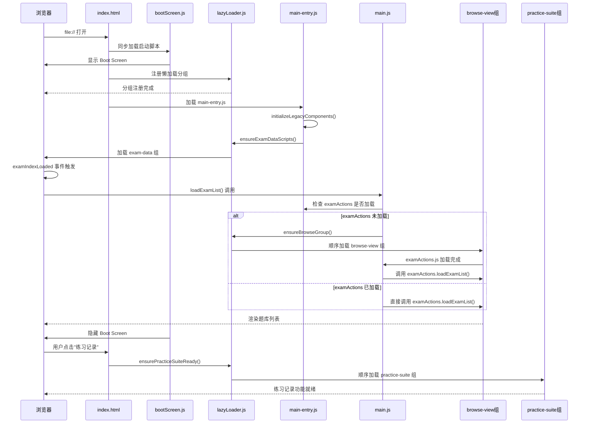
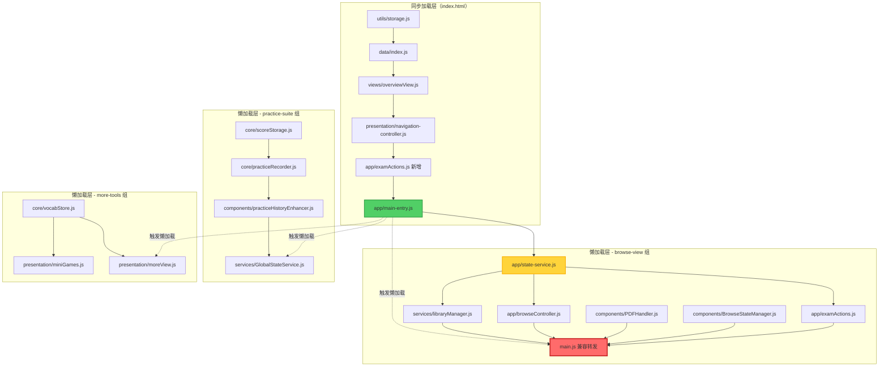
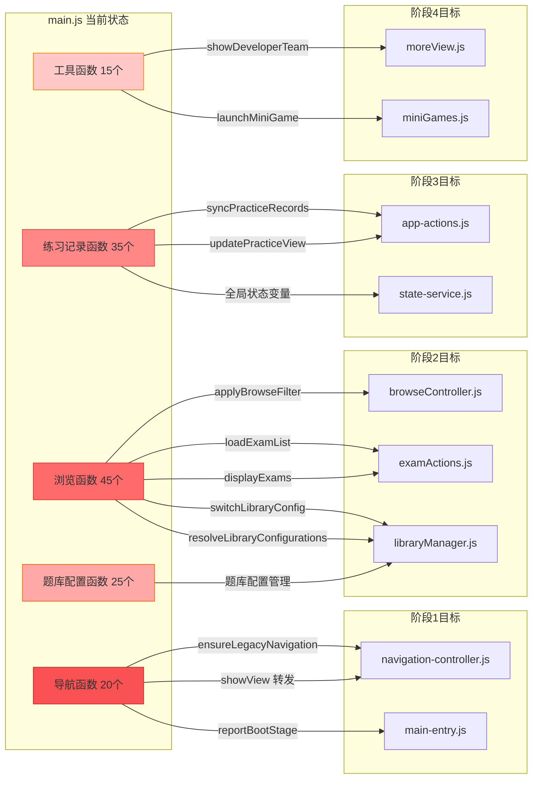
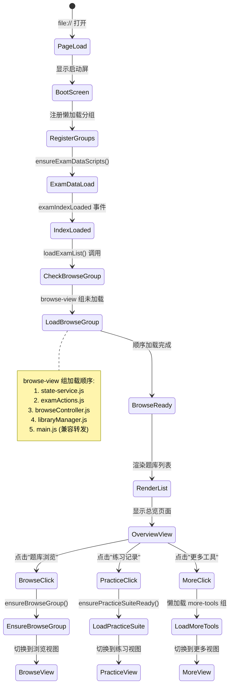
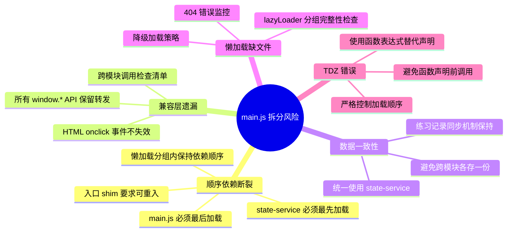

# main.js 拆分依赖关系图

## 一、加载时序图（Sequence Diagram）



## 二、模块依赖关系图（Dependency Graph）



## 三、函数迁移流向图（Migration Flow）



## 四、懒加载触发点流程图（Lazy Loading Triggers）



## 五、全局 API 兼容层映射图（Global API Compatibility）

```mermaid
graph TD
    subgraph "HTML 模板调用"
        H1[onclick='browseCategory()']
        H2[onclick='filterByType()']
        H3[onclick='searchExams()']
        H4[onclick='toggleBulkDelete()']
        H5[onclick='clearPracticeData()']
        H6[onclick='showDeveloperTeam()']
    end
    
    subgraph "window.* 全局 API"
        W1[window.browseCategory]
        W2[window.filterByType]
        W3[window.searchExams]
        W4[window.toggleBulkDelete]
        W5[window.clearPracticeData]
        W6[window.showDeveloperTeam]
        W7[window.switchLibraryConfig]
        W8[window.deleteLibraryConfig]
        W9[window.normalizeRecordId]
        W10[window.showMessage]
    end
    
    subgraph "main.js 兼容转发层"
        M1[browseCategory 转发]
        M2[filterByType 转发]
        M3[searchExams 转发]
        M4[toggleBulkDelete 转发]
        M5[clearPracticeData 转发]
        M6[showDeveloperTeam 转发]
        M7[switchLibraryConfig 转发]
        M8[deleteLibraryConfig 转发]
        M9[normalizeRecordId 保留]
        M10[showMessage 转发]
    end
    
    subgraph "实际实现模块"
        I1[browseController.browseCategory]
        I2[browseController.filterByType]
        I3[examActions.searchExams]
        I4[app-actions.toggleBulkDelete]
        I5[app-actions.clearPracticeData]
        I6[moreView.showDeveloperTeam]
        I7[libraryManager.switchLibraryConfig]
        I8[libraryManager.deleteLibraryConfig]
        I9[main.js normalizeRecordId]
        I10[message-center.showMessage]
    end
    
    H1 --> W1 --> M1 --> I1
    H2 --> W2 --> M2 --> I2
    H3 --> W3 --> M3 --> I3
    H4 --> W4 --> M4 --> I4
    H5 --> W5 --> M5 --> I5
    H6 --> W6 --> M6 --> I6
    W7 --> M7 --> I7
    W8 --> M8 --> I8
    W9 --> M9 --> I9
    W10 --> M10 --> I10
    
    style M1 fill:#ffd43b,stroke:#fab005
    style M2 fill:#ffd43b,stroke:#fab005
    style M3 fill:#ffd43b,stroke:#fab005
    style M4 fill:#ffd43b,stroke:#fab005
    style M5 fill:#ffd43b,stroke:#fab005
    style M6 fill:#ffd43b,stroke:#fab005
    style M7 fill:#ffd43b,stroke:#fab005
    style M8 fill:#ffd43b,stroke:#fab005
    style M9 fill:#51cf66,stroke:#2f9e44
    style M10 fill:#ffd43b,stroke:#fab005
```

## 六、阶段化迁移路线图（Phase Migration Roadmap）

```mermaid
gantt
    title main.js 拆分阶段化路线图
    dateFormat YYYY-MM-DD
    section 阶段0
    基线盘点与依赖分析           :done, phase0, 2025-11-28, 1d
    file:// 基线测试             :active, test0, after phase0, 1d
    
    section 阶段1
    入口/壳层函数迁移            :phase1, after test0, 2d
    全局状态出清                 :phase1b, after phase1, 1d
    兼容转发层验证               :test1, after phase1b, 1d
    
    section 阶段2
    浏览筛选函数迁移             :phase2a, after test1, 2d
    题库配置函数迁移             :phase2b, after phase2a, 2d
    懒加载顺序校正               :phase2c, after phase2b, 1d
    file:// 回归测试             :test2, after phase2c, 1d
    
    section 阶段3
    练习记录链路迁移             :phase3a, after test2, 2d
    导出/套题模式迁移            :phase3b, after phase3a, 1d
    懒加载触发点优化             :phase3c, after phase3b, 1d
    
    section 阶段4
    更多工具/小游戏迁移          :phase4a, after phase3c, 1d
    空壳函数清理                 :phase4b, after phase4a, 1d
    
    section 阶段5
    file:// 手测全流程            :test5a, after phase4b, 1d
    CI 静态测试套件              :test5b, after test5a, 1d
    E2E 练习流程测试             :test5c, after test5b, 1d
    临时日志清理                 :cleanup, after test5c, 1d
```

## 七、风险点与防御措施（Risk Mitigation）



---

**图表说明**:
- 🔴 红色节点: 需要迁移的 main.js 函数
- 🟡 黄色节点: 兼容转发层（临时保留）
- 🟢 绿色节点: 最终实现模块
- 🔵 蓝色节点: 核心依赖模块

**使用方式**:
1. 在支持 Mermaid 的 Markdown 查看器中打开本文档
2. 或使用 [Mermaid Live Editor](https://mermaid.live/) 渲染图表
3. 或在 VS Code 中安装 Mermaid 插件查看

**维护者**: Antigravity AI  
**版本**: v1.0  
**更新时间**: 2025-11-28
