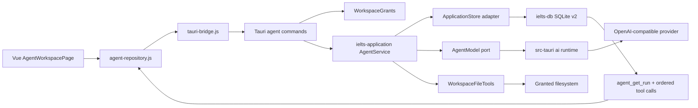
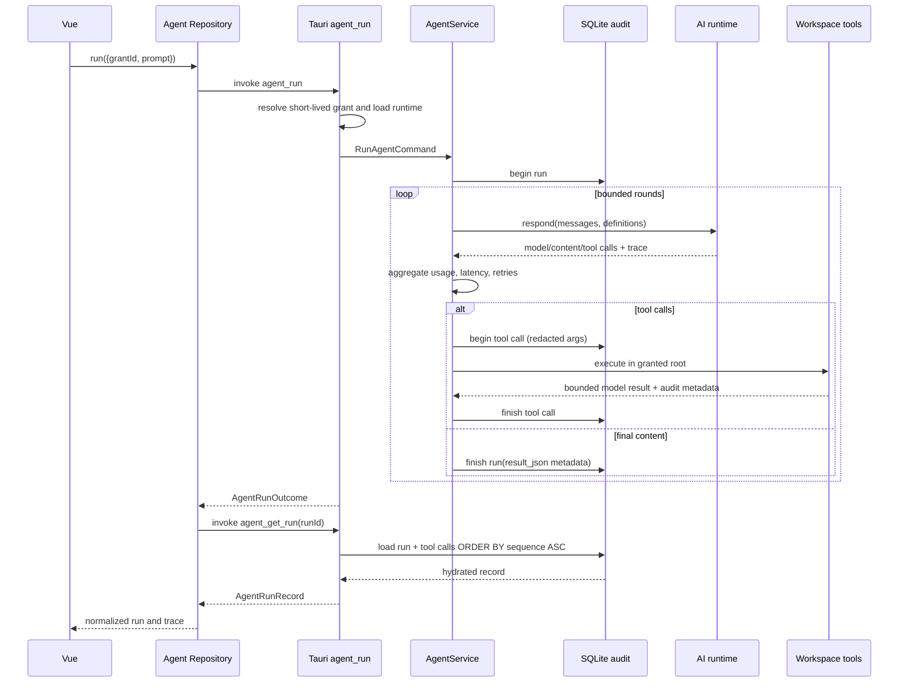

# Agent M0 基线冻结

日期：2026-08-11
分支：`IELTS-WRITING-FEAT`
产品目标：打包的 Tauri 2 + Vue 桌面客户端

## 身份与版本

| 项目 | 值 |
|---|---|
| branch tip（M0 开始） | `10b609a14fc275f175d56498a7a7a69592f69dbe` |
| tip subject | `test: freeze writing result visual contract` |
| backend foundation ancestor | `93e4ed4`（是当前 HEAD 的祖先） |
| Evolution Plan UI baseline | `5c9fd7c`（是当前 HEAD 的祖先） |
| Cargo.lock SHA-256（M0 开始） | `3323FE5418DDD3D3F22D2B0A8324F794AAFB1C2BBBF0358B265E61B256A68259` |
| Cargo.lock SHA-256（M0 实现后） | `2CDDDEA2F908947D4D78DA9552D1E8467904430C1A1E54A5C51B682778E0BB5F` |
| migration count | 11 |
| latest migration | `0011_agent_runs_tool_calls.sql` |
| M0 migration | 无；本阶段只扩展现有 `result_json` |
| M0 checkpoint | local tag `agent-m0-baseline-20260811`（指向最终 scoped M0 commit） |

M0 实现引入 `sha2` 作为 application crate 的直接依赖，因此完成后的 `Cargo.lock` 会有预期的依赖清单变化；这不是 schema 或数据迁移。

## 架构地图



### 层职责

- `ielts-domain`：跨边界 DTO、错误 envelope 和无运行时依赖的领域合同。
- `ielts-db`：SQLite v2 schema、Agent run/tool-call audit、事务和崩溃恢复；不负责 HTTP 或 Tauri。
- `ielts-application`：一次 Agent run 的用例编排、轮次/工具限制、模型和工具 port、最小 trace 聚合。
- `src-tauri/src/ai`：provider 配置、Keyring 取密钥、OpenAI-compatible HTTP、bounded retry 和响应解析。
- `src-tauri/src/agent`：短期 workspace grant、路径 containment、UTF-8/大小/hash/atomic write 安全工具。
- `src-tauri/src/commands`：Tauri 输入校验、State 装配、CommandResponse 适配；不承载 Vue 状态。
- `apps/writing-vue/src/api`：窄 repository，把 typed Agent DTO 映射到现有 invoke/unwrap bridge。
- `AgentWorkspacePage`：三栏可视化与运行入口；不构造数据库真相，不拼接 Agent 工具协议。

## AgentService 顺序合同



## M0 trace contract

`AgentRunOutcome` and every terminal run's existing `result_json` carry the same minimized metadata: `actualModel`, `providerRequestId`, aggregate `latencyMs`, aggregate `usage`, aggregate `retryCount`, and SHA-256 `promptHash`. `model` remains on the successful outcome as the compatibility alias for the actual terminal model.

- latency and retry count are summed across model rounds;
- usage is summed with saturating arithmetic;
- actual model and provider request ID identify the terminal model response; `x-request-id`/provider header wins over a body completion ID, with the body ID as fallback;
- provider、HTTP、transport、malformed envelope、空响应和 loop-limit 失败同样保存六字段 trace，并以 `hasContent: false` 标记；在有效 provider envelope 到达前，`actualModel` 保持 `null`，不能用 requested model 冒充；
- failed `agent_run` responses carry the persisted `runId` in the error context so the UI can hydrate the authoritative failed run from SQLite without masking the provider error;
- prompt hash is SHA-256 of the product-controlled system prompt only, never user text or file contents;
- run audit deliberately stores `hasContent`, not final response content；the immediate outcome owns UI content，SQLite owns run status/metadata/tool-call rehydration;
- tool arguments/results remain bounded audit metadata. File bodies are never copied into audit payloads.

## Rollback boundary

`apps/writing-vue/src/config/feature-flags.js` 是 Agent route 与导航的唯一开关来源。默认值为 `true`，保持当前发布行为；显式设置 `VITE_FEATURE_AGENT_WORKSPACE_V1=false` 后重新构建，会同时移除 `/agent` route 和导航入口，catch-all 将旧的 `#/agent` 地址重定向到总览。

```powershell
$env:VITE_FEATURE_AGENT_WORKSPACE_V1='false'
npm.cmd --prefix apps/writing-vue run build
```

关闭构建已用 Chromium 实测：Agent 导航不存在、`#/agent` 回到 `#/`，Reading、Writing、History 仍可达。No Reading, Writing, History, settings, content catalog, or existing SQLite migration depends on the Agent route. M0 adds no migration, so existing data remains readable.
