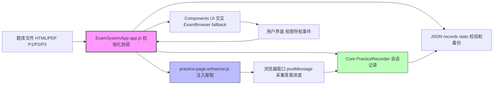

# IELTS 练习系统管理员 Wiki

## 系统简介

这是一个本地化的IELTS（雅思）练习系统，包含P1、P2、P3三个级别的阅读练习题目。系统支持HTML和PDF两种格式的题目，具备完整的练习记录、数据管理和性能优化功能。管理员视角：焦点维护代码、题库和数据完整性，无服务器部署。核心是纯前端JS应用，使用localStorage持久化数据，支持跨窗口通信（postMessage）采集练习数据。

系统目标：为用户提供交互练习，为管理员提供易维护结构。当前版本v1.0.0，~50个JS模块，134篇题库文件。维护重点：JS模块兼容、题库路径标准化、localStorage容量管理（<5MB）。

## 快速部署

1. 复制整个项目目录到新位置，保持"0.2 main send/"和题库文件夹结构。
2. 双击`improved-working-system.html`在现代浏览器中打开（Chrome 60+等）。
3. 验证：打开DevTools（F12），检查Console无错误，Application > localStorage有默认键（如'user_stats'）。
4. 测试核心：点击"题库浏览"，确认P1/P2/P3加载；运行设置 > "系统检测"。监控Network标签，确保JS文件加载（无404）。
5. 多用户：每个浏览器实例独立localStorage；测试多窗口（新开标签）不冲突。

无安装依赖，纯静态文件。更新后刷新浏览器缓存（Ctrl+Shift+R）。部署到服务器：用Nginx/Apache托管静态文件，启用HTTPS防混合内容。

## 系统架构

纯前端JS应用，使用localStorage存储。核心`ExamSystemApp`类（[`app.js`](0.2 main send/js/app.js:5)）协调模块化组件，总行~2762行。架构分层：主App → 组件/UI → 核心逻辑 → Utils/工具。无框架（如React），纯原生JS ES6+，易维护但需手动兼容。

### 整体数据流
数据从题库文件（HTML/PDF）加载，经Enhancer注入采集（答案/交互），Core处理（记录/分析），Utils持久化（localStorage JSON）。通信：postMessage跨窗口。



**关键特性**：
- **模块化**：~50文件，components/ (UI)，core/ (逻辑)，utils/ (工具)。初始化顺序：核心(PracticeRecorder) → 可选(ExamBrowser等) → 事件监听。
- **错误处理**：全局`handleGlobalError`捕获JS/Promise错误，fallback UI (showFallbackUI)。
- **响应式**：ResponsiveManager处理resize/orientation，移动适配 (isMobile())。
- **存储**：StorageManager封装localStorage，带版本迁移 (handleVersionUpgrade)，fallback内存Map。
- **通信**：postMessage (setupExamWindowCommunication)，session-ready/progress/complete/error消息。
- **降级**：无组件时fallback (createFallbackRecorder/ExamBrowser)，模拟数据 (generateSimulatedResults)。

### 各组件/插件详细架构

#### 1. 主应用：ExamSystemApp (app.js, ~2762行)
- **类定义**：`class ExamSystemApp { constructor() { ... } }`，属性：components Map, examWindows Map, userStats。
- **初始化流程** (initialize(), ~50行)：
  1. showLoading(true) + checkDependencies() (验证storage/Utils)。
  2. initializeResponsiveFeatures()：新ResponsiveManager/TouchHandler/ThemeManager/KeyboardShortcuts/TutorialSystem/SettingsPanel。
  3. initializeComponents()：waitForComponents()轮询类加载 (e.g. PracticeRecorder 8s超时)，initializeCoreComponents() (必需：PracticeRecorder, fallback if fail)，initializeOptionalComponents() (可选：ExamBrowser/ExamScanner等，~12个)。
  4. setupEventListeners()：导航(click .nav-btn)、resize/visibility/keydown (Ctrl+1-4视图切换)。
  5. loadInitialData()：scanExamLibrary() (ExamScanner)，loadUserStats() (storage.get 'user_stats')。
  6. setupInitialView() + showActiveSessionsIndicator() + startSessionMonitoring() (30s cleanupClosedWindows)。
  7. setupGlobalErrorHandling()：unhandledrejection/error事件 → handleGlobalError (globalErrors数组, >5/min warning)。
- **核心方法**：
  - **导航**：navigateToView(viewName) (隐藏/显示 .view, 更新 URL/history)，onViewActivated() (refreshOverviewData等)。
  - **题库管理**：browseCategory(category) (ExamBrowser.showCategory)，startCategoryPractice() (随机openExam)。
  - **会话处理**：openExam(examId) → buildExamUrl() + openExamWindow() (80%屏幕居中) + injectDataCollectionScript() (fetch enhancer.js or inline) + setupExamWindowManagement/Communication (messageHandler: SESSION_READY/PROGRESS_UPDATE等)。
  - **数据注入**：injectDataCollectionScript() (load enhancer.js to examWindow, postMessage INIT_SESSION)，handlePracticeComplete() (saveRealPracticeData + showRealCompletionNotification)。
  - **统计**：updateOverviewStats() (calculateAverageAccuracy/StudyDays/CategoryStats)，loadUserStats()。
  - **清理**：cleanupExamSession() (delete examWindows/messageHandlers/active_sessions)，destroy() (clear intervals/components)。
- **用户操作逻辑**：启动 → 选分类(P1/P2/P3) → browse/startPractice → 新窗口加载题库HTML → Enhancer注入采集 → postMessage回主窗 → Recorder保存JSON → UI更新 (progress/通知)。
- **图解：初始化流程**
  ```mermaid
  sequenceDiagram
      participant U as 用户
      participant A as App app.js
      participant C as Components
      participant E as Enhancer
      participant S as Storage
      U->>A: DOMContentLoaded
      A->>A: checkDependencies
      A->>A: initializeResponsiveFeatures
      A->>C: waitForComponents + initializeCore/Optional
      Note over A,C: PracticeRecorder 核心 ExamBrowser 可选
      A->>A: setupEventListeners
      A->>S: loadInitialData + loadUserStats
      A->>A: setupInitialView
      A->>A: isInitialized=true
      U->>A: 点击题库浏览
      A->>C: browseCategory
      U->>A: 点击开始练习
      A->>A: openExam + injectScript
      A->>E: postMessage INIT_SESSION examWindow
      E->>E: extractCorrectAnswers + setupAnswerListeners
      E->>A: postMessage PRACTICE_COMPLETE answers/progress
      A->>A: handlePracticeComplete + saveRealPracticeData
      A->>S: storage.set practice_records
      A->>U: showRealCompletionNotification
  ```

#### 2. 增强器：practice-page-enhancer.js (~1211行)
- **全局对象**：`window.practicePageEnhancer = { ... }`，属性：sessionId, answers, correctAnswers, interactions, startTime。
- **初始化** (initialize())：setupCommunication() (message 'INIT_SESSION' → send SESSION_READY)，setupAnswerListeners() (change/input/click/drop/visibility/blur)，extractCorrectAnswers() (CorrectAnswerExtractor类：4策略 extractFromAnswersObject/ResultsTable/DOM/Scripts)，interceptSubmit() (重写gradeAnswers/grade + click 'Submit')，setupInteractionTracking() (click/scroll)。
- **核心功能**：
  - **答案提取**：CorrectAnswerExtractor类 (constructor: strategies数组)，extractFromPage() (循环策略，normalizeAnswers()标准化q1-A/TRUE等)，parseAnswersObject() (JSON/手动parse)，extractFromResultsTable() (table tr/td解析)。
  - **监听/收集**：recordAnswer() (name/id/dataset → answers[ qId ]=value)，collectAllAnswers() (inputs + dropzones + matching/ordering + pageStructure)，collectDropzoneAnswers() ( .dropzone/.paragraph-dropzone/.match-dropzone)。
  - **提交处理**：handleSubmit() (延迟 collectAllAnswers + extractFromResultsTable + generateAnswerComparison() (user vs correct, compareAnswers normalize) + extractScore() (正则 Final Score/Score/Accuracy + table .result-correct) + sendMessage 'PRACTICE_COMPLETE')。
  - **监控**：startCorrectAnswerMonitoring() (30次1s检查 #results table)，startResultsMonitoring() (60次0.5s检查 'Final Score')。
- **数据流**：页面load → initialize() → extractCorrectAnswers() (备用DOM/脚本) → 监听change/click/drop → collectAllAnswers() (全面scan) → submit/monitor → handleSubmit() (comparison + score) → postMessage to parent。
- **图解：答案采集流程**
  ```mermaid
  flowchart TD
      A["页面加载"] --> B["initialize"]
      B --> C["setupCommunication postMessage SESSION_READY"]
      B --> D["extractCorrectAnswers CorrectAnswerExtractor"]
      D --> E{"策略成功?"}
      E -->|是| F["normalizeAnswers q1-A"]
      E -->|否| G["备用 DOM/脚本/表格"]
      B --> H["setupAnswerListeners change/input/click/drop"]
      H --> I["recordAnswer qId=value"]
      I --> J["interactions.push"]
      subgraph 提交
      K["interceptSubmit/monitor"]
      K --> L["collectAllAnswers inputs + dropzones + matching"]
      L --> M["generateAnswerComparison user vs correct"]
      M --> N["extractScore 正则/table"]
      N --> O["sendMessage PRACTICE_COMPLETE answers/correct/comparison/score"]
      end
      J --> K
      F --> K
      O --> P["父窗 handlePracticeComplete"]
  ```

#### 3. 核心记录器：PracticeRecorder (core/practiceRecorder.js, ~1046行)
- **类定义**：`class PracticeRecorder { constructor() { ... } }`，属性：activeSessions Map, sessionListeners Map, scoreStorage (ScoreStorage实例)。
- **初始化** (initialize())：restoreActiveSessions() (storage 'active_sessions')，setupMessageListeners() (message/session visibility)，startAutoSave() (30s saveAllSessions)，beforeunload save。
- **会话管理**：
  - startPracticeSession(examId, examData)：generateSessionId()，sessionData (progress/answers/metadata)，activeSessions.set + save + setupSessionListener (1min checkActivity)。
  - handleSessionStarted/Progress/Completed/Paused/Resumed/Error (message类型)：更新status/progress/answers + save + dispatchEvent ('sessionStarted'等)。
  - endPracticeSession(examId, reason)：中断记录 (saveInterruptedRecord)，delete active + cleanupListener + dispatch 'sessionEnded'。
- **数据处理**：
  - savePracticeRecord(record)：ScoreStorage.save or fallback storage.unshift (限1000)，validateData (records array/id等)。
  - updateUserStats(record)：totalPractices/time/avgScore + category/questionType + streakDays (日期diff)。
  - handleRealPracticeData(examId, realData)：validateRealData (required/duration/score)，createRealPracticeRecord (id/accuracy/realData: answers/history/interactions/scoreInfo)，save + updateStats + dispatch 'realDataProcessed'，assessDataQuality (issues/confidence 0.1-1.0)。
  - handleFallbackData()：generateSimulatedResults (70% base ±30%) + handleSessionCompleted。
- **存储/导出**：getPracticeRecords(filters)，getUserStats()，exportData()/importData() (backup/restore via ScoreStorage)，getStorageStats()。
- **图解：会话生命周期**
  ```mermaid
  graph TD
      Idle --> Starting
      Starting --> Active
      Active --> Progress
      Active --> Paused
      Paused --> Active
      Progress --> Completed
      Completed --> Idle
      Active --> Error
      Error --> Idle
      Active --> Interrupted
      Interrupted --> Idle
  ```

#### 4. 存储管理：StorageManager (utils/storage.js, ~307行)
- **类定义**：`class StorageManager { constructor() { ... } }`，prefix 'exam_system_'，version '1.0.0'。
- **初始化** (initializeStorage())：test localStorage可用，handleVersionUpgrade (首次 initializeDefaultData: user_stats/settings/exam_index等)，set 'system_version'。
- **核心方法**：
  - set/get(key, defaultValue)：JSON.stringify {data/timestamp/version}，fallback Map if no localStorage。
  - remove/clear()：delete prefix键，clear后defaultData。
  - exportData()：{version/exportDate/data: all prefix键}，importData() (backup → clear → set → catch restore)。
  - getStorageInfo()：used/available (5MB限)，validateData (records array/id, stats number等)。
- **数据格式**：JSON {data: value, timestamp, version}，键如 'practice_records' (array {id/examId/startTime/accuracy/realData})。
- **图解：存储操作**
  ```mermaid
  sequenceDiagram
      participant A as AppRecorder
      participant S as StorageManager
      participant L as LocalStorage
      participant M as MemoryFallback
      A->>S: set practice_records record
      S->>S: getKey exam_system_practice_records
      alt LocalStorage可用
          S->>L: setItem serialized JSON
      else fallback
          S->>M: set key serialized
      end
      Note over S: data record timestamp version
      A->>S: get user_stats default
      S->>L: getItem parse data
      S->>A: stats or default
      A->>S: exportData
      S->>L: all prefix keys data all
      S->>A: export object
  ```

#### 5. 其他组件

##### 5.1 成绩分析器：ScoreAnalyzer (core/scoreAnalyzer.js, ~950行)
- **类定义**：`class ScoreAnalyzer { constructor() { ... } }`，属性：analysisCache Map (5min超时)，cacheTimeout。
- **初始化** (initialize())：setupCacheCleanup() (interval cleanExpiredCache)。
- **核心功能**：
  - **基础统计**：calculateBasicStats(records) (cache 'basic_stats_' )：totalPractices/time/avgScore/accuracy/timePerPractice-PerQuestion/best-worst/variance/completionRate/improvementTrend (线性回归slope)。
  - **分类/题型分析**：analyzeCategoryPerformance(records) (group by category: practices/avgScore/time/best-worst/recent10/improvementTrend/stability=1-sqrt(variance))，analyzeQuestionTypePerformance() (group by type: practices/accuracy/time/best-worst/recent5/stability)。
  - **趋势分析**：analyzeLearningTrends(records, 30days) (filter date, groupByDate dailyStats, score/accuracy/time/frequency/weekdayPerformance/learningIntensity=practices/day, improvementRate last-first quarter)。
  - **图表数据**：generateRadarChartData() (categories/questionTypes/overall: accuracy/stability/efficiency= (60-timePerQ)/60 *100/trend=(slope+0.1)/0.2*100)，generateProgressCurveData() (daily points + 7day movingAvg + trendLine linear, milestones best/consecutive/high-volume)。
- **数据流**：records from storage → calculateBasicStats (loop sum/avg/variance) → cache set/get → return stats (e.g., avgAccuracy=correct/total)。
- **图解：统计计算流程**
  ```mermaid
  graph TD
      A["RecordsFromStorage"] --> B["calculateBasicStats"]
      B --> C["Sum totalPractices time score questions correct"]
      C --> D["AvgScore totalScore/practices AvgAccuracy correct/questions"]
      D --> E["BestWorst Variance sqrt sum pow deviation Completion completed/total"]
      E --> F["ImprovementTrend linearRegression slope"]
      B --> G["analyzeCategoryPerformance groupByCategory"]
      G --> H["AvgScore time bestWorst recent10 trend stability 1-sqrt var"]
      B --> I["analyzeQuestionTypePerformance groupByType"]
      I --> J["OverallAccuracy totalCorrect/totalQuestions timeTrend improvement timeHistory"]
      F --> K["generateRadarChartData categories questionTypes overall"]
      H --> K
      J --> K
      K --> L["ReturnRadarData cache"]
  ```

##### 5.2 推荐引擎：RecommendationEngine (core/recommendationEngine.js, ~859行)
- **类定义**：`class RecommendationEngine { constructor() { ... } }`，config (difficultyAdjustment high0.85/low0.6/rate0.1, weights weakness0.4/performance0.3/freq0.2/diff0.1, learningPath max10/diversity0.3/progression0.15)，examCategories (P1 easy/multiple-choice/TFNG, P2 medium/heading-matching/gap, P3 hard/summary/multiple)。
- **初始化** (initialize())：new ScoreAnalyzer/WeaknessAnalyzer (依赖)，initializeExamMapping() (questionTypeDifficulty 1-6)。
- **核心功能**：
  - **生成推荐**：generateRecommendations(userId) (getUserPracticeRecords filter completed) → analyzeUserPerformance (basic/category/questionType/trends + userLevel=accuracy*0.5+consistency0.3+efficiency0.2, learningPreferences preferredCategories/top2 freq*perf, practiceFrequency=count/days, sessionLength=avgDuration) → generateRecommendationStrategy (primaryFocus weakness/skill/foundation, targetAreas weak/top3, difficultyAdjustment ±0.1 based avgRecent, recommendationTypes targeted/skill/challenging/basic/category/question, learningPath short/medium/long goals/recommendations) → generateSpecificRecommendations (byType targeted/skill/challenging/basic/category/question, applyDiversityFilter maxPerType/cat 30%) → applyPersonalization (adjust time/diff based preferences/progress, tags level/progress)。
  - **类型推荐**：generateTargetedPracticeRecommendations (targeted_practice title=area专项, questionTypes for area)，generateSkillBuildingRecommendations (skill_building综合)，generateChallengingPracticeRecommendations (challenging P3 heading/summary)，generateBasicPracticeRecommendations (basic P1 multiple/TFNG)，generateCategorySpecificRecommendations (category_specific Px questionTypes)，generateQuestionTypeSpecificRecommendations (question_type_specific label/diff for type)。
  - **辅助**：getRecommendedCategory/QuestionTypes (mapping low_acc=P1/time=P2/consistency=P1, types multiple/TFNG/gap)，calculateRecommendedDifficulty (base medium ± based adjustment)，getQuestionTypeLabel (中文)，getCategoryForQuestionType (P2 default)，increase/decreaseDifficulty (easy-medium-hard)。
- **数据流**：userId → getRecords (storage 'practice_records' completed) → analyzePerformance (ScoreAnalyzer stats + level/preferences/progressRate) → strategy (focus/target/diff/types/path) → specificRecs (byType + diversity + personalize) → return {strategy/recommendations/metadata}。
- **图解：推荐生成流程**
  ```mermaid
  graph TD
      A["UserID"] --> B["GetUserPracticeRecords completed"]
      B --> C["analyzeUserPerformance basic category questionType trends"]
      C --> D["UserLevel acc*0.5+cons*0.3+eff*0.2"]
      C --> E["LearningPreferences preferredCat freq*perf sessionLength avgDur"]
      C --> F["ProgressRate last-first quarter"]
      D --> G["generateRecommendationStrategy primaryFocus weakness skill foundation"]
      E --> G
      F --> G
      G --> H["TargetAreas weak top3 diffAdj ±0.1 types targeted skill challenging"]
      H --> I["generateSpecificRecommendations byType"]
      I --> J["applyDiversityFilter maxPerType cat 30%"]
      J --> K["applyPersonalization time diff tags"]
      K --> L["Return strategy recommendations metadata"]
  ```

##### 5.3 数据备份管理器：DataBackupManager (utils/dataBackupManager.js, ~696行)
- **类定义**：`class DataBackupManager { constructor() { ... } }`，storageKeys (backupSettings/export/importHistory)，supportedFormats ['json','csv']，maxBackup20/export50。
- **初始化** (initialize())：initializeSettings (default autoBackup true/interval24h/max10/compress/encrypt false)，setupPeriodicCleanup (24h cleanupExpiredData)。
- **核心功能**：
  - **导出**：exportPracticeRecords(options) (format json/csv, includeStats/backups, filter date/categories) → get records (practiceRecorder or storage) → filterByDateRange (start/end) / categories → exportData {exportInfo/recordCount/options, practiceRecords, userStats, backups} → exportAsJSON (stringify compress0) or CSV (headers id/examId/start-end/duration/status/score/total/correct/acc/cat/freq/title/created, escape " ) → recordExportHistory (id/timestamp/version/count/options)。
  - **导入**：importPracticeData(importData, options merge/replace/skip/validate/backup) → parseImportData (JSON.parse or object) → validateImportData (required id/examId/start/end, date valid) → executeImport (ScoreStorage.import or storage merge/replace/skip based existingIds) → recordImportHistory (count/success/error)。
  - **备份/恢复**：createPreImportBackup (ScoreStorage.create or manual {practice/user/exam_index} to 'manual_backups' limit10)，restoreBackup (ScoreStorage.restore or manual from 'manual_backups')，clearData (options clear records/stats/backups/settings + backupId，reinit default)。
  - **历史/统计**：getExport/ImportHistory (sort timestamp desc)，getDataStats (records count/oldest/newest, userStats total/time/avg, history count/last, storage info)。
- **数据流**：export → filter records/stats → stringify/CSV → download (blob URL) + history；import → parse/validate → merge/replace → history + backup restore。
- **图解：备份流程**
  ```mermaid
  graph TD
      A["UserExport"] --> B["exportPracticeRecords format include filter"]
      B --> C["get records from storage"]
      C --> D["filter date categories"]
      D --> E["build exportData records stats backups"]
      E --> F{"format?"}
      F -->|json| G["exportAsJSON stringify"]
      F -->|csv| H["exportAsCSV headers escape"]
      G --> I["recordExportHistory"]
      H --> I
      I --> J["download blob URL"]
      K["UserImport"] --> L["importPracticeData merge validate backup"]
      L --> M["parseImportData JSON object"]
      M --> N["validateImportData required date"]
      N --> O["createPreImportBackup manual if no ScoreStorage"]
      O --> P["executeImport ScoreStorage or storage merge replace skip"]
      P --> Q["recordImportHistory count success"]
      R["Restore"] --> S["restoreBackup from manual backups"]
      S --> T["storage set keys"]
  ```

##### 5.4 设置面板：SettingsPanel (components/settingsPanel.js, ~684行)
- **类定义**：`class SettingsPanel { constructor() { ... } }`，属性：isVisible, settings (theme/fontSize/reduceMotion/highContrast/autoTheme/keyboardShortcuts/soundEffects/autoSave/notifications)。
- **初始化** (init())：loadSettings (storage get current_theme/theme_settings/keyboard/sound/autoSave/notifications)，createSettingsButton (fixed bottom-right ⚙️ click show)，setupEventListeners (Ctrl+Shift+S toggle, Escape hide)。
- **核心功能**：
  - **显示/隐藏**：show() (createSettingsModal + focus)，hide() (remove overlay)，toggle()。
  - **模态创建** (createSettingsModal())：overlay + modal (header title/close, tabs appearance/accessibility/interaction/advanced, content sections theme/font/highContrast/reduceMotion/keyboard/sound/notifications/dataManagement/systemMaintenance/clear/reset-tutorials/show-tutorials/systemInfo storage-usage)。
  - **事件**：setupModalEvents (close/overlay click, tab switch, theme/font/highContrast/reduceMotion change → app.themeManager.set/toggle, keyboard/sound/autoSave/notifications change → settings update, dataManagement → show dataManagementPanel, systemMaintenance → show systemMaintenancePanel, clearData confirm localStorage.clear reload, resetToDefaults confirm themeManager.reset + settings default + save/hide, exportSettings JSON blob download)。
  - **UI交互**：switchTab (toggle active class)，calculateStorageUsage (localStorage size KB)。
- **数据流**：load settings from storage → createModal (select/checkbox based settings) → change events update app.themeManager/keyboardShortcuts + settings obj → saveSettings storage.set (keyboard/sound/autoSave/notifications)。
- **图解：设置面板交互**
  ```mermaid
  sequenceDiagram
      participant U as 用户
      participant S as SettingsPanel
      participant T as ThemeManager
      participant K as KeyboardShortcuts
      participant D as DataManagementPanel
      U->>S: 点击⚙️ or Ctrl+Shift+S
      S->>S: show createSettingsModal tabs content
      U->>S: 选择 theme change
      S->>T: themeManager.setTheme value
      U->>S: 切换 tab appearance accessibility
      U->>S: toggle highContrast reduceMotion
      S->>T: themeManager.toggleHighContrast ReduceMotion
      U->>S: toggle keyboardShortcuts
      S->>K: keyboardShortcuts enable disable
      U->>S: 点击 dataManagement
      S->>D: dataManagementPanel show
      U->>S: 点击 clearData confirm
      S->>S: localStorage clear reload
      U->>S: 点击 saveSettings
      S->>S: saveSettings storage set
      S->>U: showMessage 保存
      U->>S: Escape or close
      S->>S: hide remove overlay
  ```

##### 5.5 系统诊断：SystemDiagnostics (utils/systemDiagnostics.js, ~990行)
- **类定义**：`class SystemDiagnostics { constructor() { ... } }`，属性：diagnosticResults/performanceMetrics/errorLogs/maintenanceTasks数组。
- **初始化** (initialize())：setupErrorLogging (error/unhandledrejection → logError)，setupPerformanceMonitoring (interval startPerformanceMonitoring)，loadHistoricalData (storage get results/metrics/logs/history)，setupPeriodicDiagnostics (1h performance, 1d integrity)。
- **核心功能**：
  - **完整性检查**：checkExamIntegrity() (status running/passed/failed, issues/warnings/summary total/valid/missing/corrupted/inconsistencies/storageIssues) → checkExamIndex (validateEntry id/title/cat/path/filename, duplicateIds)，checkExamFiles (isValidFilePath .html no ..)，checkDataConsistency (orphaned record examId not in index, stats mismatch total/practices, category count)，checkStorageIntegrity (storageInfo used>90% high/75% medium, criticalKeys get null high, data_corruption catch)。
  - **性能监控**：startPerformanceMonitoring() (memory used/total/limit, timing dom/load/ready, storage write/read 100x, examOperations search/filter map 100x)，measureStoragePerformance (100 write/read iteration time/ops)，measureExamOperationPerformance (search P1 high freq, process map displayName)。
  - **错误分析**：analyzeErrorPatterns() (group type count/perc, recent24h count/rate, recommendations if JS>10/storage>5/recent>50)。
  - **维护**：performMaintenance(tasks) (cleanupExpiredData 1y old records, rebuildExamIndex scanExams, recalculateUserStats, compressStorageData remove redundant, clearErrorLogs) → executeMaintenanceTask switch。
  - **健康状态**：getSystemHealth() (latestDiagnostic issues critical/high deduct 20/10, error recent>20 deduct15, memory>90% deduct10, status healthy/warning/critical if score>=80/60, issues list, recommendations generateOptimizationRecommendations)。
- **数据流**：init → setup listeners/monitoring → checkExamIntegrity (index/files/consistency/storage) → save results/metrics/logs → getSystemHealth (score/issues/recommendations)。
- **图解：诊断流程**
  ```mermaid
  graph TD
      A["Init"] --> B["setupErrorLogging error unhandledRejection"]
      A --> C["setupPerformanceMonitoring 1h"]
      A --> D["loadHistoricalData storageGet"]
      A --> E["setupPeriodicDiagnostics 1d integrity"]
      F["UserRunDiag"] --> G["checkExamIntegrity statusRunning"]
      G --> H["checkExamIndex validateEntry duplicate"]
      H --> I["checkExamFiles isValidPath"]
      I --> J["checkDataConsistency orphaned statsMismatch"]
      J --> K["checkStorageIntegrity quota criticalKeys"]
      K --> L["Summary totalValid missing corrupted"]
      L --> M["saveDiagnosticResults"]
      N["PerfMon"] --> O["startPerformanceMonitoring memory timing storage examOps"]
      O --> P["savePerformanceMetrics"]
      Q["ErrorLog"] --> R["logError type message stack"]
      R --> S["analyzeErrorPatterns group recent recommendations"]
      S --> T["saveErrorLogs"]
      U["getSystemHealth"] --> V["latestDiagnostic performance error"]
      V --> W["score 100-critical*20-high*10-memory>90*10"]
      W --> X["status healthy warning critical issues recommendations"]
  ```

### 题库组织
- 位于"睡着过项目组(9.4)[134篇]/3. 所有文章(9.4)[134篇]/"，子文件夹P1/P2/P3，每题一对.html（交互）和.pdf（静态），命名"P1 - Topic.html"。
- 加载：app.js动态扫描 (storage 'exam_index' {id/title/path/filename/category})，buildExamUrl() (path + filename)。
- 元数据：无中央JSON，ExamScanner.scanExamLibrary() (推断文件夹scan)。总134篇，搜索title/category。
- 问题：路径冗长（易404），建议重构"topics/P1/q1.html" + topics.json ({id: "p1-1", title: "...", level: "P1", format: "html/pdf"})，IndexValidator.js重建索引。
- **图解：题库加载**
  ```mermaid
  graph TD
      A["题库文件夹 P1 P2 P3"] --> B["ExamScanner scanExamLibrary"]
      B --> C["storage exam_index"]
      D["点击分类"] --> E["browseCategory"]
      E --> F["get exam_index filter"]
      F --> G["displayExams list"]
      H["点击开始"] --> I["openExam"]
      I --> J["buildExamUrl"]
      J --> K["window.open exam.html"]
      K --> L["inject enhancer postMessage"]
  ```

## 管理员操作

### 部署
1. 复制项目（包括.gitignore、js/、题库文件夹）。Git init + commit初始状态。
2. 启动：打开improved-working-system.html。DevTools监控Console/Network (JS加载<2s，无404)。
3. 监控：localStorage键 (user_stats/practice_records/exam_index)，容量getStorageInfo() <4MB。
4. 多环境：测试Chrome/Firefox/Safari/Edge；移动DevTools模拟 (iPhone/横屏)。
5. 生产：托管静态服务器，.htaccess防目录浏览；CDN JS文件加速。

### 更新题库
1. 新题：P级别文件夹添加.html/.pdf (命名"P1 - New Topic.html"，确保title/id一致)。
2. 更新exam_index：手动或script scan (Node.js fs.readdirSync)，set storage {id: filename, path: folder, title: extract from HTML <title>}。
3. 验证：重启app，"题库浏览"确认；systemDiagnostics.js检查完整 (missing files警报)，IndexValidator.js重建。
4. 批量：Python脚本重命名长路径 (os.rename "睡着过..." → "topics/")，生成topics.json。风险：路径变迁导致old records path失效，迁移script update exam_index。
5. 版本控制：题库Git submodule，更新后run end-to-end-test.js验证加载/采集。

### 备份维护
1. 手动：设置 > "数据导出" (exportData() JSON含records/stats/backups)，下载 + 校验 (checksum)。
2. 自动：dataBackupManager.js定时 (console set interval)，save to Downloads/本地文件夹。
3. 恢复：importData(JSON)，DataIntegrityManager.js校验 (diff/repair parse错误)，validateData()确认格式。
4. 清理：PerformanceOptimizer.js监控localStorage (>5MB alert)，storage.clearObsolete() (old interrupted_records >100)。
5. JS维护：改文件后刷新 (无构建)；test integration-test.js (模拟会话/通信)；Git branch 'feature/update-utils'，merge前run tests。

## 故障排除

### 常见问题（用户+管理员，扩展README）

#### 1. 题目无法打开
- **症状**：点击后空白/Console "404" or "跨域"。
- **解决**：浏览器允许弹窗 (chrome://settings/content/popups)；检查路径 (DevTools Network)。管理员：systemDiagnostics.js验证题库 (scanExamLibrary())；修复：update exam_index path，修正文件夹权限 (Windows共享)。
- **高级**：Enhancer注入失败 (injectDataCollectionScript())，Console "跨域" → 统一origin (file://本地)；fallback inlineScript。

#### 2. 练习数据丢失
- **症状**：localStorage空 or parse错误。
- **解决**：恢复备份 (importData())；检查隐私模式/扩展禁用存储。管理员：DataConsistencyManager.js integrity check (JSON validate)，repair (reparse records)；StorageManager fallback内存 if quota_exceeded。

#### 3. 系统运行缓慢
- **症状**：加载>5s，FPS<30。
- **解决**：清缓存 (DevTools Application > Clear storage)；PerformanceOptimizer.js报告 (FPS/内存)。管理员：DevTools Performance录制，优化循环 (scoreAnalyzer.calculate avg)，压缩JS (uglifyjs app.js)；题库>100篇分页 (lazy load)。

#### 4. 移动设备显示异常
- **症状**：布局崩，触摸无响应。
- **解决**：横屏；现代浏览器 (Chrome Mobile)。管理员：DevTools设备模拟，调整responsiveManager.js media queries (@media 768px)，test touchHandler.js (drag/drop)。

#### 5. 通信/会话错误（管理员特有）
- **症状**：postMessage失败，Console "message来源不匹配"。
- **解决**：CommunicationTester.js诊断 (send/receive test)；重启窗口 (focusExamWindow())。检查CommunicationRecovery.js日志 (reconnect on error)；跨域：统一file:// or server。

#### 6. 题库扫描失败
- **症状**：P级别空，exam_index []。
- **解决**：路径权限 (Windows文件夹访问)；IndexValidator.js重建 (fs scan fallback Node script)。管理员：script generate exam_index.json from folders。

#### 7. 答案提取失败 (Enhancer特有)
- **症状**：correctAnswers {}，模拟数据。
- **解决**：debugPracticeEnhancer() Console检查策略；更新extractFromPage() selectors (page-specific)。管理员：test extractFromResultsTable() on sample HTML。

### 高级调试
- **工具**：设置 > "系统检测" (全扫描组件/数据/性能/通信)，export报告JSON。
- **日志**：app.js handleGlobalError() (globalErrors >100限)，Console filter "[App]/[Enhancer]/[Recorder]"。
- **重置**：备份 (exportData()) → storage.clear() + 刷新 → import恢复；test mode: localStorage.clear() + reload。
- **性能分析**：DevTools > Performance (录制initialize() ~10s)，Lighthouse audit (PWA/性能分>80)。
- **兼容测试**：BrowserStack/Sauce Labs (Chrome60+/FF55+/Safari12+/Edge79+)；移动iOS/Android。

## 最佳实践

- **代码维护**：Git分支 (feature/new-enhancer)，避免改app.js核心 (extract to utils)；ESLint/Prettier格式，JSDoc注释方法。
- **题库管理**：标准化 (P1-001-Title.html)，>100篇 topics.json + lazy load (fetch on browse)；防XSS: sanitize HTML (DOMPurify lib if add)。
- **数据安全**：备份checksum (CryptoJS MD5)，encrypt敏感 (storage.set Crypto AES)；quota警报 (getStorageInfo() >4MB clear old)。
- **性能**：限localStorage <4MB (compress JSON gzip if server)；懒加载组件 (initializeOptionalComponents())，throttle resize (250ms)。
- **用户体验**：A/B test通知 (showUserMessage)，教程 (TutorialSystem on first load)；移动优先 (touchHandler + media queries)。
- **更新**：版本化 (app.js version const)，每月 end-to-end-test.js (Puppeteer模拟会话/采集)；monitor globalErrors dashboard (if add backend)。
- **安全**：无后端，但sanitize题库HTML (utils/helpers.js escape)，CSP meta防注入；localStorage防XSS (validate on get)。

遵循"Never break userspace"：更新前备份/测试，兼容old records (migrate path in handleVersionUpgrade)。

## 更新日志

### v1.0.0 (当前)
- ✅ 题库管理 (动态scan)
- ✅ 自动记录+统计 (realData + fallback)
- ✅ 跨窗口通信 (postMessage + inject)
- ✅ 备份/恢复 (export/import + validate)
- ✅ 性能优化 (throttle + lazy)
- ✅ 错误恢复 (global + fallback UI)
- ✅ 响应式设计 (mobile + touch)

管理员添加：详细架构/流程图、维护指南、调试工具。

## 技术细节

- **前端**：HTML5/CSS3/JS ES6+ (class/async/await/Map)。
- **存储**：localStorage (JSON: {records: array{id/examId/accuracy/realData}, stats